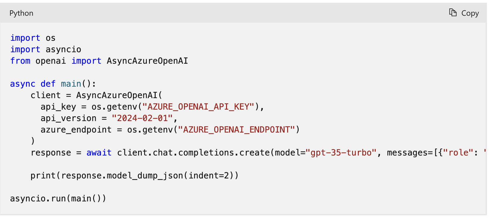
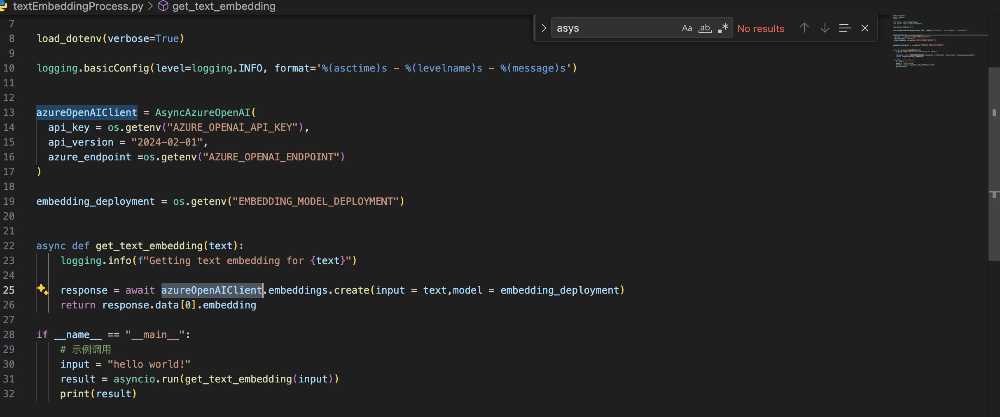
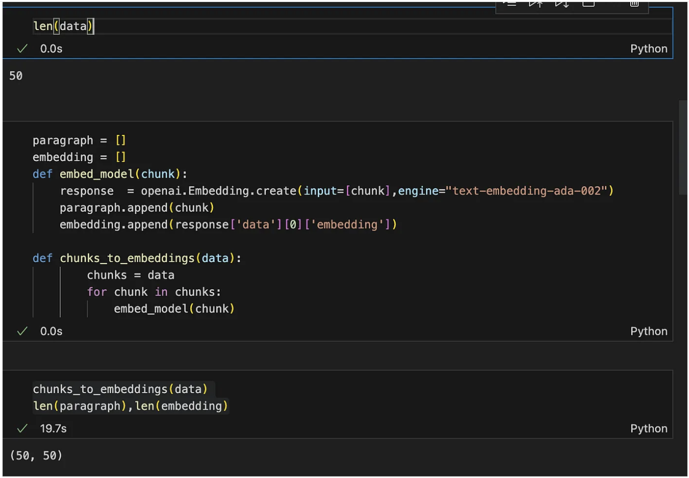
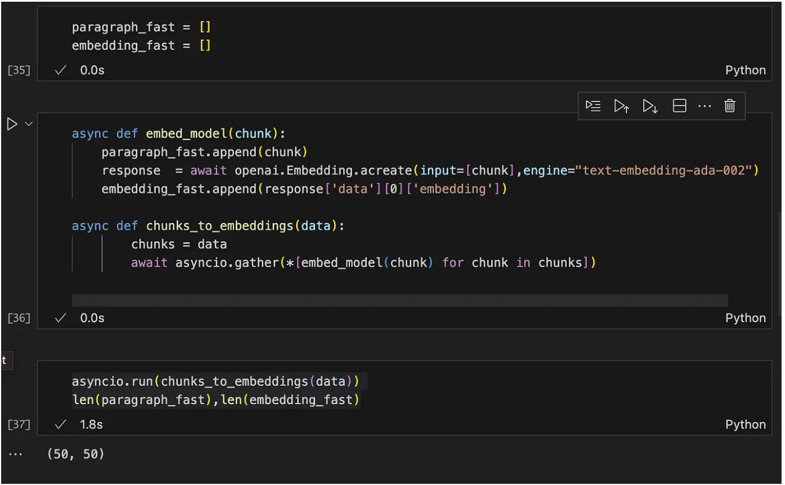
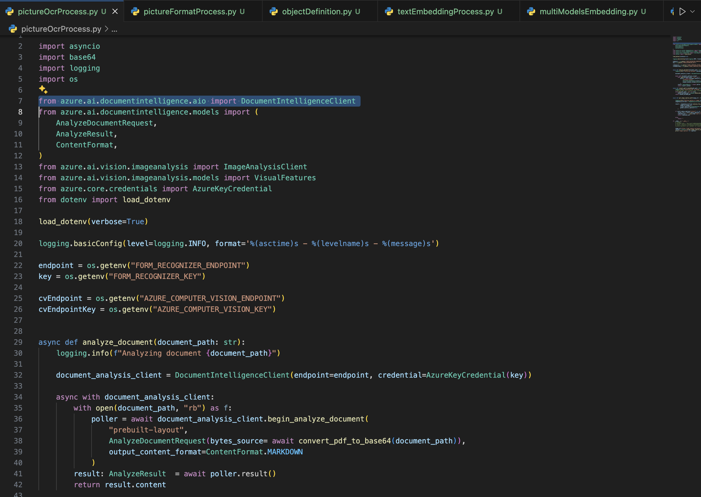
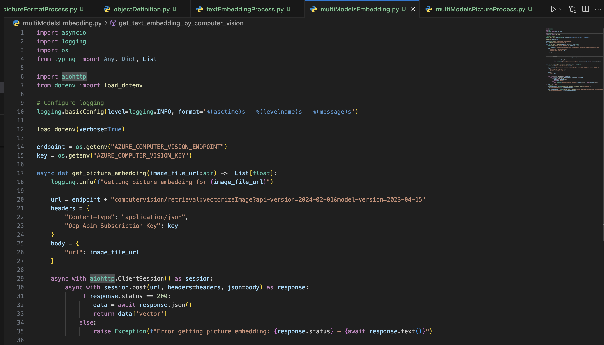
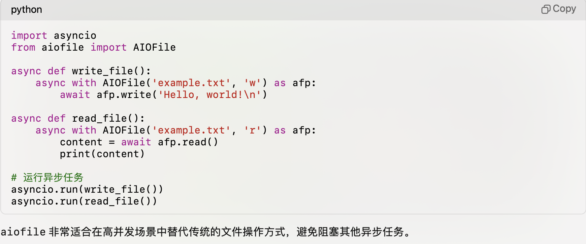

## AzureAI相关paas的AIO python SDK介绍与实践

大家对openAI的SDK相对来说会比较熟悉，但是往往一个解决方案不仅仅用到openAI的SDK。往往需要需要使用azure AI的多个pass服务，比如：Azure computer vision（机器视觉，还是识别图片中的物体等），Azure Document Intelligence（文档ocr，识别问题内容），Azure AI search（向量语义搜索，或者关键字搜索等），如果大家没有那么熟悉的话，使用默认的sample的话，可能就是同步API。这些API都设计到网络调用，如果使用量比较少的话，问题不大，但是如果要处理大量文件或请求的话，还是需要使用asyncIO相关的接口，来尽可能的加速处理。

### azureAI的AIO简单介绍

1. Azure OpenAI Python SDK 异步调用库

    openAI新的python库中（版本 > 1.0）如果是低于1.0版本的话，参考这个这个文档做相应的迁移。
[Migrating to the OpenAI Python API library 1.x](https://learn.microsoft.com/en-us/azure/ai-services/openai/how-to/migration?tabs=python-new%2Cdalle-fix)

    
    调用LLM和embedding是一样的，只要用这个AsyncAzureOpenAI 就可以了。

    这里有一个文档对比在使用sync和asyncIO的性能对比，使用 Azure Open AI 生成嵌入的代码，对于50个文档，需要20秒。对相同数量的文档异步执行此操作时，需要 1.8 秒

更多细节，请参考这个文档：
[implement-asynchronous-programming-in-azure-openai-for-task-parallelization](https://medium.com/@averma9838/implement-asynchronous-programming-in-azure-openai-for-task-parallelization-c26430491d7c)

2. AzureAI SDK 异步简单asycIO调用

Azure Document Intelligence，Azure computer vision，Azure AI search等aio调用库，只需要修改在引入的时候对应sdk，namespace前面增加aio就可以了。
比如：

from azure.ai.documentintelligence.aio import DocumentIntelligenceClient

from azure.ai.vision.imageanalysis.aio import ImageAnalysisClient

from azure.search.documents.aio import SearchClient

在调用的时候，需要定义调用方法定义异步方法，然后调用对应方法的时候使用await，让系统的event loop把这个协程加入任务队列中，得到结果放回位置。

### 通过aiohttp和aiofile来异步处理http请求和文件处理

在对应的sdk没有对应的方法，或者需要一些额外处理的时候，如果需要使用async模式的话，可以使用aiohttp和aiofile对应python包来处理。
对应的sample可以参考如下代码：

***这里需要注意的一个点就是，通过async with的方式使用，这样在with的scope之外，会自动关闭链接资源等***

3. 除了asyncIO之外，python中的multiThread，multiProcess,subprocess
