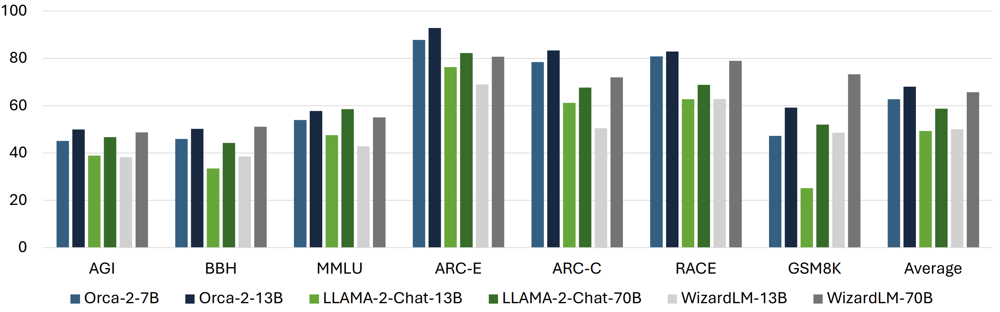
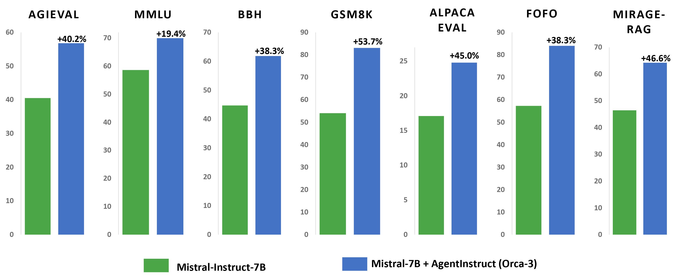

## 数据合成

合成数据加速 LLM 开发：在过去的一年里，使用合成数据极大地推动了大型语言模型 （LLMs。它加快了所有阶段的模型训练，从预训练（例如 Phi-3）到指令调整（例如 Orca 和 WizardLM）和从人类反馈中进行强化学习（例如，直接 Nash 优化）。

### Orca1的 从 GPT-4 的复杂解释链中渐进学习

Orca，这是一个 130 亿个参数的模型，可以学习模仿 LFM 的推理过程。 循序渐进的思维过程;和其他复杂的指令，在 ChatGPT 的教师帮助指导下。为了促进这种渐进式学习，我们利用大规模和多样化的仿制品数据，并进行明智的抽样和选择。Orca 在 Big-Bench Hard （BBH） 等复杂的零样本推理基准测试中比 Vicuna-13B 等传统最先进的指令调整模型高出 100% 以上，在 AGIEval 上高出 42%。此外，Orca 在 BBH 基准测试中达到了与 ChatGPT 的同等水平，并在 SAT、LSAT、GRE 和 GMAT 等专业和学术考试中表现出有竞争力的性能（4 分差距和优化的系统消息），均在没有 CoT 的零镜头设置中;同时落后于 GPT-4。 我们的研究表明，从逐步解释中学习，无论这些解释是由人类还是更高级的 AI 模型生成的，都是提高模型能力和技能的一个有前途的方向。

### Orca 2 教会小模型推理
    
Orca 2 是 LLAMA-2 的微调版本。它仅用于研究目的，并在对用户给定数据进行推理、阅读理解、数学问题解决和文本摘要等任务中提供单轮次响应。该模型旨在特别擅长推理。

Orca 2 背后的一个关键见解是，不同的任务可以从不同的解决方案策略中受益（例如，逐步处理、召回然后生成、召回原因生成、提取生成和直接回答），并且大型模型采用的解决方案策略可能不是较小模型的最佳选择。例如，虽然像 GPT-4 这样功能极其强大的模型可以直接回答复杂的任务，但较小的模型可能会受益于将任务分解为步骤。
Orca 2 使用扩展的、高度定制的合成数据集进行训练。训练数据的生成使它教会了 Orca 2 各种推理技术，例如逐步处理、召回然后生成、召回原因生成、提取生成和直接回答方法，同时还教它为不同的任务选择不同的解决方案策略。训练数据是从功能更强大的教师模型获得的。请注意，我们可以通过非常详细的说明甚至多次调用来获得老师的回复，具体取决于任务和模型所需的行为。在没有详细说明如何完成任务的原始说明的情况下，将鼓励学生模型学习基本策略以及它引发的推理能力。

研究表明，提高较小语言模型的推理能力不仅是可能的，而且可以通过对定制的合成数据进行训练来实现。Orca 2 模型通过实施各种推理技术并识别每个任务的最有效解决方案策略，实现了与大型模型相当甚至经常超过模型的性能水平，尤其是在零样本推理任务中。尽管这些模型仍然存在其基础模型固有的限制和约束，但它们显示出未来改进的前景，特别是在更好的推理能力、控制和安全性方面，通过使用合成数据进行后训练。使用由更强大的模型创建的定制和高质量合成数据来训练语言模型的潜力，这些数据使用复杂的提示和可能的多个模型调用。虽然大模型将继续展示卓越的功能，但构建功能更强大的小型模型的研究将有助于为需要不同部署场景并在效率和功能之间进行权衡的新应用程序铺平道路。

### Orca3-AgentInstruct

在 Orca 和 Orca 2 上的工作证明了使用合成数据对小型语言模型进行后训练的能力，并使它们达到以前只有在更大的语言模型中才能找到的性能水平。Orca-AgentInstruct 是朝着这个方向迈出的另一步，我们探索使用代理流来大规模生成多样化和高质量的数据。Orca-AgentInstruct 是用于合成数据生成的代理解决方案。通过利用代理框架，AgentInstruct 可以从原始数据源生成定制的数据集，包括提示和响应，为构建用于模型微调的合成数据工厂铺平道路。
    
    
通过微调基本 Mistral 70 亿参数模型并使用 AgentInstruct 生成 2500 万对数据集，观察到的实质性改进证明了这种方法的有效性。微调模型（我们称之为 Orca-3-Mistral）在多个基准测试中展示了显著的性能提升。例如，它显示 AGIEval 提高了 40%，MMLU 提高了 19%，GSM8K 提高了 54%，BBH 提高了 38%，AlpacaEval 提高了 45%，在多个摘要基准中，不准确或不可靠的结果减少了 31.34%。
将公开提供此数据集的 100 万对子集 （orca-agentinstruct-1M），以及一份描述数据生成过程的报告，以鼓励对合成数据生成和语言模型微调的研究。

#### 生成高质量的合成数据很困难

研究表明，使用其他模型生成的合成数据进行预训练模型可能会导致模型崩溃，从而导致模型逐渐退化。对于使用合成数据进行后训练也提出了类似的担忧，这表明它可能会导致一个模仿过程，即经过训练的模型只学习风格特征而不是实际能力。这种差异可能归因于生成高质量和多样化合成数据的挑战。成功使用合成数据需要大量的人力来整理和过滤数据以确保高质量。

1. 合成数据与代理
在过去一年中见证的另一个重大发展是代理（尤其是多代理）工作流的兴起，例如 AutoGen。代理工作流可以生成高质量的数据，这超越了底层 LLMs，通过使用具有反射和迭代的流，使代理能够回顾解决方案、生成批评并改进解决方案。他们还可以使用搜索 API、计算器和代码解释器等工具来解决 LLM 限制。

多代理工作流还带来了其他好处，例如模拟我们可以生成新提示和相应响应的场景。它们还支持数据生成工作流的自动化，从而减少或消除对某些任务不必要的人工干预。

2. 代理指示
生成用于后期训练或微调的合成数据通常依赖于现有的提示集，该提示集要么按原样使用，要么用作生成更多指令的种子。在这项工作中，我们将问题设置推广到一个更广泛的目标，即生成大量多样化、具有挑战性和高质量的数据，以将特定技能传授给 AI 模型。我们将此设置称为生成式教学。

AgentInstruct 是一种用于生成式教学的代理解决方案。AgentInstruct 使用原始文档作为输入来创建演示和反馈数据。当通用数据用作种子时，AgentInstruct 可用于教授 LLM 通用功能，例如写入、推理或检索增强生成 （RAG）。特定于领域的数据（如零售或金融）也可以用作种子，以改进某个专业化的模型。

AgentInstruct 可以创建：

1) 高质量数据：AgentInstruct 使用 GPT-4 以及搜索和代码解释器等工具来创建高质量的数据。
2) 数据多样：AgentInstruct 使用一组专用代理（具有强大的 LLMs、工具和反射流）和一个分类法（包含 100 多个子类别）创建提示和响应，从而确保多样性和质量。
3) 数据量大：AgentInstruct 可以自主运行。和 applyiflows 进行验证和数据过滤。它不需要种子提示，并使用原始文档进行种子设定。

使用原始数据作为种子有两个优势：它丰富，允许 AgentInstruct 生成大规模和多样化的数据集，并且它通过避免使用现有提示来鼓励学习一般技能，而不是特定于基准的技能。

原文链接：
[Orca-AgentInstruct](https://www.microsoft.com/en-us/research/blog/orca-agentinstruct-agentic-flows-can-be-effective-synthetic-data-generators/?utm_source=chatgpt.com)

