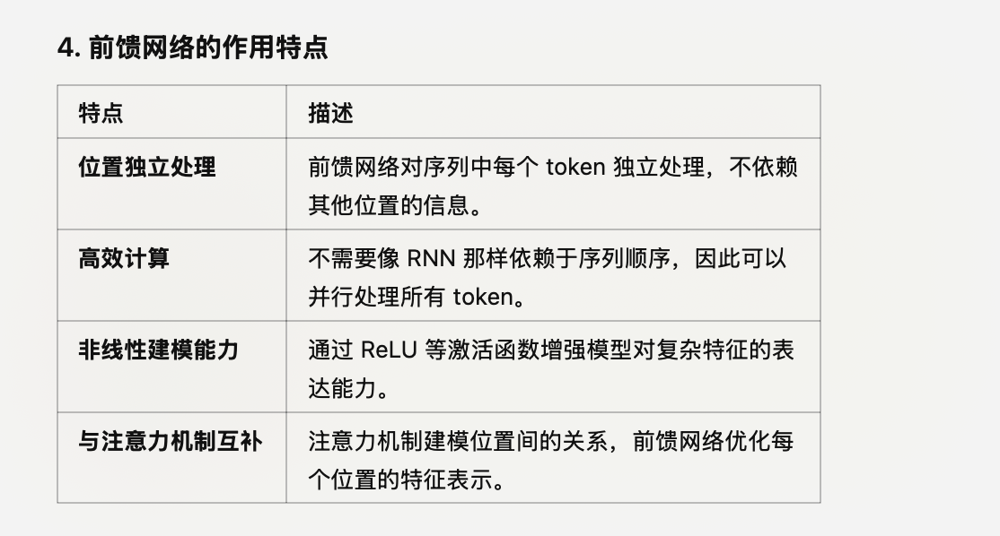

### Q1: GPT 只使用transformer的 decode为什么它还是transform模型呢？

1.1 原始 Transformer 架构

    •	Transformer 的原始设计包括两部分：
    •	Encoder：主要用于编码输入序列的上下文特征，常见于翻译任务中的源语言处理。
    •	Decoder：接收编码器的输出以及目标序列的部分输入，生成目标序列。
    •	典型应用：机器翻译（如将英语句子翻译成法语）。

1.2 GPT 的选择

    •	GPT 的目标是 生成文本（Generative），具体为预测下一步的 token，因此：
    •	不需要编码器部分，因为它没有外部输入序列（如翻译任务中的源语言）。
    •	只保留了解码器部分，并调整为自回归生成模式：基于前面的生成内容，预测下一个 token。
    •	换句话说，GPT 是一种只使用解码器的 Transformer 模型。

2. 为什么 GPT 仍然属于 Transformer？

2.1 核心机制未变

GPT 的解码器部分仍然遵循 Transformer 的核心机制：
    1.	自注意力机制 (Self-Attention)：
    •	GPT 使用了 Transformer 中的自注意力机制，但引入了因果遮掩（causal masking），确保生成时只能看到当前位置之前的 token。
    •	这是解码器生成任务的关键。
    2.	位置编码 (Positional Encoding)：
    •	GPT 也使用了位置编码，以表示输入序列中各 token 的顺序。
    3.	前馈网络 (Feed-Forward Network)：
    •	和 Transformer 原始架构一致，GPT 每层仍然包含一个前馈网络来处理每个 token 的特征。
    4.	多头注意力机制 (Multi-Head Attention)：
    •	GPT 继承了多头注意力的设计，用于捕获序列中不同部分的关系。

2.2 生成任务的本质仍然是 Transformer 架构的解码任务

    •	原始 Transformer 的解码器部分可以独立用于生成任务，GPT 恰恰就是对这一部分的扩展和优化。
    •	虽然没有编码器，但解码器本质上仍然是 Transformer 的组成部分。

3. GPT 的改动是对 Transformer 架构的特殊化

3.1 GPT 的主要变化

    1.	只使用解码器部分：
    •	原始 Transformer 的解码器会接收编码器的输出和目标序列的部分输入。
    •	GPT 的解码器改为只基于历史生成的 token 自回归地预测下一个 token。
    2.	因果遮掩 (Causal Masking)：
    •	遮掩掉当前 token 后面的所有 token，确保生成过程的因果关系（不能看到未来）。
    •	原始 Transformer 解码器会看到目标序列的所有上下文，GPT 则限制了这一点。

3.2 为什么仍然算作 Transformer

    •	共享核心设计理念：
    •	GPT 没有改变 Transformer 的核心计算方法（如自注意力、前馈网络）。
    •	它只是在任务目标和部分机制（如遮掩方式）上做了调整。
    •	保持模块结构：
    •	Transformer 的层次化结构（注意力 + 前馈网络 + 残差连接 + 层归一化）完全保留。
    •	以任务为中心的调整：
    •	Transformer 的架构设计是通用的，GPT 专注于生成任务，只需部分功能即可完成目标。
4. 其他模型对 Transformer 的使用方式

不同任务需要不同的模块组合，Transformer 的通用性使其可以灵活调整：
    1.	原始 Transformer (Encoder + Decoder)：
    •	用于机器翻译等需要同时处理输入和输出序列的任务。
    2.	BERT (只用 Encoder)：
    •	专注于语言理解任务（如分类、填空），不需要生成功能。
    3.	GPT (只用 Decoder)：
    •	专注于生成任务（如文本生成、对话）。
    4.	T5 (Encoder + Decoder)：
    •	集成两者，既可以生成，也可以理解。

*** 具体在分类问题上的话，也有大量使用GPT来做的?**

### Q2： 这里的前反馈机制是具体的是什么意思？

前馈网络对每个 token 的处理是并行的，可以分布式训练

前馈机制 (Feed-Forward Mechanism) ：

 Transformer 架构中一个关键的组成部分，用于对每个序列中的位置（即每个 token）的特征进行进一步的变换和非线性处理。

虽然“前馈机制”听起来像一个新概念，但实际上它是深度学习中非常基础的操作，可以理解为在模型中对输入特征进行逐层计算的一种方式。

1. 什么是前馈机制？

1.1 前馈 (Feed-Forward) 的定义

前馈机制本质上是一个全连接的神经网络层，即：
    1.	输入经过一个线性变换（矩阵乘法和偏置加法）。
    2.	然后通过一个非线性激活函数。
    3.	最终输出处理后的特征。

1.2 为什么叫“前馈”？（也就是逐层的向前下层 传递，没有向后层 反馈。 ）

    •	“前馈” 是相对于 “反馈” (Feedback) 而言的。
    •	前馈网络中的信息从输入流向输出，没有循环或反馈回网络的早期层。
    •	这种简单的流向使得前馈网络在计算中非常高效和直观。

2. Transformer 中的前馈网络

在 Transformer 架构中，每一层的前馈网络 (Feed-Forward Neural Network, FFN) 是独立的，作用于每个序列位置的特征。

2.1 结构

前馈网络是 Transformer 的每一层中注意力机制后面的一个模块，其公式为：

\text{FFN}(x) = \text{ReLU}(xW_1 + b_1)W_2 + b_2

    •	输入 (x)：来自多头自注意力机制的输出。
    •	线性变换：
    1.	首先，输入通过一个线性变换 W_1（权重矩阵）和偏置 b_1，映射到更高的维度。
    2.	然后，应用非线性激活函数（通常是 ReLU）。
    3.	最后，通过另一个线性变换 W_2 和偏置 b_2，将高维特征映射回原始维度。
    •	输出：生成的特征会传递给下一层。

2.2 参数共享

    •	Transformer 的每一层都有自己的前馈网络，参数是独立的，每个 token 的处理是位置无关的（但通过注意力机制获得了上下文关系）。
    •	前馈网络对每个 token 的处理是并行的。

3. 为什么 Transformer 使用前馈机制？

3.1 增强非线性表达能力

    •	注意力机制本质上是一个加权求和操作，虽然它可以捕获位置间的关系，但缺乏非线性变换能力。
    •	前馈网络通过引入非线性（如 ReLU 激活函数）和多层计算，能够增强模型对复杂特征的表示能力。

3.2 提供独立的特征变换

    •	自注意力机制关注的是序列中不同位置的关系（全局依赖）。
    •	前馈网络则关注每个位置的特征表示，让模型在对上下文建模的基础上进一步优化每个位置的特征。

3.3 高效的并行化

    •	前馈网络只对单个位置的特征进行处理，不需要序列间的信息流动（这些信息由注意力机制完成）。
    •	因此，可以对所有位置并行地进行计算，这也是 Transformer 高效的重要原因之一。

5. 示例：如何理解前馈网络的计算？

假设有一个句子 “The cat sat on the mat”，经过自注意力机制后，我们得到了序列中每个单词的上下文相关特征（维度为 512）。接下来，前馈网络的计算步骤如下：

步骤 1：线性变换

    •	每个单词的特征通过一个线性层，将维度从 512 \to 2048（假设前馈网络的隐层维度是 2048）。

步骤 2：非线性激活

    •	使用 ReLU 激活函数将负值置为 0，增强特征的非线性表达。

步骤 3：映射回原始维度

    •	将特征从 2048 \to 512 映射，方便传递到下一层。

结果

    •	每个单词的特征被优化，表示能力更强。

6. 总结：前馈机制的意义

    •	前馈机制 是 Transformer 的每一层中的独立模块，作用于每个 token 的特征。
    •	它通过两层线性变换和非线性激活，对注意力机制输出的特征进行进一步优化。
    •	核心作用：
    •	增强非线性表达能力。
    •	与注意力机制协同工作，优化每个位置的特征表示。
    •	通过并行化实现高效计算。

简单来说，前馈机制是 Transformer 的“特征优化器”，帮助每个位置的特征更好地适应后续任务需求。

### Q3: 多头注意力机制，具体是什么？

并行计算：多头机制的计算可以高效并行，特别适合现代硬件（如GPU）

在Transformer模型中，注意力机制（Attention）会根据输入的上下文，为不同的token分配不同的权重，以捕捉它们之间的重要关系。这种机制能够让模型更好地理解句子中词语之间的依赖关系，而不是简单地线性处理文本序列。

多头注意力机制的具体内容

多头注意力机制（Multi-Head Attention）是Transformer模型中注意力机制的核心之一。它的主要思想是将普通的注意力机制分成多个头（Head），每个头都独立计算注意力权重。这样，模型可以从多个不同的角度去学习输入序列中token之间的关系。

多头注意力的实现步骤
    1.	线性变换：
    •	输入的序列通过三个不同的线性变换得到 Query (Q)、Key (K) 和 Value (V) 矩阵。假设输入维度是 d_{model}，而每个头的维度
是 d_k，线性变换后：

Q = XW_Q, \quad K = XW_K, \quad V = XW_V

其中， W_Q, W_K, W_V  是学习到的权重矩阵。
    2.	分头：
    •	将上述 Q、K、V 矩阵分成 h 个头，每个头的维度是 \frac{d_{model}}{h}。每个头独立地计算注意力。
    3.	计算单头注意力：
    •	对每个头使用 Scaled Dot-Product Attention 计算注意力权重：

\text{Attention}(Q, K, V) = \text{softmax}\left(\frac{QK^\top}{\sqrt{d_k}}\right)V

这里的 \sqrt{d_k} 是缩放因子，防止点积值过大影响softmax的梯度。
    4.	组合多头输出：
    •	将 h 个头的输出拼接起来，并通过一个线性变换将维度恢复到 d_{model}：

\text{MultiHead}(Q, K, V) = \text{Concat}(\text{head}_1, \text{head}_2, \dots, \text{head}_h)W_O

其中 W_O 是输出的线性变换矩阵。

多头注意力的优势
    1.	多视角建模：不同的头可以捕捉序列中不同层次或类型的关系，比如短距离依赖和长距离依赖。
    2.	增强模型能力：相比单一注意力，多头机制能让模型有更丰富的表达能力。
    3.	并行计算：多头机制的计算可以高效并行，特别适合现代硬件（如GPU）。

示意图

如果以图示方式来看，多头注意力就像有多个注意力机制同时作用，每个机制（头）专注于不同的上下文关系，最后再合并这些信息生成
最终输出。

总结来说，多头注意力是对单头注意力的扩展，它通过增加不同头的独立性和组合能力，使得Transformer模型在自然语言处理、图像处理
等任务上有更强的表达能力。

多头注意力（Multi-Head Attention）中的头数（ h ）是一个超参数，需要在模型设计时根据任务和资源情况来确定。以下是选择头数时的
主要考虑因素：

1. 通常的默认值
    •	Transformer原始论文（“Attention Is All You Need”）中，头数一般设为  h = 8 。
    •	在更大的模型（如GPT系列、BERT等）中，头数可能为 12、16、32 等。

这些值通常根据经验选择，并且在不同的模型和任务中被验证过效果良好。

2. 头数与嵌入维度的关系

多头注意力要求嵌入维度（embedding size）  d_{model}  可以被头数  h  整除，因为每个头分配的维度是：

d_k = \frac{d_{model}}{h}

例如：
    •	如果  d_{model} = 512  且  h = 8 ，则每个头的维度  d_k = 64 。
    •	如果  d_{model} = 768  且  h = 12 ，则  d_k = 64 。

3. 头数对模型性能的影响
    •	更多头数的优点：
    1.	捕获更多关系：更多的头可以学习不同的注意力模式，尤其是在复杂的上下文中。
    2.	细粒度建模：每个头关注的特征更细致，有助于丰富表达能力。
    •	更多头数的缺点：
    1.	计算和内存开销：头数增加会显著增加计算量和显存使用。
    2.	头的冗余：研究发现，过多的头可能会导致某些头的贡献很小，甚至是冗余的。

因此，头数的选择需要在性能提升和计算代价之间权衡。

### Q4：因果遮掩 (Causal Masking) 是推理的时候还是调优的时候？

什么是因果遮掩（Causal Masking）？
 
因果遮掩是指在自回归模型（如GPT）中，确保每个时间步只能够看到它之前的时间步的数据，而不能看到它之后的时间步的数据。这是为了保证模型在生成下一个词时，只依赖于之前的词，而不是未来的信息。
在训练时的因果遮掩
 
在训练过程中，因果遮掩用于确保模型在计算每个时间步的损失时，只能访问它之前的时间步的信息。具体实现通常是通过一个上三角矩阵的遮掩掩码来实现的。这个掩码矩阵会在计算注意力权重时屏蔽掉未来的词。

例如，假设我们有一个句子 "The cat sat on the mat"，在训练过程中，对于生成每个单词的预测，模型只能看到该单词之前的单词：
• 预测 "The"：看不到任何单词。
• 预测 "cat"：只能看到 "The"。
• 预测 "sat"：只能看到 "The cat"。
• 预测 "on"：只能看到 "The cat sat"。
在推理时的因果遮掩
 
在推理（生成文本）时，因果遮掩同样重要。推理过程是逐步进行的，即每次只生成一个词，并将其作为输入再次传递给模型，生成下一个词。在这个过程中，因果遮掩确保每次生成时，模型只依赖于之前生成的词。

例如，在生成一句话时，模型从一个起始词开始，不断生成下一个词，每次生成时只考虑到目前为止生成的所有词，而不会使用未来的词：
1. 起始词是 "The"。
2. 生成下一个词 "cat"，使用 "The" 作为上下文。
3. 生成下一个词 "sat"，使用 "The cat" 作为上下文。
4. 依此类推，直到生成结束条件满足。
实际用例
 
• 训练过程：在训练一个GPT模型时，因果遮掩确保模型在学习如何生成每个单词时，只使用该单词之前的上下文。这是通过在训练数据上应用因果遮掩掩码矩阵来实现的。
• 推理过程：在文本生成任务中，因果遮掩确保每个生成的词只依赖于之前生成的词。这在逐步生成文本时，能够保证生成的过程是自回归的，即每一步生成都只基于之前生成的内容。
总结
 
因果遮掩在GPT模型的训练和推理过程中都起着至关重要的作用。在训练过程中，它帮助模型正确地学习如何在生成下一个词时只依赖于之前的词。在推理过程中，它确保生成的文本是连贯和合理的，因为每个词的生成都只依赖于之前已经生成的词。这种机制是GPT模型能够生成高质量文本的关键之一。

如果是这样的话，只看到之前的内容，那与RNN的区别是什么？ 因为transformer模型就是通过注意机制，让他们知道上下文，通过多头来不同方面来处理内容，如果通过因果遮掩（Causal Masking） 不就没有很好的使用注意力机制了吗？ 还是注意力机制是在因果遮掩（Causal Masking）基础之上？

这是一个非常好的问题！因果遮掩（Causal Masking）和注意力机制的结合确实是Transformer模型（如GPT）与传统的循环神经网络（RNN）之间的关键区别之一。让我们详细探讨一下。
RNN与Transformer的区别
 
RNN的工作原理
 
RNN（Recurrent Neural Network）通过递归的方式处理序列数据，每个时间步的输出依赖于前一个时间步的隐藏状态。RNN的主要特点是它通过隐状态（hidden state）来捕捉序列中的上下文信息。
• 优点：能够处理任意长度的序列，并且在时间步之间具有依赖性。
• 缺点：由于依赖于前一个时间步的计算，RNN在处理长序列时会面临梯度消失和梯度爆炸问题，同时难以并行化。

Transformer的工作原理
 
Transformer模型通过自注意力机制（Self-Attention）来处理序列数据。自注意力机制允许每个输入位置关注序列中的其他位置，从而捕捉全局上下文信息。
• 优点：能够并行处理输入序列，并且通过多头注意力机制（Multi-Head Attention）捕捉输入序列中的不同方面。
• 缺点：对于生成任务，需要引入因果遮掩来保持自回归的性质。

因果遮掩与注意力机制的结合
 
在Transformer模型中，因果遮掩（Causal Masking）和注意力机制是结合使用的，尤其是在自回归生成模型（如GPT）中。
注意力机制的作用
 
注意力机制计算输入序列中每个位置与其他位置的相关性（注意力权重），从而生成每个位置的上下文表示。具体步骤包括：
    1. 计算查询（Query）、键（Key）和值（Value）向量。
    2. 计算查询与所有键的点积，并通过Softmax函数获得注意力权重。
    3. 使用注意力权重对值向量进行加权求和，得到每个位置的上下文表示。

因果遮掩的作用
 
因果遮掩通过上三角矩阵掩码，确保每个位置只能关注它之前的位置，而不能看到未来的位置。这种遮掩机制在计算注意力权重时，屏蔽掉未来的位置，从而保持自回归的性质。

例如，对于一个输入序列 "The cat sat on the mat"，在生成每个词时：
• 生成 "The" 时：模型看不到任何其他词。
• 生成 "cat" 时：模型只能看到 "The"。
• 生成 "sat" 时：模型只能看到 "The cat"。
• 依此类推。

注意力机制在因果遮掩基础上工作
 
注意力机制在因果遮掩的基础上工作，即在计算注意力权重时，因果遮掩掩码确保每个位置只能关注它之前的位置。这样，注意力机制仍然能够捕捉到之前的上下文信息，但不会泄露未来的信息。
总结
 
• RNN：通过隐状态捕捉序列中的上下文信息，存在难以并行化和长序列处理困难的问题。
• Transformer：通过自注意力机制并行处理输入序列，并使用因果遮掩保持自回归性质。
因果遮掩与注意力机制结合：因果遮掩确保每个位置只能关注它之前的位置，而注意力机制在此基础上捕捉上下

### Q5： transformer模型中的token的向量编码

GPT中的嵌入过程：
    1.	输入文本Token化：
    •	输入文本首先会被tokenizer（分词器）处理，分解成一系列的Token。比如，句子 “I love AI” 可能会被分解为 ["I", "love", "AI"]。
    2.	Token映射到嵌入向量：
    •	每个Token会被映射到一个高维向量，这个过程通过**嵌入矩阵（Embedding Matrix）**完成。假设模型的嵌入维度为 d_{model}，那么每个Token会变成一个 d_{model}-维的向量。
    •	嵌入矩阵的每一行表示一个Token的向量，这个矩阵是一个学习得到的参数。
    •	例如，如果有 V 个不同的Token（词汇表大小），而模型的嵌入维度为 d_{model}，则嵌入矩阵的维度为 V \times d_{model}。
    3.	位置编码（Positional Encoding）：
    •	由于Transformer本身不具备处理序列顺序的能力，位置编码（Positional Encoding） 会被加到每个Token的嵌入向量中，以便让模型知道Token在序列中的位置。
    •	这些位置编码也是通过固定的算法生成（如正弦和余弦函数）或者作为模型参数学习的。
    4.	输入到Transformer层：
    •	在输入的每个Token都通过嵌入矩阵转化为向量后，经过位置编码的嵌入向量就会作为输入传递到Transformer模型的第一层（即多头注意力机制和前馈网络层等）。

嵌入层是Transformer的一部分
    •	Transformer的第一层：在GPT模型中，嵌入层是Transformer架构中的第一层，它负责将Token转换为向量表示，并加上位置编码。之后，这些嵌入向量会通过Transformer的多层自注意力机制（Self-Attention）、前馈神经网络等层进行处理。
    •	嵌入层的作用：嵌入层本质上是为后续的注意力机制、前馈层等提供初始输入。它的作用就是将每个Token的离散表示（数字）转化为模型能够处理的连续向量形式。

总结：
    •	GPT模型中的嵌入层并不是一个独立的模型，而是Transformer结构中的第一层。它通过嵌入矩阵将输入的Token转换为高维向量表示，作为后续Transformer层的输入。
    •	这个嵌入层是学习得到的，并且是Transformer模型的一部分，之后的处理（如多头注意力、前馈神经网络等）基于这些嵌入向量进行。
