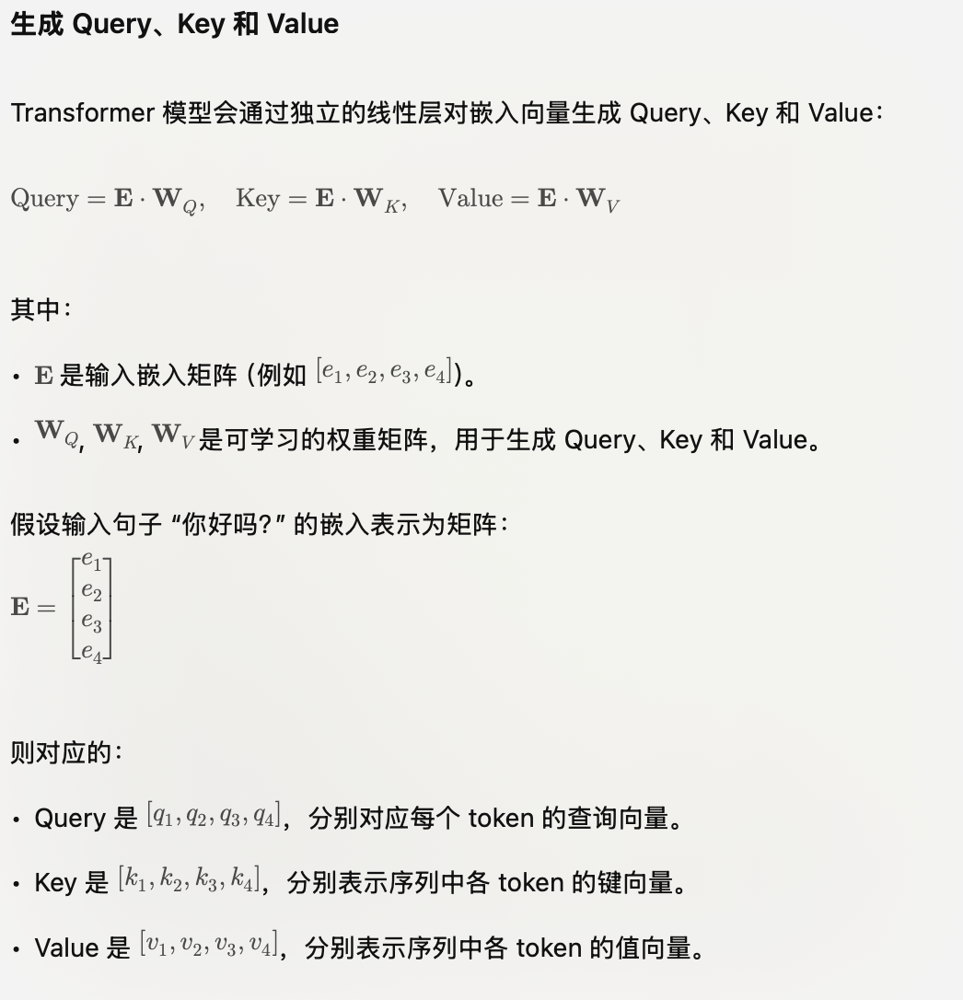

## 注意力机制

#### Attention注意力的重要性

Attention机制是一种在处理时序相关问题的时候常用的技术，主要用于处理序列数据。

核心思想是在处理序列数据时，网络应该更关注输入中的重要部分，而忽略不重要的部分，它通过学习不同部分的权重，将输入的序列中的重要部分显式地加权，从而使得模型可以更好地关注与输出有关的信息。

在序列建模任务中，比如机器翻译、文本摘要、语言理解等，输入序列的不同部分可能具有不同的重要性。传统的循环神经网络（RNN）或卷积神经网络（CNN）在处理整个序列时，难以捕捉到序列中不同位置的重要程度，可能导致信息传递不够高效，特别是在处理长序列时表现更明显。

Attention机制的关键是引入一种机制来动态地计算输入序列中各个位置的权重，从而在每个时间步上，对输入序列的不同部分进行加权求和，得到当前时间步的输出。这样就实现了模型对输入中不同部分的关注度的自适应调整。

#### Attention的计算步骤

具体的计算步骤如下：

- 计算查询（Query）：查询是当前时间步的输入，用于和序列中其他位置的信息进行比较。
- 计算键（Key）和值（Value）：键表示序列中其他位置的信息，值是对应位置的表示。键和值用来和查询进行比较。
- 计算注意力权重：通过将查询和键进行内积运算，然后应用softmax函数，得到注意力权重。这些权重表示了在当前时间步，模型应该关注序列中其他位置的重要程度。
- 加权求和：根据注意力权重将值进行加权求和，得到当前时间步的输出。

在Transformer中，Self-Attention 被称为"Scaled Dot-Product Attention"，其计算过程如下：

- 对于输入序列中的每个位置，通过计算其与所有其他位置之间的相似度得分（通常通过点积计算）。
- 对得分进行缩放处理，以防止梯度爆炸。
- 将得分用softmax函数转换为注意力权重，以便计算每个位置的加权和。
- 使用注意力权重对输入序列中的所有位置进行加权求和，得到每个位置的自注意输出。
  
$$
Attention(Q,K,V)=softmax(\frac{QK^T}{\sqrt{d_k}})V
$$

#### Attention机制 与其他机制的区别和概念

1. Attention机制和传统的Seq2Seq模型有什么区别？

Seq2Seq模型是一种基于编码器-解码器结构的模型，主要用于处理序列到序列的任务，例如机器翻译、语音识别等。
传统的Seq2Seq模型只使用编码器来捕捉输入序列的信息，而解码器只从编码器的最后状态中获取信息，并将其用于生成输出序列。
而Attention机制则允许解码器在生成每个输出时，根据输入序列的不同部分给予不同的注意力，从而使得模型更好地关注到输入序列中的重要信息。

2. self-attention 和 target-attention的区别？

self-attention是指在序列数据中，将当前位置与其他位置之间的关系建模。它通过计算每个位置与其他所有位置之间的相关性得分，从而为每个位置分配一个权重。这使得模型能够根据输入序列的不同部分的重要性，自适应地选择要关注的信息。

target-attention则是指将注意力机制应用于目标（或查询）和一组相关对象之间的关系。它用于将目标与其他相关对象进行比较，并将注意力分配给与目标最相关的对象。这种类型的注意力通常用于任务如机器翻译中的编码-解码模型，其中需要将源语言的信息对齐到目标语言。

因此，自注意力主要关注序列内部的关系，而目标注意力则关注目标与其他对象之间的关系。这两种注意力机制在不同的上下文中起着重要的作用，帮助模型有效地处理序列数据和相关任务。

3. 在常规attention中，一般有k=v，那self-attention 可以吗?

self-attention实际只是attention中的一种特殊情况，因此k=v是没有问题的，也即K，V参数矩阵相同。实际上，在Transformer模型中，Self-Attention的典型实现就是k等于v的情况。Transformer中的Self-Attention被称为"Scaled Dot-Product Attention"，其中通过将词向量进行线性变换来得到Q、K、V，并且这三者是相等的。

4. 目前主流的attention方法有哪些？

- Scaled Dot-Product Attention: 这是Transformer模型中最常用的Attention机制，用于计算查询向量（Q）与键向量（K）之间的相似度得分，然后使用注意力权重对值向量（V）进行加权求和。
- Multi-Head Attention: 这是Transformer中的一个改进，通过同时使用多组独立的注意力头（多个QKV三元组），并在输出时将它们拼接在一起。这样的做法允许模型在不同的表示空间上学习不同类型的注意力模式。
- Relative Positional Encoding: 传统的Self-Attention机制在处理序列时并未直接考虑位置信息，而相对位置编码引入了位置信息，使得模型能够更好地处理序列中不同位置之间的关系。
- Transformer-XL: 一种改进的Transformer模型，通过使用循环机制来扩展Self-Attention的上下文窗口，从而处理更长的序列依赖性。

5.  self-attention 在计算的过程中，如何对padding位做mask？

在 Attention 机制中，同样需要忽略 padding 部分的影响，这里以transformer encoder中的self-attention为例：self-attention中，Q和K在点积之后，需要先经过mask再进行softmax，因此，对于要屏蔽的部分，mask之后的输出需要为负无穷，这样softmax之后输出才为0。

6. 深度学习中attention与全连接层的区别何在？

Transformer Paper里重新用QKV定义了Attention。所谓的QKV就是Query，Key，Value。如果我们用这个机制来研究传统的RNN attention，就会发现这个过程其实是这样的：RNN最后一步的output是Q，这个Q query了每一个中间步骤的K。Q和K共同产生了Attention Score，最后Attention Score乘以V加权求和得到context。那如果我们不用Attention，单纯用全连接层呢？很简单，全链接层可没有什么Query和Key的概念，只有一个Value，也就是说给每个V加一个权重再加到一起（如果是Self Attention，加权这个过程都免了，因为V就直接是从raw input加权得到的。）

可见Attention和全连接最大的区别就是Query和Key，而这两者也恰好产生了Attention Score这个Attention中最核心的机制。而在Query和Key中，我认为Query又相对更重要，因为Query是一个锚点，Attention Score便是从过计算与这个锚点的距离算出来的。任何Attention based algorithm里都会有Query这个概念，但全连接显然没有。

最后来一个比较形象的比喻吧。如果一个神经网络的任务是从一堆白色小球中找到一个略微发灰的，那么全连接就是在里面随便乱抓然后凭记忆和感觉找，而attention则是左手拿一个白色小球，右手从袋子里一个一个抓出来，两两对比颜色，你左手抓的那个白色小球就是Query。

7. transformer中multi-head attention中每个head为什么要进行降维？

在Transformer的Multi-Head Attention中，对每个head进行降维是为了增加模型的表达能力和效率。

每个head是独立的注意力机制，它们可以学习不同类型的特征和关系。通过使用多个注意力头，Transformer可以并行地学习多种不同的特征表示，从而增强了模型的表示能力。

然而，在使用多个注意力头的同时，注意力机制的计算复杂度也会增加。原始的Scaled Dot-Product Attention的计算复杂度为$O(d^2)$，其中d是输入向量的维度。如果使用h个注意力头，计算复杂度将增加到$O(hd^2)$。这可能会导致Transformer在处理大规模输入时变得非常耗时。

为了缓解计算复杂度的问题，Transformer中在每个head上进行降维。在每个注意力头中，输入向量通过线性变换被映射到一个较低维度的空间。这个降维过程使用两个矩阵：一个是查询（Q）和键（K）的降维矩阵$W_q$和$W_k$，另一个是值（V）的降维矩阵$W_v$。

通过降低每个head的维度，Transformer可以在保持较高的表达能力的同时，大大减少计算复杂度。降维后的计算复杂度为$(h\hat d ^ 2)$，其中$\hat d$是降维后的维度。通常情况下，$\hat d$会远小于原始维度d，这样就可以显著提高模型的计算效率。

### MHA & MQA & MGA

#### MHA

从多头注意力的结构图中，貌似这个所谓的多个头就是指多组线性变换层，其实并不是，只有使用了一组线性变化层，即三个变换张量对Q，K，V分别进行线性变换，这些变换不会改变原有张量的尺寸，因此每个变换矩阵都是方阵，得到输出结果后，多头的作用才开始显现，每个头开始从词义层面分割输出的张量，也就是每个头都想获得一组Q，K，V进行注意力机制的计算，但是句子中的每个词的表示只获得一部分，也就是只分割了最后一维的词嵌入向量。这就是所谓的多头，将每个头的获得的输入送到注意力机制中, 就形成多头注意力机制.

Multi-head attention允许模型共同关注来自不同位置的不同表示子空间的信息，如果只有一个attention head，它的平均值会削弱这个信息。

Multi-head attention允许模型**共同关注来自不同位置的不同表示子空间的信息**，如果只有一个attention head，它的平均值会削弱这个信息。

$$
MultiHead(Q,K,V)=Concat(head_1,...,head_h)W^O \\
where ~ head_i = Attention(QW_i^Q, KW_i^K, VW_i^V) 
$$

其中映射由权重矩阵完成：$W^Q_i \in \mathbb{R}^{d_{{model}} \times d_k}
 $, $W^K_i \in \mathbb{R}^{d_{\text{model}} \times d_k}$, $W^V_i \in \mathbb{R}^{d_{\text{model}} \times d_v}$和$W^O_i \in \mathbb{R}^{hd_v \times d_{\text{model}} }$。

**多头注意力作用**

这种结构设计能**让每个注意力机制去优化每个词汇的不同特征部分**，从而均衡同一种注意力机制可能产生的偏差，让词义拥有来自更多元的表达，实验表明可以从而提升模型效果.

**为什么要做多头注意力机制呢**？

- 一个 dot product 的注意力里面，没有什么可以学的参数。具体函数就是内积，为了识别不一样的模式，希望有不一样的计算相似度的办法。加性 attention 有一个权重可学，也许能学到一些内容。
- multi-head attention 给 h 次机会去学习 不一样的投影的方法，使得在投影进去的度量空间里面能够去匹配不同模式需要的一些相似函数，然后把 h 个 heads 拼接起来，最后再做一次投影。
- 每一个头 hi 是把 Q,K,V 通过 可以学习的 Wq, Wk, Wv 投影到 dv 上，再通过注意力函数，得到 headi。&#x20;

#### others

1. Transformer为何使用多头注意力机制？（为什么不使用一个头）

多头保证了transformer可以注意到不同子空间的信息，捕捉到更加丰富的特征信息。可以类比CNN中同时使用多个滤波器的作用，直观上讲，多头的注意力有助于网络捕捉到更丰富的特征/信息。

2. Transformer为什么Q和K使用不同的权重矩阵生成，为何不能使用同一个值进行自身的点乘？ （注意和第一个问题的区别）

使用Q/K/V不相同可以保证在不同空间进行投影，增强了表达能力，提高了泛化能力。
同时，由softmax函数的性质决定，实质做的是一个soft版本的arg max操作，得到的向量接近一个one-hot向量（接近程度根据这组数的数量级有所不同）。如果令Q=K，那么得到的模型大概率会得到一个类似单位矩阵的attention矩阵，这样self-attention就退化成一个point-wise线性映射。这样至少是违反了设计的初衷。

3. Transformer计算attention的时候为何选择点乘而不是加法？两者计算复杂度和效果上有什么区别？

K和Q的点乘是为了得到一个attention score 矩阵，用来对V进行提纯。K和Q使用了不同的W_k, W_Q来计算，可以理解为是在不同空间上的投影。正因为有了这种不同空间的投影，增加了表达能力，这样计算得到的attention score矩阵的泛化能力更高。
为了计算更快。矩阵加法在加法这一块的计算量确实简单，但是作为一个整体计算attention的时候相当于一个隐层，整体计算量和点积相似。在效果上来说，从实验分析，两者的效果和dk相关，dk越大，加法的效果越显著。

4. 为什么在进行softmax之前需要对attention进行scaled（为什么除以dk的平方根），并使用公式推导进行讲解

- 这取决于softmax函数的特性，如果softmax内计算的数数量级太大，会输出近似one-hot编码的形式，导致梯度消失的问题，所以需要scale
- 那么至于为什么需要用维度开根号，假设向量q，k满足各分量独立同分布，均值为0，方差为1，那么qk点积均值为0，方差为dk，从统计学计算，若果让qk点积的方差控制在1，需要将其除以dk的平方根，是的softmax更加平滑 

5. 为什么在进行多头注意力的时候需要对每个head进行降维？（可以参考上面一个问题）

将原有的高维空间转化为多个低维空间并再最后进行拼接，形成同样维度的输出，借此丰富特性信息
- 基本结构：Embedding + Position Embedding，Self-Attention，Add + LN，FN，Add + LN

6. Transformer的位置编码？有什么意义和优缺点？

因为self-attention是位置无关的，无论句子的顺序是什么样的，通过self-attention计算的token的hidden embedding都是一样的，这显然不符合人类的思维。因此要有一个办法能够在模型中表达出一个token的位置信息，transformer使用了固定的positional encoding来表示token在句子中的绝对位置信息。

7. 简单讲一下Transformer中的残差结构以及意义。

就是ResNet的优点，解决梯度消失

8. Transformer训练的时候学习率是如何设定的？Dropout是如何设定的，位置在哪里？Dropout 在测试的需要有什么需要注意的吗？

Dropout测试的时候记得对输入整体呈上dropout的比率