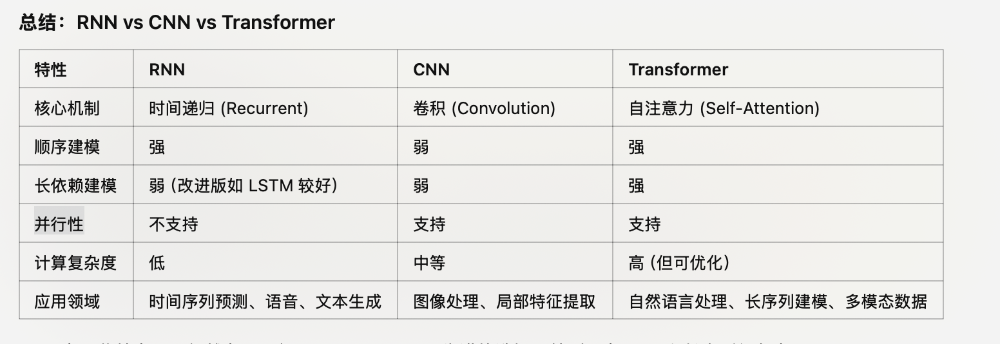

## transformer 和 CNN，RNN的初步比较

CNN 和 Transformer 都是基于分块处理输入数据的，但它们的核心机制和适用场景有显著区别。

CNN：卷积核 (Convolution Kernel) 滑动窗口机制。
	•	CNN 对输入数据进行局部处理，利用卷积核对局部区域提取特征。每次卷积操作仅关注输入的一部分（感受野）。
	•	卷积操作对输入具有平移不变性，非常适合捕捉局部模式（例如图像边缘、纹理等）。
	•	数据特点：主要处理固定长度、结构化输入，例如图像和音频。
	•	局限性：
        •	固定感受野，无法有效处理远距离依赖。
        •	长度不足时通过填充 (Padding)，长度过长时需要切块或降维处理。
    •	卷积操作本身是高度并行的，适合 GPU 加速。
	•	但其处理流程需要逐层传递局部特征（依赖感受野的逐层扩展），因此不完全并行。

RNN（Recurrent Neural Network）是最早用于处理序列数据的神经网络之一，擅长处理时序数据和依赖上下文的信息。
RNN：
	•	核心机制：递归 (Recurrence)。
	•	RNN 通过隐藏状态 h_t 将前一个时间步的信息传递到当前时间步
    •	每次只能处理一个时间步，通过递归迭代建模时间序列的依赖关系。
	•	数据特点：擅长处理顺序敏感的任务，如时间序列、自然语言文本等。
•	局限性：
	•	序列依赖：无法并行，导致训练速度慢。
	•	梯度问题：容易出现梯度消失或梯度爆炸，尤其是长序列。
	•	局部感受野：前一个时间步的隐藏状态传递到当前步，依赖链条长度限制了远程依赖的建模能力。
    •	改进版（如 LSTM 和 GRU）通过门控机制部分缓解这一问题，但仍有局限。

Transformer：
    •	核心机制：自注意力机制 (Self-Attention)。
	•	Transformer 对整个输入序列同时建模，通过计算序列中每个元素与其他元素的相关性（注意力权重），捕捉长程依赖关系。
	•	无需滑动窗口，直接全局建模输入。
    •	数据特点：主要处理序列化数据，例如自然语言文本、时间序列、甚至图像补充任务。
•	局限性：
	•	对长序列计算代价较高（注意力机制复杂度为 O(n^2)）。
	•	需要特殊的机制（例如位置编码）保留位置信息。
	•	非常适合硬件优化，支持全并行计算（尤其适用于现代深度学习硬件）。
    •	自注意力机制直接建模全局关系，对长序列的建模能力强。
    •	适合处理依赖于上下文的复杂任务。

### 位置编码

对于Transformer模型来说，位置编码的加入是必不可少的，因为纯粹的Attention模块是无法捕捉输入顺序的，即无法区分不同位置的Token。为此大体有两个选择：

- 想办法将位置信息融入到输入中，这构成了绝对位置编码的一般做法；
- 想办法微调一下Attention结构，使得它有能力分辨不同位置的Token，这构成了相对位置编码的一般做法。

#### 绝对位置编码

形式上来看，绝对位置编码是相对简单的一种方案，但即便如此，也不妨碍各路研究人员的奇思妙想，也有不少的变种。一般来说，绝对位置编码会加到输入中：在输入的第$k$个向量$x_k$中加入位置向量$p_k$变为$x_k+p_k$，其中$p_k$只依赖于位置编号$k$。

(1) 训练式

直接将位置编码当作可训练参数，比如最大长度为512，编码维度为768，那么就初始化一个512×768的矩阵作为位置向量，让它随着训练过程更新。

对于这种训练式的绝对位置编码，一般的认为它的缺点是没有外推性，即如果预训练最大长度为512的话，那么最多就只能处理长度为512的句子，再长就处理不了了。当然，也可以将超过512的位置向量随机初始化，然后继续微调。但笔者最近的研究表明，通过层次分解的方式，可以使得绝对位置编码能外推到足够长的范围，同时保持还不错的效果，细节请参考笔者之前的博文《层次分解位置编码，让BERT可以处理超长文本》。因此，其实外推性也不是绝对位置编码的明显缺点。

(2)三角式

三角函数式位置编码，一般也称为Sinusoidal位置编码，是Google的论文《Attention is All You Need》所提出来的一个显式解：

$$ \left{\begin{array}{l}\boldsymbol{p}{k, 2 i}=\sin \left(k / 10000^{2 i / d}\right) \ \boldsymbol{p}{k, 2 i+1}=\cos \left(k / 10000^{2 i / d}\right)\end{array}\right. $$

其中$p_{k,2i}$,$p_{k,2i+1}$分别是位置$k$的编码向量的第$2i$,$2i+1$个分量，$d$是位置向量的维度。

很明显，三角函数式位置编码的特点是有显式的生成规律，因此可以期望于它有一定的外推性。另外一个使用它的理由是：由于$\sin (\alpha+\beta)=\sin \alpha \cos \beta+\cos \alpha \sin \beta$以及$\cos (\alpha+\beta)=\cos \alpha \cos \beta-\sin \alpha \sin \beta$，这表明位置$\alpha+\beta$的向量可以表示成位置$\alpha$和位置$\beta$的向量组合，这提供了表达相对位置信息的可能性。但很奇怪的是，现在我们很少能看到直接使用这种形式的绝对位置编码的工作，原因不详。

(3)递归式

原则上来说，RNN模型不需要位置编码，它在结构上就自带了学习到位置信息的可能性（因为递归就意味着我们可以训练一个“数数”模型），因此，如果在输入后面先接一层RNN，然后再接Transformer，那么理论上就不需要加位置编码了。同理，我们也可以用RNN模型来学习一种绝对位置编码，比如从一个向量$p_0$出发，通过递归格式$p_{k+1}=f(p_k)$来得到各个位置的编码向量。
理论上来说，基于递归模型的位置编码也具有比较好的外推性，同时它也比三角函数式的位置编码有更好的灵活性（比如容易证明三角函数式的位置编码就是FLOATER的某个特解）。但是很明显，递归形式的位置编码牺牲了一定的并行性，可能会带速度瓶颈。

(4)相乘式

似乎将“加”换成“乘”，也就是$x_k\times p_k$的方式，似乎比$x_k+p_k$能取得更好的结果。只是提供这么一种可能性。关于实验来源，可以参考《中文语言模型研究：(1) 乘性位置编码》。

#### 相对位置编码

相对位置并没有完整建模每个输入的位置信息，而是在算Attention的时候考虑当前位置与被Attention的位置的相对距离，由于自然语言一般更依赖于相对位置，所以相对位置编码通常也有着优秀的表现。对于相对位置编码来说，它的灵活性更大，更加体现出了研究人员的“天马行空”。

(1)经典式

相对位置编码起源于Google的论文《Self-Attention with Relative Position Representations》，华为开源的NEZHA模型也用到了这种位置编码，后面各种相对位置编码变体基本也是依葫芦画瓢的简单修改。

一般认为，相对位置编码是由绝对位置编码启发而来，考虑一般的带绝对位置编码的Attention.只需要有限个位置编码，就可以表达出任意长度的相对位置（因为进行了截断），不管$p_K$,$p_V$是选择可训练式的还是三角函数式的，都可以达到处理任意长度文本的需求。

(2)XLNET式

XLNET式位置编码其实源自Transformer-XL的论文《Transformer-XL: Attentive Language Models Beyond a Fixed-Length Context》，只不过因为使用了Transformer-XL架构的XLNET模型并在一定程度上超过了BERT后，Transformer-XL才算广为人知，因此这种位置编码通常也被冠以XLNET之名。

(3)T5式

T5模型出自文章《Exploring the Limits of Transfer Learning with a Unified Text-to-Text Transformer》，里边用到了一种更简单的相对位置编码。思路依然源自$q_ik^T_j$展开式，如果非要分析每一项的含义，那么可以分别理解为“输入-输入”、“输入-位置”、“位置-输入”、“位置-位置”四项注意力的组合。如果我们认为输入信息与位置信息应该是独立（解耦）的，那么它们就不应该有过多的交互，所以“输入-位置”、“位置-输入”两项Attention可以删掉，而$\boldsymbol{p}{i} \boldsymbol{W}{Q} \boldsymbol{W}{K}^{\top} \boldsymbol{p}{j}^{\top}$实际上只是一个只依赖于$(i,j)$的标量，我们可以直接将它作为参数训练出来，即简化为：

$$ \boldsymbol{x}{i} \boldsymbol{W}{Q} \boldsymbol{W}{K}^{\top} \boldsymbol{x}{j}^{\top}+\boldsymbol{\beta}_{i, j} $$

说白了，它仅仅是在Attention矩阵的基础上加一个可训练的偏置项而已，而跟XLNET式一样，在$v_j$上的位置偏置则直接被去掉了。包含同样的思想的还有微软在ICLR 2021的论文《Rethinking Positional Encoding in Language Pre-training》中提出的TUPE位置编码。

(4) DeBERTa式

DeBERTa也是微软搞的，去年6月就发出来了，论文为《DeBERTa: Decoding-enhanced BERT with Disentangled Attention》，最近又小小地火了一把，一是因为它正式中了ICLR 2021，二则是它登上SuperGLUE的榜首，成绩稍微超过了T5。

其实DeBERTa的主要改进也是在位置编码上，同样还是从$q_ik^T_j$展开式出发，T5是干脆去掉了第2、3项，只保留第4项并替换为相对位置编码，而DeBERTa则刚刚相反，它扔掉了第4项，保留第2、3项并且替换为相对位置编码.

不过，DeBERTa比较有意思的地方，是提供了使用相对位置和绝对位置编码的一个新视角，它指出NLP的大多数任务可能都只需要相对位置信息，但确实有些场景下绝对位置信息更有帮助，于是它将整个模型分为两部分来理解。以Base版的MLM预训练模型为例，它一共有13层，前11层只是用相对位置编码，这部分称为Encoder，后面2层加入绝对位置信息，这部分它称之为Decoder，还弄了个简称EMD（Enhanced Mask Decoder）；至于下游任务的微调截断，则是使用前11层的Encoder加上1层的Decoder来进行。

SuperGLUE上的成绩肯定了DeBERTa的价值，但是它论文的各种命名真的是让人觉得极度不适，比如它自称的“Encoder”、“Decoder”就很容易让人误解这是一个Seq2Seq模型，比如EMD这个简称也跟Earth Mover's Distance重名。

#### 其他位置编码

(1)CNN式
尽管经典的将CNN用于NLP的工作《Convolutional Sequence to Sequence Learning》往里边加入了位置编码，但我们知道一般的CNN模型尤其是图像中的CNN模型，都是没有另外加位置编码的，那CNN模型究竟是怎么捕捉位置信息的呢？

如果让笔者来回答，那么答案可能是卷积核的各项异性导致了它能分辨出不同方向的相对位置。不过ICLR 2020的论文《How Much Position Information Do Convolutional Neural Networks Encode?》给出了一个可能让人比较意外的答案：CNN模型的位置信息，是Zero Padding泄漏的！

我们知道，为了使得卷积编码过程中的feature保持一定的大小，我们通常会对输入padding一定的0，而这篇论文显示该操作导致模型有能力识别位置信息。也就是说，卷积核的各向异性固然重要，但是最根本的是zero padding的存在，那么可以想象，实际上提取的是当前位置与padding的边界的相对距离。

不过，这个能力依赖于CNN的局部性，像Attention这种全局的无先验结构并不适用，

(2) 复数式

复数式位置编码可谓是最特立独行的一种位置编码方案了，它来自ICLR 2020的论文《Encoding word order in complex embeddings》。论文的主要思想是结合复数的性质以及一些基本原理.
这里的i是虚数单位，j代表某个词，k代表该词所在的位置.
代表词j的三组词向量。你没看错，它确实假设每个词有三组跟位置无关的词向量了（当然可以按照某种形式进行参数共享，使得它退化为两组甚至一组），然后跟位置k相关的词向量就按照上述公式运算。

你以为引入多组词向量就是它最特立独行的地方了？并不是！我们看到上式还是复数形式，你猜它接下来怎么着？将它实数化？非也，它是将它直接用于复数模型！也就是说，它走的是一条复数模型路线，不仅仅输入的Embedding层是复数的，里边的每一层Transformer都是复数的，它还实现和对比了复数版的Fasttext、LSTM、CNN等模型！

(3) 融合式（RoPE）

RoPE通过绝对位置编码的方式实现相对位置编码，综合了绝对位置编码和相对位置编码的优点。
主要就是对attention中的q, k向量注入了绝对位置信息，然后用更新的q,k向量做attention中的内积就会引入相对位置信息了。
RoPE旋转位置编码是一种相对位置编码，之前主要用在自研的语言模型roformer上，后续谷歌Palm和meta的LLaMA等都是采用此位置编码，通过复数形式来对于三角式绝对位置编码的改进。
