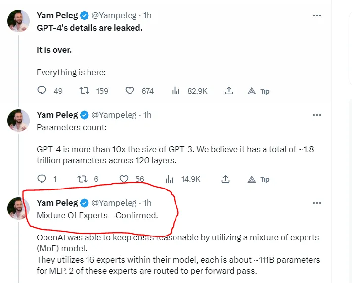
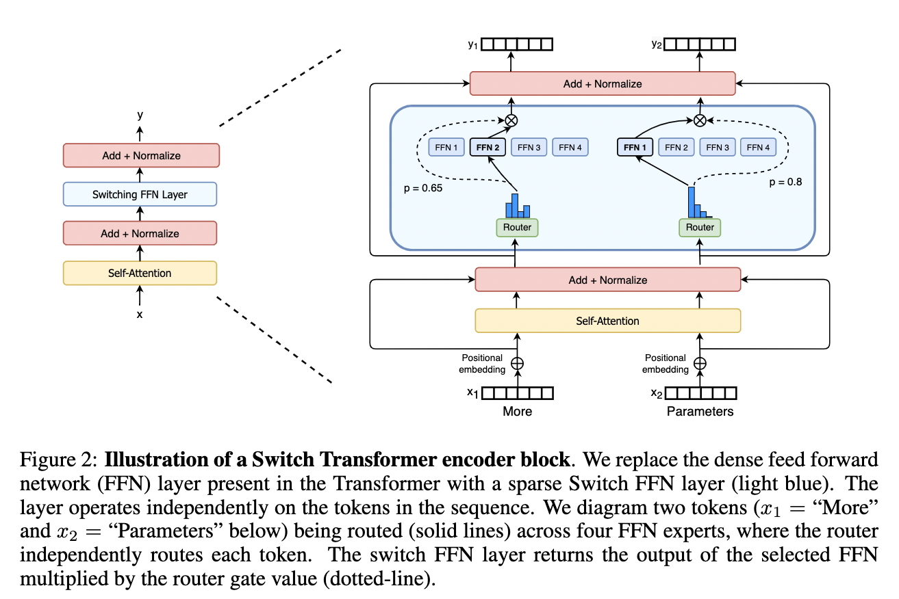
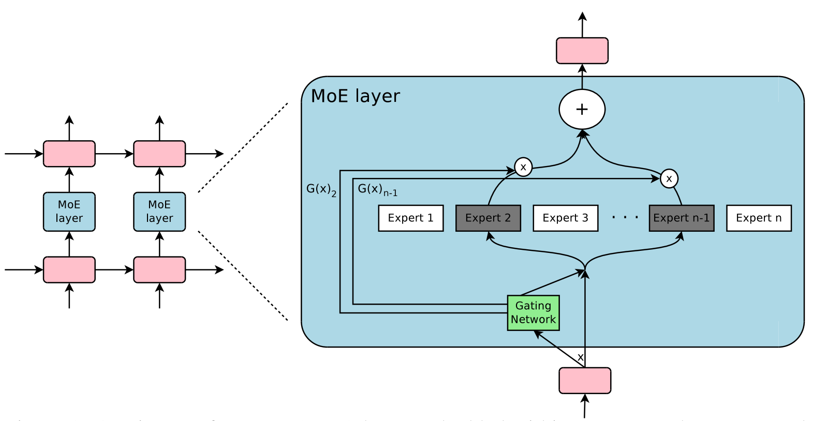
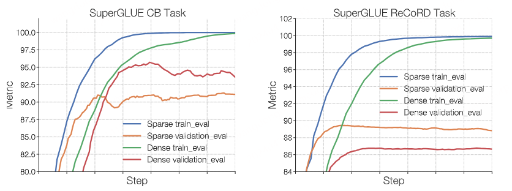

### MoE整理介绍

这条关于 GPT4 架构的推文

GPT-4远不止1万亿，甚至还是8个2200亿参数组成的混合专家模型（MoE）。
2023年6月，美国知名骇客George Hotz在接受采访时透露，GPT-4由8个220B模型组成。这么算来，8 x 220B = 1.76万亿。就连PyTorch的创建者Soumith Chintala对此也深信不疑。
MoE 应用于大模型，GPT-4并不是第一个。在2022年的时候，Google 就提出了MoE大模型Switch Transformer，模型大小是1571B，Switch Transformer在预训练任务上显示出比 T5-XXL（11B） 模型更高的样本效率。在相同的训练时间和计算资源下，Switch Transformer 能够达到更好的性能。
除了GPT-4和Switch Transformer，国内的团队DeepSeek 也开源了国内首个 MoE 大模型 DeepSeekMoE。

DeepSeekMoE 2B可接近2B Dense，仅用了17.5%计算量。
DeepSeekMoE 16B性能比肩 LLaMA2 7B 的同时，仅用了40%计算量。
DeepSeekMoE 145B 优于Google 的MoE大模型GShard，而且仅用 28.5%计算量即可匹配 67B Dense 模型的性能。

它是一种新的监督学习过程，一个系统中包含多个分开的网络，每个网络去处理全部训练样本的一个子集。这种方式可以看做是把多层网络进行了模块化的转换。
假设已经知道数据集中存在一些天然的子集（比如来自不同的domain，不同的topic），那么用单个模型去学习，就会受到很多干扰（interference），导致学习很慢、泛化困难。这时，可以使用多个模型（即专家，expert）去学习，使用一个门网络（gating network）来决定每个数据应该被哪个模型去训练，这样就可以减轻不同类型样本之间的干扰。

#### MoE术语
MoE，全称为Mixed Expert Models，翻译过来就是混合专家模型。MoE并不是什么最新技术，早在1991年的时候，论文Adaptive Mixture of Local Experts就提出了MoE。
它谈到了这个术语，称为 Mix of Experts。最新学术内容从这篇论文中有相同的理解:
[Towards Understanding Mixture of Experts in Deep Learning](https://arxiv.org/pdf/2208.02813.pdf)

模型规模是提升模型性能的关键因素之一，这也是为什么今天的大模型能取得成功。在有限的计算资源预算下，用更少的训练步数训练一个更大的模型，往往比用更多的步数训练一个较小的模型效果更佳。

深度学习使计算机能够从大量数据中学习复杂的模式，从而彻底改变了从图像识别到自然语言处理的许多领域。深度学习的关键组成部分之一是神经网络架构，它定义了数据如何流经模型以及模型如何从数据中学习。其中一种架构是 Mixture-of-Experts （MoE） 模型，该模型在各种任务中取得了重大成功。

MoE 的一个显著优势是它们能够在远少于 Dense 模型所需的计算资源下进行有效的预训练。这意味着在相同的计算预算条件下，可以显著扩大模型或数据集的规模。特别是在预训练阶段，与稠密模型相比，混合专家模型通常能够更快地达到相同的质量水平。

MoE模型是一种集成学习的方法，它结合了多个“专家”模型的预测，每个模型都专注于数据的特定部分。就像是神经网络世界中的一种团队合作技术。想象一下，把一项大任务分解成更小的部分，让不同的专家来处理每个部分。然后，有一个聪明的法官，他根据情况决定遵循哪位专家的建议，所有这些建议都融合在一起。
尽管它最初是用神经网络来解释的，但你可以将这个想法用于任何类型的专家或模型。这有点像你把不同的味道结合在一起做一道美味的菜，这属于一组很酷的综合学习方法，称为元学习。

#### MoE架构

MoE基于Transformer架构，主要由两部分组成：

稀疏 MoE 层**：** 这些层代替了传统 Transformer 模型中的前馈网络 (FFN) 层。MoE 层包含若干“专家”(例如 8 个)，每个专家本身是一个独立的神经网络。在实际应用中，这些专家通常是前馈网络 (FFN)，但它们也可以是更复杂的网络结构。

门控网络或路由: 这个部分用于决定哪些 token 被发送到哪个专家。例如，在下图中，“More”这个 token 可能被发送到第二个专家，而“Parameters”这个 token 被发送到第一个专家。有时，一个 token 甚至可以被发送到多个专家。token 的路由方式是 MoE 使用中的一个关键点，因为路由器由学习的参数组成，并且与网络的其他部分一同进行预训练。

### 大语言模型的技术背景前提

- 神经网络的吸收信息的容量（capacity）受限于参数数目。
- 条件计算（conditional computation）**针对于每个样本， ​激活网络的部分子网络进行计算**，它在理论上已证明，可以作为一种显著增加模型容量的方法。
- 在实际中，在牺牲少量计算效率的情况下，实现了 1000 倍的模型容量（model capacity） 的提升。
- 引入了稀疏门控专家混合层（Sparsely-Gated Mixture-of-Experts Layer），包括数以千计的前馈子网络。对于每一个样本，有一个可训练的门控网络（gating network）会计算这些专家（指前馈子网络）的稀疏组合。
- 把专家混合（MoE）应用于语言建模和机器翻译任务中，对于这些任务，从训练语料库中吸收的巨量知识，是十分关键的。
- 在我们提出的模型架构里，MoE 包含 1370 亿个参数，以卷积的方式放在堆叠 LSTM 层之间。
- 在大型语言建模和及其翻译的基准测试中，该模型以更少的计算成本，实现了比最先进方法更好的结果。

##### 条件计算

充分利用训练数据和模型大小的规模，一直以来都是深度学习成功的关键。

- 当训练集足够大，增加神经网络的容量（即参数数目），可以得到更高的预测准确度。
- 对于传统的深度学习模型，对每一个样本都会激活整个模型，这会导致在训练成本上，以大约二次方的速度增长，因为模型大小和训练样本数目都增加了。
- 当前计算能力和分布式计算的进展，并不能满足这样的需求。

因此有很多工作提出了各种形式的条件计算，它们在不显著增加计算成本的情况下**，尽量增加模型的容量**。

- 在这些算法里，以每个样本为基础（on a per-example basis），会激活或冻结网络中的大部分。
- 这种门控决策机制，可以是二进制的，也可以是稀疏而连续的；可以是随机性的，也可以是确定性的。
- 门控决策通过有各种形式的强化学习和反向传播来训练。

#### Sparse MoE的设计GLaM
这是Google在2021年推出的一个超大模型，比GPT-3大三倍，但是由于使用了Sparse MoE的设计，训练成本却只有GPT-3的1/3，而且在29个NLP任务上超越了GPT-3。

下面这个来自Google Blog的动图很形象地展示了GLaM的结构：

##### 机器翻译为例
这里使用的MoE模型是GNMT的修改版本。

为了减少计算，编码器和解码器中的LSTM层的数量分别从9和8减少到3和2。

MoE层被插入编码器（在层2和3之间）和解码器（在层1和2之间）中。每个MoE层包含多达2048名专家，每个专家都有大约200万个参数，总共为模型增加了大约80亿个参数。

在Google Production数据集上，MoE模型在训练了六分之一的时间后，测试BLEU得分也提高了1.01。

#### Fine-Tuning MoE 模型

稠密模型和稀疏模型在过拟合的动态表现上存在显著差异。稀疏模型更易于出现过拟合现象，因此在处理这些模型时，尝试更强的内部正则化措施是有益的，比如使用更高比例的 dropout。例如，可以为稠密层设定一个较低的 dropout 率，而为稀疏层设置一个更高的 dropout 率，以此来优化模型性能。

在 Fine-Tuning 过程中是否使用辅助损失是一个需要决策的问题。ST-MoE 的作者尝试关闭辅助损失，发现即使高达 11% 的 token 被丢弃，模型的质量也没有显著受到影响。token 丢弃可能是一种正则化形式，有助于防止过拟合。

实验观察到，在相同的预训练 PPL 下，稀疏模型在下游任务中的表现不如对应的稠密模型，特别是在理解任务 (如 SuperGLUE) 上。另一方面，对于知识密集型任务 (如 TriviaQA)，稀疏模型的表现异常出色。作者还观察到，在Fine-Tuning 过程中，较少的专家的数量有助于改善性能。另一个关于泛化问题确认的发现是，模型在小型任务上表现较差，但在大型任务上表现良好。

注意点：

- 1. 一种可行的 Fine-Tuning 策略是尝试冻结所有非专家层的权重。实践中，这会导致性能大幅下降，可以尝试相反的方法：仅冻结 MoE 层的参数。实验结果显示，这种方法几乎与更新所有参数的效果相当。这种做法可以加速 Fine-Tuning 过程，并降低显存需求。

- 2. 在 Fine-Tuning MoE 时还需要考虑的一个问题是，它们有需要特殊设置的超参数，例如，稀疏模型往往更适合使用较小的 batch size 和较高的学习率，这样可以获得更好的训练效果。

### 结论

- 该工作是一个展现基于深度网络的条件计算的重大胜利。
- 涉及设计考虑、条件计算的挑战、从算法和工程上的解决方案。
- 虽然聚焦在文本领域上，条件计算仍然可以在其他领域发挥作用。期望有更多条件计算的实现和应用。

主要回答三个问题的内容：

第一个问题：MoE 为什么能够实现在低成本下训练更大的模型。

这主要是因为稀疏路由的原因，每个 token 只会选择 top-k 个专家进行计算。同时可以使用模型并行、专家并行和数据并行，优化 MoE 的训练效率。而负载均衡损失可提升每个 device 的利用率。

第二个问题：MoE 如何解决训练稳定性问题？

可以通过混合精度训练、更小的参数初始化，以及 Router z-loss 提升训练的稳定性。

第三个问题：MoE 如何解决 Fine-Tuning 过程中的过拟合问题？

可以通过更大的 dropout （主要针对 expert）、更大的学习率、更小的 batch size。目前看到的主要是预训练的优化，针对 Fine-Tuning 的优化主要是一些常规的手段。