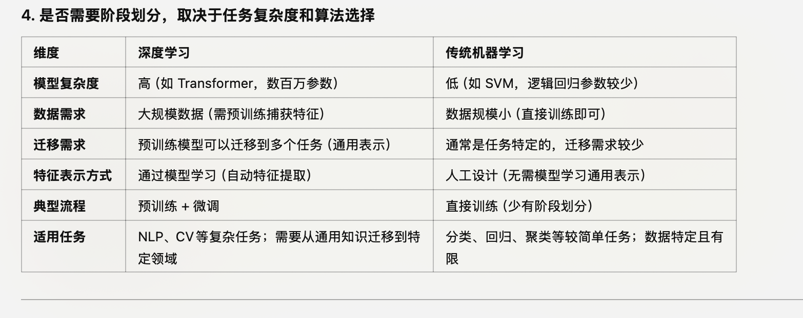

## Deep Learning

因为深度学习是基于神经网络的，才会涉及到 “pre-trained” 等不同阶段的概念在深度学习（deep learning）中更为明显和重要，而在传统的机器学习（machine learning）中，这种阶段的划分并不常见或者没有那么严格。这种区别的原因可以从以下几个方面来解释：

1. 深度学习与传统机器学习的架构差异

深度学习

    •	复杂的模型结构：深度学习模型（如 CNN、RNN、Transformer）通常包含数百万甚至数十亿的参数，直接从头训练需要大量数据和计算资源。
    •	大规模数据需求：预训练的一个关键目的是在通用任务上学习大量数据的特征，从而减轻下游任务的数据需求。
    •	特征提取自动化：深度学习通过多个层级自动学习特征表示，而这些表示需要通过预训练来捕捉通用知识。

传统机器学习

    •	简单模型结构：如逻辑回归、支持向量机（SVM）、随机森林等，参数量较少，可以用少量数据直接优化模型。
    •	人工特征工程：传统机器学习通常依赖于领域专家进行特征设计，而非通过模型自己学习特征。
    •	数据规模较小：传统任务通常用中小规模的数据，直接训练即可达到较好的效果。

因此，深度学习因为模型复杂性和数据需求，才需要预训练和微调等不同阶段，而传统机器学习无需这种复杂流程。

####  预训练的特性更适合深度学习

深度学习中的预训练

    •	迁移学习（Transfer Learning）：
        •	预训练模型能够学习通用表示（如 BERT 在 NLP 中学到的语言知识，ResNet 在图像中学到的视觉特征）。
        •	这些通用表示可以迁移到不同的下游任务上，节省计算和数据资源。
    
    •	表示学习（Representation Learning）：
        •	深度学习的一个重要特点是能够通过多层结构捕获抽象的特征表示。
        •	预训练帮助模型学习更高质量的通用表示，为后续任务提供优势。

传统机器学习中的情况

    •	无通用表示需求：
        •	传统机器学习模型通常是任务特定的，不需要学习通用表示。例如，训练一个 SVM 来解决分类问题，不需要先学到一个通用的特征表示。
    •	无需迁移学习：
        •	传统模型通常直接优化目标任务，而不是依赖其他任务的知识。
        •	如果有迁移需求，通常通过重新训练模型，而不是通过“预训练-微调”的方式。

#### 数据规模和任务需求的影响

深度学习需要预训练的原因

    •	深度学习模型需要大量标注数据来避免过拟合，而大多数实际任务数据不足。
    •	预训练通过无监督或自监督学习，在大规模未标注数据上建立强大的表示能力，然后在下游任务上用较少的数据微调。

传统机器学习无需预训练的原因

    •	传统模型可以在小规模数据上高效训练，例如，使用1000条数据训练逻辑回归或随机森林可以直接达到较好效果。
    •	数据特征是人工设计的，无需通过模型学习，因此没有预训练的需求。

#### 实际应用中的例外情况

深度学习不需要预训练的场景

    •	数据量非常大且任务特定（如 Google 用超大规模数据从零训练 Bard 的语言模型）。
    •	任务较简单（如小型 CNN 在图像分类中的应用）。

传统机器学习需要“类似预训练”的情况

虽然传统机器学习没有严格意义的预训练阶段，但在以下场景中会出现类似概念：
    •	领域特定特征的提取：
        •	例如，在医学影像中，可以先用深度学习模型提取特征，再用 SVM 或逻辑回归进行分类。
    •	半监督学习：
        •	在未标注数据上学习初步表示，然后在标注数据上调整（类似预训练和微调）。
    •	集成学习：
        •	通过多个模型的组合，类似预训练阶段的“多任务学习”。

#### Pre-trained (预训练)

预训练 是指在大规模通用数据集上训练模型的初始阶段，目的是让模型学到广泛的知识，如语言模式、语法结构或基本视觉特征。

    •	通常是无监督或自监督方式进行训练：
        •	语言模型：通过预测下一个词（如 GPT）或填补缺失词（如 BERT）的任务学习。
        •	视觉模型：通过任务如图像分类或图像特征提取进行训练。
    •	结果是一个通用的模型，可以作为基础模型用在特定领域的任务上，通过**微调（fine-tuning）**来实现更高性能。

Train a model (训练模型)

    •	训练一个模型是指从零开始或从初始状态对模型参数进行优化，使其在特定任务上表现良好。
    •	通常需要定义明确的任务目标，如分类、回归或生成数据。
    •	全量训练需要大量的计算资源和领域数据。

1. 数据使用的广度和任务目标

预训练：
    •	使用通用的大规模数据集（如 Wikipedia、Common Crawl）。
    •	目标是学习通用表示（如语义理解或基本视觉特征），而不是直接解决特定任务。
    训练模型：
    •	通常使用特定领域的数据集（如医学文本或金融数据）。
    •	目标是优化模型在该特定任务上的性能。

2. 时间和资源投入

    预训练：
    •	通常由大公司（如 OpenAI、Google）使用高性能计算资源进行，耗时长、资源消耗大。
    •	一次预训练可以为多个任务复用，减少后续开发成本。
    训练模型：
    •	可以从头开始训练（需要大量资源），或基于预训练模型微调（资源需求较低）。
    •	微调阶段只需要调整模型少量参数，通常更高效。

3. 模型的通用性

    预训练模型：
    •	通用性强，适合迁移到不同任务（如 GPT 模型既能回答问题，也能生成文章）。
    从零训练的模型：
    •	针对性强，模型从一开始就是为特定任务设计，难以迁移到其他任务。

