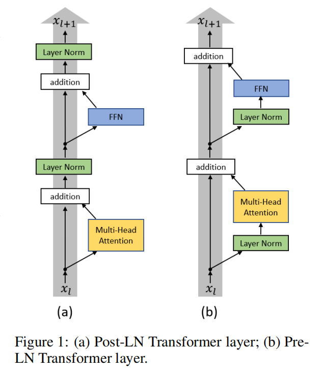
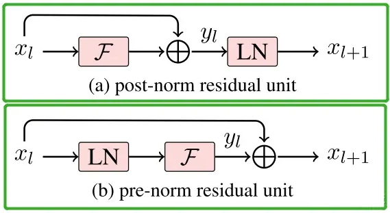

## 层归一化或正则化

在Transformer中，这里的Norm主要指Layer Normalization，但在一般的模型中，它也可以是Batch Normalization、Instance Normalization等，相关结论本质上是通用的。

它是一种正则化技术，通过对每个样本的隐藏层激活进行归一化，使其均值为 0、方差为 1。
这有助于减少网络中梯度变化的敏感性，从而提高训练速度和稳定性。
是一种关键的归一化技术，在 Transformer 模型中帮助提高训练速度、稳定性，并使模型在各种场景中表现更为鲁棒。

### 在Transformers中位置

在 Transformer 架构中，LayerNormalization 通常用于以下位置：
	1.	在多头自注意力机制之后：对 Attention 输出进行归一化。
	2.	在前馈神经网络之后：对全连接层的输出进行归一化。
	3.	残差连接中：结合残差连接使用，确保稳定训练。

### Normalization主要的类型

常用的Normalization方法主要有：

- Batch Normalization（BN，2015年）、
- Layer Normalization（LN，2016年）、
- Instance Normalization（IN，2017年）、
- Group Normalization（GN，2018年）。

它们都是从激活函数的输入来考虑、做文章的，以不同的方式对激活函数的输入进行 Norm 的。

将输入的 feature map shape 记为**[N, C, H, W]**，其中
- N表示batch size，即N个样本；
- C表示通道数；
- H、W分别表示特征图的高度、宽度。

这几个方法主要的区别就是在：

- BN是在batch上，对N、H、W做归一化，而保留通道 C 的维度。BN对较小的batch size效果不好。BN适用于固定深度的前向神经网络，如CNN，不适用于RNN；
- LN在通道方向上，对C、H、W归一化，主要对RNN效果明显；
- IN在图像像素上，对H、W做归一化，用在风格化迁移；
- GN将channel分组，然后再做归一化。

比喻成一摞书，这摞书总共有 N 本，每本有 C 页，每页有 H 行，每行 有W 个字符。

- BN 求均值时，相当于把这些书按页码一一对应地加起来（例如第1本书第36页，第2本书第36页......），再除以每个页码下的字符总数：N×H×W，因此可以把 BN 看成求“平均书”的操作（注意这个“平均书”每页只有一个字），求标准差时也是同理。
- LN 求均值时，相当于把每一本书的所有字加起来，再除以这本书的字符总数：C×H×W，即求整本书的“平均字”，求标准差时也是同理。
- IN 求均值时，相当于把一页书中所有字加起来，再除以该页的总字数：H×W，即求每页书的“平均字”，求标准差时也是同理。
- GN 相当于把一本 C 页的书平均分成 G 份，每份成为有 C/G 页的小册子，求每个小册子的“平均字”和字的“标准差”。

### Post-LN 和 Pre-LN

左边是原版Transformer的Post-LN，即将LN放在addition之后；右边是改进之后的Pre-LN，即把LN放在FFN和MHA之前。

一般认为，Post-Norm在残差之后做归一化，对参数正则化的效果更强，进而模型的收敛性也会更好；而Pre-Norm有一部分参数直接加在了后面，没有对这部分参数进行正则化，可以在反向时防止梯度爆炸或者梯度消失，大模型的训练难度大，因而使用Pre-Norm较多。

目前比较明确的结论是：同一设置之下，Pre Norm结构往往更容易训练，但最终效果通常不如Post Norm。Pre Norm更容易训练好理解，因为它的恒等路径更突出，但为什么它效果反而没那么好呢？为什么Pre Norm的效果不如Post Norm？

Pre Norm结构无形地增加了模型的宽度而降低了模型的深度，而我们知道深度通常比宽度更重要，所以是无形之中的降低深度导致最终效果变差了。而Post Norm刚刚相反，在《浅谈Transformer的初始化、参数化与标准化》中我们就分析过，它每Norm一次就削弱一次恒等分支的权重，所以Post Norm反而是更突出残差分支的，因此Post Norm中的层数更加“足秤”，一旦训练好之后效果更优。
简单来说，所谓“the gradients of Pre-LN at bottom layers tend to be larger than at top layers”，就是指Pre Norm结构会过度倾向于恒等分支（bottom layers），从而使得Pre Norm倾向于退化（degradation）为一个“浅而宽”的模型，最终不如同一深度的Post Norm。这跟前面的直观理解本质上是一致的。

