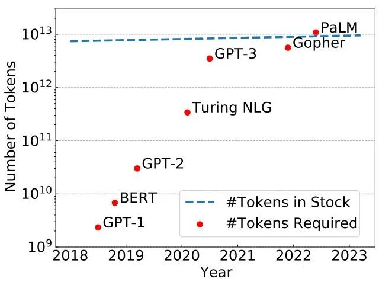

## token及模型参数

#### 预训练模型表现影响因素

1.预训练模型表现影响因素
模型表现强依赖于模型规模(模型参数量N(Embedding除外)、训练Token数D、训练总计算量C)；
平滑幂定律：模型表现与三个因子均遵循幂定律，不受另外两个因子限制；

FLOPs (Floating Point Operations)： FLOPs 表示执行某个计算任务所需的浮点运算次数。FLOPs 是衡量模型训练中计算复杂度的关键指标。它考虑了前向传播和反向传播中所有需要的计算量。
FLOPs = 每次前向传播的 FLOPs × 2 (反向传播) × 总训练步数。

FLOPs (in Gopher unit)：Gopher 是一个由 DeepMind 发布的大型语言模型，其训练过程中提出了一种标准化的 FLOPs 衡量方法，便于模型规模的比较。
Gopher 单位是通过将某种规模和训练需求设定为基准值 1。
FLOPs (in Gopher unit) = 实际 FLOPs ÷ 基准模型 FLOPs

在给定计算量预算下，模型参数量以及训练Token数应该同比提升，对应模型参数量需要的训练Token数如下：

| Parameters  | FLOPs    | FLOPs (in Gopher unit) | Tokens         |
| ----------- | -------- | ---------------------- | -------------- |
| 400 Million | 1.92e+19 | 1//29,968              | 8.0 Billion    |
| 1 Billion   | 1.21e+20 | 1//4,761               | 20.2 Billion   |
| 10 Billion  | 1.23e+22 | 1//46                  | 205.1 Billion  |
| 67 Billion  | 5.76e+23 | 1                      | 1.5 Trillion   |
| 175 Billion | 3.85e+24 | 6.7                    | 3.7 Trillion   |
| 280 Billion | 9.90e+24 | 17.2                   | 5.9 Trillion   |
| 520 Billion | 3.43e+25 | 59.5                   | 11.0 Trillion  |
| 1 Trillion  | 1.27e+26 | 221.3                  | 21.2 Trillion  |
| 10 Trillion | 1.30e+28 | 22515.9                | 216.2 Trillion |

平滑幂定律：
幂定律形式描述了性能随关键因子的增长规律，表现为 快速初始增长、逐渐减缓 的趋势。在语言模型训练中，它提供了一种精确的理论框架，帮助研究者设计更高效、更具成本效益的训练策略。

总体来说，这些结果表明，随着适当地提高模型大小、数据和计算能力，语言建模性能会平稳、可预测地提高。更大的语言模型将比其他模型表现更好，并且更具样本效率。

- 训练的tokens数量大概训练的参数20倍，计算量是指数级别的增加的。

#### 预训练数据 Token 重复 是否影响 模型性能？
- 多轮epoch的训练会降低模型性能；
- 更大规模的数据集会缓解重复epochs对模型性能下降的影响；
- 提高数据集的质量也无法挽救重复训练带来的过拟合；
- 小计算量模型的过拟合趋势与大计算量的差不多；
- 多样的训练目标不一定减轻多Epoch的性能下降；
- Dropout是一个被大语言模型忽视的正则技术，虽然慢，但是可以降低多epochs的影响；
- 在训练过程中逐渐使用dropout是有效的策略；

#### 为什么要考虑在重复的数据集上做多次训练？

在此前的研究中，大家发现大语言模型的规模和训练数据集中tokens的数量对模型的性能有很大的影响。大模型扩展定律都认为模型的规模与训练数据的规模必须同时扩大才能让模型产生更好的性能。但是，tokens数量似乎并不是很足够，如下图所示是作者研究的模型参数规模增长和目前互联网是可用的数据集tokens数量增长情况：

在这幅图中，蓝色的虚线是互联网上数据集中tokens数量预估结果，高质量文本中tokens数量每年增长只有4%-5%，与世界经济增长率差不多，但是显著慢于模型规模的增长。例如，MetaAI训练的LLaMA-65B模型用了1.4万亿tokens，而2023年全球的tokens估计只有9万亿！按照目前模型规模的发展情况，在2023年-2027年几年的时间里，我们的模型将把全球所有数据集的tokens都训练完成，此后，我们很可能陷入缺少tokens训练的地步，这被作者称为tokens危机。

这就很自然的让大家想到，我们是否可以通过增加训练的epochs来做重复的训练，以提高模型的效果？ 在如Vision Transformers这样的模型中，模型训练的epochs高达300次，而大语言模型的训练epochs通常都是1-2次，多的也都是个位数。2022年，Hoffmann的论文中提出用重复的tokens训练大语言模型会让模型降低性能，而Taylor在训练Galactica模型时候发现epochs次数达到4次也可以提升模型效果。显然，在重复数据集上训练多次对模型的影响目前还没有一个相对完善的研究。但是这个问题很重要！

因此，新加坡国立大学的研究人员做了这项研究，系统性分析了大语言模型epochs的设置影响，从3个方面得出了11个结论！

#### 预训练数据集重复的影响是什么？
1. 模型参数规模与tokens数量需要匹配

首先是模型参数规模的增长与模型需要的tokens数量基本是呈线性的。
这意味如果你要充分训练一个LLM，需要根据它的参数数量来收集足够的tokens。

2. 多轮epoch的训练会降低模型性能
Epochs 是深度学习模型训练中的一个重要概念，表示 完整遍历一次整个训练数据集 的过程。换句话说，当模型看到训练集中的每一个样本 一次 时，就完成了一个 Epoch。

Batch（批次）:
	•	为了更高效地训练模型，数据集通常被分割成多个小批次，每个小批次称为一个 batch。
	•	每次通过一个 batch 完成的前向传播和反向传播称为一次 iteration（迭代）。
Iteration（迭代）:
	•	一个 epoch 通常包含若干个迭代（iterations），具体数量由公式决定：

\text{Iterations per Epoch} = \frac{\text{训练样本总数}}{\text{批次大小}}

	•	举例：假设数据集有 1000 个样本，批次大小为 100，那么一个 epoch 包含  \frac{1000}{100} = 10  次迭代。

设置多次epochs来让模型总的训练过的tokens差不多水平，观察模型的性能。

如下图所示，可以看到，数据集重复的次数越多，模型的性能越差：

此外，如果tokens数量不够，模型参数规模越大，越容易出现过拟合的现象！

尽管重复数据上的训练会降低预训练模型的效果，但是这种方式对于下游任务的影响也没有人探测过。因此，作者也继续做了这方面的研究，得到的结论是在下游任务上也会出现，即如果预训练模型在重复数据上进行，尽管训练的总的tokens数量可能一致，但是，其下游任务的效果也是更差！

#### 正则化可以降低多epochs的影响吗

- Dropout 是一种随机正则化技术，在每次训练过程中，随机地将神经网络中的部分神经元置为无效（即“丢弃”），从而减少神经元之间的相互依赖性，增强模型的鲁棒性。（数据较少时，用于防止过拟合。）
- Droppath 是 Dropout 的一种扩展，专门用于深层神经网络（如 ResNet 或 Transformer）。它随机丢弃整个路径（如残差分支或注意力头），而不是单个神经元。（深层网络中，增强路径间的独立性和鲁棒性。）
- Weight Decay 是一种  L2  正则化方法，通过在损失函数中加入权重的平方惩罚项，限制模型权重的大小，从而防止过拟合。（通用方法，可与其他正则化技术联合使用。）

正则技术，如dropout、droppath、weight decay等都是常用的防止过拟合的技术。而多Epochs的负面影响也都是过拟合。因此，作者研究了这些正则技术是否可以降低多epochs的影响。

1. Dropout是一个被大语言模型忽视的正则技术，虽然慢，但是可以降低多epochs的影响
在目前超过100亿参数规模的大语言模型中，如GPT-3、PaLM、LLaMA等，都没有使用dropout（可能是因为太慢了）。而前面说的Galactica训练使用了，这是Galactica能够训练4Epochs提升性能的最重要的原因。

2. dropout对不同规模模型的影响不同

尽管前面已经证明dropout使用可以降低多epochs的影响，但是在不同规模模型下是不同的。对于规模较大的模型，dropout不能有效降低多epochs带来的坏处！

