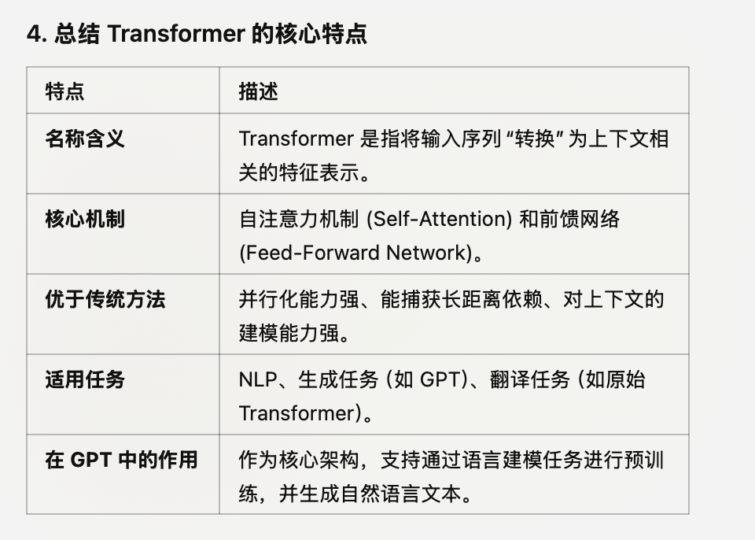

## Transform 的特点

先通过pre-trained 这种预训练，得到一个比较通用的模型，然后通过调整来让它来适合generative 任务，预判下一个token，
这里的transform 是什么?CNN，RNN 等并列的 Transform ：

#### Transformer 是什么？

Transformer 是一种 深度神经网络架构，专为序列数据设计。它通过一种叫做 自注意力机制 (Self-Attention) 的方法，捕获序列中各部分之间的关系，无需像传统 RNN 或 CNN 那样依赖固定的顺序。也就是它可以在一个序列中，去需要需要注意点，词干，主谓宾等，把那些预期助词等忽略，减少注意力。以及对应位置，每个位置之间的关系

####  “Transformer” 这个名字的由来

“Transformer” 的含义可以追溯到其功能和设计目的：
    •	它通过自注意力机制，将输入序列“转换（transform）”为一种新的表示，用于下游任务（如分类或生成）。
    •	具体来说，它“转换”了输入序列的每个部分，使得输出能够捕获全局上下文和局部信息。

#### 核心模块

Transformer 的主要模块包括：

    1.	自注意力机制 (Self-Attention)：
        •	关注输入序列中的每个位置，与其他位置的关系。
        •	例如，在句子 “The cat sat on the mat” 中，自注意力机制可以让模型理解 “the” 和 “cat” 之间的关联。

    2.	前馈网络 (Feed-Forward Network)：
        •	在捕获上下文关系后，进一步对每个位置的特征进行非线性变换。

    3.	编码器-解码器结构 (Encoder-Decoder Architecture)：
            •	编码器 (Encoder)：将输入序列转换为一种上下文表示。
            •	解码器 (Decoder)：根据上下文生成输出序列（如翻译、回答问题等）。
            •	GPT 只使用了解码器部分进行文本生成。（只是通过判断生成下一个token）

#### 相比 RNN/CNN 的优势

    •	并行化能力强：
        •	RNN 需要逐步处理序列（按时间步），Transformer 能同时处理序列的所有位置，利用 GPU 并行加速。
    •	捕获长距离依赖关系：
        •	传统 RNN 难以捕获长距离依赖（如句子中前后词之间的关系），而 Transformer 可以通过自注意力机制高效地捕获。
    •	不需要固定长度的上下文窗口：
        •	CNN 有固定的卷积核大小，Transformer 的自注意力机制理论上可以捕获任意长度的关系。

#### 适用于生成任务

在 GPT 中，Transformer 架构被调整为只使用解码器部分，专注于 生成 (Generative) 任务：
    •	输入是一个部分序列（如“Once upon a time”）。
    •	输出是预测的下一个 token（如“there”），然后不断递归生成直到满足停止条件。

#### 语言建模

Transformer 架构适用于语言建模的原因：
    •	它能够学习 上下文相关 的表示。
    •	它可以有效预测序列中的下一个 token（这是 GPT 的生成目标）。

Transformer 的架构特点，使其非常适合 NLP 中的预训练和生成任务：

#### 适合预训练

    •	自注意力机制可以在大规模无标注数据（如维基百科、书籍语料）上学习语言特征，包括语法、语义和上下文关系。
    •	模型通过语言建模任务（如预测下一个 token）捕获通用的语言知识。

####  适合生成

    •	在生成任务中，解码器部分通过递归生成序列：
        1.	每一步将前面生成的 token 作为输入。
        2.	使用自注意力捕获上下文关系，预测下一个 token。
    •	这种生成方式与自注意力的结合，使 Transformer 能够生成更自然、更连贯的文本。

#### 易于扩展

    •	Transformer 的并行化能力和模块化设计，使其适合大规模训练，支持扩展到更大的数据集和模型（如 GPT-3、GPT-4）。

