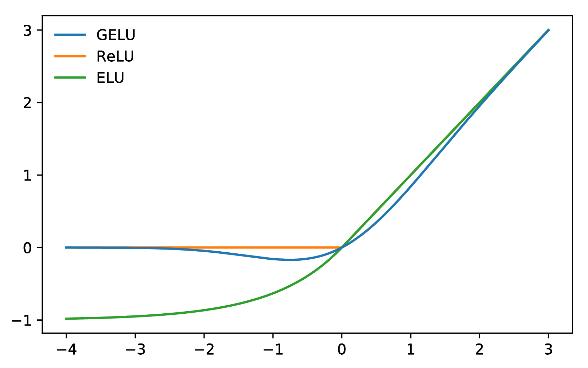
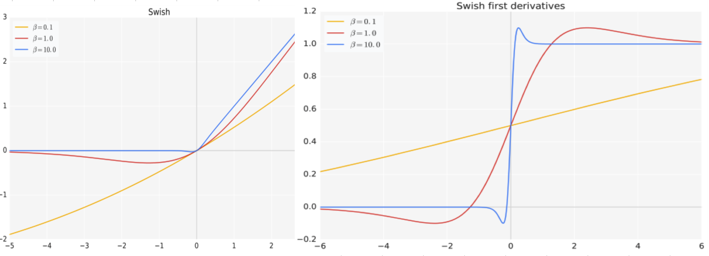

## 激活函数

### FFN（Feed-Forward Network）：
（前馈网络）是人工神经网络（Artificial Neural Network, ANN）的一种基础结构，广泛用于机器学习和深度学习中。其特点在于信息从输入层单向传递到输出层，不存在循环或反馈，因此称为“前馈”。

Feed-Forward Network 主要由以下三部分组成：
	1.	输入层（Input Layer）：
        	•	接收外部输入数据。
	        •	每个节点通常代表一个输入特征。
    2.	隐藏层（Hidden Layers）：
            •	介于输入层和输出层之间，包含神经元（neurons）。
	        •	每个神经元通过权重（weights）和偏置（bias）对输入数据进行线性变换，然后通过激活函数（activation function）引入非线性。
	        •	隐藏层数量和每层神经元数量是超参数，需要根据任务调整。
    3.  输出层（Output Layer）：
            •	根据具体任务产生最终输出。
            •	输出层的神经元数量通常与任务目标一致，例如分类问题中的类别数。

Feed-Forward Network 的运行可以概括为以下几步：
    1.	前向传播（Forward Propagation）
        •	输入数据从输入层出发，经过隐藏层的线性变换和激活函数处理，最后到达输出层。
        •	每个神经元的输出公式：z = W*x + b
    2. 	损失计算（Loss Calculation）：
        •	将输出层的预测结果与目标值进行比较，计算误差（损失函数，Loss Function）。
    3.	反向传播（Backpropagation）（用于训练）：
        •	通过梯度下降（Gradient Descent）优化算法，根据损失对网络中的权重和偏置进行更新，使预测结果更加准确。

主要特点：
	•	无环性：信息单向流动，无反馈。
	•	可扩展性：可以添加多个隐藏层以提升模型复杂性（深度学习中的深度网络）。
	•	简单性：适用于从线性回归到复杂模式识别等广泛的任务。

### 激活函数
    是神经网络中的核心组件，其作用是引入非线性，使网络能够学习和表示复杂的映射关系。没有激活函数的网络只是线性变换的堆叠，无法解决复杂问题。
    主要作用如下：
	1.	非线性化：
        •	激活函数的主要功能是将线性输入转换为非线性输出，使神经网络可以拟合复杂的数据分布。
        •	例如，输入层和隐藏层之间的线性操作（矩阵乘法）本身无法表示曲线或复杂关系，激活函数可以解决这一问题。
	2.	特征选择：
        •	一些激活函数（如 ReLU）会过滤掉不重要的信息（如负值），从而突出有意义的特征。
	3.	梯度传递：
        •	激活函数的导数用于反向传播计算梯度，因此其选择对梯度消失或爆炸有直接影响。

##### 激活函数的选择
	1.	隐藏层：
	    •	常用 ReLU 或其变体（Leaky ReLU、PReLU、ELU 等），因为它们计算简单且梯度传递效果好。
	2.	输出层：
        •	回归问题：通常使用线性激活函数。
        •	二分类问题：使用 Sigmoid。
        •	多分类问题：使用 Softmax。
	3.	特殊任务：
	    •	使用 GeLU、Swish 等平滑激活函数提升复杂模型的性能。

#### 概念解释

Linear Unit 指的是一种线性变换层，通常出现在神经网络的全连接层（Fully Connected Layer）中，负责对输入数据进行线性操作，为后续的激活函数提供输入。
在很多激活函数中包含LU，比如：ReLU，Leaky ReLU，GeLU（Gaussian Error Linear Unit）等。

	•	线性变换本身是线性的，如果整个网络中只有 Linear Unit，没有激活函数，则网络的输出仍是线性组合，无法拟合复杂的非线性关系。
	•	通常，在 Linear Unit 后会添加激活函数（如 ReLU、Sigmoid）来引入非线性，使网络能够处理复杂任务。

Linear Unit 的作用
	1.	特征组合：
	    •	将输入的特征通过权重和偏置重新组合，使数据通过网络层逐步抽象出更高层次的特征。
	2.	激活函数的输入：
	    •	Linear Unit 的输出 z 通常作为激活函数的输入，从而引入非线性，使网络具有更强的表达能力。
	3.	灵活建模：
	    •	权重 \mathbf{w} 和偏置 b 是可训练的参数，模型通过训练调整这些参数以拟合数据分布。


##### 常见的激活函数及其公式
1. Sigmoid（S型激活函数）
	•	定义公式：
            Sigmoid(x) = 1/{1 + e^{-x}}

	•	输出范围：(0, 1)
	•	特性：
        •	将输入值压缩到 [0, 1] 区间。
        •	常用于输出层（如二分类问题）。
        •	缺点：容易导致梯度消失。

2. Tanh（双曲正切函数）
    	•	定义公式：
        Tanh(x) = {e^x - e^{-x}}/{e^x + e^{-x}}
        •	输出范围：(-1, 1)
    	•	特性：
	•	比 Sigmoid 更强大，因为它的输出范围包括负值。
	•	缺点：仍会出现梯度消失问题。

3. ReLU（Rectified Linear Unit）
   ReLu(x) = max(0,x)
   	•	输出范围：[0, +\infty)
	•	特性：
        •	简单高效，计算快，梯度传播效果好。
        •	缺点：可能导致“Dying ReLU”问题（神经元永远输出 0）。
4. Leaky ReLU
   	•	定义公式：

其中 \alpha 是小于 1 的常数（通常为 0.01）。
	•	输出范围：(-\infty, +\infty)
	•	特性：
        •	解决了 ReLU 的“Dying ReLU”问题。
        •	允许负输入通过，但有一个小的斜率。

5. Softmax
   	•	定义公式（适用于多分类问题）：

    \text{Softmax}(x_i) = \frac{e^{x_i}}{\sum_{j=1}^N e^{x_j}}

    •	输出范围：[0, 1]，且所有输出值之和为 1。
	•	特性：
	    •	用于多分类任务中的概率分布。

6. GeLU（Gaussian Error Linear Unit）
   常用于神经网络中的非线性变换。它在Transformer模型中广泛应用于FFN（Feed-Forward Network）块。下面是GeLU的计算公式：
   假设输入是一个标量 x，GeLU的计算公式如下：

假设输入是一个标量 x，GeLU的计算公式如下：

$$
GeLU(x) = 0.5 \times x \times (1 + tanh(\sqrt{\frac{2}{\pi}} \times (x + 0.044715 \times x^3)))
$$

其中，`tanh() `是双曲正切函数，`sqrt()` 是平方根函数，$\pi $是圆周率。

```python
import numpy as np

def GELU(x):
    return 0.5 * x * (1 + np.tanh(np.sqrt(2 / np.pi) * (x + 0.044715 * np.power(x, 3))))
```



相对于 Sigmoid 和 Tanh 激活函数，ReLU 和 GeLU 更为准确和高效，因为它们在神经网络中的梯度消失问题上表现更好。而 ReLU 和 GeLU 几乎没有梯度消失的现象，可以更好地支持深层神经网络的训练和优化。

而 **ReLU 和 GeLU 的区别在于形状和计算效率**。ReLU 是一个非常简单的函数，仅仅是输入为负数时返回0，而输入为正数时返回自身，从而仅包含了一次分段线性变换。但是，**ReLU 函数存在一个问题，就是在输入为负数时，输出恒为0，这个问题可能会导致神经元死亡，从而降低模型的表达能力**。GeLU 函数则是一个连续的 S 形曲线，介于 Sigmoid 和 ReLU 之间，形状比 ReLU 更为平滑，可以在一定程度上缓解神经元死亡的问题。不过，由于 GeLU 函数中包含了指数运算等复杂计算，所以在实际应用中通常比 ReLU 慢。

总之，ReLU 和 GeLU 都是常用的激活函数，它们各有优缺点，并适用于不同类型的神经网络和机器学习问题。一般来说，ReLU 更适合使用在卷积神经网络（CNN）中，而 GeLU 更适用于全连接网络（FNN）。

1. Swish 

Swish是一种激活函数，它在深度学习中常用于神经网络的非线性变换。Swish函数的计算公式如下：

$$
Swish(x) = x \times sigmoid(\beta * x)
$$

其中，$sigmoid()$ 是Sigmoid函数，$x$ 是输入，$\beta$ 是一个可调节的超参数。



Swish函数的特点是在接近零的区域表现得类似于线性函数，而在远离零的区域则表现出非线性的特性。相比于其他常用的激活函数（如ReLU、tanh等），Swish函数在某些情况下能够提供更好的性能和更快的收敛速度。

Swish函数的设计灵感来自于自动搜索算法，它通过引入一个可调节的超参数来增加非线性程度。当beta为0时，Swish函数退化为线性函数；当beta趋近于无穷大时，Swish函数趋近于ReLU函数。

需要注意的是，Swish函数相对于其他激活函数来说计算开销较大，因为它需要进行Sigmoid运算。因此，在实际应用中，也可以根据具体情况选择其他的激活函数来代替Swish函数。

