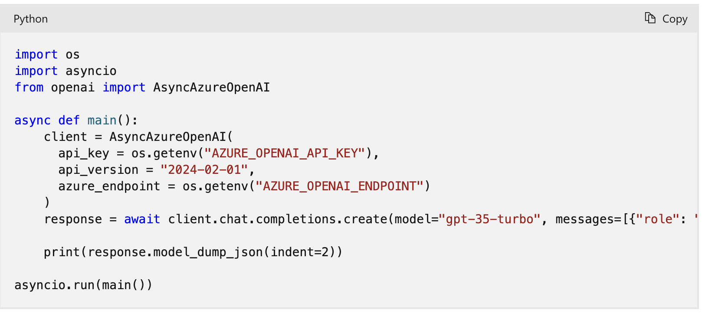
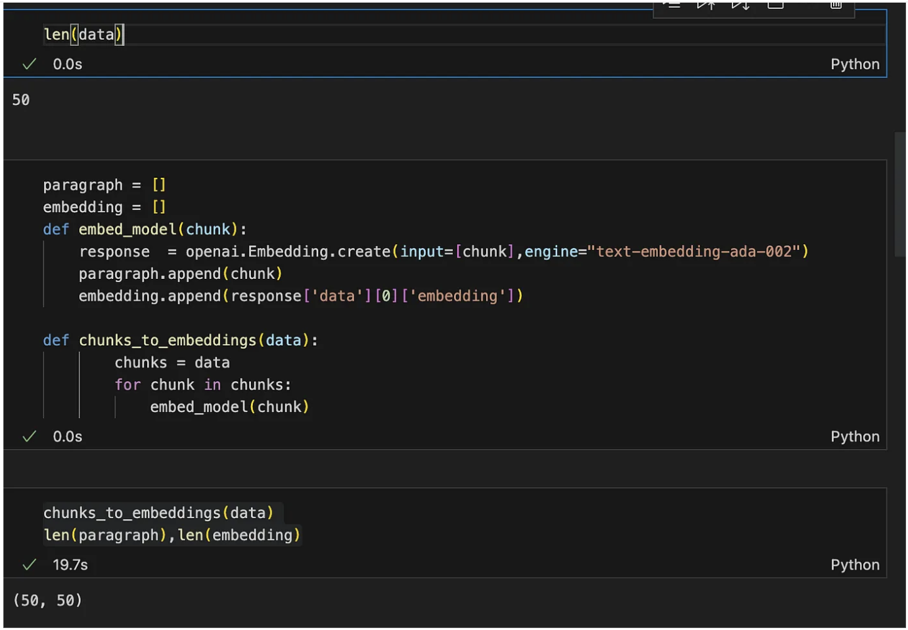
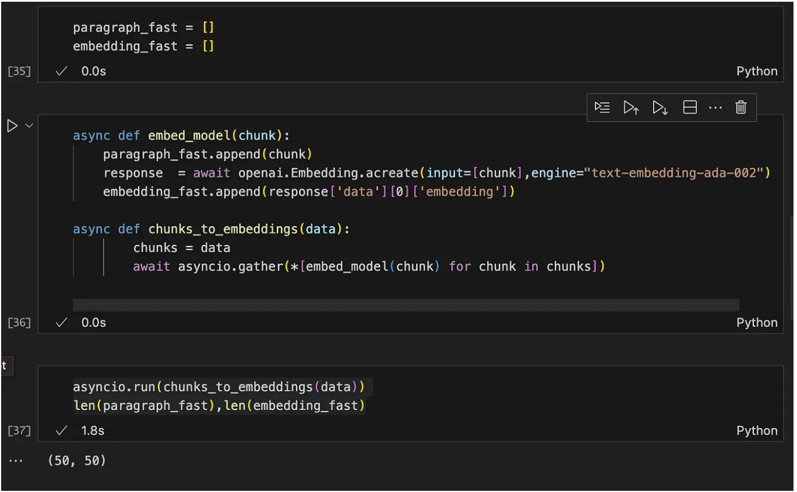
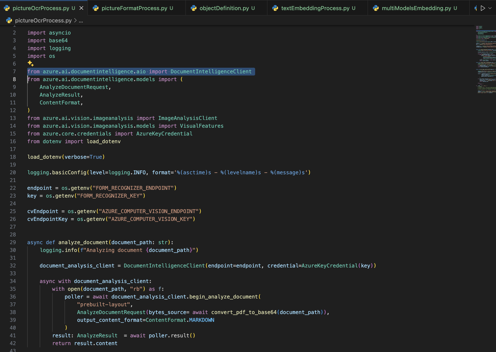
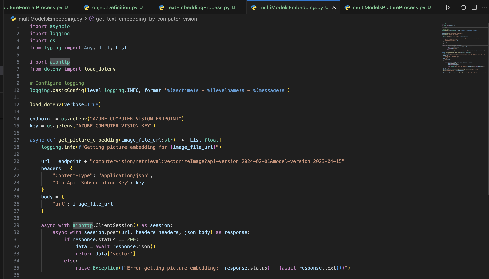
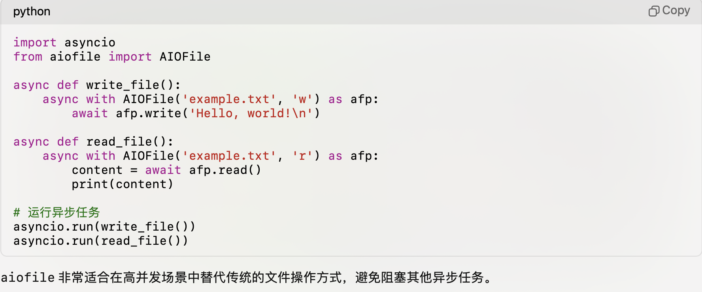
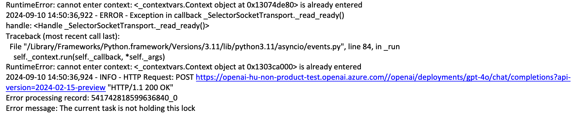

## AzureAI相关paas的AIO python SDK介绍与实践

大家对openAI的SDK相对来说会比较熟悉，但是往往一个解决方案不仅仅用到openAI的SDK。往往需要需要使用azure AI的多个pass服务，比如：Azure computer vision（机器视觉，还是识别图片中的物体等），Azure Document Intelligence（文档ocr，识别问题内容），Azure AI search（向量语义搜索，或者关键字搜索等），如果大家没有那么熟悉的话，使用默认的sample的话，可能就是同步API。这些API都设计到网络调用，如果使用量比较少的话，问题不大，但是如果要处理大量文件或请求的话，还是需要使用asyncIO相关的接口，来尽可能的加速处理。


### azureAI的AIO简单介绍

1. Azure OpenAI Python SDK 异步调用库

    openAI新的python库中（版本 > 1.0）如果是低于1.0版本的话，参考这个这个文档做相应的迁移。
[Migrating to the OpenAI Python API library 1.x](https://learn.microsoft.com/en-us/azure/ai-services/openai/how-to/migration?tabs=python-new%2Cdalle-fix)

    
    调用LLM和embedding是一样的，只要用这个AsyncAzureOpenAI 就可以了。


    这里有一个文档对比在使用sync和asyncIO的性能对比，使用 Azure Open AI 生成嵌入的代码，对于50个文档，需要20秒。对相同数量的文档异步执行此操作时，需要 1.8 秒


更多细节，请参考这个文档：
[implement-asynchronous-programming-in-azure-openai-for-task-parallelization](https://medium.com/@averma9838/implement-asynchronous-programming-in-azure-openai-for-task-parallelization-c26430491d7c)

2. AzureAI SDK 异步简单asycIO调用

Azure Document Intelligence，Azure computer vision，Azure AI search等aio调用库，只需要修改在引入的时候对应sdk，namespace前面增加aio就可以了。
比如：

from azure.ai.documentintelligence.aio import DocumentIntelligenceClient

from azure.ai.vision.imageanalysis.aio import ImageAnalysisClient

from azure.search.documents.aio import SearchClient

在调用的时候，需要定义调用方法定义异步方法，然后调用对应方法的时候使用await，让系统的event loop把这个协程加入任务队列中，得到结果放回位置。



### 通过aiohttp和aiofile来异步处理http请求和文件处理

在对应的sdk没有对应的方法，或者需要一些额外处理的时候，如果需要使用async模式的话，可以使用aiohttp和aiofile对应python包来处理。
对应的sample可以参考如下代码：



***这里需要注意的一个点就是，通过async with的方式使用，这样在with的scope之外，会自动关闭链接资源等***

### python的并发处理
  
除了asyncIO之外，python中的multiThread，multiProcess,subprocess相关的内容也可以增加程序的性能和相应。
  
#### Python的multiThread与global interpreter lock

GIL 是 CPython 中的一个机制，用于避免多线程中的数据竞争问题，但它限制了多线程并行执行 Python 字节码的能力。

GIL大致的特性如下：

1. 在多线程环境中，每个线程在执行 Python 代码时，必须先获取 GIL。

2.当一个线程获得 GIL 后，它会在执行一段时间（Python 中称为“字节码执行窗口”）后主动释放 GIL，让其他线程有机会获取锁。

3. 如果一个线程在等待 I/O 操作（如网络请求或文件操作），GIL 也会被释放，允许其他线程执行。

4. 当 GIL 被释放时，操作系统会通过调度器来决定哪个线程能够获取到 GIL 并继续执行。

Python 3.x 引入了一些 GIL 的改进，例如在 I/O 操作时更高效地释放 GIL，让其他线程有更多机会获取锁。即使在python3的各个小版本中，也有不同的差异。
比如python3.7和python3.9在不同场景是否，释放GIL也有一些差异，通过使用多线程完成计数这种情况，锁竞争和释放对实际使用场景都有着不同。
如果需要多版本，或者跨平台部署的话，还是自己来选择锁来处理。不能简单依赖这个特性。


##### Python的multiThread的诸多限制，那什么时候需要使用它？

从上面的例子可以看到asynci通过协程co-routine，task，future等相关特性，提供了很便利的使用，高效处理IO问题。
但是它也在一些情况下，表现并没有multi-thread那么好。

    1. 协程需要 显示 await 来放行

    2.  如果协程中，有一个计算密集型的任务，那么它就会在co-routine里面出不来
        虽然可以通过 await asycio.sleep(0) 来放权），但是如果调用别人的函数的话，可能就没有办法控制了。
    
    3.  需要依赖的第三方库没有aio方法定义

在如上集中情况下，使用multi-thread是比较合适的。因为Multi-thread使用底层的操作系统的线程机制。
对于计算密集型的程序应用，不会被一个thread 强行占用很长时间，操作系统会按照它的规则来公平分配时间。

#### python的multiprocess

因为python的thread存在GIL，所以对于计算密集型的程序，更好的方式还是使用multiprocess来利用cpu的多核能力。

    •	multiprocessing 是用于并行执行 Python 函数或任务的模块，它通过启动多个 Python 进程来并行化任务。每个进程都有自己的独立 Python 解释器，因此不会受到 GIL（Global Interpreter Lock）的限制。
    •	multiprocessing 提供了丰富的进程间通信方式，包括管道（Pipes）、队列（Queues）、共享内存（Shared Memory）等，适合在 Python 进程之间共享数据。
    •	ultiprocessing 主要用于并行化 Python 代码中的 CPU 密集型任务，例如数据处理、数学计算等。
    •	使用场景：
            •	需要并行执行多个 Python 函数时。
            •	需要执行 CPU 密集型任务时，并希望充分利用多核 CPU 资源。
            •	需要在 Python 进程之间共享或传递数据时。

```python
import multiprocessing

def worker(num):
    print(f'Worker: {num}')

if __name__ == '__main__':
    processes = []
    for i in range(5):
        p = multiprocessing.Process(target=worker, args=(i,))
        processes.append(p)
        p.start()

    for p in processes:
        p.join()
```

除了上述库之外，还有aiomultiprocess 库： 这个库专门设计用于在多进程环境中使用 asyncio。它可能会帮助您更容易地管理这种复杂的场景。
```python
    from aiomultiprocess import Pool
    
    async def main():
        urls = ['http://example.com', 'http://example.org', 'http://example.net']
        async with Pool() as pool:
            results = await pool.map(fetch, urls)
    
    if __name__ == "__main__":
        asyncio.run(main())

```
    
#### python的subprocess 

subprocess 和 multiprocessing 是 Python 中用于并行执行任务的两个不同模块，但它们的设计初衷和使用场景有所不同。
以下是它们的主要区别以及各自的使用场景

    •	subprocess 是用于启动和与外部进程交互的模块。它通常用于执行外部的程序或脚本
                （例如调用 shell 命令、运行非 Python 的可执行程序等）。
    •	subprocess 提供了与外部进程交互的方式，主要通过标准输入（stdin）、标准输出（stdout）和标准错误输出（stderr）来与子进程进行通信。
    •	subprocess 可以用于执行任何外部程序，而不仅限于 Python 程序。
    •	使用场景：
            •	需要调用系统命令或其他编程语言编写的可执行文件时，例如：
            •	运行一个 shell 脚本。
            •	启动一个 C++ 程序。
            •	调用系统命令（如 ls、cp、ping 等）。
    •	当任务不需要与 Python 主进程紧密集成，且任务是通过外部程序完成时。

***在实际使用并发和asycio的过程中，出现上下文锁的问题，通过subprocess就没有问题，因为它的process是完全独立的， 而且不应该创建的主线程。***

### 如果是一个计算密集型同时也是IO密集型的程序，应该如果组合使用好这些计数？

在实际使用过程，可能需要读取大量的文件，通过对文件内容和记录进行处理，同时也需要大量的http请求来请求azureAI的服务。
这种情况下，如果简单使用asyncio的话， 显然不够。我们还要尽可能的使用提高cpu使用率，就需要组合上面的技术来完成。

在没有使用aiomultiprocess和subprocess的情况下，出现如下错误：


问题原因分析：

    1.	重复进入上下文 (contextvars.Context)：
        •	这意味着有多个协程可能试图同时进入相同的上下文，而这是不允许的。上下文管理器（如 async with 或其他基于上下文
的操作）只能在同一时间被一个协程占用。
         •	如果不同的协程试图同时进入同一个上下文，asyncio 会抛出这个异常。
    2.	“The current task is not holding this lock” 错误：
         •	这个错误表明当前的异步任务试图释放一个它未持有的锁。常见的原因是多个协程在使用相同的锁对象，而锁并未按照预
期的方式被释放或重新进入。
         •	这种情况可能发生在并发执行的协程间没有正确同步时，特别是在 asyncio 与线程或多进程混合使用时。

也就是因为引入并发，并发的里面的co-routine在同一个event-loop中，那么就会出现多个co-routine同时进入一个context的情况。

进一步解释说明：

理解 contextvars.Context

    1.	什么是 contextvars.Context:
         •	contextvars 是 Python 3.7 引入的标准库，允许你在协程间安全地共享状态，确保每个协程拥有自己独立的上下文变量，避免不同协程之间的状态污染。
         •	它主要用来解决异步编程中的共享状态问题，使得每个协程可以有自己的独立变量，即使它们在同一事件循环中运行。

    2.	contextvars 的使用场景:
         •	异步编程：在 asyncio 或类似的异步框架中，每个协程可能需要独立的上下文信息，而不是共享全局状态。例如，数据库连接的状态、当前的请求 ID 等。
         •	跨协程传递状态：contextvars 保证在同一协程中，跨函数调用时状态的一致性，但不会影响其他协程。

为什么会有 contextvars 冲突？

在协程内部，contextvars 的冲突可能出现在以下情况：

    1.	同一个协程试图重复进入相同的上下文：
        •	当一个协程已经进入了某个 context，***如果你再次尝试进入该上下文，而没有正确地退出之前的上下文，就会引发冲突***。上下文只能由持有它的协程管理，不能重复进入。
    2.	并发访问和上下文的错误管理：
        •	尽管每个协程都有独立的上下文变量，但如果多个协程试图同时访问某些共享的上下文对象，而没有正确管理这些上下文的进入和退出，就可能导致上下文冲突。
    3.	锁或其他资源的错误使用：
        •	错误地在多个协程间共享和使用同一个锁或者其他资源管理工具（如 async with）时，也可能引发上下文冲突。每个协程在尝试进入 async with 语句或其他上下文时，如果没有正确释放之前的锁或者上下文对象，就会导致冲突。

***资源管理工具（如 async with）会把对应的局部代码，变成一个全局的资源context？？***


那么进一步分析几个问题：

    1. event-loop到底是一个什么运行机制？有没有办法同时只让一个进入？

    2. 当使用的multi-process的情况下，为什么还是使用同一个event-loop呢？如果让每个process使用各自的event loop？
    
    3. 为什么使用subprocess就没有这个问题？
    

#### asyncIO的异步锁（event-loop到底是一个什么运行机制？有没有办法同时只让一个进入？）

如果在多个协程（并发的情况）中使用了上下文管理器（如 async with），确保每个上下文只被一个协程独占使用。你可以通过将关键的代码块放到一个特定协程中，或者引入合适的锁机制来避免上下文的重复进入。
例如，确保你在协程中正确使用 async with，并避免多次进入相同的上下文：

```python
async with context:
    # 确保只在一个协程中进入这个上下文
    await some_async_task()
```

用asyncio.Lock 或其他锁机制，确保每个锁只由持有它的协程释放。可以通过显式的锁管理来确保锁的正确使用， 确保不同协程间正确使用锁。
```python
lock = asyncio.Lock()

async def task():
    async with lock:
        # 这里是执行互斥的代码块
        await perform_task()
```

```python
import asyncio
import aiofile

async def process_file(file_path, lock):
    async with aiofile.AIOFile(file_path, 'r') as file:
        async with lock:  # 独立的锁，用于保护某些资源
            content = await file.read()
            await asyncio.sleep(1)  # 模拟某些异步操作
            print(f"Processed {file_path}")
    
async def main():
    lock = asyncio.Lock()  # 每个协程共享的异步锁

    # 启动多个协程，每个协程独立处理文件，并使用锁来防止冲突
    await asyncio.gather(
        process_file('file1.txt', lock),
        process_file('file2.txt', lock),
        process_file('file3.txt', lock)
    )

# 运行事件循环
asyncio.run(main())
```

通过这些手段，能够有效避免 RuntimeError: cannot enter context 以及锁相关的错误。但是也同时表示没有高效的使用并发，这块代码会成为性能瓶颈。

#### 多进程与asycIO的context（当使用的multi-process的情况下，为什么还是使用同一个event-loop呢？如果让每个process使用各自的event loop？）

在 multiprocessing 中，虽然每个进程拥有独立的上下文（内存空间、GIL、堆栈等）但是任然会出现 asyncio context 冲突的可能原因可能和以下几点有关：


1.	Forking 的继承行为（Unix 系统）:
        •	在 Unix 系统（如 Linux 或 macOS）中，multiprocessing 使用的默认进程启动方式是 fork。
            fork 会直接将父进程的整个内存空间复制到子进程中，这意味着在子进程启动时，它会继承父进程的状态和资源，包括未完成的 asyncio 事件循环或已存在的上下文。
        
        •	如果父进程中已经启动了一个事件循环，子进程可能继承了这个事件循环，这就会导致子进程中的 asyncio 任务试图复用这个上下文，从而导致冲突。

2.	Windows 系统中的行为:
        
        •	在 Windows 中，multiprocessing 使用的是 spawn 方式，这意味着每个子进程都会重新初始化，不会继承父进程的上下文。所以在 Windows 上应该不会有这个问题。

解决方法

为了避免这种 asyncio context 冲突，需要确保每个子进程都在独立的上下文中启动自己的 asyncio 事件循环，而不继承父进程的现有上下文。

```python
import asyncio
import multiprocessing

async def async_task(task_id):
    await asyncio.sleep(1)
    print(f"Task {task_id} completed in process {multiprocessing.current_process().name}")

def run_event_loop_in_process(task_id):
    # 每个进程中明确创建并运行一个独立的事件循环
    loop = asyncio.new_event_loop()  # 创建新的事件循环
    asyncio.set_event_loop(loop)     # 设置这个事件循环为当前进程的事件循环
    loop.run_until_complete(async_task(task_id))  # 运行任务

if __name__ == "__main__":
    processes = []
    for i in range(5):
        p = multiprocessing.Process(target=run_event_loop_in_process, args=(i,))
        processes.append(p)
        p.start()

    for p in processes:
        p.join()
```

2. 避免在父进程中预先创建事件循环

如果父进程中已经创建并运行了事件循环，子进程可能继承这个事件循环。在启动子进程之前，尽量避免在父进程中创建或启动任何异步任务或事件循环，确保每个子进程独立运行自己的事件循环。

3. 使用 multiprocessing.set_start_method("spawn")

在 Unix 系统上，你可以显式地将进程启动方式设置为 spawn，以避免子进程继承父进程的上下文。这样每个子进程将重新初始化，不会继承父进程的 asyncio 事件循环。
```python
import asyncio
import multiprocessing

def run_event_loop(task_id):
    asyncio.run(async_task(task_id))

if __name__ == "__main__":
    multiprocessing.set_start_method("spawn")  # 使用 spawn 方法启动子进程
    processes = []
    for i in range(5):
        p = multiprocessing.Process(target=run_event_loop, args=(i,))
        processes.append(p)
        p.start()

    for p in processes:
        p.join()

```
这种方式会确保子进程不继承父进程的上下文，避免上下文冲突的问题。

4. 显式关闭父进程的事件循环

在某些情况下，父进程可能在子进程启动之前已经创建了事件循环。为了避免子进程继承这个事件循环，可以在启动子进程之前手动关闭父进程中的事件循环。
```python
import asyncio
import multiprocessing

async def async_task(task_id):
    await asyncio.sleep(1)
    print(f"Task {task_id} completed in process {multiprocessing.current_process().name}")

def run_event_loop_in_process(task_id):
    asyncio.run(async_task(task_id))

if __name__ == "__main__":
    # 关闭父进程的事件循环
    loop = asyncio.get_event_loop()
    loop.close()

    processes = []
    for i in range(5):
        p = multiprocessing.Process(target=run_event_loop_in_process, args=(i,))
        processes.append(p)
        p.start()

    for p in processes:
        p.join()
```

#### subprocess与asycIO的context（为什么使用subprocess就没有这个问题？）

使用 subprocess 确实可以在很大程度上避免 asyncio 的上下文问题。这是因为 subprocess 创建的是完全独立的进程，与父进程有更清晰的边界和更好的隔离。

subprocess 的一些注意事项：
为什么 subprocess 可以避免 asyncio 上下文问题：

    1. 完全隔离：subprocess 创建的是完全独立的进程，有自己的内存空间和 Python 解释器实例。
    
    2. 无状态继承：与 multiprocessing 不同，subprocess 不会继承父进程的 Python 解释器状态，包括 asyncio 的上下文。
    
    3. 清晰的通信边界：subprocess 通过标准输入/输出或特定的进程间通信机制与父进程通信，不会共享 Python 级别的对象或上下文。

使用 subprocess 的注意事项：
    1. 启动开销：subprocess 的启动可能比 multiprocessing 稍慢，因为它需要启动一个全新的 Python 解释器。
    
    2. 通信方式：与子进程的通信通常通过管道（pipe）或其他 I/O 机制进行，这可能需要额外的编码/解码步骤。
    
    3. 资源管理：需要小心管理子进程的生命周期，确保它们在完成任务后被正确终止。
    
    4. 错误处理：子进程的错误需要通过返回码或输出流来捕获和处理。

使用subproces + processPool来实现：

```python
import os
import subprocess
from concurrent.futures import ProcessPoolExecutor

def call_process_data_file(file_path):
    subprocess.run(["python3", "/Users/huqianghui/Downloads/git_temp/multi-model-data-process/dataProcess.py", file_path])
def process_multiple_files(directory, max_workers):
    file_paths = [os.path.join(directory, f) for f in os.listdir(directory) if os.path.isfile(os.path.join(directory, f))]
    
    with ProcessPoolExecutor(max_workers=max_workers) as executor:
        futures = [executor.submit(call_process_data_file, file_path) for file_path in file_paths]
        
        for future in futures:
            future.result()  # 等待所有任务完成
# Example usage
if __name__ == "__main__":
    directory = os.getenv("temp_dir")
    process_multiple_files(directory, max_workers=os.cpu_count())
```

***关于coroutine，task，future，以及更多关于event loop和queue等相关内容，下次继续。***