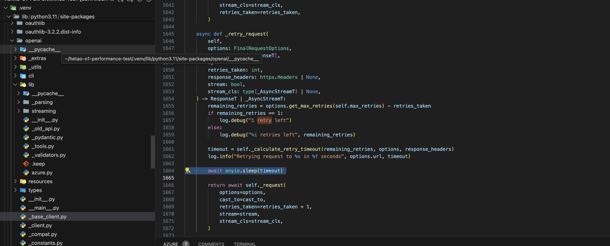
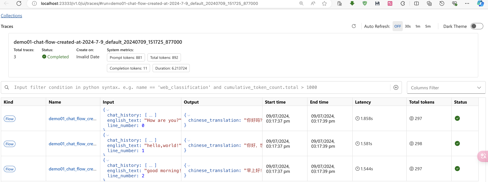
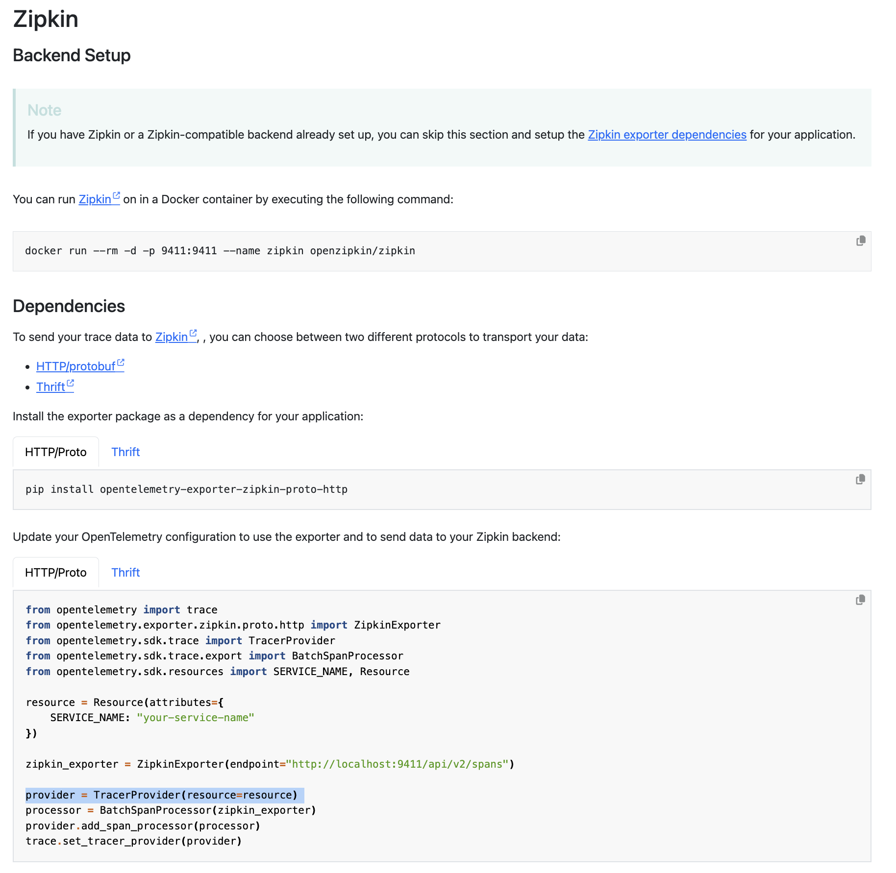
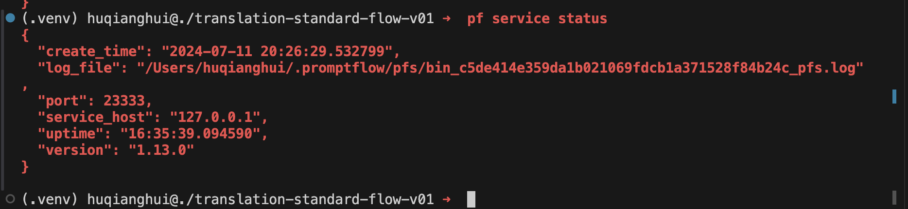
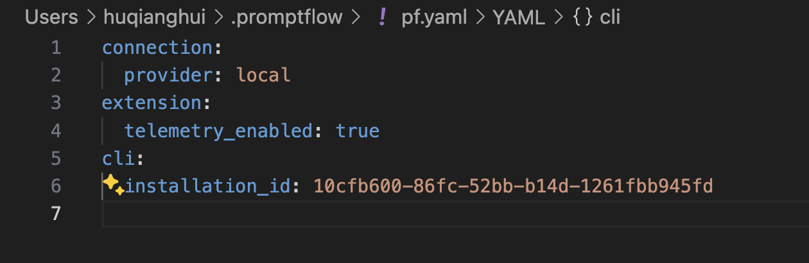

# 构建高性能GenAI应用架构指南

## 1. 性能优化策略

### 1.1 OpenAI API调用优化
在使用OpenAI API时需要注意以下关键点：

- Rate Limits: RPM(请求/分钟)和TPM(令牌/分钟)限制
  Azure OpenAI 的配额功能支持为您的部署分配速率限制，最高可达称为“配额”的全局限制。配额按区域、按模型分配给订阅，以每分钟令牌数 （TPM） 为单位。对于大多数模型，订阅都使用默认配额载入。在某个区域中超过了模型的 TPM 限制，则可以在部署之间重新分配配额或请求增加配额。或者，如果可行，请考虑在与现有部署相同的地理位置的新 Azure 区域中创建部署。
  TPM 速率限制基于收到请求时估计要处理的最大令牌数。它与用于计费的令牌计数不同，后者是在完成所有处理后计算的。
  Azure OpenAI 使用以下方法计算每个请求的最大已处理令牌计数：
    Prompt text and count 提示文本和计数
    The max_tokens setting max_tokens设置
    The best_of setting best_of设置

   估计计数将添加到所有请求的运行令牌计数中，该计数每分钟重置一次。在一分钟内达到 TPM 速率限制后，将返回 429 响应代码。
   为了最大限度地减少与速率限制相关的问题，最好使用以下技术：

    - 在应用程序中实现重试逻辑。
    - 避免工作负载的急剧变化。逐渐增加工作负载。
    - 测试不同的负载增加模式。
    - 增加分配给部署的配额。如有必要，从另一个部署中移动配额。

[Azure openAI regional-quota-limits](https://learn.microsoft.com/zh-cn/azure/ai-services/openai/quotas-limits#regional-quota-limits)

  
- Azure OpenAI的429错误处理
  在openAI的python库中，已经包含了的retry机制
  - 1. 在API 层面 有参数配置retry的次数
   不管是同步class 还是异步class，都已经包含retry参数和429处理

   ```python
   class AzureOpenAI(BaseAzureClient[httpx.Client, Stream[Any]], OpenAI):
       @overload
       def __init__(
           self,
           *,
           azure_endpoint: str,
           azure_deployment: str | None = None,
           api_version: str | None = None,
           api_key: str | None = None,
           azure_ad_token: str | None = None,
           azure_ad_token_provider: AzureADTokenProvider | None = None,
           organization: str | None = None,
           timeout: float | Timeout | None | NotGiven = NOT_GIVEN,
       max_retries: int = DEFAULT_MAX_RETRIES,
           default_headers: Mapping[str, str] | None = None,
           default_query: Mapping[str, object] | None = None,
           http_client: httpx.Client | None = None,
           _strict_response_validation: bool = False,
       ) -> None: ...
   
   这里默认DEFAULT_MAX_RETRIES是两次，
   ```
  - 2. 通过http reponse里面参数来计算sleep 时间，来高效的处理429问题
    在同步里面，通过使用time.sleep 这种线程操作实现。

    ```python
    def _retry_request(
            self,
            options: FinalRequestOptions,
            cast_to: Type[ResponseT],
            *,
            retries_taken: int,
            response_headers: httpx.Headers | None,
            stream: bool,
            stream_cls: type[_StreamT] | None,
        ) -> ResponseT | _StreamT:
            remaining_retries = options.get_max_retries(self.max_retries) - retries_taken
            if remaining_retries == 1:
                log.debug("1 retry left")
            else:
                log.debug("%i retries left", remaining_retries)
          timeout = self._calculate_retry_timeout(remaining_retries, options, response_headers)
            log.info("Retrying request to %s in %f seconds", options.url, timeout)
            # In a synchronous context we are blocking the entire thread. Up to the library user to run the client in a
            # different thread if necessary.
            time.sleep(timeout)
            return self._request(
                options=options,
                cast_to=cast_to,
                retries_taken=retries_taken + 1,
                stream=stream,
                stream_cls=stream_cls,
            )
    ```
    这里已经通过计算sleep_seconds来休眠时间，来避免429的问题

    如果api version的http 里面返回了这个参数，retry_after，则使用这个参数（因为不是所有的版本，或者错误有这个值：）
    ```python
            # If the API asks us to wait a certain amount of time (and it's a reasonable amount), just do what it says.
            retry_after = self._parse_retry_after_header(response_headers)
            if retry_after is not None and 0 < retry_after <= 60:
                return retry_after
    ```

    如果异步类的，会使用asyncIO retry实现
    .venv/lib/python3.11/site-packages/openai/_base_client.py
    class AsyncAPIClient(BaseClient[httpx.AsyncClient, AsyncStream[Any]]):
    

### 1.2 并发控制方案
- 信号量控制并发请求数
  
  应用程序需要使用的资源通常是有限的，比如数据库并发连接数可能有限，CPU 核数也是有限的。我们不想让应用程序超负荷运行，或者根据 API 当前的订阅策略，我们使用的 API 只允许少量的并发请求。信号量的作用很像锁，可以获取它也可以释放它：可以多次获取它，直到我们指定的限制。信号量将跟踪这个限制值。每次获取信号量时，都会对限制值进行递减；每次释放信号量时，这个值将增加。如果计数为零，则任何进一步获取信号量的尝试都将被阻塞，直到其他人调用 `release` 并增加计数。
  与锁进行比较，可以将锁视为限制值为 1 的信号量。

- 多进程处理CPU密集任务
  
  asyncio 提供了一个与 Python 的 multiprocessing 库进行交互的 API。通过这个 API，我们可以利用 async 和 await 语法来同时使用 asyncio 的功能和多进程能力。即使在执行 CPU 密集型代码时，我们仍然可以从 asyncio 提供的优势中获益。这允许我们提升 CPU 密集型任务（如数学计算或数据处理）的性能，绕过全局解释器锁（GIL），并充分利用多核机器的资源。

- asyncio处理I/O密集任务
  asyncio 专门设计用于异步处理 I/O 密集型任务，比如网络请求、数据库查询、文件操作等。这类任务通常涉及等待外部资源的响应，而在等待期间，CPU 不会一直被占用，asyncio 可以充分利用这个特性来提高效率。当处理 I/O 密集型任务时，asyncio 的事件循环会在协程等待外部资源时，自动调度和运行其他协程。这样，可以同时管理多个 I/O 操作，而无需阻塞整个程序。

- 协程池管理资源
  当需要同时运行大量异步任务时，协程池可以帮助你限制资源使用，确保程序不会因过载而崩溃。
  asyncio.multiprocess 使得你可以在 asyncio 中异步地调用 multiprocessing 功能，简化了进程池的管理，并且能够与 asyncio 的事件循环协同工作。通过这种方式，asyncio 协程可以在处理 I/O 密集型任务时继续执行，而不会被 CPU 密集型任务阻塞。
  

## 2. 可观测性

### 2.1 日志追踪
- 使用promptflow SDK的start_trace方法收集请求参数

    1. Prompt flow 通过promptflow-devkit提供
   
        Prompt flow 有两种模式：
          
              1. 本地模式，默认起一个23333端口，通过 sqlLite来记录trace信息
              通过pf service status 可以查看。
              
              如果这个端口出错，受阻的话，就会选择新的端口比如23334等
              
              2. azure server模式，会和application insight 对接，数据会保存到对应analytics workspaces
          
             azure-sdk-for-python/sdk/monitor/azure-monitor-opentelemetry-exporter at main · Azure/azure-sdk-for-python (github.com)
    
        其他的方法，来对接：
            
             Exporters | OpenTelemetry
            
            OTLP Specification 1.3.2 | OpenTelemetry
            
        
        Send telemetry to the OpenTelemetry Collector to make sure it’s exported correctly. Using the Collector in production environments is a best practice. To visualize your telemetry, export it to a backend such as Jaeger, Zipkin, Prometheus, or a vendor-specific backend.

        


    
    2. Prompt flow 默认给DAG flow 开启 ，所以只要执行DAG flow 或者 batch run 都可以看到trace UI
        

    3. 在trace UI 中支持python 代码的过滤

    4. trace信息，在本地存储的sqllite中
        

    5. 可以通过命令行或者SDK来删除trace 信息
        ```command
            pf service status 
        ```
   
    6. 通过pf service status 查看配置和状态
        

    7. 对应的配置文件
        

- Azure Monitor集成

    需要自己来与azure monitor集成

    

    


## 3. 可靠性保障

### 3.1 重试机制
- OpenAI官方库内置重试机制
  
  可以参照上面的内容，如果openAI版本太低，或者使用的其他库来访问的话，就需要自定义重试策略了。

- 自定义重试策略实现
  
  在处理网络请求时，通常会遇到请求失败的情况。为了提高系统的鲁棒性，通常会实现重试机制，并通过指数回退（Exponential Backoff）策略来避免频繁的请求。
  1. Tenacity 是一个强大的重试库，它支持多种回退策略，例如指数回退、最大重试次数等。
   
  2. backoff 库也提供了简洁的方式来实现重试和回退策略。
   
  3. 如果你不想使用外部库，也可以通过 Python 的内建功能来手动实现重试和回退机制。

### 3.2 缓存策略
1. 内存缓存（LRU Cache）
   - Python内置的@lru_cache装饰器
    它是内存级别，如果重启的话，就会消失。但是因为有时候我们需要持久化，或者分布式的情况的话，就没有办法满足了。


2. 磁盘缓存（DiskCache）
    与其他Python缓存库相比，DiskCache有以下优势：
        持久化缓存：DiskCache将缓存数据存储在磁盘上，可以长期保存缓存，即使程序重启也不会丢失。而内存缓存库如Redis在程序重启时会丢失缓存数据。
        海量缓存容量：由于利用磁盘存储，DiskCache可以存储大量数据，而内存缓存通常受限于可用内存大小。
        多种缓存策略：DiskCache支持LRU、LFU、FIFO等多种缓存替换策略，可以根据业务需求灵活选择。
        丰富的功能：DiskCache提供事务支持、缓存压缩、并发控制等高级特性，满足各种复杂的缓存需求。
    DiskCache是一个功能强大、易于使用的Python缓存库,非常适合处理大量数据或需要长期缓存的应用程序。但是它不支持async方式。

3. 异步缓存
   - aiocache的使用
   - cashews的统一缓存接口
   - Redis集成方案

4. Prompt缓存
   - OpenAI官方的prompt�aching机制
   - 自定义prompt缓存策略

## 4. 高级并发处理

### 4.1 多进程与asyncio结合
- multiprocessing库的使用
- CPU密集型任务处理
- map/reduce模式实现

### 4.2 异步Web应用
- ASGI框架选择
- Web API构建最佳实践
- 性能优化策略

### 4.3 并发同步控制
- 锁机制
- 信号量使用
- 事件通知
- 条件变量

### 4.4 异步队列应用
- 后台任务处理
- 实时响应机制
- 任务调度策略

### 4.5 子进程管理
- 创建和管理子进程
- 数据读写控制
- 进程间通信

## 5. 部署和运维

### 5.1 部署方式

### 5.2 监控和告警
- 日志监控
- 性能指标
- 异常告警
- 资源使用率

## 总结
构建高性能GenAI应用需要综合考虑：
1. 合理的并发模型选择
2. 完善的可观测性设计
3. 多层次的缓存策略
4. 可靠的重试机制
5. 灵活的资源管理
6. 高效的部署和运维策略

通过合理运用这些技术，我们可以构建出稳定、高效的GenAI应用系统。在实际应用中，还需要根据具体场景和需求对这些策略进行调整和优化。