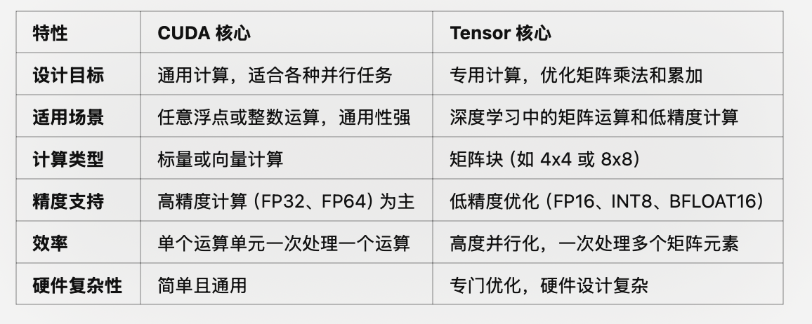
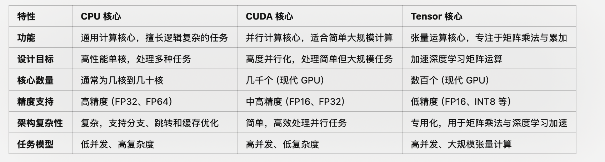

## 推理 Inference

#### 硬件 GPU vs CPU

GPU 相对于 CPU 在深度学习任务中的操作具有显著优势，主要体现在计算能力、内存处理和数据格式支持等多个方面。
1. 并行计算
GPU 拥有大量的计算核心（如 CUDA 核心或 Tensor 核心），可以进行大规模的并行计算。
	•	适用于矩阵乘法、卷积等高度并行化的任务。
	•	一个现代 GPU（如 NVIDIA A100）通常有几千个核心，而 CPU 的核心数在几十个以内。

CUDA 核心：NVIDIA GPU 中的基本计算单元，专为并行任务优化。每个 CUDA 核心能够独立执行简单的数学操作（如加法、乘法）。最大化并行计算能力，处理大规模、小任务的计算负载。
一个现代 GPU（如 NVIDIA A100）拥有数千个 CUDA 核心（如 6912 个 CUDA 核心），这些核心协同工作，一次执行数万个线程。
•	GPU 核心（CUDA 核心）的设计目标是并行化计算，而非高性能单线程计算。
	•	简单性: CUDA 核心的硬件设计相对简单，便于大量集成。
	•	任务特点: 深度学习、图像处理等任务需要大规模并行计算。
	•	架构优化: 一个 GPU 的流处理器集群（SM）中有多个 CUDA 核心，而多个 SM 又共享一定数量的调度器和缓存。
CUDA 核心是 GPU 最初的核心计算单元，用于加速并行计算任务。它的通用性使其可以处理各种计算工作，不局限于深度学习。
对于深度学习中大量涉及的矩阵乘法（如卷积神经网络中的计算），CUDA 核心效率不足，因为矩阵运算需要重复调用大量基本运算。

Tensor 核心： NVIDIA GPU 中专用于矩阵运算（尤其是深度学习）的硬件单元，首次引入于 Volta 架构（如 V100）。它可以同时计算多个矩阵元素，专为深度学习中的矩阵乘法和低精度计算（FP16、INT8）优化。高效地加速深度学习模型的训练和推理。专为张量运算（矩阵乘法与累加，GEMM 操作）设计。在一个时钟周期内完成多个 FP16 运算，比 CUDA 核心快数倍。更适合深度学习等大规模矩阵运算任务。
Tensor 核心不以单个运算为单位，而是一次性处理矩阵块（如 4x4、8x8 的矩阵）。NVIDIA A100 拥有 432 个 Tensor 核心，效率比 CUDA 核心高得多。
深度学习的兴起带来了对矩阵乘法和低精度计算的高效支持需求，而这并不是 CUDA 核心的强项。
	•	深度学习中的训练和推理都依赖矩阵乘法，涉及巨量的计算负载。
	•	Tensor 核心的硬件设计直接加速矩阵乘法与累加运算。
Tensor 核心通过直接处理矩阵块，大幅减少了操作步骤，特别是在低精度计算中。

CPU 核心较少，但单核性能较强，适合执行顺序逻辑密集的任务。
每个 CPU 核心是一个完整的、功能强大的计算单元，可以处理复杂逻辑、分支、任务调度等任务。
•	由于核心更复杂且单核性能更强，制造成本和功耗较高，因此 CPU 核心数量通常较少（如 4-64 核）。
•	每个核心有自己的缓存（如 L1、L2、L3 缓存）和独立的控制单元。

Q: 大模型在GPU和CPU上推理速度如何?

A: 大语言模型在GPU和CPU上进行推理的速度存在显著差异。一般情况下，**GPU在进行深度学习推理任务时具有更高的计算性能**，因此大语言模型在GPU上的推理速度通常会比在CPU上更快。

以下是GPU和CPU在大语言模型推理速度方面的一些特点：

1.  **GPU推理速度快**：GPU具有大量的并行计算单元，可以同时处理多个计算任务。对于大语言模型而言，GPU可以更高效地执行矩阵运算和神经网络计算，从而加速推理过程。
2.  **CPU推理速度相对较慢**：相较于GPU，CPU的计算能力较弱，主要用于通用计算任务。虽然CPU也可以执行大语言模型的推理任务，但由于计算能力有限，推理速度通常会较慢。
3.  **使用GPU加速推理**：为了充分利用GPU的计算能力，通常会使用深度学习框架提供的GPU加速功能，如CUDA或OpenCL。这些加速库可以将计算任务分配给GPU并利用其并行计算能力，从而加快大语言模型的推理速度。

需要注意的是，推理速度还受到模型大小、输入数据大小、计算操作的复杂度以及硬件设备的性能等因素的影响。因此，具体的推理速度会因具体情况而异。一般来说，使用GPU进行大语言模型的推理可以获得更快的速度。

##### 指令集
GPU专用的并行指令集（如 CUDA 或 ROCm）使得开发者可以高效利用硬件资源。支持异构计算，结合 CPU 的控制能力和 GPU 的计算能力处理复杂任务。
每个 GPU 核心（如 CUDA 核心）较为简单，但一个 GPU 拥有数千个核心。使用 SIMD（单指令多数据）或 SIMT（单指令多线程）架构，每条指令可同时处理大量数据。
牺牲单核性能，优化整体并行吞吐量。例如 Tensor 核心加速矩阵运算，纹理单元加速图像采样。
•	GPU 的指令集专为并行计算设计，提供高吞吐量指令以优化图形渲染和数据并行计算。
	•	常见 GPU 指令集：
	•	NVIDIA: PTX（Parallel Thread Execution）为中间层指令，后由硬件翻译为具体的执行指令。
	•	AMD: GCN（Graphics Core Next）和 RDNA 指令集。
	•	Intel: Xe 指令集。
	•	GPU 通常具有专用指令以加速图形计算（如纹理采样、着色器计算）和深度学习（如矩阵乘法）。

CPU 的指令集（如 SIMD 或 AVX）并非完全为并行计算设计。主要处理控制任务，计算任务效率较低。
CPU 的单个核通常设计得非常复杂，具有深度流水线和乱序执行能力（Out-of-Order Execution），专注于单线程性能和低延迟执行。
•	CPU 的指令集（Instruction Set Architecture, ISA）定义了处理器如何执行计算任务，包括算术、逻辑、内存操作、分支等。
	•	常见的 CPU 指令集包括：
	•	x86/x64（Intel、AMD）
	•	ARM（移动设备，Apple M 系列等）
	•	RISC-V（新兴开放式指令集）

#### 内存处理
GPU 的内存带宽（Memory Bandwidth）远高于 CPU。
	•	高带宽支持更快的模型和数据传输。
	•	例如，NVIDIA A100 的内存带宽可达 1.6 TB/s，而高端 CPU 的带宽通常在 100 GB/s 左右。
CPU内存带宽较低，无法高效处理大规模并行任务。

GPU 拥有专用的显存（如 GDDR6、HBM），访问速度快且延迟低。
	•	更适合处理大规模深度学习模型和数据。
CPU共享主机内存，访问延迟较高且可能受到其他任务的干扰。

Q:为什么大模型推理时显存涨的那么多还一直占着？

A: 
大语言模型进行推理时，显存涨得很多且一直占着显存不释放的原因主要有以下几点：
1.  **模型参数占用显存**：大语言模型通常具有巨大的参数量，这些参数需要存储在显存中以供推理使用。因此，在推理过程中，模型参数会占用相当大的显存空间。
2.  **输入数据占用显存**：进行推理时，需要将输入数据加载到显存中。对于大语言模型而言，输入数据通常也会占用较大的显存空间，尤其是对于较长的文本输入。
3.  **中间计算结果占用显存**：在推理过程中，模型会进行一系列的计算操作，生成中间结果。这些中间结果也需要存储在显存中，以便后续计算使用。对于大语言模型而言，中间计算结果可能会占用较多的显存空间。
4.  **内存管理策略**：某些深度学习框架在推理时采用了一种延迟释放显存的策略，即显存不会立即释放，而是保留一段时间以备后续使用。这种策略可以减少显存的分配和释放频率，提高推理效率，但也会导致显存一直占用的现象。

需要注意的是，显存的占用情况可能会受到硬件设备、深度学习框架和模型实现的影响。不同的环境和设置可能会导致显存占用的差异。如果显存占用过多导致资源不足或性能下降，可以考虑调整模型的批量大小、优化显存分配策略或使用更高性能的硬件设备来解决问题。

Q: 有哪些省内存的大语言模型训练/微调/推理方法？
A:
有一些方法可以帮助省内存的大语言模型训练、微调和推理，以下是一些常见的方法：

1.  **参数共享（Parameter Sharing）**：通过共享模型中的参数，可以减少内存占用。例如，可以在不同的位置共享相同的嵌入层或注意力机制。
2.  **梯度累积（Gradient Accumulation）**：在训练过程中，将多个小批次的梯度累积起来，然后进行一次参数更新。这样可以减少每个小批次的内存需求，特别适用于GPU内存较小的情况。
3.  **梯度裁剪（Gradient Clipping）**：通过限制梯度的大小，可以避免梯度爆炸的问题，从而减少内存使用。
4.  **分布式训练（Distributed Training）**：将训练过程分布到多台机器或多个设备上，可以减少单个设备的内存占用。分布式训练还可以加速训练过程。
5.  **量化（Quantization）**：将模型参数从高精度表示（如FP32）转换为低精度表示（如INT8或FP16），可以减少内存占用。量化方法可以通过减少参数位数或使用整数表示来实现。
6.  **剪枝（Pruning）**：通过去除冗余或不重要的模型参数，可以减少模型的内存占用。剪枝方法可以根据参数的重要性进行选择，从而保持模型性能的同时减少内存需求。
7.  **蒸馏（Knowledge Distillation）**：使用较小的模型（教师模型）来指导训练较大的模型（学生模型），可以从教师模型中提取知识，减少内存占用。
8.  **分块处理（Chunking）**：将输入数据或模型分成较小的块进行处理，可以减少内存需求。例如，在推理过程中，可以将较长的输入序列分成多个较短的子序列进行处理。

这些方法可以结合使用，根据具体场景和需求进行选择和调整。同时，不同的方法可能对不同的模型和任务有不同的效果，因此需要进行实验和评估。

#### 数据类型--浮点运算

深度学习任务（如神经网络的训练和推理）在大多数情况下对高精度需求较低，FP16 或 INT8 足以满足要求。使用低精度时，数据传输量减少，提高了内存利用效率，进一步加速计算。
FP16在相对较小的数据范围内进行计算，因此在相同的计算资源下可以执行更多的计算操作。虽然FP16的精度相对较低，但对于某些应用场景，如图像处理和语音识别等，FP16的精度已经足够满足需求。

GPU 的架构为浮点运算优化，特别是对于深度学习常用的低精度计算（FP16、INT8）。
    •	GPU 的 Tensor 核心针对低精度矩阵运算进行优化，FP16 的计算速度远高于 FP32。
	•	Tensor Cores 专为矩阵计算和低精度优化设计，可以极大提升深度学习模型的训练与推理速度。
GPU 能在低精度数据类型的处理上实现极高的吞吐量，这使其在深度学习中相较于 CPU 具有显著的性能优势

	•	低精度数据类型（FP16、INT8、BFLOAT16）: GPU 为深度学习优化，特别是 Tensor 核心，能高效处理这些类型。
	•	单精度浮点（FP32）: 作为标准类型，GPU 通常提供大规模并行支持。
	•	双精度浮点（FP64）: 高性能计算场景中提供支持，但速度较慢，部分消费级 GPU 不提供硬件加速。

•	Ampere 架构（如 A100、RTX 30 系列）: 开始支持 INT4 运算。
	•	Tensor 核心具备 INT4 运算能力，专为低精度推理任务设计。
	•	Ampere 的 Tensor 核心支持混合精度运算，允许同时处理不同数据类型（如 INT4 和 FP16）。
	•	Hopper 架构（如 H100）: 对 INT4 的支持进一步优化，提升性能和效率。

CPU适合高精度运算（FP32 和 FP64）: CPU 的设计主要考虑通用性和高精度，支持复杂计算任务。 
优化更多面向高精度计算（FP64、FP32），在低精度浮点计算上效率较低。CPU 缺乏对低精度运算的硬件优化，即使支持 FP16 或 INT8，也没有 GPU 的并行能力强

	•	高精度运算（FP32 和 FP64）: CPU 的设计主要考虑通用性和高精度，支持复杂计算任务。
	•	较低效率的低精度运算（FP16 和 INT8）: 虽然现代 CPU 支持这些低精度类型，但硬件优化有限。
    •	科学计算、金融分析等需要高精度运算的场景。
	•	缺乏深度学习加速硬件时执行低精度计算。

Q: 推理速度上，INT8和FP16比起来怎么样？

A: 
在大语言模型的推理速度上，**使用INT8（8位整数量化）和FP16（半精度浮点数）相对于FP32（单精度浮点数）可以带来一定的加速效果**。这是因为INT8和FP16的数据类型在**表示数据时所需的内存和计算资源较少，从而可以加快推理速度**。

具体来说，INT8在相同的内存空间下可以存储更多的数据，从而可以在相同的计算资源下进行更多的并行计算。这可以提高每秒推理操作数（Operations Per Second，OPS）的数量，加速推理速度。

FP16在相对较小的数据范围内进行计算，因此在相同的计算资源下可以执行更多的计算操作。虽然FP16的精度相对较低，但对于某些应用场景，如图像处理和语音识别等，FP16的精度已经足够满足需求。

需要注意的是，**INT8和FP16的加速效果可能会受到硬件设备的支持程度和具体实现的影响**。某些硬件设备可能对INT8和FP16有更好的优化支持，从而进一步提高推理速度。

综上所述，使用INT8和FP16数据类型可以在大语言模型的推理过程中提高推理速度，但需要根据具体场景和硬件设备的支持情况进行评估和选择。

####  框架支持

深度学习框架（如 TensorFlow、PyTorch）会根据硬件自动选择使用 CUDA 核心或 Tensor 核心。
	•	如果启用了混合精度（Mixed Precision Training），Tensor 核心会被广泛使用。
	•	默认情况下，框架可能更多依赖 CUDA 核心，尤其是高精度计算。

NVIDIA 提供专门的软件工具来充分利用 Tensor 核心的性能，例如：
	•	CUDA: CUDA 库直接支持调用 Tensor 核心。
	•	cuBLAS: 高效的矩阵计算库，支持 Tensor 核心优化。
	•	cuDNN: 深度学习库（如卷积运算）通过 Tensor 核心加速。
	•	TensorRT: 推理优化框架，充分利用 Tensor 核心。
	•	编程语言和 API:

使用以下工具可以直接调用 Tensor 核心：
	•	CUDA Warp Matrix API: 提供对 Tensor 核心操作的低级控制。
	•	TensorFlow / PyTorch: 自动利用 Tensor 核心完成低精度矩阵运算（启用混合精度训练时）。

在深度学习任务中，Tensor 核心通过加速矩阵乘法（GEMM）大幅提升性能。例如：
	•	使用 FP16 精度时，Tensor 核心的矩阵运算速度比 CUDA 核心快数倍。
	•	A100 的 Tensor 核心可以达到每秒 312 TFLOPS（FP16）的计算能力。
***1 TFLOPS = 10^{12} 次浮点运算每秒。***

混合精度训练:
Tensor 核心支持混合精度训练（Mixed Precision Training），通过在关键运算中使用 FP16 提升速度，同时保持 FP32 的训练精度。