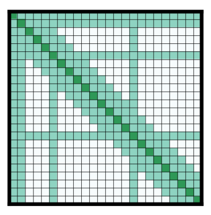

## Attention mechanisms 注意力机制

大多数 transformer 模型使用完全注意力，因为注意力矩阵是方形的。
当您有长文本时，这可能是一个很大的计算瓶颈。
Longformer 和 reformer 是试图提高效率并使用注意力矩阵的稀疏版本来加快训练速度的模型。

### LSH attention

Reformer 使用 LSH 注意力。在 softmax（QK^t） 中，只有矩阵 QK^t 的最大元素（在 softmax 维度中）才会给出有用的贡献。
因此，对于 Q 中的每个查询 q，我们只能考虑 K 中接近 q 的键 k。哈希函数用于确定 q 和 k 是否接近。
修改 attention mask 以掩盖当前 token（除了第一个位置），因为它会给出一个 query 和一个相等的 key（所以彼此非常相似）。由于哈希可能有点随机，因此在实践中使用多个哈希函数（由 n_rounds 参数确定），然后一起平均。

### Local attention

Longformer 使用本地注意力：通常，本地上下文（例如，左侧和右侧的两个标记是什么？）足以对给定标记执行操作。此外，通过堆叠具有小窗口的注意力层，最后一层将具有一个接收场，而不仅仅是窗口中的标记，允许它们构建整个句子的表示。

一些预选的 input token 也被给予全局关注：对于这几个 token，注意力矩阵可以访问所有 token，这个过程是对称的：所有其他 token 都可以访问这些特定 token（在其本地窗口中的 token 之上）。这如论文的图 2d 所示，请参阅下面的注意力掩码示例：

使用这些参数较少的注意力矩阵可以让模型具有具有更大序列长度的输入。

### Other tricks

Reformer 使用轴向位置编码：在传统的 transformer 模型中，位置编码 E ,隐藏状态的维度。如果你的文本很长，这个矩阵可能会很大，并且在 GPU 上占用太多空间。为了缓解这种情况，轴向位置编码包括将大矩阵 E 分解为两个较小的矩阵 E1 和 E2，维度为 1 × 𝑑 1 l 1​× 1​安德尔 2 × 𝑑 2 l 2​× 2​，这样 （对于长度的乘积，这最终会小得多

