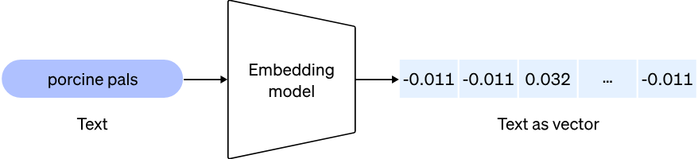
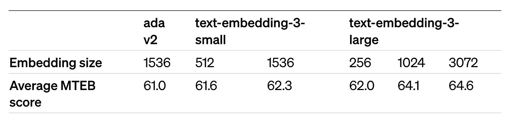
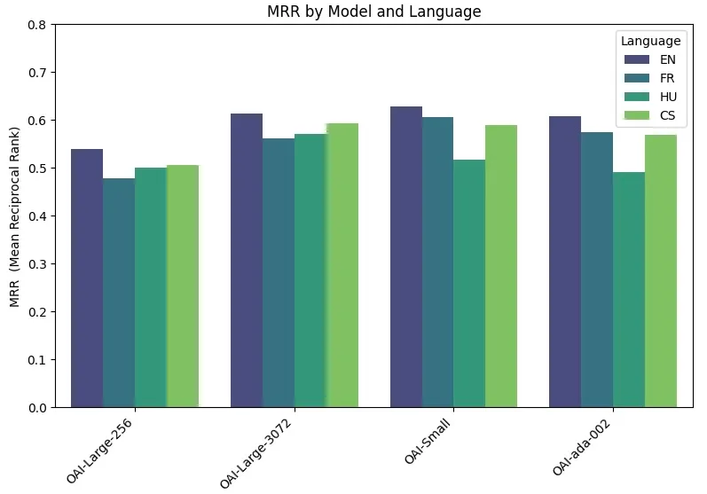
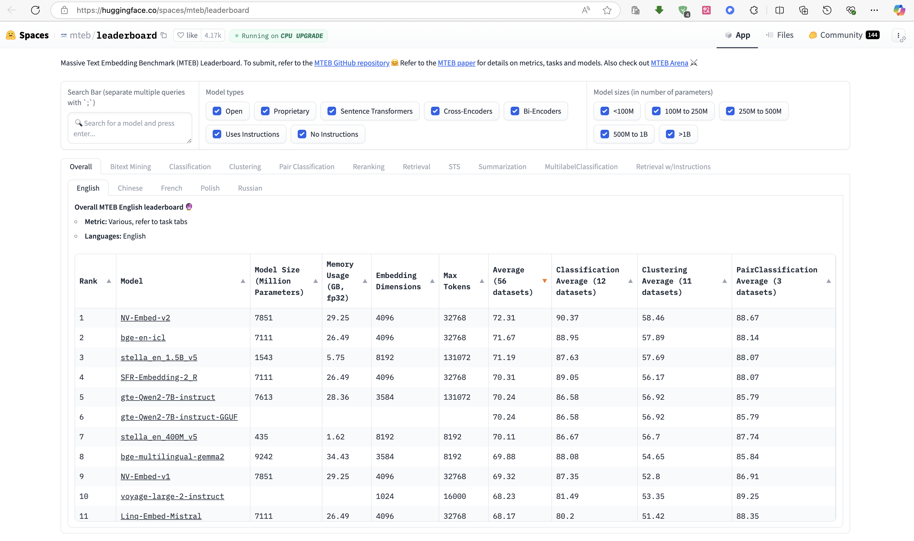

1. 什么是Embedding？
嵌入是表示内容（如自然语言或代码）中概念的数字序列，便于嵌入测量文本字符串的相关性 。嵌入使机器学习模型和其他算法能够轻松理解内容之间的关系并执行聚类或检索等任务。

嵌入是浮点数的向量（列表）。两个向量之间的距离衡量它们的相关性。小距离表示高相关性，大距离表示低相关性。

2.Embedding主要使用场景

- 搜索（其中结果按与查询字符串的相关性排名）
- 聚类（其中文本字符串按相似性分组）
- 推荐（推荐包含相关文本字符串的项目）
- 异常检测（识别出相关性不大的异常值）
- 多样性测量（分析相似性分布）
- 分类（其中文本字符串按其最相似的标签进行分类）

3. 不同的Embedding模型的区别

什么嵌入模型最适合你自己的语言？许多研究和排行榜调查了什么是英语中最好的嵌入模型，但那里的语言太多了？
如果找到一种在西班牙语、日语、印度尼西亚语或法语，或者中文中表现良好的嵌入模型。
这就需要一些测试数据来做为参考。

- 模型版本和维度大小

首先看看OAI的基准测试

正如预期的那样，对于大型模型，使用较大的嵌入大小 3072 可以观察到更好的性能。
但是如果使用新的版本的话，即使相同的维度信息也可以得到更好的效果。

***在评估中，大型、小型和 Ada 模型之间的性能差异远不如 MTEB 基准那么明显，这反映了这样一个事实，即在大型基准中观察到的平均性能不一定反映在自定义数据集上获得的性能。***

- 更多开源Embedding模型对比，可以基于自己的需求场景：特定语言，或者多语言，多模态，特定行业等

围绕嵌入的开源研究非常活跃，并且定期发布新模型。[Hugging Face 😊 MTEB](https://huggingface.co/spaces/mteb/leaderboard) 排行榜是了解最新发布模型的好地方。

4. 非英语RAG情况下Embeddings选择

Embeddings，简而言之，是文本数据的数值化表示。它们将单词、句子甚至整个文档转化为数字，这些数字并非随机生成，而是经过精心设计，旨在捕捉文本中的意义和关系。例如，“dog”和“puppy”在数值空间中的位置会比“car”更接近，因为它们具有相似的语义。但是很多Embedding模型在非英语测试结果往往没有benchmark那么好的，主要有几个原因导致：

- 训练的时候，英语在数字世界中占据主导地位，拥有丰富的高质量训练数据。相比之下，许多其他语言，尤其是资源较少的语言，缺乏多样化和标准化的数据集，这限制了在这些语言上训练的embeddings的质量。
- 很多自然语言处理（NLP）模型最初是为英语开发的，并在多语言版本中优先考虑英语。这导致在多语言参数空间中学习时，较少表示的语言的性能可能会受到影响。
- 英语具有相对简单的形态学结构，而许多其他语言则具有复杂的词形变化。此外，不同的语法或词序（如日语的主宾谓结构或阿拉伯语的灵活词序）也给针对英语结构优化的模型带来了额外的挑战。
- 捕捉跨语言的语义意义并非易事。单词和短语往往具有微妙的含义，这些含义无法直接翻译。例如，英语中的“love”在西班牙语中有“amor”，在希腊语中有“eros”或“agape”等多种文化上不同的等价物。未能考虑这些差异的embeddings在跨语言对齐方面会遇到困难。

5. 对比英语与多语言 Embedding 模型在荷兰语 RAG 系统中的应用表现

- 实验背景与配置
  
  为了全面评估不同 Embedding 模型在处理非英语语言（例如荷兰语）时的效能，我们选取了两个来自亚马逊 Bedrock 平台的模型进行对比分析：Cohere Embed English v3（专为英语优化）与 Cohere Embed Multilingual v3（专为多语言任务设计）。实验数据集采用荷兰语版的消防员指南，并借助 LangChain 框架构建本地化的向量存储系统。在此过程中，我们将文档分割为较小的段落，并分别利用不同的 Embedding 模型进行索引。

- 测试案例与结果解读
  
  针对问题“Welke rangen zijn er bij de brandweer?”（消防部门有哪些等级？），我们进行了测试。在荷兰语数据集中，“hiërarchie”这一术语与“rangen”在语义上相近，但在英语中，“hierarchy”与“ranks”的语义差异较大。Cohere Embed English v3 模型的响应较为宽泛，未能基于荷兰语文档的上下文进行精确匹配，因为它难以建立“hiërarchie”与“rangen”之间的语义联系，只能依赖通用的知识库。相比之下，Cohere Embed Multilingual v3 模型则能够准确地从文档中检索到相关信息，展示了其处理荷兰语特定语义的卓越能力，成功识别了查询与文档之间的语义关联。

- 核心发现与结论
  
  Cohere Embed English v3 在处理荷兰语查询时，由于缺乏必要的语义对齐机制，无法有效地从文档中检索出相关的上下文信息，这凸显了使用英语特定 Embedding 模型处理非英语任务的局限性。而 Cohere Embed Multilingual v3 在测试中表现优异，能够高效地检索并利用文档中的上下文信息，这充分证明了多语言 Embedding 模型在准确检索和回答非英语查询方面的重要性。通过实验分析，我们展示了英文embeddings在多语言环境中的局限性，以及多语言embeddings在提高检索准确性和用户信任方面的优势。对于在全球多语言环境中开发AI系统的组织而言，选择适合任务的embedding模型是非常重要的。

同样的如果中文的情况下，选择中文benchmark更好的Embedding模型也至关重要。

