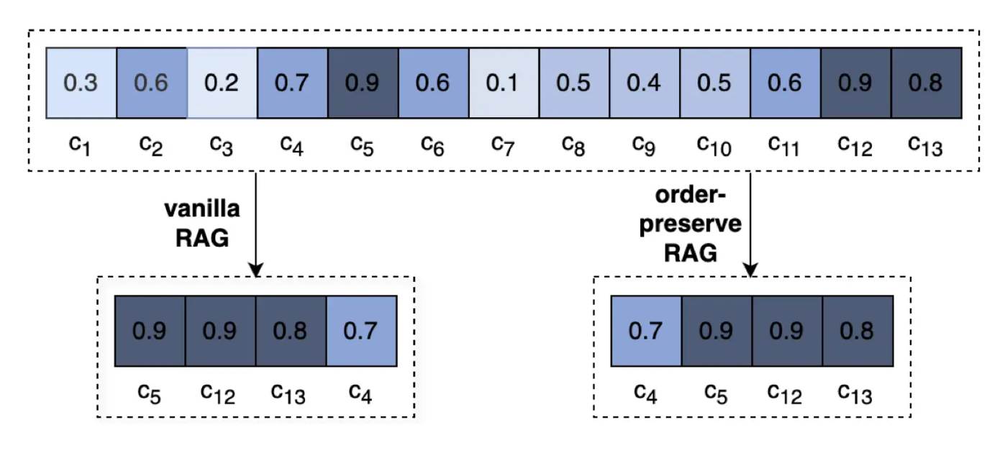
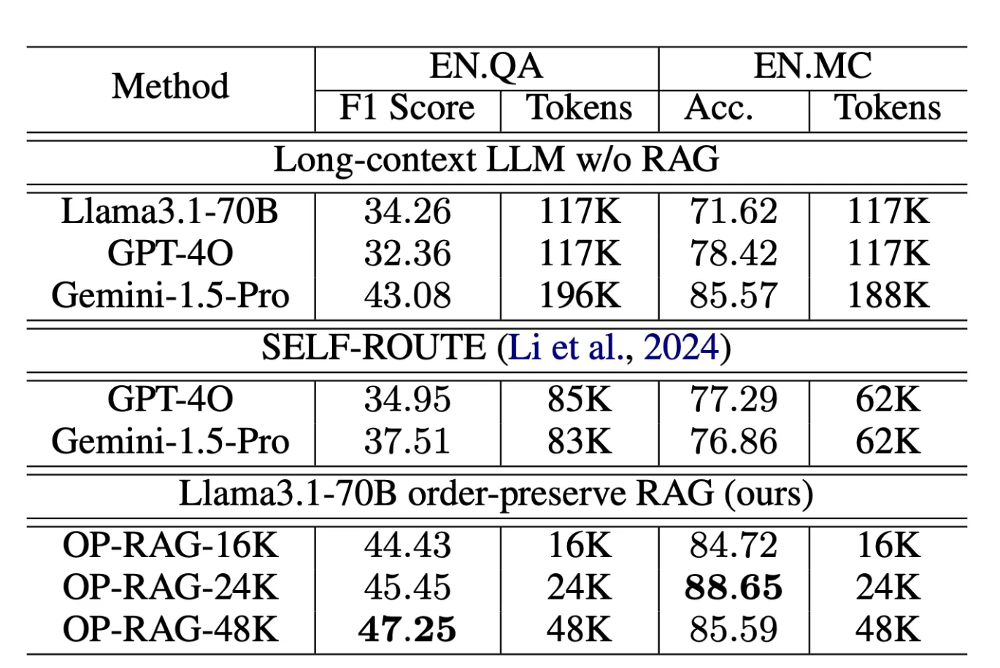

在context windows很长的RAG 方案中，我们往往就是通过chunk进行切割，然后通过打分，或者 rerank的语义再打分排序，把内容给LLM，让它回答。
但是研究人员重新审视了检索增强生成 （RAG） 如何与处理大块文本的 LLMs。他们发现了一些有趣的事情：检索文本块的顺序真的很重要。这项研究没有按照通常的相关性对块进行排序，而是尝试将块保持其原始顺序。事实证明，这种称为 order-preserve RAG 的调整确实提高了 RAG 提出的答案的质量。

1. 块不是越多越好
   提取的 order-preserve RAG 的块越多，一开始得到的答案就越好。之所以能提升，是因为模型可以看到更广泛的相关信息，从而帮助它找到合适的上下文来做出更准确的响应。但有一个问题：拉入太多的块在某个点后开始适得其反。它带来了许多不相关或分散注意力的信息，这些信息可能会使模型感到困惑，从而导致答案的质量下降。因此，关键是找到一个最佳点，即使用足够的上下文来提高召回率，而不会使模型因不必要的噪声而过载。

2. 块顺序对 RAG 很重要(Chunk order matters for RAG)
    
    OP-RAG 脱颖而出的地方。排名靠前的块是根据其相关性分数挑选的，但我们不是按这些分数重新排列它们，而是按照它们在文档中出现的顺序保留它们。这意味着，如果数据块最初在文档中的前，则无论它们各自的相关性分数如何，它在我们的阵容中都将保持这种状态。这种方法不同于传统的 RAG，在 RAG 中，块仅按相关性排序，可能会破坏信息的自然流动。通过保持原始序列，OP-RAG 有助于保持文本的逻辑进展，这对于产生连贯和准确的回答至关重要。
    下图直观地代表了这个概念，比较了传统 RAG 和 OP-RAG 如何组织文本块。通过保持原始文档顺序，OP-RAG 避免了潜在的混淆，并确保响应不仅准确地解决了查询，而且保持了上下文的完整性。
   

3. OP-RAG的测试结果
   OP-RAG 针对两种基线方法进行了测试。第一个使用长上下文 LLMs没有任何 RAG。如下表所示，这种方法往往使用大量token，效率低下且成本高昂。例如，没有 RAG 的 Llama3.1-70B 型号在 EN 上的得分为 34.26 F1。使用大约 117,000 个令牌的 QA 数据集。相比之下，仅使用 48,000 个代币的 OP-RAG 获得了更高的 47.25 F1 分数。
   

   第二个基线涉及 SELF-ROUTE 机制，该机制根据模型的自我评估自动决定是使用 RAG 还是长上下文 LLM。OP-RAG 也被证明优于这种方法，而且它使用的代币要少得多。

Nvidia 最近发布的 OP-RAG 证明，有许多新方法可以使用 RAG 来处理冗长的文本。这只是证明复杂的 RAG 会一直存在，至少在不久的将来是这样。

参考论文：
[Retrieval Augmented Generation or Long-Context LLMs?](https://arxiv.org/pdf/2407.16833)