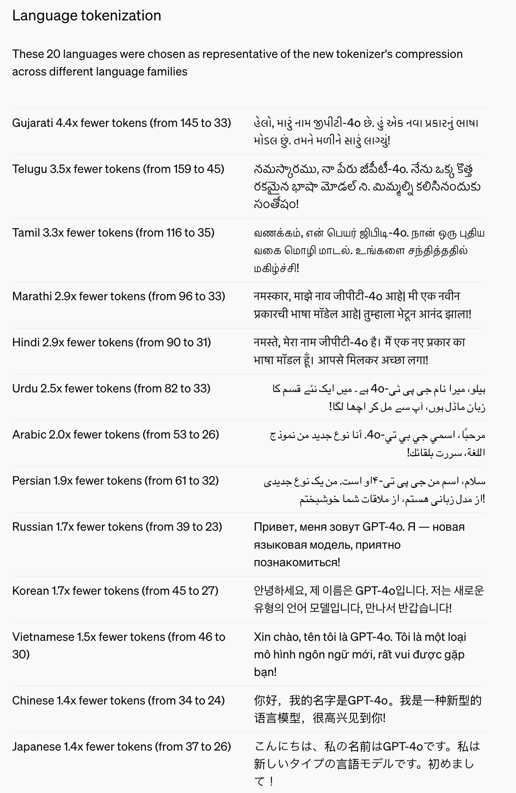
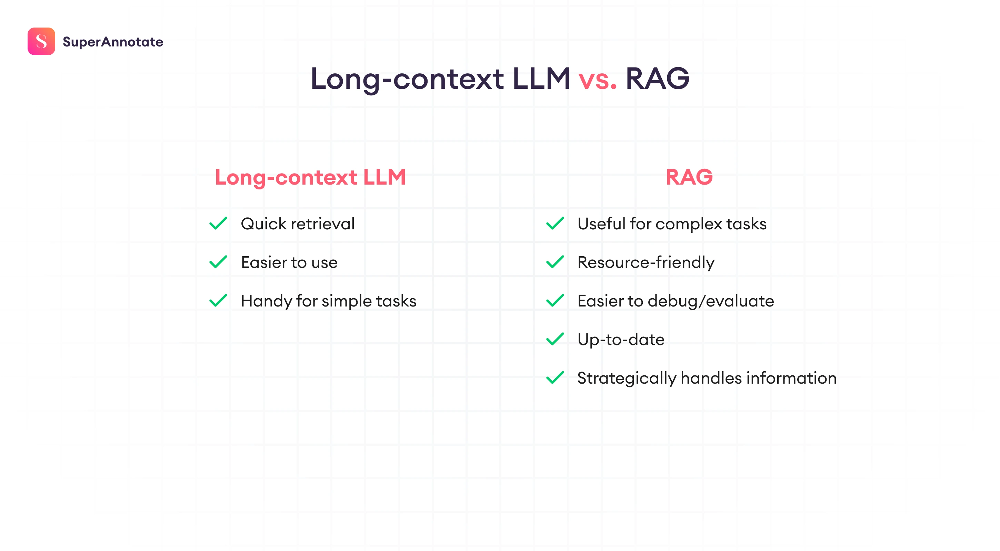

1. RAG 和 大语言模型发展

LLM已经从上下文窗口小到几千个token到最新的一次处理Gemini 1.5 Pro多达一百万个令牌。
包括不同大语言模型的编码器，编码效能也在不断的提升。
OpenAI的模型中，相比较于gpt3.5 和gpt-4-turbo，gpt-4o模型，很重要的一个更新就是变更了编码集。 从原来的cl100k_base 变成了o200k_base。
方法给出的20中语言的token优化如下：

更多的说明链接可以参考官方文档：
[hello-gpt-4o](https://openai.com/index/hello-gpt-4o/)

所以从context windows还是tokenizer的优化，都得到了巨大的飞跃。为了寻找处理超出初始上下文窗口所能处理的信息的方法，人们开发了检索增强生成 （RAG），它将与他们的语言模型相关联，并帮助从外部文档中检索实时和准确的答案。但是现在我们有大约 1000 倍大的上下文窗口可以处理整个百科全书，一个问题自然而然地出现了：我们还需要 RAG 吗？

简短的回答是肯定的。
长一点的答案是 
    – 这不仅是关于拥有更多信息，而且是关于正确的信息，以做出更明智的决策。

如图是long-context LLM回答和RAG的简单对比：

Long-context LLM pros 长上下文 LLM 优点:

- Quick retrieval 快速检索: 长上下文模型可以持续接收输入、推理和动态检索信息。另一方面，RAG 需要附加外部文档，然后使用相同的数据来完成其所有任务。这意味着，虽然您可以不断将新信息放入上下文中，但对于 RAG，这需要更多的步骤。
- Easier to use 更易于使用: RAG 涉及多个组件 – 检索、嵌入模型和语言模型。这意味着，为了使您的 RAG 发挥最佳效果，您需要设置嵌入参数、分块策略，然后尝试测试您的模型是否真的给出了正确的答案。总的来说，比仅仅输入长提示要多花点功夫。
- Handy for simple tasks 方便执行简单任务: 如果情况不太复杂，并且需要从大量文本中相对简单地检索，则长上下文模型可以快速方便地使用。在这种情况下，如果您尝试使用 LLM，它可能工作得很好。也会不起作用的情况，RAG能做相应的增强。

RAG 优点:
- Complex RAG 将继续存在: 更简单的 RAG 形式（以微不足道的方式对数据进行分块和检索）可能会有所下降。但更复杂的 RAG将继续存在并且进化。当今的 RAG 系统包括复杂的工具，如查询重写、数据块重新排序、数据清理和优化的向量搜索，这些工具增强了它们的功能并扩展了它们的覆盖范围。
- RAG 可以更高效: 扩展 LLM 的上下文窗口以包含大量文本肯定有其自身的一系列障碍，尤其是当您考虑到较慢的响应时间和计算成本的上升时。环境越大，需要处理的数据就越多，这真的会开始累积起来。另一方面，RAG 通过仅检索相关和必要的信息来保持精简和平均.
- RAG 对资源更友好:与长上下文窗口所涉及的大量处理相比，RAG 仍然是更实惠、更快速的解决方案。它允许开发人员使用额外的上下文来增强 LLMs而无需花费大量时间和成本来处理大量数据块。
- RAG 更易于调试和评估: RAG 是一本打开的书——这意味着，您可以轻松地从一个问题到另一个答案。这对于大型文档或复杂的推理任务特别有用。这意味着 RAG 可以帮助您轻松调试答案，而放置太多上下文可能会难以处理并导致错误/幻觉。
- RAG 能够保持最新状态: RAG 的最大优势之一是它将最新的数据集成到 LLM 的决策过程中。通过直接连接到更新的数据库或进行外部调用，RAG 确保正在使用的信息是最新的可用信息，这对于及时性至关重要的应用程序至关重要。
- RAG 战略性地处理信息: 通常，当关键信息位于输入的开头或结尾时，LLMs 的性能最佳。这意味着，根据最近的研究，如果你问的问题涉及上下文的其余部分，你可能会对答案感到失望。同时，使用 RAG，有一些技术，例如对文档进行重新排序，您可以使用这些技术根据文档的优先级战略性地更改文档的位置。如果在上下文中完成，这将是一个很大的障碍。

2. 如果更有效利用LLM context windwos来加强RAG

