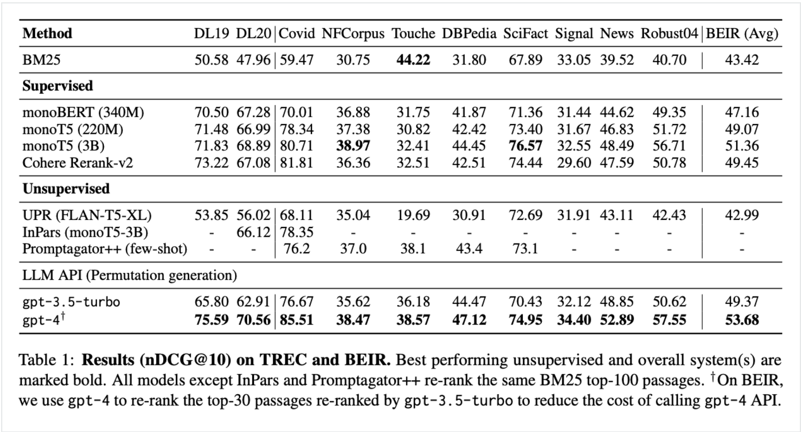

## RankGPT as a Re-Ranking Agent for RAG

RankGPT 是一种使用像 ChatGPT 这样的 LLMs 对 RAG 系统中检索到的文档进行重新排序的方法，通过优先考虑最相关的信息来提高输出质量。

### RankGPT 在 RAG 中的作用和好处

RankGPT 使用 LLMs 来评估检索到的文档或文本片段的相关性，确保最重要的文档或文本片段位于顶部。使用 RankGPT，RAG 管道中的生成器可以获得更高质量的输入，从而获得更准确的响应。

### RankGPT 基准测试性能

RankGPT （gpt-4） 在 TREC 和 BEIR 中表现优于所有其他模型，平均 nDCG@10 分为 53.68，如下表所示。它在 BEIR 数据集中获得了最高的结果，击败了 monoT5 （3B） 和 Cohere Rerank-v2 等强大的监督模型。即使使用 gpt-3.5-turbo，RankGPT 的得分也很有竞争力，证明它是一个非常有效的重新排序器。

### 在 RAG 管道中实施 RankGPT

参考github: https://github.com/sunnweiwei/RankGPT

llamaIndex 实现参照 ：https://docs.llamaindex.ai/en/stable/examples/node_postprocessor/rankGPT/