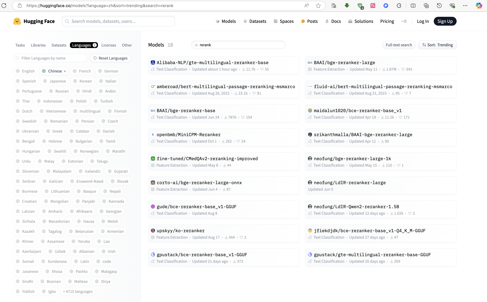
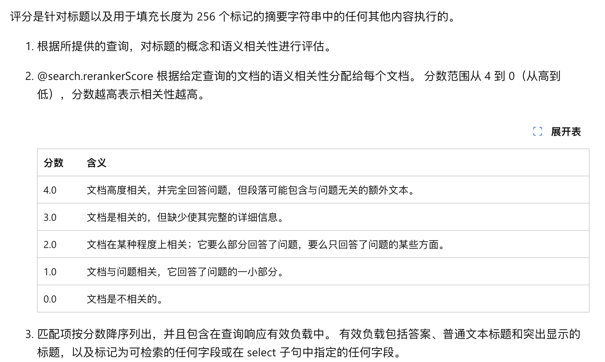

1. Rerank介绍

构建检索增强生成 （RAG） 管道时，一个关键组件是 Retriever。有多种嵌入模型可供选择，包括 OpenAI、CohereAI等，开源模型。

但是，有了所有这些选项，我们如何确定获得更好的一流检索性能呢？得到这个结果之后，是否有更好的排序语义模型来重新排序呢？
其中ReRank模型是对RAG检索返回的结果进行重新排序的模型。
也就是下图中2nd Retrieval的模型，它的作用是对第一步RAG检索出来的chunks，也就是文本进行重新的排序的。重新排序之后的文本，再给送给LLM来进行处理。

1. 为什么需要 Rerank 模型呢？

已经有了Embedding模型，它本身也是语义表达，为什么还需要一个语义rerank模型呢？

使用 embedding 和 rerank 模型 的排序有显著的算法区别，它们在排序策略和模型设计上体现出不同的侧重点：

- 	向量检索：使用预训练模型将文本转换为高维向量表示。查询和候选文档通过计算它们之间的余弦相似度或其他距离度量，来进行初步的排序。
- 	效率优先：这种方法速度快，适合处理大规模数据，因为 embedding 的计算可以通过高效的数据结构（如向量数据库或索引结构）进行快速相似度查询。
-   粗粒度：embedding 通常只能捕捉到文本之间的基本语义相似度，不一定能很好地理解细粒度的语义差异或上下文信息。
-   

而Rerank 模型：

-  精细排序：Rerank 模型通常基于深度学习，使用更复杂的网络结构（如基于 Transformer 的架构）来对文本进行更深入的理解。
- 上下文敏感性：Rerank 模型可以结合查询和候选文档的上下文，深入理解它们的语义关系，能更精准地捕捉到细微的语义差异和关联。
- 计算密集：Rerank 模型计算成本较高，通常应用于较小规模的候选集合，对 embedding 筛选出的前 k 个候选结果进行重新排序。

尽管 embedding 排序能快速处理大规模数据，但它存在一定的局限性，尤其在复杂的语义场景中表现可能不够精准。引入 Rerank 模型可以带来以下优势：
	•	提高排序精度：Rerank 模型能更好地理解文本中的上下文语义，确保最终排序更加符合查询的意图和期望的答案。
	•	处理模糊或歧义查询：当查询语句语义模糊或需要根据具体上下文进行精细判断时，Rerank 模型表现更优。
	•	多阶段排序策略：通常，搜索系统会先使用 embedding 排序缩小候选范围，再用 Rerank 模型进行精确排序，以在效率和精度之间取得平衡。
因此，embedding 排序负责快速筛选，Rerank 模型负责精细排序，共同构建高效且精确的排序流程。

3. 进一步Rerank的重要性--召回率与上下文窗口

RAG通过在大量文本文档中进行语义搜索来工作，这些文档数量可能达到数十亿。为了实现大规模搜索的快速响应，我们一般采用向量搜索技术，即将文本转化为向量后，放入一个向量空间内，通过余弦相似度等度量标准来比较它们与查询向量的近似度。

向量搜索的前提是需要向量。这些向量基本上是将文本背后的意义压缩成768或1536维的向量形式，这一过程不可避免地会丢失一些信息。因此，我们常常会发现，即使是排名前三的文档，也可能遗漏了一些关键信息。如果较低位置的文档包含了有助于大语言模型更好地形成回答的相关信息，我们该如何是好？一个简单的方法是增加返回的文档数量（即增加top_k值），并将它们全部传递给大语言模型。

值得注意的是，召回率不考虑检索到的文档总数。理论上我们通过返回所有文档可以实现完美的召回率。然而，这在实际操作中是不可行的，因为大语言模型对可以处理的文本量有一定的限制，我们称之为上下文窗口。尽管如现在模型拥有高达128KToken的巨大上下文窗口，理论上可以包含大量文档，但我们仍然不能返回所有文档并填满上下文窗口以提高召回率。

在上下文窗口中填充过多内容时，会降低大语言模型在该窗口中检索信息的能力。研究表明，当上下文窗口被过多Token填满时，大语言模型的回忆能力会受到影响。此外，过度填充上下文窗口还会使模型较难按指令执行，因此，这种做法是不可取的。

为了解决这一问题，我们可以通过检索尽可能多的文档来最大化检索召回率，然后通过尽量减少最终传递给大语言模型的文档数量。为此，我们重新排序检索到的文档，并只保留最相关的文档。

4. 为何选择使用重排序器

向量模型使用的双编码器（bi-encoder）精度较低的根本原因在于，它必须将文档的所有潜在含义压缩成一个向量——这无疑导致了信息的丢失。双编码器（Bi-Encoder）是一种常用于自然语言处理（NLP）任务的神经网络结构，尤其在信息检索和相似性匹配任务中非常有效。双编码器的基本思想是使用两个独立的神经网络（通常是预训练的语言模型，如 BERT）分别对输入的两个文本进行编码，将它们转换为向量表示。然后，可以通过计算这些向量之间的相似度（例如使用余弦相似度或点积）来判断文本对之间的相关性。由于查询是在收到后才知道的，双编码器对查询的上下文一无所知（我们是在用户提出查询之前就已经创建了嵌入）。

重排序模型通常使用更复杂的编码器结构来提高精度，比如交互式编码器（Cross-Encoder）。与双编码器不同，交互式编码器会将查询和候选文本一起输入同一个模型，并进行全局的交互处理。具体来说，Cross-Encoder 会将两个输入文本连接起来并使用一个共享的神经网络（如 BERT）来捕捉细粒度的交互信息，从而生成更精确的相关性分数。

Cross-Encoder 的工作流程

	1.	输入表示：将查询和候选文本拼接成一个单一的输入序列，通常是 [CLS] query [SEP] candidate [SEP] 的格式。
	2.	深度交互：整个输入序列通过一个共享的编码器（如 BERT）进行编码，以便模型能够学习到查询和候选文本之间的复杂交互。
	3.	生成相关性分数：使用输出的 [CLS] 标记的向量来计算查询和候选文本之间的相关性分数。

为什么 Cross-Encoder 可以提高精度

Cross-Encoder 在计算查询和候选文本的相关性时，会考虑到两者之间的交互关系，而不像 Bi-Encoder 那样独立地编码每个文本。这种深度交互允许模型更好地捕捉细微的语义差异，从而显著提高排序精度。缺点是 Cross-Encoder 需要逐个处理每个文本对，计算成本较高，因而不适合大规模检索任务。

这样选择Cross-Encoder的重排序器的精确度远超过嵌入模型，因为它使用的双编码器（bi-encoder）。

5. 开源rerank模型表现

Rerank模型效果公认效果比较好的是一家AI独角兽cohere发布的cohere rerank：cohere.com/rerank，不过该模型是一个闭源商用模型，个人使用有一定的免费额度。
国内中文开源rerank模型中效果比较好的有BAAI的bge系列模型（和这家公司的开源的embedding模型是同一个模型系列）：

更多可以查看hugging face:
[hungging_face_zhn_rerank](https://huggingface.co/models?language=zh&sort=trending&search=rerank)

两者性能对比，在结合Embedding的情况下：

这些数据清楚地表明了 rerankers 在优化搜索结果中的重要性。几乎所有嵌入都受益于重新排名，显示出更高的命中率和 MRR。
Rerankers，尤其是 CohereRerank，已经证明了他们将任何嵌入转换为竞争性嵌入的能力。

整体总结：

在考虑命中率和 MRR 时，OpenAI + CohereRerank 的组合 JinaAI-Base + bge-reranker-large/ CohereRerank 成为顶级竞争者。
但是，无论使用何种嵌入， CohereRerank/ bge-reranker-large reranker 在各种嵌入中带来的持续改进使其成为提高搜索质量的出色选择。

6. Azure AI Search开箱即用的rerank

- Azure AI Search的内容大小
  
AI search本来了向量搜索和关键子搜索的混合搜索能力，可以通过自定义打分方法来控制打分，同时还提供了语义的rerank能力，通过bing search的排序模型来进行rerank打分。
语义排名中，查询子系统将搜索结果作为摘要和排名模型的输入传递。 由于排名模型具有输入大小约束并且是处理密集型的，因此必须将搜索结果进行结构化（总结）并调整其大小以便高效处理。

语义排序器从文本查询的 BM25 排名结果或矢量/混合查询的 RRF 排名结果开始。 重新排名练习中仅使用文本字段，并且只有前 50 个结果才会进入语义排名，即使结果包含 50 个以上的结果也是如此。 通常，语义排名中使用的字段是信息性和描述性的。

对于搜索结果中的每个文档，摘要模型最多接受 2000 个标记，其中一个标记大约为 10 个字符。 输入由语义配置中列出的“标题”、“关键字”和“内容”字段组合而成。

过长的字符串会被剪裁，以确保总长度满足摘要步骤的输入要求。 此剪裁练习演示了为什么必须按优先级顺序向语义配置添加字段。 如果你的文档非常大，其中的字段包含大量文本，则会忽略超过最大限制的任何内容。
摘要输出是每个文档的摘要字符串，由每个字段中最相关的信息组成。 摘要字符串将发送到排名程序进行评分，并发送到计算机阅读理解模型以获取标题和答案。
传递给语义排名程序的每个生成的摘要字符串的最大长度为 256 个标记。

- Azure AI Search的打分范围
查询请求设置queryType=semantic 并且搜索字符串不为空（例如 search=pet friendly hotels in New York）则会语义排序

更多参考链接：
[语义搜索整理介绍](https://learn.microsoft.com/zh-cn/azure/search/semantic-search-overview)

不同的查询类型下，不同打分机制的得分情况：

[azure-ai-search-outperforming-vector-search-with-hybrid-retrieval-and-ranking](https://techcommunity.microsoft.com/blog/azure-ai-services-blog/azure-ai-search-outperforming-vector-search-with-hybrid-retrieval-and-ranking-ca/3929167)

