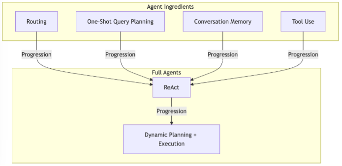
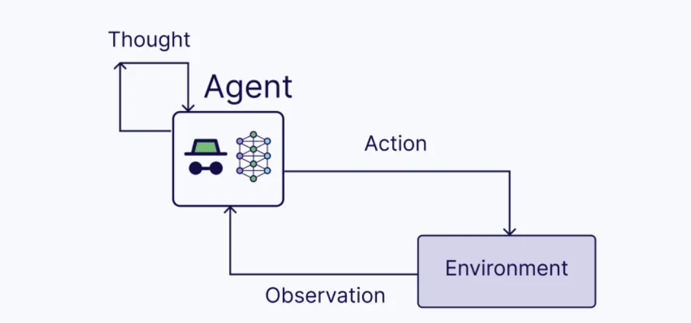
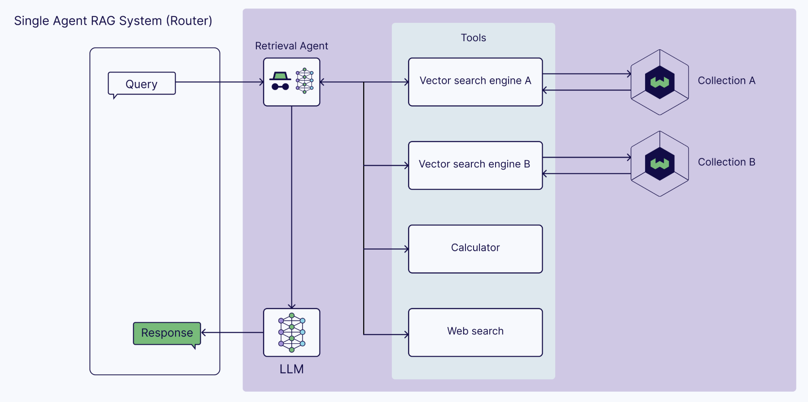
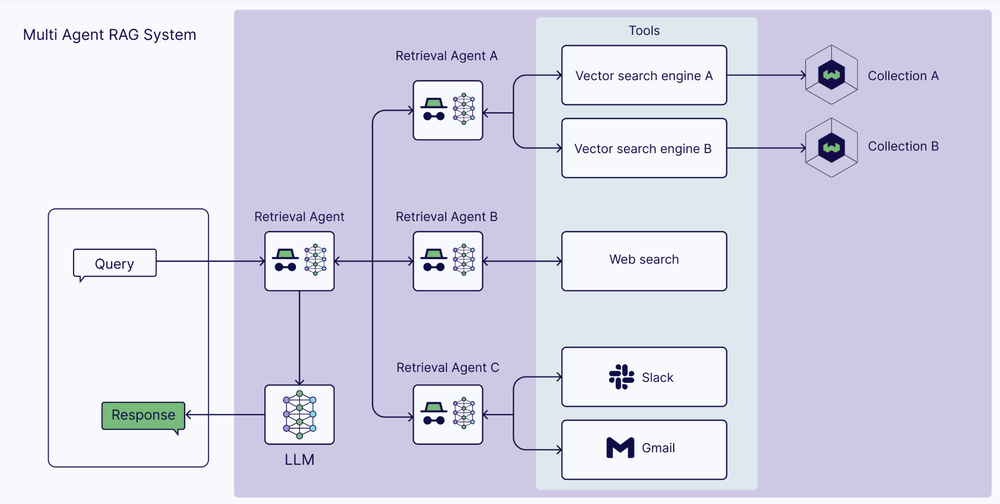

在2023年，检索增强型生成（RAG）技术占据了主导地位，而在2024年，智能体工作流程正在推动巨大的进步。使用AI智能体为构建更强大的、健壮的、多功能的大型语言模型（LLM）驱动的应用开辟了新的可能性。其中一个可能性是在智能体RAG流程中增强RAG流程中的AI智能体。

典型的 RAG 应用程序有两个相当大的限制：

- Naive RAG 管道只考虑一个外部知识源。但是，某些解决方案可能需要两个外部知识源，而某些解决方案可能需要外部工具和 API，例如 Web 搜索。
- 它们是一次性解决方案，这意味着上下文被检索一次。对检索到的上下文的质量没有推理或验证。

## AI系统中的智能体是什么

随着LLM的流行，AI智能体和多智能体系统的新范式已经出现。AI智能体是具有角色和任务的LLM，它们可以访问内存和外部工具。LLM的推理能力帮助智能体规划所需的步骤并采取行动来完成手头的任务。因此，AI智能体的核心组件包括：

- LLM（具有角色和任务）
- 内存（短期和长期）
- 规划（例如，反思、自我批评、查询路由等）
- 工具（例如，计算器、网络搜索等）

一个流行的框架是ReAct框架。ReAct智能体可以在保持状态（在内存中）的同时处理顺序多部分查询，通过将路由、查询规划和工具使用结合为一个单一实体。

*** ReAct = 推理 + 行动（使用LLM）**

这个过程包括以下步骤：

思考：在接收到用户查询后，智能体推理下一步行动

行动：智能体决定行动并执行它（例如，工具使用）

观察：智能体观察行动的反馈

这个过程一直迭代，直到智能体完成任务并响应用户。

## 什么是 Agentic RAG？

Agentic  RAG 描述了一种基于 AI 代理的 RAG 实现。具体来说，它将 AI 代理整合到 RAG 管道中，以编排其组件并执行除简单信息检索和生成之外的其他操作，以克服非代理管道的限制。

### Agentic RAG 如何运作？

尽管Agent可以合并到 RAG 管道的不同阶段，但Agentic RAG 通常是指在检索组件中使用Agent。

具体来说，检索组件通过使用可访问不同检索器工具的检索代理而成为代理组件，例如：

- 对向量索引执行向量搜索的向量搜索引擎
-  Web 搜索
-  计算器
-  用于以编程方式访问软件的任何 API，例如电子邮件或聊天程序
-  以及更多
  
RAG 代理可以对以下示例检索场景进行推理和操作：

-  决定是否检索信息
-  确定使用哪个工具检索相关信息
-  构建查询本身
-  评估检索到的上下文，并确定是否需要重新检索。

### Agentic RAG 架构

与顺序的朴素 RAG 架构相比，代理 RAG 架构的核心是代理。代理 RAG 架构可能具有不同程度的复杂程度。在最简单的形式中，单代理 RAG 架构是一个简单的路由器。但是，您也可以将多个代理添加到多代理 RAG 架构中。本节讨论两种基本的 RAG 架构。

- 单代理 RAG（路由器）

代理 RAG 最简单的形式是路由器。这意味着您至少有两个外部知识源，代理决定从哪个源中检索其他上下文。但是，外部知识源不必局限于（矢量）数据库。您也可以从工具中检索更多信息。例如，您可以执行 Web 搜索，也可以使用 API 从 Slack 通道或您的电子邮件帐户中检索其他信息。

- 多智能体 RAG 系统

单代理系统也有其局限性，因为它仅限于一个代理，集推理、检索和答案生成于一体。因此，将多个代理链接到一个多代理 RAG 应用程序中是有益的。

例如，您可以有一个主代理，负责在多个专用检索代理之间协调信息检索。例如，一个代理可以从专有的内部数据源检索信息。另一个代理可能专门从您的个人帐户中检索信息，例如电子邮件或聊天。另一个代理也可能专门从 Web 搜索中检索公共信息。

### 实施 Agentic RAG

代理由多个组件组成。要构建代理 RAG 管道，
有两个选项：具有函数调用的语言模型或代理框架。

两种实现都会得到相同的结果，这只取决于你想要的控制和灵活性。

#### 具有函数调用的语言模型

语言模型是代理 RAG 系统的主要组成部分。
另一个组件是工具，它使语言模型能够访问外部服务。
具有函数调用功能的语言模型通过允许模型与预定义的工具交互，提供了一种构建代理系统的方法。语言模型提供商已将此功能添加到其客户端中。

2023 年 6 月，OpenAI 发布了 gpt-3.5-turbo 和 gpt-4 的函数调用。
它使这些模型能够将 GPT 的功能与外部工具和 API 可靠地连接起来。
开发人员很快就开始构建将 gpt-4 插入代码执行程序、数据库、计算器等的应用程序。

函数调用不仅适用于专有模型。Ollama 引入了对 Llama3.2、nemotron-mini 等流行开源模型的工具支持。

#### 代理框架

DSPy、LangChain、CrewAI、LlamaIndex 和 Letta 等代理框架已经出现，以促进使用语言模型构建应用程序。这些框架通过将预构建的模板插入在一起，简化了代理 RAG 系统的构建。

- DSPy 支持 ReAct 代理和 Avatar 优化。Avatar optimization 描述了对每个工具的描述使用自动提示工程。
- LangChain 提供了许多使用工具的服务。LangChain 的 LCEL 和 LangGraph 框架进一步提供了内置工具。
- LlamaIndex 进一步介绍了 QueryEngineTool，这是检索工具的模板集合。
- CrewAI 是开发多代理系统的领先框架之一。用于工具使用的关键概念之一是在代理之间共享工具。
- Swarm 是 OpenAI 为多代理编排构建的框架。Swarm 同样关注如何在代理之间共享工具。
- Letta将内部世界模型反映和优化为函数的 Letta 接口。除了回答问题之外，这还可能需要使用搜索结果来更新代理对聊天机器人用户的记忆。

### 为什么企业采用代理 RAG

企业正在从普通 RAG 转向构建代理 RAG 应用程序。Replit 发布了一个帮助开发人员构建和调试软件的代理。此外，Microsoft 还宣布了与用户一起工作的 copilot，为完成任务提供建议。这些只是生产中代理的几个例子，可能性是无穷无尽的。

#### Agentic RAG 的好处

从原版 RAG 到代理 RAG 的转变使这些系统能够产生更准确的响应，自主执行任务，并更好地与人类协作。

代理 RAG 的好处主要在于提高检索到的附加信息的质量。通过添加有权访问工具使用的代理，检索代理可以将查询路由到专业知识源。此外，代理的推理功能可以在将检索到的上下文用于进一步处理之前对其进行一层验证。因此，代理 RAG 管道可以带来更强大、更准确的响应。

#### agentic RAG 的局限性

 AI 代理用于 subtask 意味着合并 LLM 来执行任务。这带来了在任何应用程序中使用 LLMs，例如增加延迟和不可靠性。根据 LLM，代理可能无法充分完成任务（甚至根本无法完成）。重要的是要采用适当的故障模式，以帮助 AI 代理在无法完成任务时摆脱卡顿。

