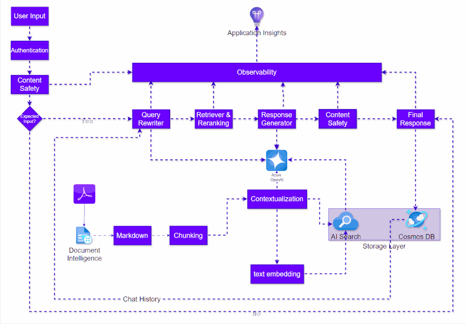

在我们常见的流程中，对于多轮对话，会通过conversion history来rewrite我们的prompt，这样的在retrieve过程中，能比较高效的匹配器内容，让LLM能够比较好的回答用户问题。因为多轮中客户的问题，很多情况是追问的，很多信息就是在上下文中，需要通过context来理解，所以这个rewrite的过程是非常重要的。

架构如图：

除了聊天历史记录之外，是否可以构建一个agent，还需要根据这个人的profile，已经需要提问的意图，包括可能的目标内容，进行重写？

- user conversion history
- user profile
- current background
- target context
等等，通过简单的配置，或者自适配来重新rewrite这个query？

可能探索的方案：

- 结合一个小模型(phi3.5)，让它能快速，大context-windows的响应生成？
- 使用LLM模型，但是提供了prompt cache也能够快速响应？