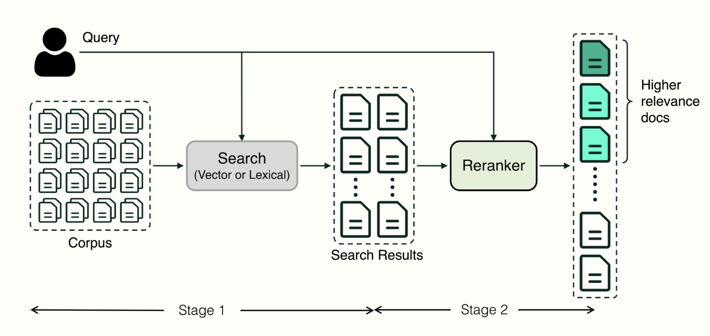
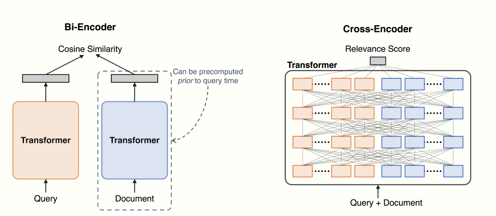
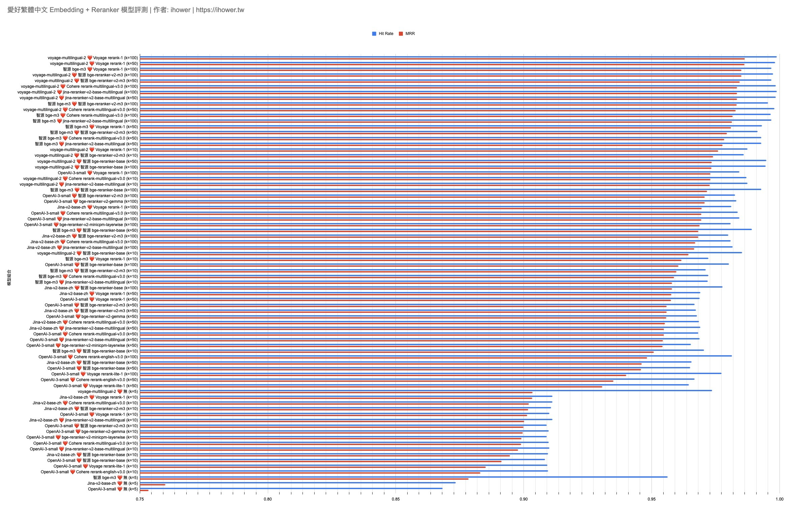

## 什么是语义排名

语义排名将查询和结果(问题和初步检索结果一同)馈送到语言理解模型，通过运算，对检索结果进行打分，和二次排序以获得更好的匹配项。

重排序模型会计算候选文档列表与用户问题的语义匹配度，根据语义匹配度重新进行排序，从而改进语义排序的结果。其原理是计算用户问题与给定的每个候选文档之间的相关性分数，并返回按相关性从高到低排序的文档列表。常见的 Rerank 模型如：Cohere rerank、bge-reranker 等

Reranker 模型是另一种不一样的模型（学名叫做 Cross-Encoder），不同于 embedding 模型（学名叫做 Bi-Encoder） 输入是文字，输出是高维度矢量。 
Reranker 模型的输入是两段文字，输出一个相关性分数 0 到 1 之间（AI Search的senamic mode输出的是0~4），也就是我们会将用户 query 跟每一份文件都去算相关性分数，然后根据分数排序。

Reranker 的执行速度较慢，成本较高，但在判断相关性上面，比 embedding 模型更准确.

因此当数据非常多、想要快又要准时，跟 embeddings模型以及BM25搭配组合的混合搜索，做成两阶段检索。

第一阶段： 从上万上亿笔资料中，用hybird search，搜寻出top K
第二阶段： 从top K中，用 Reranker 进行精细的相关性排序top N

## 为什么需要语义排名
- 对于 RAG（检索增强生成）更是如此——那些生成式 AI 用例需要一个紧凑的上下文窗口。最好的文档可能是第 4 个结果，但如果你只输入前三个结果，你就不会得到正确的答案，而且模型可能会出现幻觉。
- 即使模型上下文窗口很足够大，过多的召回分段会可能会引入相关度较低的内容，导致回答的质量降低，所以重排序的 TopK 参数并不是越大越好
- 重排序并不是搜索技术的替代品，而是一种用于增强现有检索系统的辅助工具。它最大的优势是不仅提供了一种简单且低复杂度的方法来改善搜索结果，允许用户将语义相关性纳入现有的搜索系统中，而且无需进行重大的基础设施修改

## rerank mode技术的主要区别-cross-encoding

reranker 是 “跨编码器” 神经网络，它通过一起处理查询-文档对、捕获它们细微而复杂的交互而表现出色。查询和文档被连接并输入。此转换器包括跨查询和文档的多个注意力层，有助于全面了解它们之间的关系。相比之下，使用基于嵌入的方法（也称为双编码器），transformer 分别为查询和文档生成嵌入，交互仅限于比较其嵌入的余弦相似性。因此，由于对查询-文档交互的详细分析，reranker 通常比基于嵌入的方法生成更精确的相关性分数。

## 测试对比结果

挑选了4个embedding模型，以及10个Reranker模型，top-k取10,50,100三种，共有78种组合。
先用 embedding 模型挑出 top-k 10/50/100，然后再用 Reranker 模型重排取出 top 5 后，再评分命中率和 MRR （倒数排名）

*** 倒数排名：对于每个查询，系统返回一个按相关性排序的结果列表。找到第一个相关结果的位置，计算它的倒数（如果相关结果在第 1 位，贡献值为  1 （最佳情况）。如果相关结果在第 2 位，贡献值为  0.5 如果相关结果在第  k  位，贡献值为  \frac{1}{k} 对所有查询的倒数排名取平均值，得到系统的整体性能。**

总结测试结果：

- 惊人的准确率： voyage-multilingual-2 embedding 搭配 Voyage rerank-1 （k=100） 成功提升到命中率 99.88% 了，3393题只有4题没有把正确 context 选进 top 5，而且绝大部分都是 top 1
- 使用 Reranker 进行二阶段排序确实能显著提升命中率。 即使是较弱的Embedding模型例如OpenAI small，在首轮 top-k 100 的情况下重排取前5，也能达到98%的超高准确率，超越所有只用Embedding模型的一阶段检索。
- 第一阶段 top-k 值越大最后的结果越好，当然限制是 Reranker 的 latency 和 API 成本。 用 top-k 10 的确太小了。 若文件 chunk 是 500 tokens 可用 top-k 100，若 chunk 是 1000 tokens 可用 top-k 50，如此才可以充分发挥 Reranker 模型的优势。
- 或是考虑做成动态 top-k 来节省成本： 可根据第一阶段搜寻的相似性分数，超过某个低标才进去第二阶段重排
- 重排可将MRR大幅提升到接近命中率，这代表重排之后很多正确答案就被排到第一位置，这对后续LLM生成会有帮助。 而且若LLM context window 有限或想节省 LLM tokens 成本，透过 reranker 重排后取 top 3，也可以有效节省 RAG 耗费的 tokens 量
- 重排也可以用在合并多种第一阶段搜索结果列表，例如将用户查询，透过LLM做一次Query Expansion 平行搜索出多个结果列表，去除重复后再合并丢进Reranker重排
- 对于完全不支持中文的 Reranker 模型，例如 cross-encoder/ms-marco-MiniLM-L-6-v2，当 top-k 增加时，命中率反而下降，排的越多性能越差
- 不同于Embedding模型的成本在前期准备索引阶段，Reranker模型呼叫API成本在后期用户query的用量
- 同理，也因为重排发生在用户 query 当下，因此 Reranker 的速度蛮重要的，几百毫秒还可以接受，超过 1秒 我不行
- 开源模型只有 bge-reranker-base （n=10） 在本机 MBP pro m2 还可以跑，其他需要使用 GPU 不然会太慢

### 如何选择 Reranker

在选择 reranker 时，需要仔细考虑几个关键因素，以确保最佳性能并与系统要求的兼容性。

- 相关性改进： 添加 reranker 的主要目的是增强搜索结果的相关性。评估 reranker 在检索指标（如 NDCG）或生成指标（如归因）方面提高排名的能力。
- 延迟： 评估 reranker 向搜索系统引入的额外延迟。测量重新排名文档所需的时间，并确保其保持在实时或近乎实时搜索应用程序的可接受范围内。
- 情境理解： 确定 reranker 处理查询和文档中不同长度的上下文的能力。一些 reranker 可能针对短文本输入进行了优化，而另一些 rerankers 可能能够处理具有丰富上下文信息的较长序列。
- 泛化能力： 评估 reranker 跨不同域和数据集泛化的能力。确保 reranker 不仅在训练数据上表现良好，而且在看不见或域外的数据上表现良好，以防止过度拟合并确保在各种搜索场景中的稳健性能。

### Rerankers 比较的最新研究

- 重新排名的文档计数的影响： 增加要重新排名的文档数量对重新排名过程的最终效果有积极影响。这凸显了在确定重新排名文档的最佳数量时考虑计算资源和性能提升之间权衡的重要性。
- 交叉编码器 vs. LLMs： 当与强大的检索器配对时，有效的交叉编码器已经显示出在重新排序任务中优于大多数 LLMs 的能力，但某些数据集上的 GPT-4 除外。值得注意的是，交叉编码器在提供这种改进的性能的同时效率更高，使其成为重新排序任务的有吸引力的选项。
- 基于 LLM 的 Rerankers 的评估： 基于 Zero-shot LLM 的重新排名器，包括基于 OpenAI 和开放模型的重新排序器，表现出有竞争力的效果，有些甚至与 GPT3.5 Turbo 的性能相匹配。然而，尽管这些模型的性能前景广阔，但与这些模型相关的低效率和高成本目前限制了它们在检索系统中的实际使用。

总体而言，该研究强调了重新排序方法在增强检索方面的重要叉编码器成为一种特别有前途且高效的选择。虽然基于 LLM 的重新排序器显示出有竞争力的效果，但它们的实际部署受到效率低下和高成本的阻碍。

## 结论

在优化 RAG 系统和通过减轻幻觉来确保可靠的搜索结果方面，选择合适的重新排名器的重要性怎么强调都不为过。对各种 reranker 类型（包括交叉编码器和多向量模型）的细致入微的理解强调了它们在提高搜索精度方面的关键作用。

- Reranker 做的人比较少，有做中文的选择又更少了，基本就四家 Voyage， Cohere， Jina 跟开源的 bge 系列
- 选择reranker模型的时候，语言支持很重要

