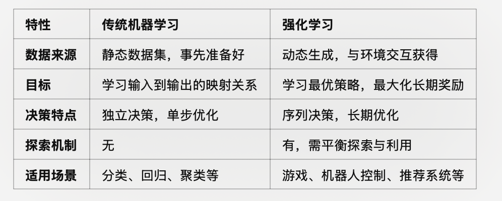
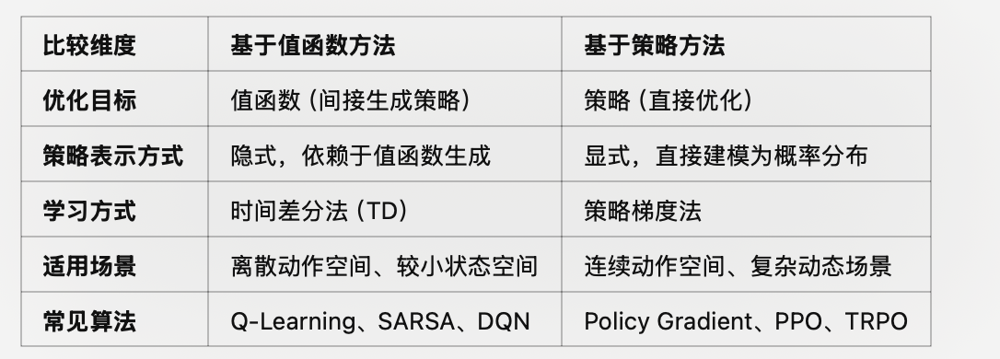

## 强化学习常见概念澄清

强化学习中的**智能体（Agent）和环境（Environment）**有特定的定义，它们共同构成了强化学习的基本框架（通常称为马尔可夫决策过程，MDP）.
强化学习本质上是解决序列决策和长期规划问题，而传统机器学习更适合解决静态映射与模式识别问题。
主要使用场景是“多序列决策问题”，或者说是对应的模型未知，需要通过学习逐渐逼近真实模型的问题。
并且当前的动作会影响环境的状态，即具有马尔可夫性的问题。同时应满足所有状态是可重复到达的条件，即满足可学习条件。

##### 1.根据是否有模型可以区分为： 有模型和免模型
免模型方法： 不需要对环境进行建模，直接与真实环境进行交互即可，所以其通常需要较多的数据或者采样工作来优化策略，这也使其对于真实环境具有更好的泛化性能；
有模型方法： 需要对环境进行建模，同时在真实环境与虚拟环境中进行学习，如果建模的环境与真实环境的差异较大，那么会限制其泛化性能。现在通常使用有模型方法进行模型的构建工作。

#### 2.强化学习与深度学习

强化学习与深度学习的区别在于它们的目标和应用场景不同，尽管可以结合使用（如深度强化学习，DRL）：
1.	深度学习：是一种监督学习或无监督学习方法，使用固定的数据集（如图像、文本）来训练模型，目标是通过优化损失函数来预测或生成结果。
	•	示例算法：CNN（卷积神经网络，用于图像）、RNN（循环神经网络，用于序列）、Transformer（用于语言和多模态任务）。
在神经网络中通常使用随机梯度下降法。随机的意思是随机选择一些样本来增量式地估计梯度，比如常用的批量训练方法。如果样本是相关的，就意味着前后两个批量很可能也是相关的，那么估计的梯度也会呈现出某种相关性。但是在极端条件下，后面的梯度估计可能会抵消掉前面的梯度估计量，从而使得训练难以收敛。

2.	强化学习：没有固定的数据集，而是通过智能体与环境的交互来学习。它更关注决策过程和长期规划。
	•	示例算法：Q-Learning、Policy Gradient、DQN（深度Q网络）、PPO（近端策略优化）。

Q-Learning、Policy Gradient、DQN、PPO等都是强化学习的具体算法实现，基于**马尔可夫决策过程（Markov Decision Process, MDP）**框架。
MDP提供了一个理论基础：用状态（State）、动作（Action）、状态转移概率（Transition Probability）、奖励函数（Reward Function）等元素描述智能体与环境的交互。

两者可以结合，比如深度强化学习（DRL），利用神经网络处理复杂的状态和动作空间，进一步扩展了强化学习的能力。
强化学习的智能体通常需要神经网络（如CNN、Transformer）来表示复杂的策略或价值函数（Value Function），从而与深度学习方法结合，形成深度强化学习技术。
还有一个主要区别：深度学习中的损失函数的目的是使预测值和真实值之间的差距尽可能小，而强化学习中的损失函数的目的是使总奖励的期望尽可能大。

#### 3.强化学习与传统机器学习
传统机器学习
	•	目标：从数据中学习映射关系（输入到输出）。
	•	监督学习：基于标注数据，最小化误差（如分类问题预测正确标签，回归问题预测连续值）。
	•	无监督学习：发现数据结构（如聚类）。
	•	任务特点：
        •	输入和输出之间有明确的关系。
        •	数据是静态的，通常在训练之前完全给定。
        •	每次预测是独立的，不涉及长期的决策或反馈。
	•	数据来源：通常依赖静态、事先准备好的数据集。
	    •	例如分类问题需要标注的标签，回归问题需要输入-输出对。
	•	数据处理：独立同分布假设（IID），即每个样本是相互独立且分布相同的。
    •	目标函数：
        •	回归：最小化均方误差（MSE）或其他损失函数。
        •	分类：最大化分类准确率，最小化交叉熵损失等。
        •	优化方式：优化全局的静态目标（如拟合数据分布）。
    •	每次预测是独立的，没有长期决策的影响。
	    •	例如，分类模型预测一张图像的类别与其他图像无关；回归模型预测房价与其他样本无关。
	•	没有探索机制：训练过程基于现有数据，模型通过拟合数据学习映射关系。

强化学习
	•	目标：通过与环境交互，找到一种策略使累计奖励最大化。
	•	强化学习中的目标不仅是找到某一时刻的最优解，还需要考虑未来的长期收益。
	•	任务特点：
        •	数据是动态的，通过智能体与环境的交互实时生成。
        •	每个动作不仅影响即时奖励，还影响未来状态和奖励（长期决策问题）。
        •	强调探索与利用之间的权衡。
    •	数据来源：智能体通过与环境交互生成数据。
	    •	例如，玩游戏时智能体的每一次动作都会更新状态，生成新的样本。
	•	数据处理：数据高度相关，下一步的状态取决于当前的动作（非IID）。这对算法的稳定性和训练效率提出了更高要求。
    •	目标函数：最大化累计奖励（通常是长期的期望值）。
	    •	例如  G_t = r_t + \gamma r_{t+1} + \gamma^2 r_{t+2} + \dots 。
	•	优化方式：动态优化，当前动作不仅影响当前奖励，还会影响未来的状态和奖励。
	•	强调策略优化（Policy Optimization）或值函数优化（Value Optimization）。
    •	强调序列决策，每个动作不仅影响当前奖励，还会影响未来状态和决策空间。
	    •	例如，机器人移动一个步伐后会改变环境状态，从而影响下一步的决策。
    •	有探索机制：智能体必须在探索（尝试新动作）和利用（根据已有知识选择最优动作）之间平衡，才能学到最优策略。
	•	常用策略：ε-greedy、软max、UCB等。

##### 示例对比

以下通过一个具体任务展示两者的区别：

房价预测（传统机器学习）
	•	输入：房屋面积、地理位置等特征。
	•	输出：房价。
	•	学习目标：通过历史数据学习面积和房价的关系，最小化预测误差。
	•	数据：事先标注好的样本集，无需动态生成。

机器人走迷宫（强化学习）
	•	状态：机器人在迷宫中的位置。
	•	动作：移动方向（上、下、左、右）。
	•	学习目标：找到一条路径使累计奖励最大化（例如尽快到达终点）。
	•	数据：通过交互生成（机器人探索路径时的状态、动作、奖励）。

#### 4.常见算法分析对比

1. Q-Learning

Q-Learning值函数（Value-based）方法。学习一个动作值函数  Q(s, a) ，表示在状态  s  下采取动作  a  后的长期累计奖励的期望值。
它易于实现，适用于小规模、离散状态空间的问题。难以扩展到大规模或连续状态空间，因为需要存储整个  Q(s, a)  表。

2. Policy Gradient

Policy Gradient是策略（Policy-based）方法。直接优化智能体的策略  \pi(a|s;\theta) ，而非通过值函数间接推导策略。目标函数是最大化策略的期望累计奖励。
它是可直接优化参数化策略，适合连续动作空间问题。但是高方差，收敛速度慢。通常需要结合**基线（baseline）**技术降低方差（如 Actor-Critic 方法）。

3.  DQN（深度 Q 网络）

DQN（深度 Q 网络）也是值函数（Value-based）方法。结合 Q-Learning 和深度学习，通过神经网络近似  Q(s, a) 。解决了传统 Q-Learning 无法处理大规模状态空间的问题。
•	改进策略：
	1.	经验回放（Experience Replay）：存储交互数据到缓冲区，随机采样训练，降低数据相关性。
	2.	目标网络（Target Network）：引入一个固定的目标网络来计算  \max_{a{\prime}} Q(s{\prime}, a{\prime}; \theta^{-}) ，定期更新目标网络，减少训练的不稳定性。
能处理高维状态空间（如图像）。但是对超参数敏感，探索时可能不稳定。

4. PPO（近端策略优化，Proximal Policy Optimization）
它是策略（Policy-based）方法。改进 Policy Gradient，避免策略更新步幅过大导致不稳定。PPO通过限制更新幅度实现更高效稳定的训练。
    •	更高效，训练更稳定。
	•	较为简单易实现，适合实际应用。
虽然比策略梯度法稳定，但仍可能对环境复杂性较敏感。

值函数优化的目的是通过估算每个状态或状态-动作对的“价值”，来帮助智能体判断如何选择动作。
状态值函数  V(s) ：表示从某状态  s  开始，智能体在未来能够获得的预期累计奖励
动作值函数  Q(s, a) ：表示在某状态  s  下执行动作  a  后，未来能够获得的预期累计奖励

虽然其核心是策略优化，但它利用了 Actor-Critic 的架构。因此，它不仅是一个策略优化方法，还在训练过程中结合了值函数估计（Critic），以提供稳定性和效率。

#### 5.主要分类： 值函数优化和策略优化

值函数优化的目标：
	1.	准确估计值函数： 通过算法（如动态规划、蒙特卡洛方法或 TD 学习）更新  V(s)  或  Q(s, a) 。
	2.	指导决策： 根据值函数选择最优动作。例如，基于  Q(s, a)  的贪婪策略：a^* = \text{argmax}_{a} Q(s, a)
值函数的优化就是通过累计未来奖励来估计每个状态或动作的“价值”。但值函数是预测的值，并不直接等同于奖励函数，而是从奖励函数中学习得到的。
值函数优化的核心是通过学习一个函数 V(s) 或 Q(s, a)，准确评估状态或状态-动作对的长期价值。这种优化通常通过动态规划、蒙特卡洛方法、时序差分或深度学习来实现，最终指导智能体以最优方式选择动作，实现任务目标。

策略优化的目的是直接优化智能体的策略  \pi(a|s) ，即在给定状态下选择动作的概率分布，而无需显式计算值函数。
策略优化的核心：
	•	策略函数  \pi(a|s;\theta) ：表示在状态  s  下采取动作  a  的概率，参数  \theta  定义策略。
	•	如果是离散动作空间，策略可以表示为一个概率分布。
	•	如果是连续动作空间，策略可能是一个参数化的概率分布（如正态分布）。
	•	策略目标函数：优化的目标是最大化某种预期收益  J(\theta) ，例如：J(\theta) = \mathbb{E} \left[ G_t \mid \pi_\theta \right]

或者直接优化累计奖励  \sum_t r_t 。
优化智能体选择动作的概率，具体指通过优化策略函数，使得智能体在不同状态下选择“好”动作的概率逐渐增加，进而提升智能体完成任务的能力。这种优化通常通过策略梯度方法实现，直接作用于策略函数的参数。最终的目标是让智能体在未知环境中高效决策，最大化累计奖励。

继续讨论基于价值的方法和基于策略的方法的区别：
1. 生成策略上的差异，前者确定，后者随机。基于价值的方法中动作-价值对的估计值最终会收敛（通常是不同的数，可以转化为0～1的概率），因此通常会获得一个确定的策略；基于策略的方法不会收敛到一个确定的值，另外他们会趋向于生成最佳随机策略。如果最佳策略是确定的，那么最优动作对应的值函数的值将远大于次优动作对应的值函数的值，值函数的大小代表概率的大小。

2. 动作空间是否连续，前者离散，后者连续。基于价值的方法，对于连续动作空间问题，虽然可以将动作空间离散化处理，但离散间距的选取不易确定。过大的离散间距会导致算法取不到最优动作，会在最优动作附近徘徊；过小的离散间距会使得动作的维度增大，会和高维度动作空间一样导致维度灾难，影响算法的速度。而基于策略的方法适用于连续的动作空间，在连续的动作空间中，可以不用计算每个动作的概率，而是通过正态分布选择动作。

3. 基于价值的方法，例如Q学习算法，是通过求解最优价值函数而间接地求解最优策略；基于策略的方法，例如REINFORCE等算法直接将策略参数化，通过策略搜索、策略梯度或者进化方法来更新参数以最大化回报。基于价值的方法不易扩展到连续动作空间，并且当同时采用非线性近似、自举等策略时会有收敛问题。策略梯度具有良好的收敛性。

4. 另外，对于价值迭代和策略迭代，策略迭代有两个循环，一个是在策略估计的时候，为了求当前策略的价值函数需要迭代很多次；另一个是外面的大循环，即策略评估、策略提升。价值迭代算法则是一步到位，直接估计最优价值函数，因此没有策略提升环节。

***基于策略方法（Policy-Based Methods）和基于值函数方法（Value-Based Methods）确实都在试图最大化累计奖励，但它们的核心区别在于优化的对象和实现方式，尤其是它们如何表示策略，以及如何学习和优化。***

进一步对比基于价值的方法和基于策略的方法的区别：

1. 优化对象的不同
基于值函数方法： 	优化对象：值函数（Value Function），如  V^\pi(s) 、 Q^\pi(s, a) 。通过值函数的最大化来间接生成策略。例如，贪婪策略选择：a = \arg\max_a Q(s, a)。主要关注的是通过学习值函数，找到对应的最优策略。策略通常是从值函数推导出来的，而不是显式学习策略。

基于策略方法： 	优化对象：策略本身 \pi(a|s)，即直接学习状态到动作的映射。	\pi(a|s)：表示在状态 s 下选择动作 a 的概率分布。通过优化策略的参数（通常记作 \theta），最大化累计奖励的期望 J(\pi)：J(\pi) = \mathbb{E}_{\pi} \left[ G_t \right]。通过策略梯度（Policy Gradient）方法来直接调整 \pi(a|s) 的概率分布。直接学习和优化策略，而不依赖值函数来生成策略。策略可以是确定性的，也可以是随机的。

2.  策略表示方式的不同

基于值函数方法： 策略是隐式表示的，依赖于值函数。比如在 Q-Learning 中，值函数  Q(s, a)  被优化后，智能体在每个状态  s  下选择拥有最大值的动作  a ：a = \arg\max_a Q(s, a)。没有直接优化策略，只是通过值函数间接生成策略。优化的核心思想：预测每个状态-动作对的奖励期望，通过提升值函数的准确性来改进策略。

基于策略方法： 	策略是显式表示的，直接建模为概率分布。	比如，策略可能被定义为一个神经网络 \pi_\theta(a|s)，输出在每个状态下选择各动作的概率。直接优化策略参数 \theta 来提高策略表现。	优化的核心思想：策略本身就是优化目标，通过直接调整策略使累计奖励期望最大化。

3. 学习方式的不同

基于值函数方法： 依赖于值函数的评估。使用时间差分（TD）学习方法来迭代估计值函数，比如 Q-Learning 和 SARSA。	学习过程是递归的，比如通过贝尔曼方程进行更新：Q(s, a) \leftarrow Q(s, a) + \alpha \left[ R + \gamma \max_{a{\prime}} Q(s{\prime}, a{\prime}) - Q(s, a) \right]。优点：通常高效，尤其在离散动作空间下可以快速收敛。	缺点：在复杂的连续动作空间中表现不好，因为需要对动作进行最大化操作。

基于策略方法：直接优化策略。	策略优化的目标是最大化累计奖励 J(\pi)，通过策略梯度公式进行优化：\nabla_\theta J(\pi) = \mathbb{E}{\pi} \left[ \nabla\theta \log \pi_\theta(a|s) G_t \right]。优点：适用于高维连续动作空间，策略可以是随机性的。缺点：策略梯度的方差较大，通常需要引入一些技术（如优势函数）来稳定学习。

4. 适用场景的不同

基于值函数方法：适合场景-动作空间是离散的（如 Q-Learning、DQN）。	状态空间相对较小或者可以通过函数逼近值函数。比如：游戏场景：如经典的迷宫导航（Discrete Maze Navigation）。AlphaGo 中的深度 Q-Learning（用于探索）。

基于策略方法： 适合场景：	动作空间是连续的（如机器人控制、自动驾驶）。	环境动态复杂且需要随机性策略（如博弈场景）。例子：机器人控制（PPO、TRPO 等）。游戏 AI 中的复杂行为策略（如 Dota 2 中的 OpenAI Five）。

### 6.马尔可夫决策过程

马尔可夫过程是一个二元组 $<S,P>$ ， $S$ 为状态集合， $P$ 为状态转移函数；

马尔可夫决策过程是一个五元组 $<S,P,A,R,\gamma>$， 其中 $R$ 表示从 $S$ 到 $S'$ 能够获得的奖励期望， $\gamma$ 为折扣因子， $A$ 为动作集合；

马尔可夫最重要的性质是**下一个状态只与当前状态有关，与之前的状态无关**，也就是 $p(s_{t+1} | s_t)= p(s_{t+1}|s_1,s_2,...,s_t)$。

求解马尔可夫决策过程时，可以直接求解**贝尔曼方程或动态规划方程**：

$$
V(s)=R(S)+ \gamma \sum_{s' \in S}p(s'|s)V(s')
$$

特别地，其矩阵形式为 $\mathrm{V}=\mathrm{R}+\gamma \mathrm{PV}$。但是贝尔曼方程很难求解且计算复杂度较高，所以可以使用动**态规划、蒙特卡洛以及时序差分**等方法求解。

马尔可夫性是 MDP 的核心假设，即当前状态 s_t 和动作 a_t 完全决定了下一状态 s_{t+1} 和奖励 r_{t+1}，而与历史状态和动作无关。
如果不具备马尔可夫性，即下一个状态与之前的状态也有关，若仅用当前的状态来求解决策过程，势必导致决策的泛化能力变差。为了解决这个问题，可以**利用循环神经网络对历史信息建模，获得包含历史信息的状态表征**，表征过程也可以使用注意力机制等手段，最后在表征状态空间求解马尔可夫决策过程问题。

#### 7.贝尔曼方程

MDP 比作一个“游戏规则”，它定义了环境的所有特性；而贝尔曼方程则是“解规则的方法”，它通过数学递归关系，帮助我们找到如何在这个环境中做出最优决策的路径。
贝尔曼方程是基于 MDP 提出的递归关系，用于描述值函数（状态值函数 V(s) 或动作值函数 Q(s, a)）的性质。
它本质上是对值函数的分解，将当前状态的价值表示为即时奖励加上下一个状态的折扣价值的期望。

贝尔曼方程：定义了当前状态与未来状态的迭代关系，表示当前状态的价值函数可以通过下个状态的价值函数来计算。贝尔曼方程即 $V(s)=R(s)+ \gamma \sum_{s' \in S}P(s'|s)V(s')$

1.  基于状态价值函数的贝尔曼方程：$V_{\pi}(s) = \sum_{a}{\pi(a|s)}\sum_{s',r}{p(s',r|s,a)[r(s,a)+\gamma V_{\pi}(s')]}$；
2.  基于动作价值函数的贝尔曼方程：$Q_{\pi}(s,a)=\sum_{s',r}p(s',r|s,a)[r(s',a)+\gamma V_{\pi}(s')]$。

计算贝尔曼方程的常见方法：

1.  **动态规划方法**（DP）：可用来计算价值函数的值。当**模型完全已知**时，使用贝尔曼方程，**迭代来计算**价值函数，并进行策略的改进。$v\left(S_{t}\right) \leftarrow \mathbb{E}_{\pi}\left[R_{t+1}+\gamma v\left(S_{t+1}\right)\right]$ 。举例：如果任务时预测从上海开车到北京所需的时间，动态规划是寻找几个**有经验的老司机（模型已知）**，在还没有出发时，统计每个老司机的预计到达时间，求平均值即可作为任务的估计值。

动态规划属于有模型方法；时序差分方法和蒙特卡洛方法，因为都是免模型的方法，所以对于后续状态的获知也都是基于试验的方法；
时序差分方法和动态规划方法的策略评估，都能基于当前状态的下一步预测情况来得到对于当前状态的价值函数的更新。

2.  **蒙特卡洛方法**（MC）：可用来计算价值函数的值。**无模型**方法，通过计算**所观察到样本的平均值**作为实际期望收益的近似。$v\left(S_{t}\right) \leftarrow v\left(S_{t}\right)+\alpha\left(G_{t}-v\left(S_{t}\right)\right)$。以开车举例，现在找几个新司机，让他们开车从上海到北京，在北京，统计到北京所用的时间，取平均值作为任务的估计值。
蒙特卡洛方法进行了完整的采样来获取长期的回报值，因而在价值估计上会有更小的偏差，但是也正因为收集了完整的信息，所以价值的方差会更大，原因在于其基于试验的采样得到，和真实的分布有差距，不充足的交互导致较大方差。而时序差分方法则相反，因为它只考虑了前一步的回报值，其他都是基于之前的估计值，因而其价值估计相对来说具有偏差大方差小的特点。

3.  **时差学习**（TD）：为动态规划方法和蒙特卡洛方法的结合。**无模型**方法，它从每轮的经验数据中学习。TD学习可以从**不完整**的一轮数据中学习。$T D(0): v\left(S_{t}\right) \leftarrow v\left(S_{t}\right)+\alpha\left(R_{t+1}+\gamma v\left(s_{t+1}\right)-v\left(S_{t}\right)\right)$。以开车举例，在出发时有个预估时间如20小时，现在新司机从上海出发，到达南京已经花费5个小时，南京到北京的预估时间为13小时，则上海到北京的预测时间可以使用13+5=18小时代替，即一部分真实值，一部分预测值。

时序差分方法不需要等到试验结束后才能进行当前状态的价值函数的计算与更新，而蒙特卡洛方法需要与环境交互，产生一整条马尔可夫链并直到最终状态才能进行更新。时序差分方法和动态规划方法的策略评估不同之处为免模型和有模型，动态规划方法可以凭借已知转移概率推断出后续的状态情况，而时序差分方法借助试验才能知道。

#### 8.***结合两者的 Actor-Critic 方法***

由于基于值函数和基于策略的方法各有优缺点，很多强化学习算法（如 Actor-Critic）结合了两者：
	•	Actor：负责直接优化策略 \pi(a|s)，进行动作选择。
    •	Critic：学习值函数 V^\pi(s) 或 Q^\pi(s, a)，对策略的表现进行评估。
这种方法兼具两者的优点：
    •	Actor 专注于策略优化，解决连续动作问题。
    •	Critic 提供奖励的低方差估计，减少策略梯度的方差。

两种方法的本质区别在于是否直接优化策略（基于策略方法）还是间接优化策略（基于值函数方法）。两者可以结合使用，形成更强大的算法（如 Actor-Critic）。

演员（Actor）是策略模块，输出动作；
评论员（Critic）是判别器，用来计算价值函数。评论员衡量当前决策的好坏。结合策略模块，当评论员判别某个动作的选择是有益的时候，策略就更新参数以增大该动作出现的概率，反之减小该动作出现的概率。优势函数的计算公式为 $A(s,a)=Q(s,a)-V(s)=r+\gamma V(s')-V(s)$ ，其可以定量地表示选择动作 $a$ 的优势。即当动作 $a$ 低于价值函数的平均值的时候，优势函数为负值；反之为正值。其是一个标量，具体来说：

-   如果 $A(s,a)>0$ ，梯度被推向正方向；
-   如果 $A(s,a)<0$ ，即我们的动作比该状态下的平均值还差，则梯度被推向反方向。

这样就需要两个价值函数，所以可以使用时序差分方法做误差估计：$A(s,a)=r+\gamma V(s')-V(s)$ 。

Actor-Critic 方法优势：

1.  相比以价值函数为中心的算法，**演员-评论员算法应用了策略梯度的技巧**，这能让它在连续动作或者高维动作空间中选取合适的动作，而Q学习做这件事会很困难。
2.  相比单纯策略梯度，**演员-评论员算法应用了Q学习或其他策略评估的做法**，使得演员-评论员算法能进行单步更新而不是回合更新，比单纯的策略梯度的效率要高。

***Actor-Critic 方法 是一种通用的强化学习架构，它为后续强化学习算法（如 A3C、PPO、DDPG 等）奠定了理论基础。***

##### 8.1异步优势演员-评论员算法（Asynchronous Advantage Actor-Critic, A3C） 

A3C 是 Actor-Critic 方法的一种改进，它是 DeepMind 在 2016 年提出的，并被认为是经典的深度强化学习算法之一。
A3C 对 Actor-Critic 方法进行了以下几个重要改进：
1.	异步并行化：
	•	在 A3C 中，多个线程/工作者（worker）同时与环境交互，各自收集状态、奖励和动作的数据，同时更新全局网络的参数。
	•	这种异步架构可以显著提高训练效率，避免掉入局部最优解，并改善收敛性。
	•	工作者不共享环境，彼此独立，能够探索不同的状态空间，从而减少过拟合和样本相关性。
2.	优势函数（Advantage Function）：
	•	A3C 使用优势函数 A(s, a) = Q(s, a) - V(s) 来衡量当前动作相对于平均策略的表现。
	•	优势函数的使用可以减少高方差，提高训练稳定性。
3.	多任务学习：
	•	A3C 可以同时优化多种目标（例如不同的奖励信号），这有助于提升算法的适应性。
4.	无经验回放（On-Policy）：
	•	A3C 不依赖经验回放（Replay Buffer），直接利用在线收集的样本更新策略，节省了显存空间。

A3C 的更新逻辑
	•	Critic 更新值函数：

\delta = R + \gamma V(s{\prime}) - V(s)

	•	Actor 使用优势函数更新策略：

\nabla_\theta J(\pi_\theta) \propto A(s, a) \nabla_\theta \log \pi_\theta(a|s)

	•	值函数 V(s) 和策略 \pi(a|s) 的参数通过异步梯度下降共享一个全局网络。

#### 9.稀疏奖励

解决稀疏奖励的主要方法：

1. 设计奖励（reward shaping）：当智能体与环境进行交互时，人为设计一些奖励，从而“指挥”智能体，告诉其采取哪一个动作是最优的。需要注意的是，这个奖励区别于环境的奖励。其可以提高我们估算Q函数时的准确性。
2. 内在好奇心模块（intrinsic curiosity module，ICM）：其代表好奇心驱动这个技术中的增加新的奖励函数以后的奖励函数。

内在好奇心模块代表好奇心驱动技术中增加新的奖励函数以后的奖励函数。具体来说，其在更新计算时会考虑3个新的部分，分别是状态 $s_1$、动作 $a_1$ 和状态 $s_2$。根据 $s_1$ 、$a_1$、$a_2$，它会输出另外一个新的奖励 $r_1^i$。所以在内在好奇心模块中，我们的总奖励并不是只有 $r$ 而已，还有 $r^i$。它不是只把所有的 $r$ 相加，还把所有 $r^i$ 相加一并当作总奖励。所以，基于内在好奇心模块的智能体在与环境交互的时候，不是只希望 $r$ 越大越好，还同时希望 $r^i$ 越大越好，希望从内在好奇心模块里面得到的总奖励越大越好。

对于如何设计内在好奇心模块，其输入就像前面所说的一样，包括3部分，即现在的状态 $s_1$、在这个状态采取的动作 $a_1$、下一个状态 $s_{t+1}$，对应的输出就是奖励 $r_1^i$。输入、输出的映射是通过网络构建的，其使用状态 $s_1$ 和动作 $a_1$ 去预测下一个状态 $\hat{s}_{t+1}$ ，然后继续评判预测的状态 $\hat{s}_{t+1}$ 和真实状态 $s_{t+1}$ 的相似性，越不相似得到的奖励就越大。通俗来说这个奖励就是，如果未来的状态越难被预测，那么得到的奖励就越大。这就是好奇心机制，其倾向于让智能体做一些风险比较大的动作，从而提高其探索的能力。

同时，为了进一步增强网络的表达能力，我们通常将内在好奇心模块的输入优化为特征提取，特征提取器的输入就是状态，输出是一个特征向量，其可以表示这个状态最主要和最重要的特征，把没有意义的事物过滤。

3. 课程学习（curriculum learning）：一种广义的用在强化学习中训练智能体的方法，其在输入训练数据的时候，采取由易到难的顺序进行输入，也可以人为设计它的学习过程。这个方法在机器学习和强化学习中普遍使用。
4. 逆课程学习（reverse curriculum learning）：相较于课程学习，逆课程学习为更广义的方法。其从最终最理想的状态 [我们称之为黄金状态（gold state）] 开始，依次去寻找距离黄金状态最近的状态作为想让智能体达到的阶段性的“理想”状态。当然，会在此过程中有意地去掉一些极端的状态，即太简单、太难的状态。综上，逆课程学习是从黄金状态反推的方法。
5. 分层强化学习（hierarchical reinforcement learning）：将一个大型的任务，横向或者纵向地拆解成由多个智能体去执行的子任务。其中，有一些智能体负责比较高层次的任务，如负责定目标，定完目标后，再将目标分配给其他的智能体执行。

主要的问题是人为设计的奖励需要领域知识，需要自己设计出让环境与智能体更好地交互的奖励，这需要不少的经验知识，并且需要我们根据实际的效果进行调整。

#### 10. 模仿学习

具体的模仿学习方法：

行为克隆、逆强化学习或者称为逆最优控制。

-   **行为克隆（behavior cloning）**：类似于机器学习中的监督学习，通过收集专家的状态与动作等对应信息，来训练我们的网络。在使用时，输入状态就可以输出对应的动作。

行为克隆存在哪些问题呢？对应的解决方法：

（1）首先，如果只收集专家的示范（看到某一个状态输出的动作），那么**所有的结果会是非常有限的**。所以要收集专家在各种极端状态下的动作或者说要收集更多、更复杂的数据，可以使用数据集聚合方法。

（2）另外，使用传统意义上的行为克隆，**智能体会完全复制专家的行为，不管专家的行为是否合理**，智能体都会硬把它记下来。智能体是一个网络，网络的容量是有限的。就算给网络足够的训练数据，它在训练数据集上得到的正确率往往也不是100\\%。所以这个时候，什么该学、什么不该学就变得很重要。实际上，极少数专家的行为是没有意义的，但是使用它们的示范至少不会产生较坏的影响。

（3）还有，**在进行行为克隆的时候，训练数据和测试数据往往是不匹配的**。可以用数据集聚合来缓解这个问题。具体来说，在训练和测试的时候，数据分布是不同的。因为在强化学习中，动作会影响到接下来的状态。我们先有状态 $s_1$ ，然后采取动作 $a_1$ ，动作 $a_1$ 会决定接下来的状态 $s_2$ 。如果 $\pi^*$ 与 $\hat{\pi}$ 一模一样，那么我们训练时看到的状态与测试时看到的状态会是一样的，这样模型的泛化性能就会变得比较差。而且， $\pi^*$ 和 $\hat{\pi}$ 可能有一点儿误差，虽然这个误差在监督学习中，由于每一个样本都是独立的，因此影响不大，但对强化学习来说，可能在某个地方，也许智能体无法完全复制专家的行为，最后得到的结果就会差很多。所以行为克隆并不能够完全解决模仿学习的问题，我们可以使用另外一个比较好的方法，即逆强化学习。

-   **数据集聚合（dataset aggregation）**：用来应对在行为克隆中专家提供不到数据的情况，其希望收集专家在各种极端状态下的动作。

-   **逆强化学习（inverse reinforcement learning，IRL）**：逆强化学习先找出奖励函数，再用强化学习找出最优演员。这么做是因为我们没有环境中的奖励，但是有专家的示范，使用逆强化学习，可以推断专家是因为何种奖励函数才会采取这些动作。有了奖励函数以后就可以使用一般的强化学习方法找出最优演员。

逆强化学习首先，有一个专家，其策略为 $\hat{\pi}$，这个专家负责与环境交互，给我们 $\hat{\tau_1}$ ～ $\hat{\tau_n}$，需要将其中的状态-动作序列都记录下来。然后对于演员，其策略为$\pi$，也需要进行一样的交互和序列的记录。接着需要指定一个奖励函数，并且保证专家对应的分数一定要比演员的要高，用这个奖励函数继续学习并更新我们的训练，同时套用一般条件下的强化学习方法进行演员网络的更新。在这个过程中，也要同时进行一开始指定的奖励函数的更新，使得演员得分越来越高，但是不超过专家的得分。最终的奖励函数应该让专家和演员对应的奖励函数都达到比较高的分数，并且从最终的奖励函数中无法分辨出两者。

逆强化学习方法与生成对抗网络在图像生成中有什么异曲同工之处：

在生成对抗网络中，有一些比较好的图片数据集，也有一个生成器，一开始其不知道要生成什么样的图片，只能随机生成。另外，我们有一个判别器，其用来给生成的图片打分，专家生成的图片得分高，生成器生成的图片得分低。有了判别器以后，生成器会想办法去“骗”判别器。生成器希望判别器也给它生成的图片打高分。整个过程与逆强化学习的过程是类似的。

（1）生成的图片就是专家的判别结果，生成器就是演员，生成器会生成很多的图片并让演员与环境进行交互，从而产生很多轨迹。这些轨迹与环境交互的记录等价于生成对抗网络中的生成图片。

（2）逆强化学习中的奖励函数就是判别器。奖励函数给专家的实例打高分，给演员的交互结果打低分。

（3）考虑两者的过程，在逆强化学习中，演员会想办法从已经学习到的奖励函数中获得高分，然后迭代地循环。这个过程其实是与生成对抗网络的训练过程一致的。