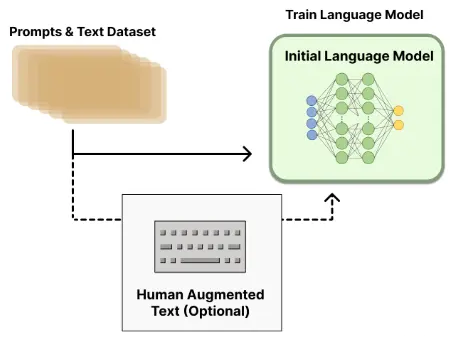
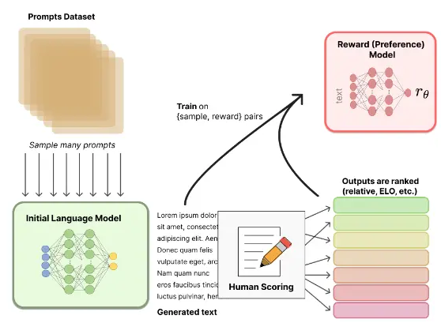
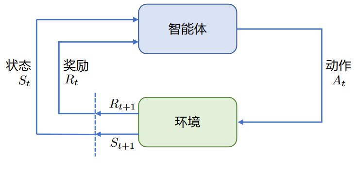

## 基于人类反馈强化学习（Reinforcement Learning Human Feedback）
RLHF就是基于人类反馈（Human Feedback）对语言模型进行强化学习（Reinforcement Learning），一般分为以下三个步骤：

1.  **预训练语言模型**（收集样本数据，有监督微调）：在人类标注的数据上微调出来的模型叫做 有监督的微调（supervised fine-tuning），这是训练出来的第一个模型

1.  **训练奖励模型**（收集排序数据，训练奖励模型）：
    -   给定一个问题，让上一步训练好的**预训练模型 SFT 生成答案**
    -   GPT 每一次预测一个词的概率，可以根据这个概率采样出很多答案，通常来说可以用 beam search
    -   这里生成了四个答案，然后把这四个答案的好坏进行人工标注，进行排序标注
    -   有了这些排序之后，再**训练一个奖励模型（Reward Model，RM）**，这个模型是说给定 prompt 得到输出，然后对这个输出生成一个分数，可以认为这个分数是一个奖励或者是打分，使得对答案的分数能够满足人工排序的关系（大小关系保持一致），一旦这个模型生成好之后，就能够对生成的答案进行打分

1.  **用强化学习微调**（使用RM模型优化SFT模型）：继续微调之前训练好的 SFT模型，使得它生成的答案能够尽量得到一个比较高的分数，即每一次将它生成的答案放进 RM 中打分，然后优化 SFT 的参数使得它生成的答案在 RM 中获得更高的分数。

备注：两次对模型的微调：GPT3模型 → SFT模型 → RL模型，其实这里始终都是同一个模型，只是不同过程中名称不同。

-   **需要SFT模型的原因**： GPT3模型不一定能够保证根据人的指示、有帮助的、安全的生成答案需要人工标注数据进行微调。
-   **需要RM模型的原因**：标注排序的判别式标注成本远远低于生成答案的生成式标注。
-   **需要RL模型的原因**：在对SFT模型进行微调时生成的答案分布也会发生变化，会导致RM模型的评分会有偏差，需要用到强化学习.

#### 强化学习的必要性

强化学习（Reinforcement Learning，RL）研究的问题是**智能体（Agent）**与**环境（Environment）** 交互的问题，其目标是使智能体在复杂且不确定的环境中最大化奖励（Reward）。

强化学习基本框 架如图所示，主要由两部分组成：智能体和环境。在强化学习过程中，智能体与环境不断交互。 智能体在环境中获取某个状态后，会根据该状态输出一个动作（Action），也称为决策（Decision）。 动作会在环境中执行，环境会根据智能体采取的动作，给出下一个状态以及当前动作所带来的奖 励。智能体的目标就是尽可能多地从环境中获取奖励。本节中将介绍强化学习的基本概念、强化 学习与有监督学习的区别，以及在大语言模型中基于人类反馈的强化学习流程。

强化学习在大语言模型上的重要作用可以概括为以下几个方面：

1.  **强化学习比有监督学习更可以考虑整体影响**：有监督学习针对单个词元进行反馈，其目 标是要求模型针对给定的输入给出的确切答案。而强化学习是针对整个输出文本进行反馈，并不 针对特定的词元。
2.  **强化学习更容易解决幻觉问题**：有监督学习算法非常容易使得求 知型查询产生幻觉。在模型并不包含或者知道答案的情况下，有监督训练仍然会促使模型给出答 案。而使用强化学习方法，则可以通过定制奖励函数，将正确答案赋予非常高的分数，放弃回答 的答案赋予中低分数，不正确的答案赋予非常高的负分，使得模型学会依赖内部知识选择放弃回 答，从而在一定程度上缓解模型幻觉问题。
3.  **强化学习可以更好的解决多轮对话奖励累积问题**：使用强化学习方法，可以通过构建奖励函数，将当前输出考虑整个对话的 背景和连贯性

### 基于人类反馈的强化学习流程

基于人类反馈的强化学习主要分为奖励模型训练和近端策略优化两个步骤。

-   **奖励模型**通过由 人类反馈标注的偏好数据来学习人类的偏好，判断模型回复的有用性以及保证内容的无害性。
-   **近端策略优化**可以根据奖励模型获得的反馈 优化模型，通过不断的迭代，让模型探索和发现更符合人类偏好的回复策略。

近端策略优化涉及到四个模型：

1.  **策略模型（Policy Model）**，生成模型回复。
2.  **奖励模型（Reward Model）**，输出奖励分数来评估回复质量的好坏。
3.  **评论模型（Critic Model）**，来预 测回复的好坏，可以在训练过程中实时调整模型，选择对未来累积收益最大的行为。
4.  **参考模型（Reference Model）** 提供了一个 SFT 模型的备份，帮助模型不会出现过于极端的变化。

近端策 略优化的实施流程如下：

1.  **环境采样**：策略模型基于给定输入生成一系列的回复，奖励模型则对这些回复进行打分获得奖励。
2.  **优势估计**：利用评论模型预测生成回复的未来累积奖励，并借助广义优势估计（Generalized Advantage Estimation，GAE）算法来估计优势函数，能够有助于更准确地评估每次行动的 好处。
3.  **优化调整**：使用优势函数来优化和调整策略模型，同时利用参考模型确保更新的策略不会有 太大的变化，从而维持模型的稳定性。

### RLHF 在实践过程中存在哪些不足？

RLHF（Reinforcement Learning from Human Feedback）是一种通过人类反馈进行增强学习的方法，尽管具有一定的优势，但在实践过程中仍然存在以下几个不足之处：

1.  **人类反馈的代价高昂**：获取高质量的人类反馈通常需要大量的人力和时间成本。人类专家需要花费时间来评估模型的行为并提供准确的反馈，这可能限制了RLHF方法的可扩展性和应用范围。
2.  **人类反馈的主观性**：人类反馈往往是主观的，不同的专家可能会有不同的意见和判断。这可能导致模型在不同专家之间的反馈上存在差异，从而影响模型的训练和性能。
3.  **反馈延迟和稀疏性**：获取人类反馈可能存在延迟和稀疏性的问题。人类专家不可能实时监控和评估模型的每一个动作，因此模型可能需要等待一段时间才能收到反馈，这可能会导致训练的效率和效果下降。
4.  **错误反馈的影响**：人类反馈可能存在错误或误导性的情况，这可能会对模型的训练产生负面影响。如果模型在错误的反馈指导下进行训练，可能会导致模型产生错误的行为策略。
5.  **缺乏探索与利用的平衡**：在RLHF中，人类反馈通常用于指导模型的行为，但可能会导致模型过于依赖人类反馈而缺乏探索的能力。这可能限制了模型发现新策略和优化性能的能力。

针对这些不足，研究人员正在探索改进RLHF方法，如设计更高效的人类反馈收集机制、开发更准确的反馈评估方法、结合自适应探索策略等，以提高RLHF方法的实用性和性能。

### 如何解决 人工产生的偏好数据集成本较高，很难量产问题？

解决人工产生偏好数据集成本高、难以量产的问题，可以考虑以下几种方法：

1.  **引入模拟数据**：使用模拟数据来代替或辅助人工产生的数据。模拟数据可以通过模拟环境或模型生成，以模拟人类用户的行为和反馈。这样可以降低数据收集的成本和难度，并且可以大规模生成数据。
2.  **主动学习**：采用主动学习的方法来优化数据收集过程。主动学习是一种主动选择样本的方法，通过选择那些对模型训练最有帮助的样本进行标注，从而减少标注的工作量。可以使用一些算法，如不确定性采样、多样性采样等，来选择最有价值的样本进行人工标注。
3.  **在线学习**：采用在线学习的方法进行模型训练。在线学习是一种增量学习的方法，可以在模型运行的同时进行训练和优化。这样可以利用实际用户的交互数据来不断改进模型，减少对人工标注数据的依赖。
4.  **众包和协作**：利用众包平台或协作机制来收集人工产生的偏好数据。通过将任务分发给多个人参与，可以降低每个人的负担，并且可以通过众包平台的规模效应来提高数据收集的效率。
5.  **数据增强和迁移学习**：通过数据增强技术，如数据合成、数据扩增等，来扩充有限的人工产生数据集。此外，可以利用迁移学习的方法，将从其他相关任务或领域收集的数据应用于当前任务，以减少对人工产生数据的需求。

综合运用上述方法，可以有效降低人工产生偏好数据的成本，提高数据的量产能力，并且保证数据的质量和多样性。

### 如何解决三个阶段的训练（SFT->RM->PPO）过程较长，更新迭代较慢问题？

要解决三个阶段训练过程较长、更新迭代较慢的问题，可以考虑以下几种方法：

1.  **并行化训练**：利用多个计算资源进行并行化训练，可以加速整个训练过程。可以通过使用多个CPU核心或GPU来并行处理不同的训练任务，从而提高训练的效率和速度。
2.  **分布式训练**：将训练任务分发到多台机器或多个节点上进行分布式训练。通过将模型和数据分布在多个节点上，并进行并行计算和通信，可以加快训练的速度和更新的迭代。
3.  **优化算法改进**：针对每个阶段的训练过程，可以考虑改进优化算法来加速更新迭代。例如，在SFT（Supervised Fine-Tuning）阶段，可以使用更高效的优化算法，如自适应学习率方法（Adaptive Learning Rate）或者剪枝技术来减少模型参数；在RM（Reward Modeling）阶段，可以使用更快速的模型训练算法，如快速梯度法（Fast Gradient Method）等；在PPO（Proximal Policy Optimization）阶段，可以考虑使用更高效的采样和优化方法，如并行采样、多步采样等。
4.  **迁移学习和预训练**：利用迁移学习和预训练技术，可以利用已有的模型或数据进行初始化或预训练，从而加速训练过程。通过将已有模型的参数或特征迁移到目标模型中，可以减少目标模型的训练时间和样本需求。
5.  **参数调优和超参数搜索**：对于每个阶段的训练过程，可以进行参数调优和超参数搜索，以找到更好的参数设置和配置。通过系统地尝试不同的参数组合和算法设定，可以找到更快速和高效的训练方式。

综合运用上述方法，可以加速三个阶段训练过程，提高更新迭代的速度和效率，从而减少训练时间和资源消耗。

### 如何解决 PPO 的训练过程同时存在4个模型（2训练，2推理），对计算资源的要求较高 问题？

可以采用 **RRHF**(**R**ank **R**esponse from **H**uman **F**eedback)的训练模式，RRHF 不需要强化学习，可以利用不同语言模型生成的回复，包括 ChatGPT、GPT-4 或当前的训练模型。RRHF通过对回复进行评分，并通过排名损失来使回复与人类偏好对齐。RRHF 通过通过排名损失使评分与人类的偏好（或者代理的奖励模型）对齐。RRHF 训练好的模型可以同时作为生成语言模型和奖励模型使用。

RRHF算法可以有效地将语言模型输出概率与人类偏好对齐，其训练思路非常简单，训练完成的模型有几个特点：

-   仅需要1到2个模型，而PPO需要4个模型，因此RRHF算法更加简单高效。
-   监督微调（SFT）可以被看作是RRHF算法的一种特殊形式。
-   RRHF 算法可以同时被用作语言模型和奖励模型。
-   RRHF 算法可以在较低的训练难度下拟合奖励模型的偏好，达到PPO算法的效果，并且避免了PPO算法中的复杂性和不稳定性问题。

