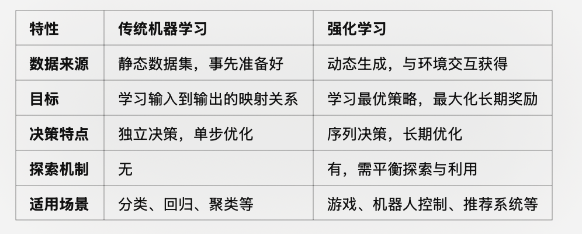

## 强化学些常见概念澄清

强化学习中的**智能体（Agent）和环境（Environment）**有特定的定义，它们共同构成了强化学习的基本框架（通常称为马尔可夫决策过程，MDP）.
强化学习本质上是解决序列决策和长期规划问题，而传统机器学习更适合解决静态映射与模式识别问题。

强化学习与深度学习的区别在于它们的目标和应用场景不同，尽管可以结合使用（如深度强化学习，DRL）：
1.	深度学习：是一种监督学习或无监督学习方法，使用固定的数据集（如图像、文本）来训练模型，目标是通过优化损失函数来预测或生成结果。
	•	示例算法：CNN（卷积神经网络，用于图像）、RNN（循环神经网络，用于序列）、Transformer（用于语言和多模态任务）。
2.	强化学习：没有固定的数据集，而是通过智能体与环境的交互来学习。它更关注决策过程和长期规划。
	•	示例算法：Q-Learning、Policy Gradient、DQN（深度Q网络）、PPO（近端策略优化）。

Q-Learning、Policy Gradient、DQN、PPO等都是强化学习的具体算法实现，基于**马尔可夫决策过程（Markov Decision Process, MDP）**框架。
MDP提供了一个理论基础：用状态（State）、动作（Action）、状态转移概率（Transition Probability）、奖励函数（Reward Function）等元素描述智能体与环境的交互。

两者可以结合，比如深度强化学习（DRL），利用神经网络处理复杂的状态和动作空间，进一步扩展了强化学习的能力。
强化学习的智能体通常需要神经网络（如CNN、Transformer）来表示复杂的策略或价值函数（Value Function），从而与深度学习方法结合，形成深度强化学习技术。

传统机器学习
	•	目标：从数据中学习映射关系（输入到输出）。
	•	监督学习：基于标注数据，最小化误差（如分类问题预测正确标签，回归问题预测连续值）。
	•	无监督学习：发现数据结构（如聚类）。
	•	任务特点：
        •	输入和输出之间有明确的关系。
        •	数据是静态的，通常在训练之前完全给定。
        •	每次预测是独立的，不涉及长期的决策或反馈。
	•	数据来源：通常依赖静态、事先准备好的数据集。
	    •	例如分类问题需要标注的标签，回归问题需要输入-输出对。
	•	数据处理：独立同分布假设（IID），即每个样本是相互独立且分布相同的。
    •	目标函数：
        •	回归：最小化均方误差（MSE）或其他损失函数。
        •	分类：最大化分类准确率，最小化交叉熵损失等。
        •	优化方式：优化全局的静态目标（如拟合数据分布）。
    •	每次预测是独立的，没有长期决策的影响。
	    •	例如，分类模型预测一张图像的类别与其他图像无关；回归模型预测房价与其他样本无关。
	•	没有探索机制：训练过程基于现有数据，模型通过拟合数据学习映射关系。

强化学习
	•	目标：通过与环境交互，找到一种策略使累计奖励最大化。
	•	强化学习中的目标不仅是找到某一时刻的最优解，还需要考虑未来的长期收益。
	•	任务特点：
        •	数据是动态的，通过智能体与环境的交互实时生成。
        •	每个动作不仅影响即时奖励，还影响未来状态和奖励（长期决策问题）。
        •	强调探索与利用之间的权衡。
    •	数据来源：智能体通过与环境交互生成数据。
	    •	例如，玩游戏时智能体的每一次动作都会更新状态，生成新的样本。
	•	数据处理：数据高度相关，下一步的状态取决于当前的动作（非IID）。这对算法的稳定性和训练效率提出了更高要求。
    •	目标函数：最大化累计奖励（通常是长期的期望值）。
	    •	例如  G_t = r_t + \gamma r_{t+1} + \gamma^2 r_{t+2} + \dots 。
	•	优化方式：动态优化，当前动作不仅影响当前奖励，还会影响未来的状态和奖励。
	•	强调策略优化（Policy Optimization）或值函数优化（Value Optimization）。
    •	强调序列决策，每个动作不仅影响当前奖励，还会影响未来状态和决策空间。
	    •	例如，机器人移动一个步伐后会改变环境状态，从而影响下一步的决策。
    •	有探索机制：智能体必须在探索（尝试新动作）和利用（根据已有知识选择最优动作）之间平衡，才能学到最优策略。
	•	常用策略：ε-greedy、软max、UCB等。

##### 示例对比

以下通过一个具体任务展示两者的区别：

房价预测（传统机器学习）
	•	输入：房屋面积、地理位置等特征。
	•	输出：房价。
	•	学习目标：通过历史数据学习面积和房价的关系，最小化预测误差。
	•	数据：事先标注好的样本集，无需动态生成。

机器人走迷宫（强化学习）
	•	状态：机器人在迷宫中的位置。
	•	动作：移动方向（上、下、左、右）。
	•	学习目标：找到一条路径使累计奖励最大化（例如尽快到达终点）。
	•	数据：通过交互生成（机器人探索路径时的状态、动作、奖励）。

#### 常见算法分析对比

1. Q-Learning

Q-Learning值函数（Value-based）方法。学习一个动作值函数  Q(s, a) ，表示在状态  s  下采取动作  a  后的长期累计奖励的期望值。
它易于实现，适用于小规模、离散状态空间的问题。难以扩展到大规模或连续状态空间，因为需要存储整个  Q(s, a)  表。

2. Policy Gradient

Policy Gradient是策略（Policy-based）方法。直接优化智能体的策略  \pi(a|s;\theta) ，而非通过值函数间接推导策略。目标函数是最大化策略的期望累计奖励。
它是可直接优化参数化策略，适合连续动作空间问题。但是高方差，收敛速度慢。通常需要结合**基线（baseline）**技术降低方差（如 Actor-Critic 方法）。

3.  DQN（深度 Q 网络）

DQN（深度 Q 网络）也是值函数（Value-based）方法。结合 Q-Learning 和深度学习，通过神经网络近似  Q(s, a) 。解决了传统 Q-Learning 无法处理大规模状态空间的问题。
•	改进策略：
	1.	经验回放（Experience Replay）：存储交互数据到缓冲区，随机采样训练，降低数据相关性。
	2.	目标网络（Target Network）：引入一个固定的目标网络来计算  \max_{a{\prime}} Q(s{\prime}, a{\prime}; \theta^{-}) ，定期更新目标网络，减少训练的不稳定性。
能处理高维状态空间（如图像）。但是对超参数敏感，探索时可能不稳定。

4. PPO（近端策略优化，Proximal Policy Optimization）
它是策略（Policy-based）方法。改进 Policy Gradient，避免策略更新步幅过大导致不稳定。PPO通过限制更新幅度实现更高效稳定的训练。
    •	更高效，训练更稳定。
	•	较为简单易实现，适合实际应用。
虽然比策略梯度法稳定，但仍可能对环境复杂性较敏感。

值函数优化的目的是通过估算每个状态或状态-动作对的“价值”，来帮助智能体判断如何选择动作。
状态值函数  V(s) ：表示从某状态  s  开始，智能体在未来能够获得的预期累计奖励
动作值函数  Q(s, a) ：表示在某状态  s  下执行动作  a  后，未来能够获得的预期累计奖励

#### 主要分类： 值函数优化和策略优化

值函数优化的目标：
	1.	准确估计值函数： 通过算法（如动态规划、蒙特卡洛方法或 TD 学习）更新  V(s)  或  Q(s, a) 。
	2.	指导决策： 根据值函数选择最优动作。例如，基于  Q(s, a)  的贪婪策略：a^* = \text{argmax}_{a} Q(s, a)
值函数的优化就是通过累计未来奖励来估计每个状态或动作的“价值”。但值函数是预测的值，并不直接等同于奖励函数，而是从奖励函数中学习得到的。
值函数优化的核心是通过学习一个函数 V(s) 或 Q(s, a)，准确评估状态或状态-动作对的长期价值。这种优化通常通过动态规划、蒙特卡洛方法、时序差分或深度学习来实现，最终指导智能体以最优方式选择动作，实现任务目标。

策略优化的目的是直接优化智能体的策略  \pi(a|s) ，即在给定状态下选择动作的概率分布，而无需显式计算值函数。
策略优化的核心：
	•	策略函数  \pi(a|s;\theta) ：表示在状态  s  下采取动作  a  的概率，参数  \theta  定义策略。
	•	如果是离散动作空间，策略可以表示为一个概率分布。
	•	如果是连续动作空间，策略可能是一个参数化的概率分布（如正态分布）。
	•	策略目标函数：优化的目标是最大化某种预期收益  J(\theta) ，例如：J(\theta) = \mathbb{E} \left[ G_t \mid \pi_\theta \right]

或者直接优化累计奖励  \sum_t r_t 。
优化智能体选择动作的概率，具体指通过优化策略函数，使得智能体在不同状态下选择“好”动作的概率逐渐增加，进而提升智能体完成任务的能力。这种优化通常通过策略梯度方法实现，直接作用于策略函数的参数。最终的目标是让智能体在未知环境中高效决策，最大化累计奖励。

