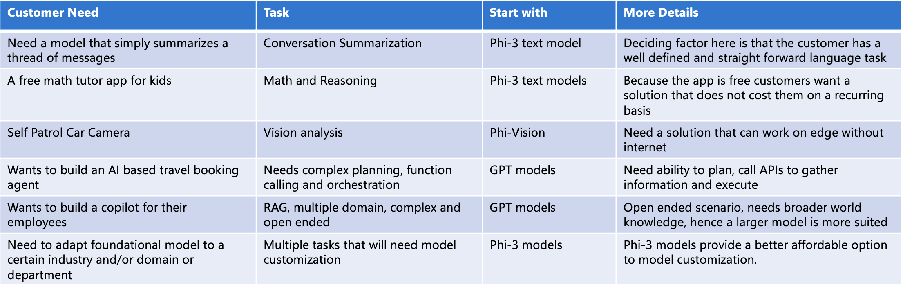

选择模型的主要考量点：

1. AI Quality
从一些benchmark数据中得到一些初步的判断：
衡量模型推理能力（常识推理和逻辑推理）的标准开源基准上以 Phi-3-Mini-128K-Instruct 的完成格式报告结果。我们与 Mistral-7b-v0.1、Mixtral-8x7b、Gemma 7B、Llama-3-8B-Struct 和 GPT-3.5 进行了比较。k-shot 示例的数量按基准测试结果，以及一些公共数据集的结果：
 

还有多语言的支持和长文本的理解等。还有一些特定任务，比如RepoQA: a benchmark for long context code understanding。

1. Customizability
2. Features
3. Price (Cost/Latency)

从具体使用场景划分的话，大致可以分成如下：

