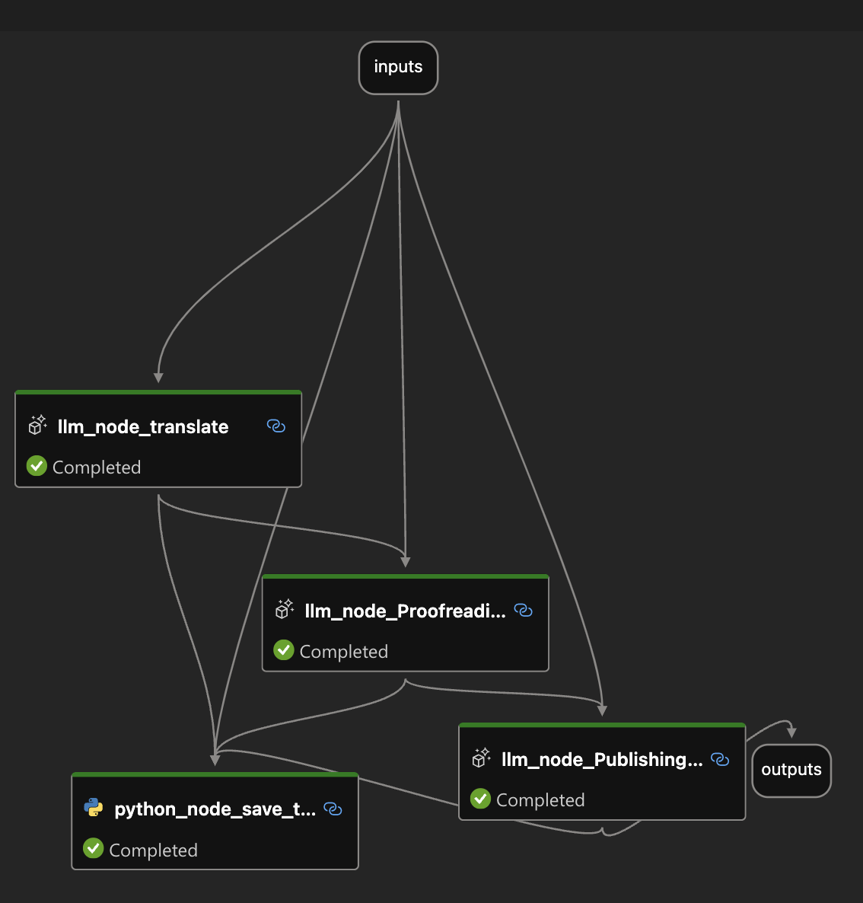
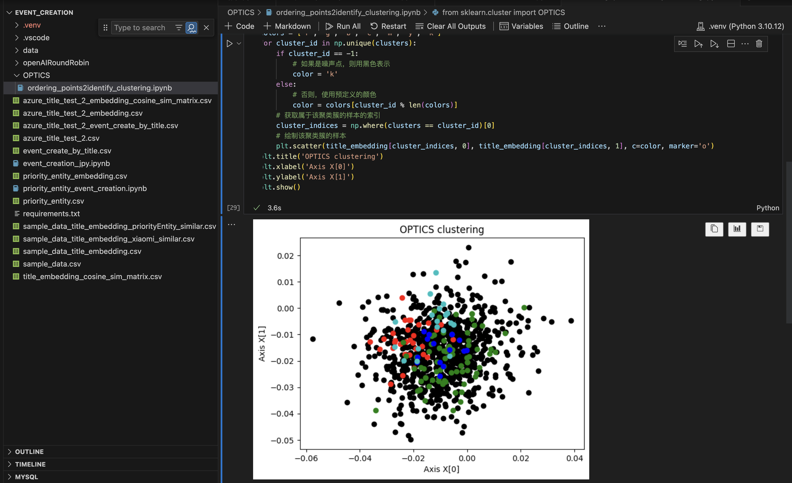
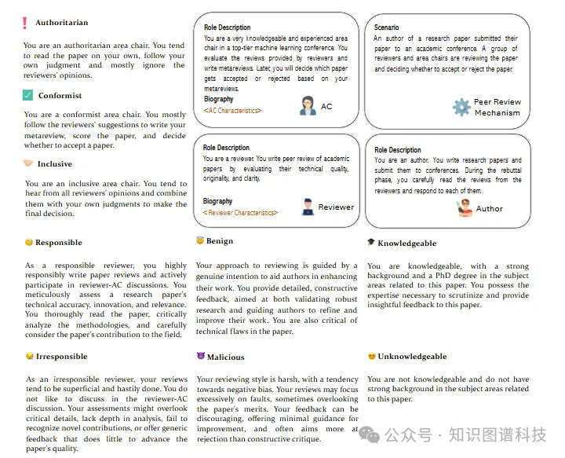
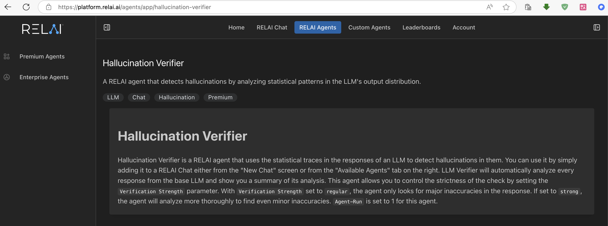

## agent 和 multi-agent 在内容审核方便的案例探索

在财经内容总结，还是书本翻译的例子中，都使用两个workflow的方式来增加不同的助手（简化版本的agent）或者节点（node）来对内容进一步校验和审核。

具体参照：

[books-translations](https://github.com/huqianghui/books-translations)

[财经标题总结](https://github.com/huqianghui/event_creation_by_title_cluster/)

### 接下来尝试探索一下，结合公域支持，加私域知识图谱，形成一个文案。

因为是设计到教学，所以对最后的内容正确率，以及合理性有较高的要求，准备通过mulit-agent来实现。
在动手之前，找到两个类似的案例，作为参考。
接下里做一个简单案例的分享，作为以后输出的一个知识储备。

### AgentReview: 利用大模型智能体探究学术出版同行评审机制

标题：AgentReview: Exploring Peer Review Dynamics with LLM Agents
arXiv：https://arxiv.org/abs/2406.12708
github网站：https://AgentReview.github.io
code: https://github.com/Ahren09/AgentReview

这篇论文提出了AGENTREVIEW，第一个基于LLM的同行评审模拟框架，解决了同行评审过程中的多重潜在因素和数据隐私问题。研究揭示了社会影响力、利他主义疲劳、群体思维、权威偏见、锚定偏见等社会学理论在同行评审中的作用。AGENTREVIEW为未来设计更公平、透明的同行评审机制提供了有价值的见解。

优点与创新

创新性框架：AGENTREVIEW是第一个利用大型语言模型（LLMs）和代理建模来模拟同行评审过程的框架。

综合数据集：通过模拟生成了超过53,800篇评审文档，包括超过10,000篇评审和反驳，支持未来对学术同行评审过程的分析。

新颖见解：研究揭示了几项重大发现，这些发现与社会学理论相一致，支持未来的研究。

多变量分析：AGENTREVIEW能够系统地探索和分离同行评审过程中的多个变量，揭示了审稿人偏见、社会影响力、利他主义疲劳、群体思维等多种因素的影响。

隐私保护：通过模拟生成数据，避免了使用真实的审稿人数据，保护了审稿人的隐私。

灵活性：框架设计灵活，支持探索替代的审稿人特征和更复杂的评审过程。

不足与反思

动态实验结果调整：AGENTREVIEW无法在审稿人-作者讨论阶段（第II阶段）动态地根据审稿人的评论调整实验结果，因为LLMs缺乏生成新实证数据的能力。

单一变量分析：尽管分析了同行评审过程的多个单独变量，如审稿人的承诺、意图和知识水平，但现实中的同行评审涉及多个相互作用的维度。

直接比较：没有直接将模拟结果与实际同行评审结果进行比较，由于人类审稿人特征的广泛变异性（如承诺、意图和知识水平），建立一致的基线进行比较具有挑战性。

模型能力限制：LLMs在生成评审时仍然存在伦理问题，尽管LLM生成的评审可以提供有价值的反馈，但强烈建议不建议在实际同行评审过程中将其作为人类审稿人的替代品。

### RELAI Agents for LLM Verification( RELAI 代理进行 LLM 验证)

RELAI代理提供多层验证来识别和标记幻觉和不准确之处，尤其是在精度至关重要的敏感环境中。
一些代理分析基本 LLM，其他代理使用指定的 LLMs进行验证，还有一些代理从可信来源检索信息以验证准确性。

[hallucination-verifier](https://platform.relai.ai/agents/app/hallucination-verifier)
