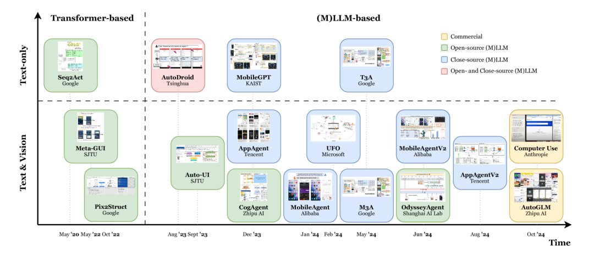

大型语言模型（LLMs）和多模态大型语言模型（MLLMs），使得Agent能够执行复杂任务。这些智能体利用（M）LLMs处理和解释GUI的能力，通过模拟人类交互（如点击和键入）自主执行用户指令。

GUI Agent领域中基础模型增长趋势的示意图:

## 基于（M）LLM的GUI Agent 框架

Agent的目标是自动控制设备以完成任务。它们通常接收用户查询和设备UI状态作为输入，并提供一系列类似人类的操作来完成任务。GUI Agent的构建包括五个部分：GUI感知器、任务规划器、决策者、记忆检索器和执行器。

GUI代理的构建包括五个主要部分：

- GUI感知器：准确解释用户输入和检测设备UI的变化。
- 任务规划器：将复杂任务分解为更小的步骤，并采用链式思维（CoT）方法。
- 决策者：基于当前环境和任务需求，提供控制设备的下一步操作。
- 记忆检索器：提供内部和外部记忆，帮助代理更有效地执行任务。
- 执行器：将代理的输出映射到相关环境中，实际控制设备。

## 基于（M）LLM的GUI Agent分类法

通过不同维度对现有工作进行分类，包括输入模态和学习模式的差异。通过这两个维度，包括了当前的主要工作，并帮助新研究者全面了解GUI代理。
不同输入模态的GUI代理：

基于LLM的GUI代理：
- 由于多模态能力有限，早期的GUI代理通常需要一个GUI感知器将图形用户界面转换为基于文本的输入。例如，一些研究将屏幕转换为一系列对象描述，并应用基于变换器的方法进行动作映射。
- 基于MLLM的GUI代理：近期研究利用高级（M）LLMs的多模态能力来提高GUI理解和任务执行能力。一些工作专注于GUI理解，例如使用基于ViT的图像编码器-文本解码器架构，或者将UI屏幕封装成连贯的语言表示。
  
不同学习模式的GUI代理：
- 基于提示的GUI代理：提示是一种有效的方法，可以以最小的额外计算开销构建代理。鉴于GUI和任务的多样性，许多研究使用提示来创建GUI代理，采用链式思维（CoT）或反应式（ReAct）风格。例如，一些研究通过设计的动作定位技术将截图作为输入，生成动作描述并将其转换为可执行动作。
- 基于SFT（Supervised Fine-Tuning，监督微调）的GUI代理：微调允许LLM适应特定领域并更有效地执行定制任务。一些工作使用SFT让GUI代理使用新模态输入、学习特定流程或执行特殊任务。

## 基于（M）LLM的GUI Agent工业应用

介绍了基于（M）LLM的GUI代理的最新工业应用，这些应用具有重大的商业潜力。包括Google Assistant for Android、Apple Intelligence、New Bing、Microsoft Copilot、Anthropic Claude 3.5和AutoGLM等。

Google Assistant for Android：
- 用户可以通过语音命令，如“Hey Google, start a run on Example App”，使用Google Assistant来启动应用、执行任务和访问内容。
- App Actions通过内置意图（BIIs）增强了应用功能，允许用户通过语音查询来导航应用和访问特性。

Apple Intelligence：
- 苹果在其设备上使用设备端和云端模型，拥有通用的基础模型和专门针对特定任务（如摘要和语调调整）的适配器模型。
- 评估表明，设备端模型的性能超过了或匹配了Mistral AI、Microsoft和Google的小型模型，而服务器模型超过了OpenAI的GPT-3并匹配了GPT-4。
  
New Bing：
- 微软的搜索引擎旨在提供更直观、高效和全面的搜索体验。
- 利用尖端的人工智能和机器学习技术，New Bing超越了传统的关键词搜索，以理解用户查询背后的上下文和意图。

Microsoft Copilot：
- 微软365应用中的一个AI工具，用于提高生产力，提供基于GPT的建议、任务自动化和内容生成。
- 它通过实时洞察增强工作流程、创造力和决策制定。

Anthropic Claude 3.5：
- Claude 3.5的最新版本引入了一个突破性的能力：计算机使用，允许Claude像人类一样与计算机交互——查看屏幕、移动光标、点击按钮和键入文本。

AutoGLM：
- 来自ChatGLM家族的一系列新工具，旨在通过手机和网络平台上的图形用户界面自主完成任务。
- 它的Android功能允许它自主理解用户指令，无需手动输入，使其能够处理诸如订购外卖、编辑评论、购物和总结文章等复杂任务。

MagicOS 9.0 YOYO：
- 一个高级助手，具有四个主要功能：自然语言和视觉处理、用户行为和上下文学习、意图识别和决策制定以及应用的无缝集成。
- 它理解用户习惯，以自主完成请求，例如通过语音命令订购咖啡，通过导航应用和服务。

[GUI_Agent_论文](https://arxiv.org/pdf/2411.04890)