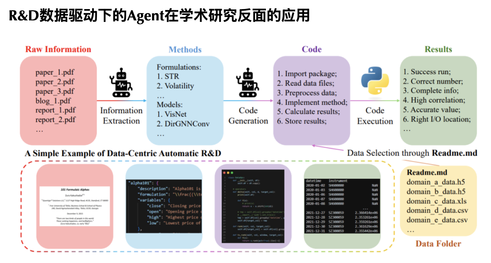

研发（R&D）对于提高工业生产力至关重要，尤其是在人工智能时代，研发的核心方面主要集中在数据和模型上。

RDAgent的目的在于：打造一个工业研发过程的自动化助手，专注于数据驱动场景，通过提出新想法和实施它们来简化模型和数据的开发。

RDAgent由两个关键部分组成：
（R）esearch代表通过提出新想法积极探索，
（D）evelopment代表实现这些想法。

这两个组成部分的有效性最终会通过实践得到反馈，无论是研发能力，都可以在这个过程中不断学习和成长.

下图RDAgent探究学术研究方向的一个案例：

Agent助手通过阅读论文和报告(Raw Information)，提取可以试试的方案（Methods），将方案通过代码的形式实施（code）,最后得到结果（result）.然后，通过阅读生成的Readme.md报告，对从原始数据进行筛选过滤，进行第二轮的迭代。直到生成满意的研究结论为止。

https://arxiv.org/pdf/2404.11276

https://arxiv.org/pdf/2407.18690

https://github.com/microsoft/RD-Agent

https://rdagent.readthedocs.io/en/latest/introduction.html