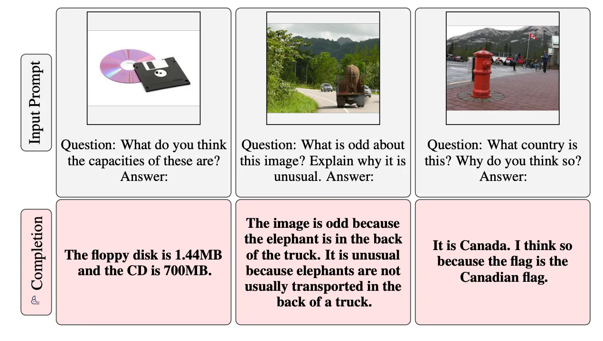

## Flamingo

Flamingo 是一种视觉语言模型，是最早的多模态生成模型之一。
它是一种多模态语言模型（实际上是一系列不同大小的模型，Flamingo 是其中最大的一个），Flamingo 尤其能够摄取包含与文本交错的图像和/或视频的多模式提示。
理解这个模型是理解此后发布的多模态模型的基础，例如Gemini 。与 Gemini 没有透露太多细节相比，Flamingo 提供了所使用的架构和组件的良好图片。还可以猜测，它的后继者使用与 Flamingo 类似的架构，但扩展到更多模式。该模型能够使用文本和图像进行推理，给出一些示例（称为少样本学习）。图像和文本完全交错，保持输入中的逻辑顺序，如下所示。

最后一个示例展示了如何将 Flamingo 与视频一起使用。视频可以分为帧（以 1 FPS 采样）并作为序列传递到模型中。
Flamingo 还能够开箱即用地进行多图像视觉对话。

人们还可以使用 Flamingo 从图像中进行视觉问答。

Flamingo 模型不是开源的，模型权重也没有提供。在Huggingface发布了 Flamingo 的开源版本，名为IDEFICS （具有交错交叉注意力的 Flamingo 增强型图像感知解码器）。可以在CPU上运行它，但推断一个提示需要将近半个小时！

Flamingo 是使用大量文本和视觉数据以半监督方式进行预训练的（类似于其他预训练语言模型），并且没有在任何特定的机器学习数据集上进行微调。为了评估模型泛化到未见过的示例的能力，对各种数据集（例如COCO）进行了评估。 Flamingo 的性能可以与最先进的零/少镜头模型以及在这些特定数据集上最先进的微调模型进行比较。

### Flamingo架构

Flamingo 模型有几个组件。有些是预先训练并保持冻结的（意味着模型权重在训练期间不会更新），而另一些是从头开始训练的。
该模型采用交错的视觉/文本数据作为输入。从文本中提取图像并替换为通用标记，例如 <image>。然后可以将其传递到普通语言模型组件中。这些图像分别通过视觉编码器模型传入，将其转换为固定大小的嵌入。然后可以将它们作为新颖的交叉注意机制的一部分进行“关注”。

Flamingo 模型利用两个互补的预训练和冻结模型：一个可以“感知”视觉场景的视觉模型和一个执行基本形式推理的大型 LM。在这些模型之间添加了新颖的架构组件，以保留它们在计算密集型预训练期间积累的知识的方式将它们连接起来。

#### 训练

Flamingo 仅接受来自网络的精心挑选的互补大规模多模态数据混合物的训练，而不使用任何用于机器学习目的注释的数据。经过这次训练后，Flamingo 模型可以通过简单的几次学习直接适应视觉任务，而无需任何特定于任务的调整。
使用四个不同的数据集来训练包含文本和图像/视频对的模型。有些是预先存在的，有些是作为本研究的一部分收集和组装的。对于每个数据集，负对数似然被最小化。总体损失是每个数据集的负对数可能性的加权和。

##### Transformer 注意力机制

了解各个组件的细节之前，让我们快速回顾一下我们需要的 Transformer Attention 机制。
Q、K、V 分别表示查询矩阵、键矩阵和值矩阵。对于每个输入令牌，我们“查询”（或关注）充当“键”的所有其他令牌。通过使用softmax，我们选择最重要（关系）的标记来对当前标记进行编码，然后根据该重要性检索其对应值的加权和。在编码器中，自注意力Q、K 和 V 都是通过输入标记的线性投影获得的 - 大小为(seq_length, embedding_dim ) 的矩阵乘以大小为(embedding_dim, head_dim)的学习权重矩阵。这会产生大小为(seq_length, head_dim)的 Q、K、V 矩阵。然后，乘积 QK^T 的大小为(seq_length, seq_length) ，最终乘积的大小为(seq_length, head_dim) 。transformer使用八个不同的矩阵来实现这一点，即所谓的多头注意力，每个矩阵的 head_dim 为 64。

这种机制有一个重要的计算缺陷。可以看到，所有矩阵都随着输入序列长度的大小而增加，事实上，注意力机制在seq_length中具有二次复杂度。

##### 解码器
在 Transformer 解码器中，还有一个额外的交叉注意力机制（尽管当时没有这么称呼），其中生成的每个输出令牌都会关注输入序列中的所有令牌。在这里，查询来自输出标记，而键和值来自输入标记。因此，对于长度为N的输入序列和长度为M 的输出序列， Q 将具有形状(M, head_dim)而 K 和 V 矩阵将具有形状(N, head_dim) 。它在输入序列长度上线性扩展，在输出序列长度上线性扩展，与自注意力机制中的O(N²)相比，复杂度为O(NM) 。自注意力的O(N²)复杂度被证明是较长序列长度的瓶颈（原始 Transformer 的最大序列长度为 512 个标记），自那时（2017 年）以来，已经有大量关于替代机制的研究仍然保持相同水平的准确性，但可以扩展到更长的序列长度。例如，最近的Mistal 7B LLM使用滑动窗口注意机制，该机制仅关注当前令牌的固定窗口大小中的令牌，但使用变压器堆叠来关注稍后网络中或大世界中更远的令牌模型可以通过环关注处理 1 小时的视频，将长序列分布到多个设备上。当尝试使用视觉数据的转换器时，序列长度的二次复杂性甚至更加明显 - 描述图像需要比一段文本的标记更多的像素。例如，原始视觉转换器仅将图像分割成块，而不是使用单独的像素。这些方法的缺点之一是它们对输入数据做出假设，从而导致归纳偏差。

2021 年，提出了一种替代通用架构，可以处理各种模式并可扩展至数十万个输入，称为感知器(Perceiver)。

在感知器中，K、V 是输入序列（他们称为字节数组）（例如图像）的投影。它的长度M非常大（例如 224 x 224 ImageNet 图像为 50K），输入到转换器中的计算成本非常高。因此，他们使用所谓的大小为N 的固定大小潜在数组，其中N << M ，例如 512。查询矩阵 Q 是该潜在数组的投影。他们使用交叉注意力组件，使用这个潜在数组来关注字节数组中的标记。这与字节数组的大小线性缩放，类似于原始的转换器解码器。该组件的复杂度为O(NM) 。现在可以将正常的 Transformer 流程​​应用于潜在数组，包括复杂性为O(N²) 的潜在数组的自注意力。这导致整体复杂度为O(NM) + O(N²)且N << M 。重要的是，由于 N 很小，这使得他们可以堆叠许多 Transformer 层，在大规模数据上构建非常大的网络，如果复杂度为O(M²) ，这是不可行的。这种潜在空间的使用是其他模型（例如稳定扩散）中使用的常见计算技巧。

#### 视觉组件架构

Flamingo 从文本中提取交错图像，并使用两个不同的组件分别对它们进行编码，如下所示：

使用的视觉编码器与 OpenAI 的 CLIP 模型非常相似。
视觉编码器与语言编码器一起从头开始训练。使用这些编码器，图像和文本对被单独编码并投影到共享嵌入空间并进行 L2 归一化。类似地，对于 CLIP，他们使用对比学习和多类 N 对损失来最大化所有配对嵌入之间的相似性，并最小化不配对嵌入之间的相似性。与选择 Vision Transformer 的 CLIP 不同，Flamingo 使用无归一化器的 ResNet。预训练后，该视觉编码器被冻结，不再进行训练！

#### The Perceiver Resampler  感知器重采样器
使用的感知器重采样器与我们之前讨论过的感知器非常相似。它采用可变数量的视觉特征并将它们转换为固定数量的输出标记。概览如下图所示

视觉特征𝑋𝑓是从视觉编码器中提取的。从论文中尚不清楚到底提取了什么，但根据上图，似乎从图像中提取了许多具有嵌入维度 d 的补丁 S，从而得到形状为 [T, S, d] 的𝑋𝑓，其中T代表时间。
𝑋𝑓 是通过首先向给定视频帧（图像被视为单帧视频）内的每个特征添加学习的时间位置编码来获得的。这类似于 Transformer 中的位置嵌入，与 RNN/LSTM 不同，输入不是按顺序处理的，否则任何排序信息都会丢失。
然后将 𝑋𝑓 展平并连接成形状为 [T*S, d] 的矩阵。
𝑋𝑓 经过许多感知器重采样器块。
就像在感知器中一样，查询 (Q) 来自所学习的潜在变量的投影。然而，有趣的是，在投影计算键 (K) 和值 (V) 之前，学习到的潜在变量和 𝑋𝑓 都被连接起来。作者解释说，他们发现这样做的效果稍好一些。这些被用在注意力机制中，该机制根据输入𝑋𝑓的大小线性缩放。
最后，后面是两个残差连接和一个前馈组件，就像 Transformer 中一样。
感知器重采样器的输出令牌的数量等于学习的潜在查询的数量。
这些输出标记现在可以在语言模型中使用来生成文本。让我们看看它是如何工作的！

#### 条件语言模型组件 The Conditioning Language Model Components
文本生成由 Transformer 解码器执行，以感知器重采样器生成的视觉表示为条件。 Flamingo 将预训练和冻结的纯文本 LM 块（即标准的预训练 Transformer）与从头开始训练的块交错，这些块交叉参与感知器重采样器的视觉输出。该架构如下图所示

为了确保在初始化时，条件模型产生与原始语言模型相同的结果，我们使用 tanh 门控机制。这会将新添加层的输出乘以 tanh(𝛼)，然后将其添加到残差连接的输入表示中，其中 𝛼 是初始化为 0 的特定于层的可学习标量。因此，在初始化时，模型输出与预训练的 LM，提高训练稳定性和最终性能。
下面是交叉注意力（论文中称为 xattn-dense）块的图示。

图像从文本中提取（并替换为<image>标记）并通过可视组件，如前所述。添加了表示“序列开始”的新标记<BOS>和表示“块结束”的<EOC> ，以指示文本开始和结束的位置。
在给定的文本标记处，模型仅交叉关注与最后一个前面的图像/视频相对应的视觉标记。 𝜑 指示文本标记可以参加哪个图像/视频，或者当前面没有图像/视频时为 0。
在实践中，这种选择性交叉注意力是通过屏蔽来实现的——这里用深蓝色条目（未屏蔽/可见）和浅蓝色条目（屏蔽）来说明。

例如，标记“<image> My puppy sat on the草地<EOC>”仅关注狗的图像，而标记“<image> My cat看起来非常威严”。 <EOC>”只关注猫的形象。
尽管模型一次只直接关注单个图像，但对所有先前图像的依赖仍然通过语言模型中的自注意力而保持。重要的是，这种单图像交叉注意方案允许模型无缝地泛化到任意数量的视觉输入，无论训练期间使用了多少个视觉输入。例如，他们在训练中使用了 5 张图像，但在推理时，模型可以使用最多 32 张图像（少量镜头）受益。

