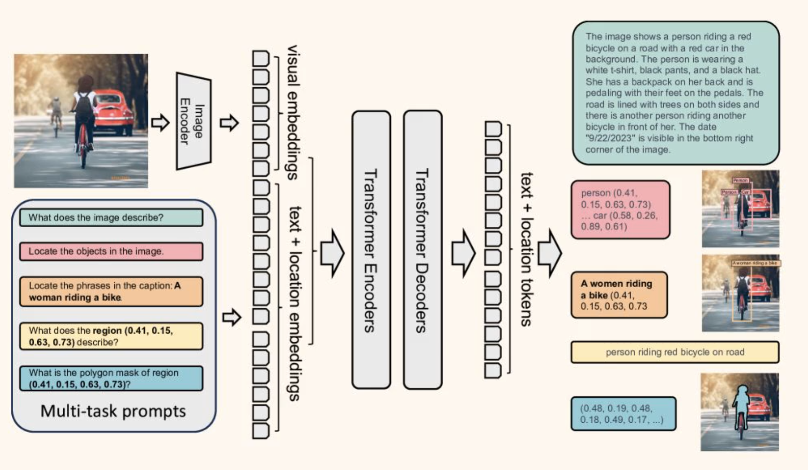
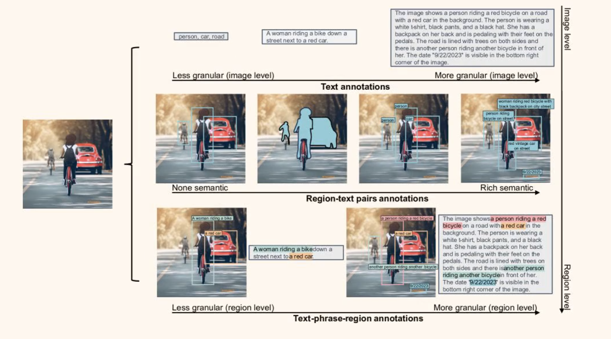
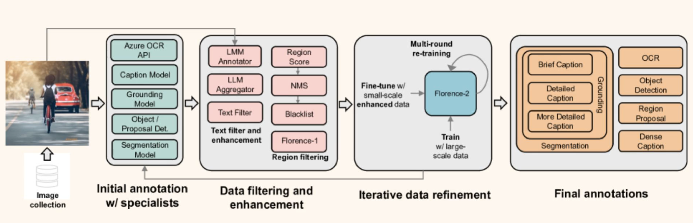
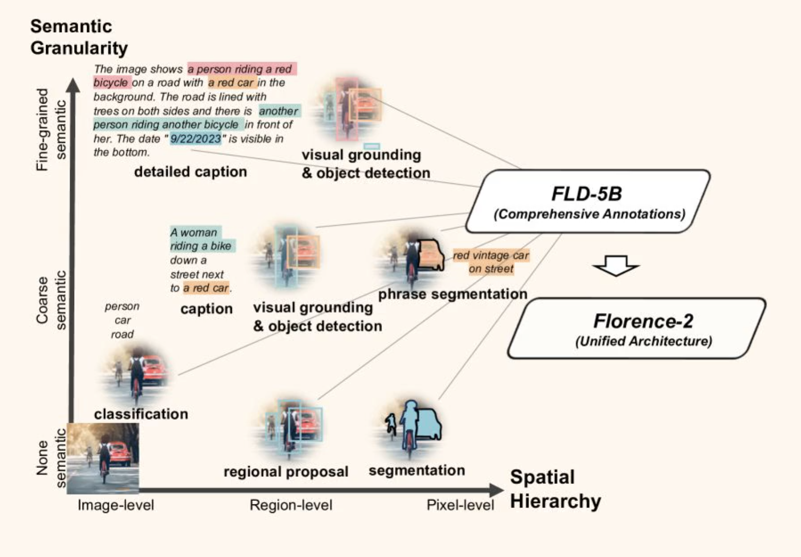
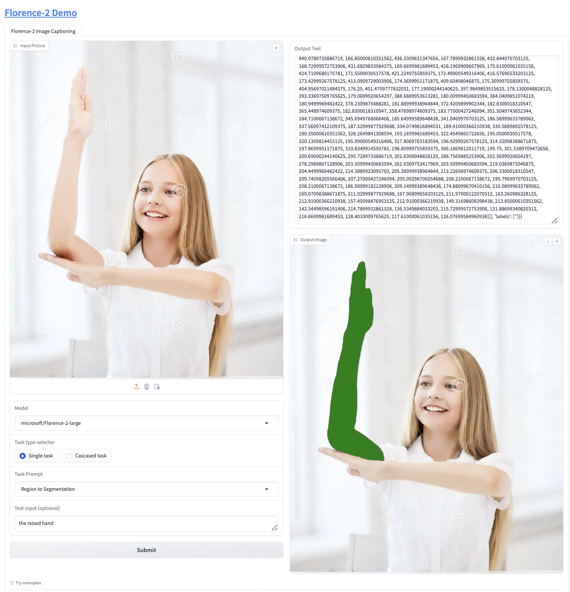

## 机器视觉的一些主要任务和挑战

一个通用的机器视觉模型，必须学习一个通用的、任务无关的表示（representation），能够适用于多种视觉任务（例如分类、检测、分割等）或多模态任务（如视觉-语言联合建模）。
通过开发一个共享的表示空间，使得模型在新任务上无需大规模微调即可表现出强大的泛化能力。其中Universal Representation Learning 是一个重要的研究方向，它旨在通过编码器生成适用于多任务的通用表示。它的关键在于通过精心设计的损失函数和大规模预训练，学习到具有强泛化能力的特征，并在下游任务中实现高效迁移和跨模态对齐。

### multi-task

如上面提到的，机器视觉模型通用模型天然就需要多任务训练，来满足不同层次的语义粒度需求。主要实现方式，将图像和文本嵌入到一个共享的多模态嵌入空间，通过相似性度量（如余弦相似度）实现对齐。通过注意力机制，关联图像的不同区域与语义描述的不同部分。例如，图像中的“红色区域”对应文本描述中的“红色汽车”。	使用特殊的损失函数（如对比损失、三元组损失）来优化视觉和语义的对齐精度。

主要可以分成以下三个粒度层次：

   1. image-level understanding
        识别物体，任务，建筑等。
        生成标题caption，消息caption和描述等
   
   2. region/pixel-level understanding
        精确识别物理，同时包括物体的坐标信息。包括后续的子图的切割，图片掩码，背景移除等
   
   3. Fine-gained visual-semanic aligement   细粒度视觉-语义对齐
        Fine-grained Visual-Semantic Alignment 是机器视觉领域中连接视觉和语义信息的重要技术，它强调细节的理解和精确的匹配，广泛应用于图像检索、分类和标注等任务。从图像库中找到与给定文本描述高度匹配的图像，或者从文本描述中检索相关的图像。

        Fine-grained（细粒度）：不仅要识别物体
            •	强调对视觉对象或场景的细致理解。
            •	不仅识别大类别（如“鸟”），还需要区分子类别（如“麻雀”和“燕子”）。
                    文本描述可能涉及图像中的细节，例如“黑色的运动鞋，带有白色鞋带”，系统需要理解图像中的细节并与描述准确匹配。
                    在高度相似的图像类别中进行区分。	例如，区分不同品种的鸟类（如“蓝翡翠”和“普通翠鸟”）或不同型号的汽车。视觉特征（如颜色、羽毛图案、车灯形状）需要与语义标签精确对齐。

            •	涉及视觉细节的精确捕捉，例如颜色、纹理、形状差异。为图像生成自然语言描述。
                    描述中的细节需要与图像特征精确匹配，例如“一个穿红色裙子的女人站在沙滩上”。
                    系统必须捕捉到特定的视觉细节并将其表达为语言。
        
        Visual-Semantic Alignment（视觉-语义对齐）:
            同时利用视觉和语言信息进行联合建模，需要在视觉特征和语义表示（如嵌入空间）之间建立细粒度的关联。例如，用于生成精确的视觉问答（Visual Question Answering）或更精准的跨模态搜索

            •	建立视觉信息（如图像或视频）与语义信息（如标签、文本描述）之间的映射关系。
	        •	对齐可以是全局的（整个图像的描述）或局部的（特定区域的描述）。

### florence2 的主要应对和实现

1. dataset

为了训练 Florence-2 模型，需要一个全面、大规模、高质量的多任务数据集，涵盖图像数据的各个方面。鉴于此类数据的稀缺性，开发了一个新的多任务图像数据集。该数据集 FLD-5B 包括跨不同任务的 126M 图像、500M 文本注释、1.3B 文本区域注释和 3.6B 文本短语区域注释。广泛地解释了我们的数据收集和注释程序，包括对各种注释类型的调整。包含不同层面的“语义粒度”semantic granularity 信息，满足不同技术任务中不同层次的语义粒度信息。保证图片多样性，从不同来源收集不同的图像来构建数据。
首先确定作为图像语料库主要来源的三个关键任务：图像分类、对象检测和图像字幕。
因此，整理并组合了源自上述任务的五个不同数据集：ImageNet-22k [18]、Object 365 [70]、Open Images [40]、Conceptual Captions [71] 和 LAION [68]   

注释工作涵盖了广泛的任务，封装在三个离散注释类别中：文本、区域-文本对和文本-短语区域三元组。
数据注释工作流程由三个基本阶段组成，每个阶段其中确保注释的准确性和质量：（1）采用专业模型的初始注释，（2）数据过滤以纠正错误并删除不相关的注释，以及（3）数据细化的迭代过程。

同时针对不同的语义粒度的要求，文本注释使用三种类型的粒度对图像进行分类：简短、详细和更详细。简短的文本仅包含一个句子，展示了最显着的对象和活动，这类似于COCO标题[13]。相比之下，详细文本和更详细文本包含多个句子，用更丰富的对象、属性和动作来描述图像。

区域-文本对为图像中的语义区域提供描述性文本注释。语义区域包括视觉对象区域和文本区域。该区域由围绕该区域的紧密边界框表示。此外，每个区域都可以用不同程度的粒度进行注释，包括短语和句子，这有助于更丰富地理解该区域。

文本-​​短语-区域三元组由图像的描述性文本、该文本中与图像对象相关的名词短语以及这些对象的区域注释组成。该文本包括先前生成的简短、详细和更详细的文本。对于每个文本，Grounding DINO 模型 [50] 都会识别名词短语并为它们创建边界框。

最后每张图片得到的标注结果：

1. florence2 learning paradigm

florence2在FLD-5B训练数据基础之上训练出来的一个通用表达的统一模型，采用sequence-to-sequnece learning paradigm。

Seq2Seq强依赖输入，通常输入与输出一一对应， 是一种 条件生成 的学习范式，目标是建模条件概率 P(\text{output} | \text{input})。它必须依赖输入  \text{input}  来生成  \text{output} ，输出是对输入的某种映射或翻译。
在 Seq2Seq 中引入注意力机制（如 Transformer 的多头注意力）是为了缓解输入序列长度较长时，上下文向量  \mathbf{C}  的信息丢失问题。注意力机制可以动态计算输入序列中每个时间步的重要性，从而更准确地捕获输入信息。

而Generative Modeling 条件生成可以依赖输入，无条件生成仅依赖训练数据分布。直接建模数据的整体分布  P(\text{data}) ，可以通过生成采样的方法生成新数据。它学习整体分布  P(\text{data}) ，生成的输出不依赖特定的输入。例如，GAN 可以生成一张逼真的人脸。当然同时在条件生成任务中，Generative Modeling 会建模条件分布  P(\text{data} | \text{condition}) ，这里的条件可以是文本、标签或其他上下文。其中自回归模型（如 GPT）通过自注意力 (Self-Attention) 处理之前生成的序列，建模其上下文关系，如果有额外条件输入（如图像生成任务中的文本描述），跨注意力 (Cross-Attention) 用来对条件信息进行动态加权。

从上图中可以看到，不同的任务中，可以组合输入图片，或者图片和文字。这个文字就变成简单提示词，来知道特定任务，比如特定实体，特定区域信息等。通过Seq2Seq传给模型处理。
比如在region to segenmentation任务重，需要指定哪个region需要关注：通过图片 + 文字表述来生成对应的output

所以任务的输出，取决于任务的类型和提示词。返回的内容也包括文本或者region（选中的区域信息）。
Text： 当提示或答案是没有特殊格式的纯文本时，将其保留为最终的序列到序列格式。
region：对于特定于区域的任务，将位置标记添加到标记器的词汇列表中，表示量化坐标。创建 1, 000类似于 [10, 11, 55, 79]的数据结构，并使用根据任务要求定制的格式来表示区域。
        1. box represetation框表示 (x0, y0, x1, y1)：用于诸如对象检测和密集区域字幕等任务，其中位置标记对应于框坐标。位置标记是框的左上角和右下角的坐标。
        2. quad box represetation四边形框表示 (x0, y0, ..., x3, y3)：对于文本检测和识别任务，对包围文本的四边形的每个坐标使用位置标记。位置标记是四边形框每个角的坐标，从左上角开始顺时针旋转。
        3. Ploygon represetation多边形表示（x0, y0, ..., xn, yn）：用于引用分割任务，位置标记代表多边形的顶点。位置标记是多边形顶点的坐标，按顺时针顺序排列。

