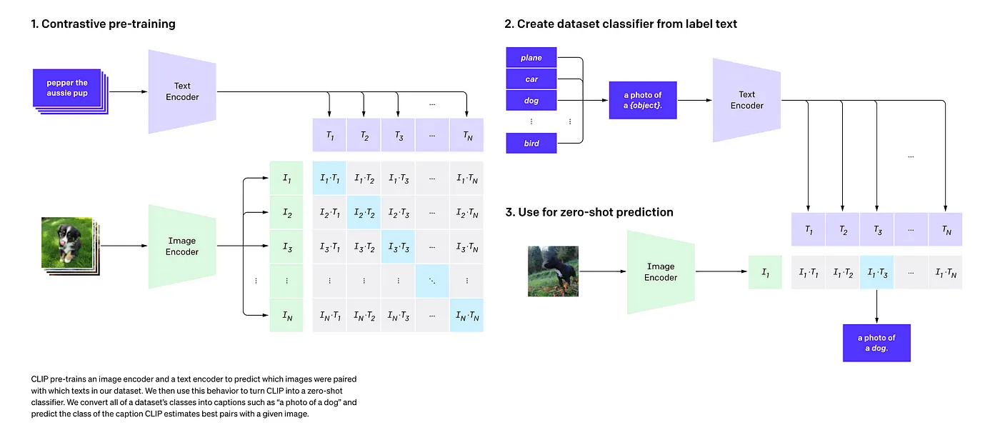
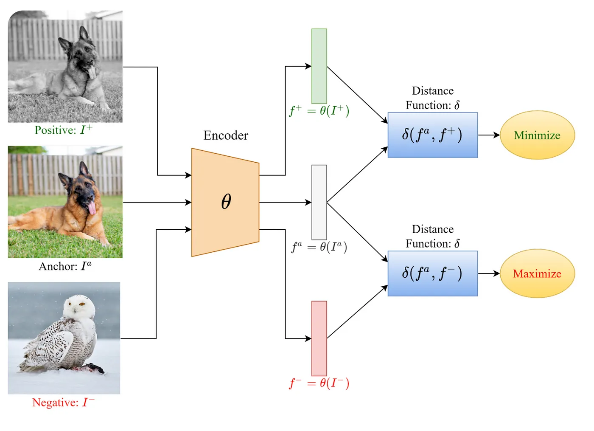
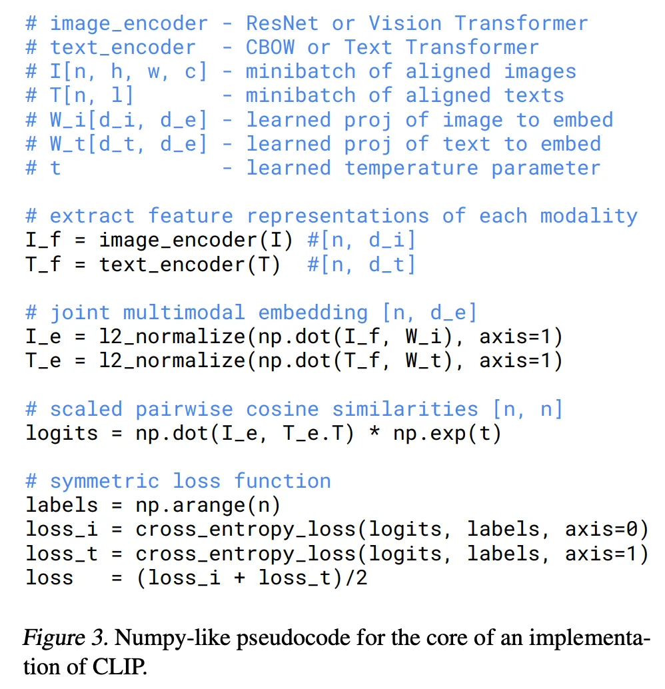
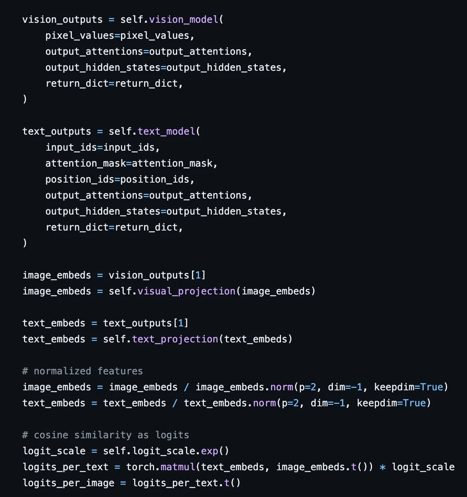
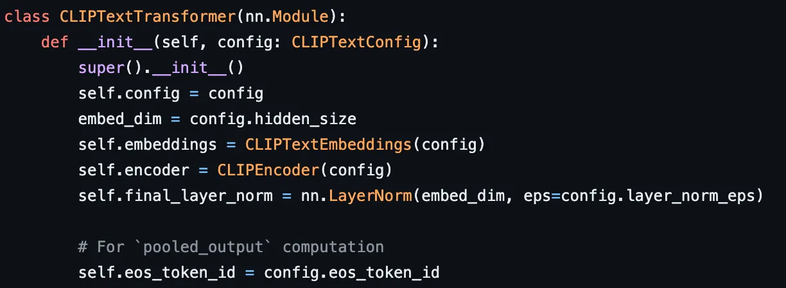
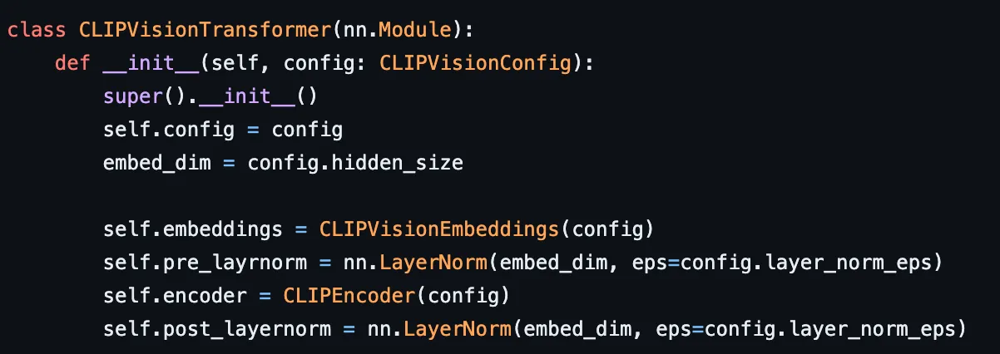
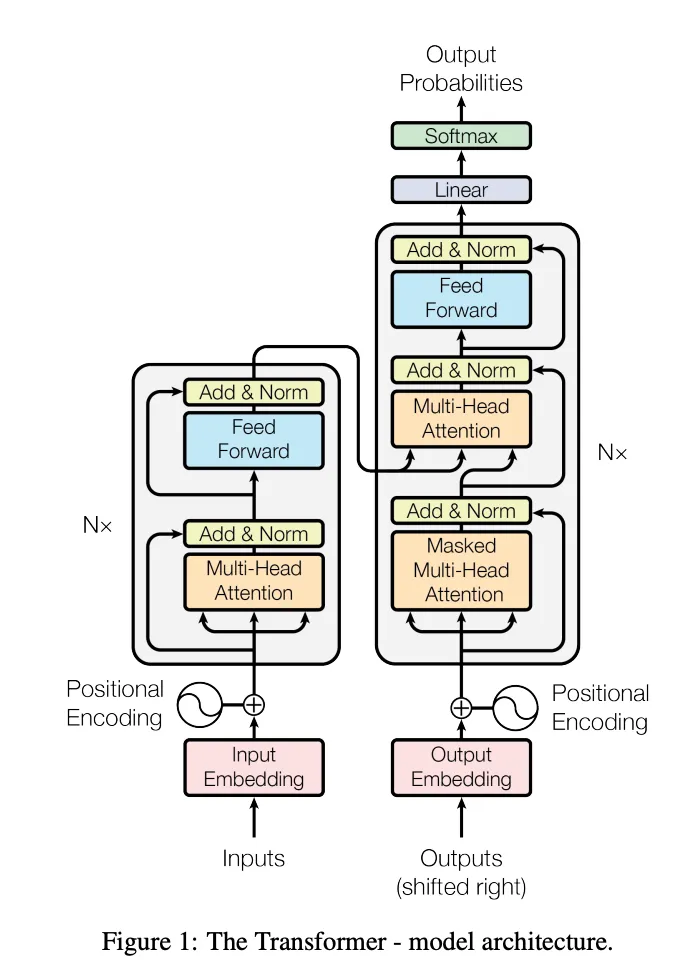
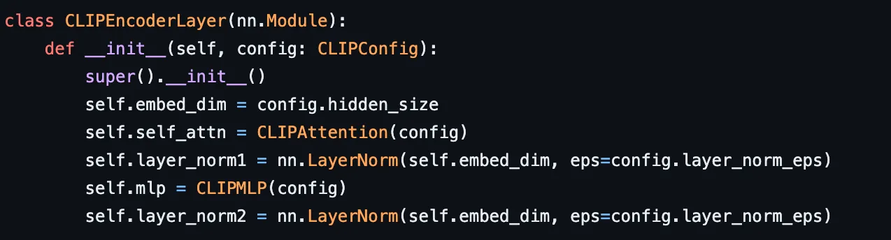
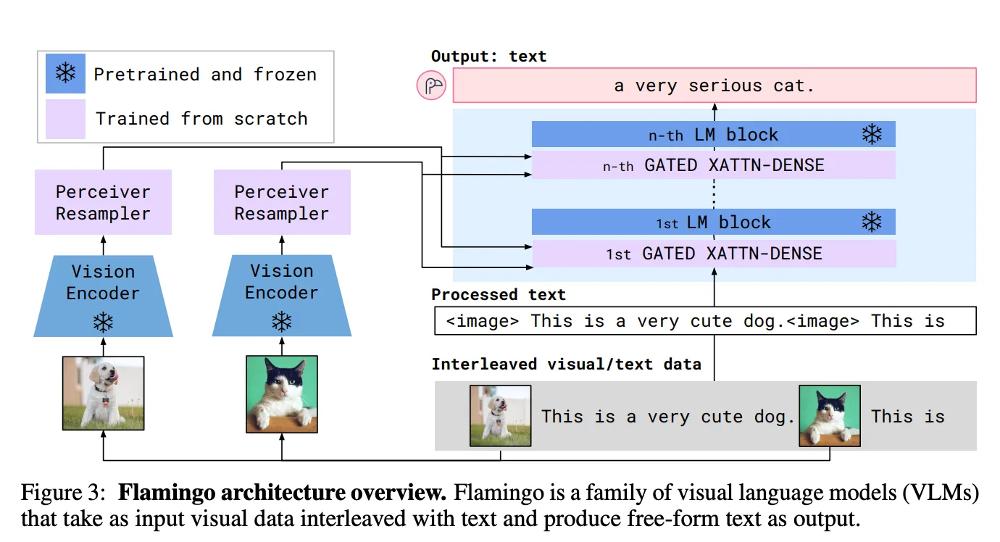
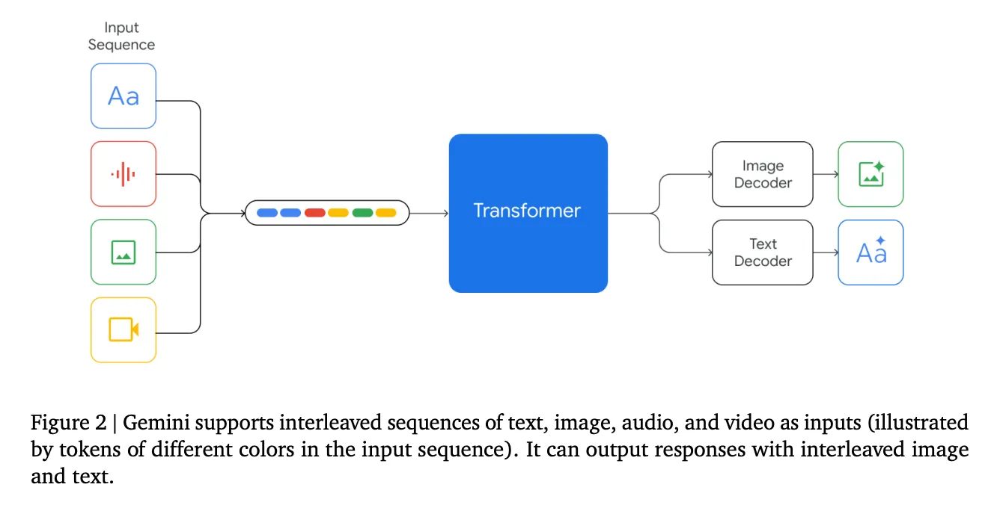

## Understanding OpenAI’s CLIP model
[clip-introduce](https://medium.com/@paluchasz/understanding-openais-clip-model-6b52bade3fa3#:~:text=The%20CLIP%20model%20has%20two,that%20it%20has%20been%20used.)

CLIP was released by OpenAI in 2021 and has become one of the building blocks in many multimodal AI systems that have been developed since then. This article is a deep dive of what it is, how it works, how it is used and also how it is implemented.

### Introduction 
CLIP which stands for Contrastive Language-Image Pre-training, is an efficient method of learning from natural language supervision and was introduced in 2021 in the paper Learning Transferable Visual Models From Natural Language Supervision.

In summary, CLIP is a joint image and text embedding model trained using 400 million image and text pairs in a self supervised way. This means that it maps both text and images to the same embedding space. So, for example, an image of a dog and the sentence “an image of a dog” would end up having very similar embeddings and be close to each other in the vector space. This is very significant as you can build many interesting applications witch such a model such as searching an image database with a description or vice versa.

The authors found that CLIP can be used for a variety of tasks that it was not trained on. For instance, it achieved remarkable zero-shot performance on various benchmarks such as ImageNet which in an image classification dataset. Zero-shot learning refers to the fact that the model was not explicitly trained on any of the 1.28M training examples in the ImageNet dataset. Nevertheless, CLIP matched the accuracy of the original ResNet-50 which was trained on the data!

But how do you use CLIP to classify images? Using ImageNet as an example, you can take each of its 1000 possible classes/objects and embed them with CLIP using the prompt “a photo of a {object}” (for example “a photo of a dog” or “a photo of a cat”). This gives you 1000 different embeddings corresponding to all the possible classes. Next, you take the image that you want to classify, let’s say a photo of a dog, and you also embed it with CLIP. Finally, you take the dot product between the image embedding and all the text embeddings. Since, CLIP is trained in such a way that both images and text are in the same embedding space and the dot product calculates the similarity between the embeddings, it is highly likely that the dot product with “a photo of a dog” will be the highest. Thus, you can predict that the image is a dog. Note, that if you want to turn CLIP into a true classifier you can also pass the dot products through the softmax function to get a predicted probability for each class.

The above process can be seen in steps 2 and 3 of the following figure.

Now let’s dive into more detail of how CLIP works.

### Architecture 
The CLIP model has two main components, a text encoder (which embeds the text) and an image encoder (which embeds the images). For the text encoder a Transformer was used. This architecture has revolutionised the field of NLP since 2017 and it is not surprise that it has been used.

For the image encoder the authors tried two different models, a ResNet-50 and a Vision Transformer (ViT). ResNet-50 is the original state of the art architecture using Convolutional Neural Networks (CNNs) that is used for image classification. The ViT is a more recent adaptation of the original Transformer for images, where each image can be split up into a sequence of patches and passed into the model analogous to a sequence of tokens. The authors found that the ViT trained faster.

Both the text and image encoder were trained from scratch.

### Training

The authors initially tried to train an image captioning model which given an image predicts the exact caption/description.

However, they found it did not scale to train on the 400M (image, text) pairs and so they opted instead for a contrastive representation learning approach. The goal of contrastive representation learning is to learn such an embedding space in which similar sample pairs stay close to each other while dissimilar ones are far apart.

In a standard contrastive learning approach you give the model examples of the form (anchor, positive, negative), where anchor is an image from one class, say a dog, positive is an alternative image from the same class, a dog, and negative is an image of another class, say a bird. You then embed the images and you train the model in such a way that the distance between the two embeddings for the same class (the dog), distance(anchor, positive), gets minimised and the distance between the two embeddings of different class, (the dog and bird), distance(anchor, negative), gets maximised. This encourages the model to output very similar embeddings for the same objects and dissimilar embeddings for different objects.


The same approach can be applied to text as well as combination of text an images. For instance, for CLIP, for a single training example, the anchor could be an image of a dog, the positive could be the caption, “an image of a dog”, and the negative could be the caption “an image of a bird”.

CLIP generalises that even further using a multi-class N-pair loss, an extension of the above but when you have multiple negatives and positives for each anchor. As described in the paper:

The below pseudo code provided in the paper encapsulates the core details nicely:

The steps include:

1. Embed the image with the image encoder and embed the text with the text encoder.
2. The image and text embeddings will come from different models and will have different dimensions, so project them (by multiplying with a learnt projection matrix) into the same joint multimodal embedding space. For instance, np.dot(I_f, W_i) multiplies a matrix of size [n, d_i] with a matrix of size [d_i, d_e] which results in a projected matrix of size [n, d_e].
3. Normalise the new embedding vectors. This turns them into unit vectors.
4. Calculate the matrix of dot products.
5. Calculate the cross entropy loss for each row and column and divide by 2, since each pair would be calculated twice.

### Prompt Engineering and Ensembling
Since the rise of language models prompt engineering has become a very common practice to get good outputs from generative models. Since the text encoder in CLIP is a transformer model the authors found it to be very crucial to get good zero-shot performance as well. The authors found that it was relatively rare in their pre-training dataset for the text paired with the image to be just a single word, for example,“dog” representing a class label. It was more common for the text to be a full sentence like a caption or description of the image. The authors therefore found the prompt “a photo of a {object}” was a good default but for certain cases more specialised prompts worked better. For instance, for satellite images they found “a satellite photo of a {object}” to work well.

The authors also experimented with ensembling of different models. Ensembling is where you combine the predictions of a few different models on the same inputs to get the final output, a common technique in machine learning to address issues in high variance and low bias (overfitting) models. In the case of CLIP, the authors construct the ensemble by constructing classifiers using many different prompts.

Both prompt engineering and ensembling showed a significant performance improvement on ImageNet.

### Limitations 
Whilst the paper dives into many more experiments and results it is important to also mention that CLIP is not perfect and has various limitations.

1. Due to the design decision mentioned earlier, this is not a generative model and cannot do image captioning for instance.
2. Authors note that CLIP is still far from state of the art (and is only comparable to a ResNet with a linear layer on top). It generalises very badly to certain tasks, for example only achieving 88% on the easy MNIST hand written digit recognition dataset. This is likely due there being no similar images in its training but CLIP does little to address that.
3. CLIP is trained on text paired with images on the internet. These image-text pairs are unfiltered and uncurated and result in CLIP models learning many social biases. (These are similar concerns to those of LLMs currently which techniques like RLFHF and Direct Preference Optimisation try to tackle).
4. The Transformer text encoder maximum sequence length (maximum number of tokens that can be passed in) was capped at 76 in the original implementation as the dataset were mostly images and captions which would generally be short sentences. Therefore, using the off the shelf pre-training model would not work well with longer texts as it would be cut off after 76 tokens, and as it was trained with short texts.

### Implementation Details
You can use CLIP on your own computer using the HuggingFace Transformers library in just a few lines of code! Firstly, import the library and load the pre-trained model.

``` python
import transformers

model = transformers.CLIPModel.from_pretrained("openai/clip-vit-base-patch32")
processor = transformers.CLIPProcessor.from_pretrained("openai/clip-vit-base-patch32")
```
Then create a list of captions/descriptions and a list of images. The image can either be a url or a PIL image.

``` python
import PIL.Image

images = [PIL.Image("for_example_a_dog_image.jpeg")]
possible_classes = ["an image of a bird", "an image of a dog", "an image of a cat"]
```

Call the processor which tokenises the texts and images and prepares them to be passed into the model. This is very similar to calling a tokeniser in the standard text only use case. Since we have a batch of descriptions we need to use padding to “pad” them all to the same length to be able to store as a tensor and truncation to cut any long sentences at the maximum sequence length (which is 76 as discussed earlier). Then pass the tokenised inputs to the model which passes them through the text and image encoders.

``` python
with torch.no_grad():
    inputs = processor(text=descriptions, images=images, return_tensors="pt", padding=True, truncation=True)
    outputs = model(**inputs)

```

Now we can retrieve the matrix of dot products with two different functions. Use logits_per_image to get a dot product matrix with the shape [num_of_images, num_of_text] and logits_per_text to get the matrix with the shape [num_of_text, num_of_images].

``` python
dot_products_per_image = outputs.logits_per_image
dot_products_per_text = outputs.logits_per_text

```

Finally, we can pass these through a softmax function if we want to get a probability distribution for each image.

``` python
probabilities = dot_products_per_image.softmax(dim=1)

```

### Diving Deeper into the Implementation

The transformers CLIP source code can be found on github and I found it to be a very modular and nice implementation. The main model is implemented in the CLIPModel class and you can see the main logic in the forward method as shown below



The vision model and text models have some minor differences in embeddings and layer norms as shown below

CLIP text encoder is a Transformer. 

CLIP image encoder is a Vision Transformer.

but they both share the same CLIPEncoder which is the main transformer encoder. This comprises of many sub blocks which they call a CLIPEncoderLayer. Recall that in the Transformer architecture each encoder and decoder gets stacked together N times. For CLIP we don’t use a decoder as we don’t generate any text.

The transformer architecture from Attention is All You Need.

Each CLIPEncoderLayer is then comprised of the attention mechanism, a normalisation layer and a simple feed forward layer/multi layer perceptron (MLP).



Finally, I went through and annotated the implementation for the multi head attention mechanism in the following gist — enjoy!

``` python 
""" Annotated code for Transformers' CLIP implementation """
from typing import Optional, Tuple

import torch
from torch import nn


class CLIPAttention(nn.Module):
    """Multi-headed attention from 'Attention Is All You Need' paper"""

    # Recall the formula is softmax(QK^T/√d_k)V. Note CLIP has a max sequence length of 77 in the original implementation so I use this as examples.

    def __init__(self, config):
        super().__init__()
        self.config = config
        self.embed_dim = config.hidden_size  # 512 in the original paper
        self.num_heads = config.num_attention_heads  # 8 heads in the original paper
        self.head_dim = self.embed_dim // self.num_heads  # 64 it in the original paper
        if self.head_dim * self.num_heads != self.embed_dim:
            raise ValueError(f"embed_dim must be divisible by num_heads (got `embed_dim`: {self.embed_dim} and `num_heads`: {self.num_heads}).")
        self.scale = self.head_dim**-0.5  # This is == 1/√(d_k) in the paper
        self.dropout = config.attention_dropout

        # Below are single neural networks layers acting as the projection matrices W_k, W_q, W_v. In the paper this have dimensions
        # (embed_dim, head_dim) = (512, 64) and there are num_heads = 8 of them. In this implementation they are combined into a single layer so single
        # matrix of size (embed_dim, embed_dim) = (512, 512)
        self.k_proj = nn.Linear(self.embed_dim, self.embed_dim)
        self.v_proj = nn.Linear(self.embed_dim, self.embed_dim)
        self.q_proj = nn.Linear(self.embed_dim, self.embed_dim)
        # The output projection W_o
        self.out_proj = nn.Linear(self.embed_dim, self.embed_dim)

    def _shape(self, tensor: torch.Tensor, seq_len: int, bsz: int):
        # This function takes in a tensor of size (bs, seq_len, embed_dim) and first turns it into a tensor of size
        # (bs, seq_length, num_heads, head_dim) and then transposes it into a shape (bs, num_heads, seq_length, head_dim)
        return tensor.view(bsz, seq_len, self.num_heads, self.head_dim).transpose(1, 2).contiguous()

    def forward(
        self,
        hidden_states: torch.Tensor,  # of shape (batch_size, max_seq_length, embedding_dim)
        attention_mask: Optional[torch.Tensor] = None,  # when you have padding tokens you want to ignore them from the attention calculation
        # See https://huggingface.co/docs/transformers/en/glossary for details.
        causal_attention_mask: Optional[torch.Tensor] = None,
        output_attentions: Optional[bool] = False,
    ) -> Tuple[torch.Tensor, Optional[torch.Tensor], Optional[Tuple[torch.Tensor]]]:
        """Input shape: Batch x Time x Channel"""

        bsz, tgt_len, embed_dim = hidden_states.size()
        # Tgt_len is the max sequence length in the batch, also for CLIP this cannot exceed 77. For the purpose of illustration I will use 77 in some
        # examples below.

        # Made a slight modification in the code below to make it more readable. We apply the projections to get the Q, K and V matrices out and use
        # the _shape method to put them into the shape (bs, num_heads, seq_length, head_dim) = (bs, 8, 77, 64). So now we see that the linear
        # layer stores all the num_heads matrices in one layer but now we extract the individual matrices for each head to apply attention per each
        # head!
        query_states = self._shape(self.q_proj(hidden_states) * self.scale, tgt_len, bsz)  # also divides by √d_k
        key_states = self._shape(self.k_proj(hidden_states), -1, bsz)
        value_states = self._shape(self.v_proj(hidden_states), -1, bsz)

        # The below combines the bs and num_heads dimensions turning each matrix (K, Q, V) from size (bs, num_hads, seq_length, head_dim) into
        # (bs * num_heads, seq_length, head_dim). Essentially stacking the matrices for all batches into one. This is done to be able to use the
        # torch.bmm function https://pytorch.org/docs/stable/generated/torch.bmm.html which expects 3D tensors.
        proj_shape = (bsz * self.num_heads, -1, self.head_dim)
        query_states = query_states.view(*proj_shape)
        key_states = key_states.view(*proj_shape)
        value_states = value_states.view(*proj_shape)

        src_len = key_states.size(1)
        attn_weights = torch.bmm(query_states, key_states.transpose(1, 2))
        # bmm performs a batched matrix multiplication, this implements QK^T. Matrix multiply (bs * num_heads, seq_length, head_dim) with
        # (bs * num_heads, head_dim, seq_length) resulting in an output shape (bs * num_heads, seq_length, seq_length).
        # I.e. for each text in the batch for each head compute an n^2 attention between each token in the sequence.

        if attn_weights.size() != (bsz * self.num_heads, tgt_len, src_len):
            raise ValueError(f"Attention weights should be of size {(bsz * self.num_heads, tgt_len, src_len)}, but is {attn_weights.size()}")

        # apply the causal_attention_mask first
        # I believe the causal_attention_mask = masked self attention as in the transformer decoder to preserve the autoregressive property for the
        # model. As explained in the CLIP paper: Masked self-attention was used in the text encoder to preserve the ability to initialize
        # with a pre-trained language model or add language modeling as an auxiliary objective, though exploration of this is left as future work.
        # Why is it used? See: https://ai.stackexchange.com/questions/40917/what-if-we-drop-the-causal-mask-in-auto-regressive-transformer
        if causal_attention_mask is not None:
            if causal_attention_mask.size() != (bsz, 1, tgt_len, src_len):
                raise ValueError(f"Attention mask should be of size {(bsz, 1, tgt_len, src_len)}, but is {causal_attention_mask.size()}")
            attn_weights = attn_weights.view(bsz, self.num_heads, tgt_len, src_len) + causal_attention_mask
            attn_weights = attn_weights.view(bsz * self.num_heads, tgt_len, src_len)

        if attention_mask is not None:
            if attention_mask.size() != (bsz, 1, tgt_len, src_len):
                raise ValueError(f"Attention mask should be of size {(bsz, 1, tgt_len, src_len)}, but is {attention_mask.size()}")
            # This applies the attention mask. The purpose is to not attend to padding tokens as they are only used for shorter sequences to
            # pad them to the maximum sequence length in the batch to be able to store in one tensor. As a result the attention mask contains 0 for
            # all useful tokens that should be attended to and is set to a very large negative number (lets say -inf) for padding tokens. This will
            # then be ignored by the softmax (recall exp(-inf) = 0)
            attn_weights = attn_weights.view(bsz, self.num_heads, tgt_len, src_len) + attention_mask
            attn_weights = attn_weights.view(bsz * self.num_heads, tgt_len, src_len)

        attn_weights = nn.functional.softmax(attn_weights, dim=-1)  # Gives attn_weights = softmax(QK^T/√d_k). Dim=-1 performars the softmax on the
        # last dimension (e.g. the rows in a 2D case) using negative indexing. The output shape remains (bs * num_heads, seq_length, seq_length)

        if output_attentions:  # no idea what this does but seems None by default #TODO
            # this operation is a bit akward, but it's required to
            # make sure that attn_weights keeps its gradient.
            # In order to do so, attn_weights have to reshaped
            # twice and have to be reused in the following
            attn_weights_reshaped = attn_weights.view(bsz, self.num_heads, tgt_len, src_len)
            attn_weights = attn_weights_reshaped.view(bsz * self.num_heads, tgt_len, src_len)
        else:
            attn_weights_reshaped = None

        attn_probs = nn.functional.dropout(attn_weights, p=self.dropout, training=self.training)  # Applies dropout but only in training

        attn_output = torch.bmm(attn_probs, value_states)
        # Peforms the final multiplication of the attn_weights with the value matrix V. So (bs * num_heads, seq_length, seq_length) *
        # (bs * num_heads, seq_length, head_dim) which results in an output of shape (bs * num_heads, seq_length, head_dim)

        if attn_output.size() != (bsz * self.num_heads, tgt_len, self.head_dim):
            raise ValueError(f"`attn_output` should be of size {(bsz, self.num_heads, tgt_len, self.head_dim)}, but is {attn_output.size()}")

        attn_output = attn_output.view(bsz, self.num_heads, tgt_len, self.head_dim)
        # expands it back out into a shape (bs, num_heads, seq_length, head_dim)
        attn_output = attn_output.transpose(1, 2)
        # transposes to (bs, seq_length, num_heads, head_dim)
        attn_output = attn_output.reshape(bsz, tgt_len, embed_dim)
        # Concatenates each matrix back into (bs, seq_length, num_heads * head_dim) = (bs, seq_length, embed_dim) = (bs, 77, 512)

        attn_output = self.out_proj(attn_output)  # Final multiplication with the output matrix W_o. Keeps the shape as (bs, seq_length, embed_dim)

        return attn_output, attn_weights_reshaped
```

### Further Work 

As mentioned at the start CLIP can be used in a variety of ways, especially in semantic search type applications. For example, we could use CLIP for image retrieval from a database by searching with a description of the image.

CLIP and its alternatives is also a building block for many multimodal models that have emerged since then. For example, in Flamingo, a Vision Language Model, it can take a sequence of text and images in one go and generate text. Flamingo uses a vision encoder to turn the images into the same embedding space as the text.


The authors experimented with both CLIP and their own version trained in a similar manner.
Finally, models like Google’s Gemini, although we don’t know much about, they are likely using similar approaches to combine input data from various modalities including also audio and video!


### Conclusion
In summary, CLIP is joint text and embedding model that can be used for many applications and to build multimodal AI systems. It is also very easy to run in Python on a CPU in just a few lines of code.


