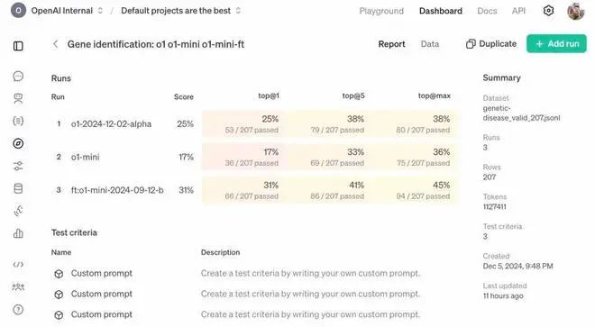
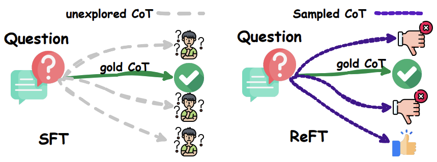
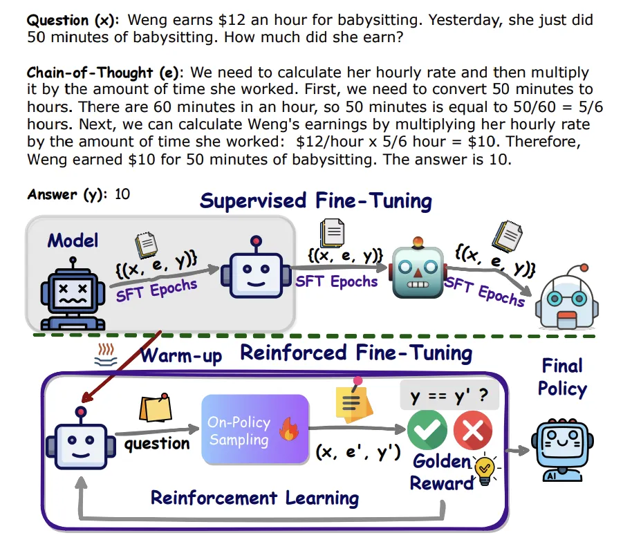
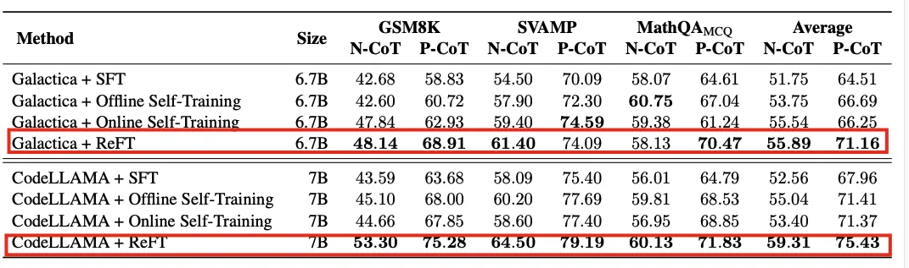
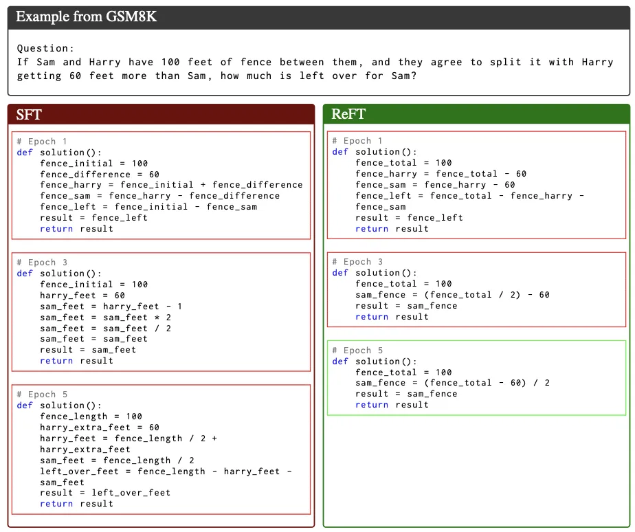

## fine-tuning种类

### Reinforcement Fine-Tuning
OpenAI推出了强化微调RFT (Reinforcement Fine-Tuning)，它可以让你用几十到几千个的训练数据，为特定的复杂任务构建专家模型，加强了模型如何处理类似问题的推理，微调后的o1-mini得分提高80%，反超o1正式版！


强化微调技术的一种实现方式：首先通过监督式微调（Supervised Fine-Tuning）对模型进行预热，然后利用在线强化学习，特别是PPO算法，进一步微调模型。这种方法能够自动采样多种推理路径，并从真实答案中自然派生出奖励信号。

SFT和ReFT在CoT替代方案存在时的比较


强化微调（RFT）的两个主要阶段：预热阶段和强化学习阶段

```
预热阶段（Warm-up）：

在这个阶段，模型使用包含“问题（question）”和“思维链（Chain-of-Thought，CoT）”元组的数据集进行微调，通常持续1-2个epoch。
目的是使模型具备基本的问题解决能力，能够生成适当的响应。
CoT生成过程被分解为一系列预测下一个词（token）的动作，直到生成结束符（<eos>）。

*** 预热这个阶段 可以看到思维链和答案，可以让模型知道处理事情的大概和数据的context****

强化学习阶段（Reinforcement Learning）：
在这个阶段，模型通过在线自我学习的方式提高性能，使用包含“问题（question）”和“答案（answer）”元组的数据集。
模型通过重复采样响应、评估响应的答案正确性，并在线更新其参数。
使用PPO（Proximal Policy Optimization）算法进行训练，其中价值模型（value model）Vϕ是基于预热阶段后的政策模型πθ的最后隐藏状态构建的。

奖励函数在终端状态时直接比较从状态的CoT提取的答案和真实答案y，正确则返回1，否则返回0。
对于数值型答案的数据集，还可以应用部分奖励（partial reward）0.1。总奖励是奖励函数得分和学习到的RL政策与初始政策之间的Kullback-Leibler（KL）散度的和。

*** 这个强化学习阶段，让它在线学习问题和大难，通过COT的答案进行奖励****
```
*** 为什么这种比全部通过warm up 这种监督学习来得更好呢？ ******
增强大型语言模型 （）LLMs 推理能力的一种方法是使用 Chain-ofThought （CoT） 注释进行监督微调 （SFT）。然而，这种方法并没有显示出足够强的泛化能力，因为训练只依赖于给定的 CoT 数据。例如，在数学问题解决中，训练数据中的每个问题通常只有一个带注释的推理路径。直观地说，算法最好从给定问题的多个带注释的推理路径中学习。为了解决这个问题，我们提出了一种简单而有效的方法，称为强化微调 （ReFT），以数学问题解决为例，以提高推理学习LLMs的普遍性。ReFT 首先用 SFT 对模型进行预热，然后采用在线强化学习，特别是本文中的 PPO 算法，以进一步微调模型，其中给定问题会自动对大量推理路径进行采样，奖励自然地来自真实答案。在 GSM8K、MathQA 和 SVAMP 数据集上的广泛实验表明，ReFT 的性能明显优于 SFT，并且通过结合多数投票和重新排名等推理时间策略，可以进一步提高性能。请注意，ReFT 通过与 SFT 相同的训练问题学习来获得改进，而无需依赖额外或增强的训练问题。这表明 ReFT 具有卓越的泛化能力。
[论文地址](https://arxiv.org/pdf/2401.08967)


GSM8K中的一个问题（x）、思维链（CoT）（e）和答案（y）的示例。

### Reinforcement Fine-Tuning vs Supervised Fine-Tuning
SFT过程在训练数据上迭代多个周期。提出的ReFT从SFT预热并在同一数据上执行RL训练。


实验表明，RFT在GSM8K、MathQA和SVAMP等数据集上的性能显著优于SFT，并且可以通过多数投票和重新排名等策略进一步提升性能

ReFT和基线模型在所有数据集上微调后的价值准确度

SFT和ReFT在GSM8K数据集中第1、3和5周期的P-CoT响应对同一个问题的反应。绿色框架内的反应是正确的，而红色框架内的反应是错误的。


### Unsupervised Fine-Tuning

虽然它不总是用“fine-tuning”这个词描述，但可以归类为以下几种方式：

a. 自监督微调 (Self-Supervised Fine-Tuning)
•	定义：使用未标注数据，通过设计自监督任务来微调模型。
	•	例如，BERT 和 GPT-3 的预训练阶段实际上就是一种自监督学习：
	    •	BERT 使用“遮掩语言建模（Masked Language Modeling, MLM）”。
	    •	GPT 系列使用“自回归语言建模（Autoregressive Language Modeling）”。
•	场景：在领域特定的未标注文本上训练模型，使其更了解目标领域的语言特点。

b. 无监督对抗训练 (Unsupervised Adversarial Fine-Tuning)
•	定义：通过对抗学习的方式，在无监督数据上调整模型参数。
	•	例如，GAN (生成对抗网络) 的思想可以被用来通过生成器-判别器机制微调生成模型。

c. Reinforcement Learning Fine-Tuning (强化学习微调)
•	定义：通过奖励信号（而非明确标注）指导模型的调整。
	•	例如，OpenAI 在 GPT-3 的基础上使用强化学习与人类反馈（RLHF）微调了 ChatGPT。
	•	特点：虽然依赖人工反馈，但通常不需要大规模标注数据。

### 其他相关概念

指令微调 (Instruction Fine-Tuning)
	•	一种特殊的有监督微调，用于让模型理解和执行自然语言指令。
	•	类似 GPT-4、Claude 这样的多用途模型，往往在大规模标注的指令数据上进行微调。

领域自适应 (Domain Adaptation)
	•	使用领域内的无标注数据进行语言建模（非监督）或少量标注数据进行任务特定训练（有监督）。