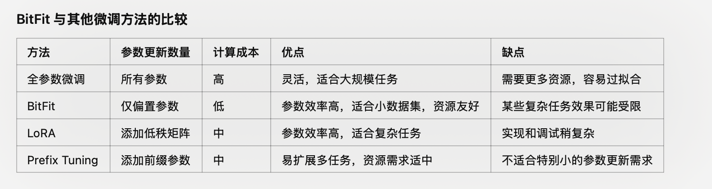

## 1. BitFit
Bias-Only Fine-Tuning（仅调整偏置的微调）
BitFit 是一种轻量化的参数高效调优（PEFT, Parameter-Efficient Fine-Tuning）方法，旨在通过调整模型的一小部分参数来实现微调，而不是对整个模型进行全量训练。

BitFit特点：

•	只调整预训练模型中各层的 偏置参数（bias），而冻结其余参数（如权重weights）。
•	偏置参数的数量远远小于模型的总参数量，因此这种方法计算成本低且参数更新量小。

BitFit 的应用场景
	•	自然语言处理（NLP）:
        •	在大语言模型（如 BERT、GPT 等）的微调中，BitFit 可以显著降低资源开销。
        •	常用于文本分类、情感分析、命名实体识别等任务。
	•	多模态任务:
	    •	在视觉语言模型（如 CLIP）中，BitFit 也可以应用于参数高效的任务适配。

BitFit 的局限性
	•	对于需要大幅调整模型权重的复杂任务，BitFit 可能不如其他方法（如全参数微调或 LoRA）表现出色。
	•	偏置参数的调整能力有限，可能无法完全适应任务特定的复杂模式。

### 技术原理

BitFit（论文：BitFit: Simple Parameter-efficient Fine-tuning or Transformer-based Masked Language-models）是一种稀疏的微调方法，它训练时只更新bias的参数或者部分bias参数。对于Transformer模型而言，冻结大部分 transformer-encoder 参数，只更新bias参数跟特定任务的分类层参数。涉及到的bias参数有attention模块中计算query,key,value跟合并多个attention结果时涉及到的bias，MLP层中的bias，Layernormalization层的bias参数。

在Bert-Base/Bert-Large这种模型里，bias参数仅占模型全部参数量的0.08%～0.09%。但是通过在Bert-Large模型上基于GLUE数据集进行了 BitFit、Adapter和Diff-Pruning的效果对比发现，BitFit在参数量远小于Adapter、Diff-Pruning的情况下，效果与Adapter、Diff-Pruning想当，甚至在某些任务上略优于Adapter、Diff-Pruning。

通过对比BitFit训练前后的参数，发现很多bias参数并没有太多变化（例如：跟计算key所涉及到的bias参数）。发现计算query和将特征维度从N放大到4N的FFN层（intermediate）的bias参数变化最为明显，只更新这两类bias参数也能达到不错的效果，反之，固定其中任何一者，模型的效果都有较大损失。

