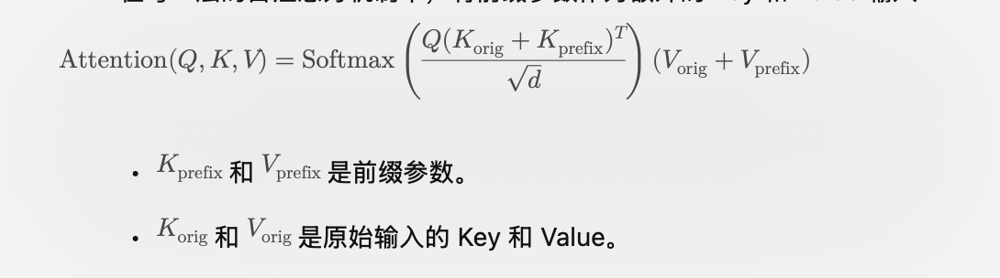

## 2. Prefix Tuning 

Prefix Tuning 是一种 参数高效微调（Parameter-Efficient Fine-Tuning, PEFT） 技术，通过引入一组可训练的参数（称为“前缀”）来调整预训练模型的行为，而无需更新模型的原始权重。
它特别适用于大语言模型（如 GPT、T5 等）的任务适配，能显著减少训练所需的参数量和计算开销。
Prefix Tuning 的核心思想是为每一层 Transformer 添加一组前缀向量，这些向量的作用是在输入通过模型时引导注意力分布。

1.	前缀的定义：
	•	前缀是一组与输入无关的可训练向量，预先添加到每个 Transformer 层的输入上（通常是 Key 和 Value 部分）。
	•	它类似于引导预训练模型生成特定任务的输出，而无需直接修改模型的权重。
2.	冻结模型参数：
	•	在 Prefix Tuning 中，预训练模型的所有原始参数（如权重和偏置）都保持冻结状态，只有前缀参数被更新。
3.	轻量化训练：
	•	前缀的参数量通常远小于模型的总参数量，因此训练成本低，同时模型能够保留原始的通用能力。

#### 主要步骤

1.	初始化前缀参数：
	•	前缀参数通常是随机初始化的向量，或者可以使用特定的初始化策略。
2.	前缀注入：
	•	在每一层的自注意力机制中，将前缀参数作为额外的 Key 和 Value 输入：

3.	任务特定训练：
	•	前缀参数根据特定任务的数据进行训练，而预训练模型的参数保持不变。
4.	推理阶段：
	•	训练完成后，前缀参数与模型一起使用，无需进一步调整。

#### 原理解析

在Prefix Tuning之前的工作主要是人工设计离散的模版或者自动化搜索离散的模版。对于人工设计的模版，模版的变化对模型最终的性能特别敏感，加一个词、少一个词或者变动位置都会造成比较大的变化。而对于自动化搜索模版，成本也比较高；同时，以前这种离散化的token搜索出来的结果可能并不是最优的。

除此之外，传统的微调范式利用预训练模型去对不同的下游任务进行微调，对每个任务都要保存一份微调后的模型权重，一方面微调整个模型耗时长；另一方面也会占很多存储空间。

基于上述两点，Prefix Tuning提出固定预训练LM，为LM添加可训练，任务特定的前缀， 这样就可以为不同任务保存不同的前缀，微调成本也小；同时，这种Prefix实际就是连续可微的Virtual Token（Soft Prompt/Continuous Prompt），相比离散的Token，更好优化，效果更好。

Prefix Tuning（论文：Prefix-Tuning: Optimizing Continuous Prompts for Generation），在输入token之前构造一段任务相关的virtual tokens作为Prefix，然后训练的时候只更新Prefix部分的参数，而PLM中的其他部分参数固定。

针对不同的模型结构，需要构造不同的Prefix。

•	针对自回归架构模型：在句子前面添加前缀，得到 z = [PREFIX; x; y]，合适的上文能够在固定 LM 的情况下去引导生成下文（比如：GPT3的上下文学习）。

•	针对编码器-解码器架构模型：Encoder和Decoder都增加了前缀，得到 z = [PREFIX; x; PREFIX0; y]。Encoder端增加前缀是为了引导输入部分的编码，Decoder 端增加前缀是为了引导后续token的生成。

该方法其实和构造Prompt类似，只是Prompt是人为构造的“显式”的提示，并且无法更新参数，而Prefix则是可以学习的“隐式”的提示。

为了防止直接更新Prefix的参数导致训练不稳定和性能下降的情况，在Prefix层前面加了MLP(Multilayer Perceptron 多层感知机)结构，训练完成后，只保留Prefix的参数。

MLP 结构在 Prefix Tuning 中的作用
	1.	稳定训练：
        •	直接训练随机初始化的 Prefix 参数可能导致梯度震荡，模型难以收敛。
        •	在 Prefix 参数前加 MLP，可以先将前缀向量映射到更有意义的特征空间，从而平滑训练过程。
	2.	增强表达能力：
        •	初始 Prefix 参数可能无法充分捕捉任务信息，而 MLP 可以对输入进行非线性变换，生成更丰富的表示。
        •	这种转换类似于预处理操作，使得最终的 Prefix 更能适应下游任务。
	3.	参数高效性：
        •	尽管训练时引入了 MLP，但训练完成后可以丢弃 MLP，直接将其变换后的结果作为 Prefix 参数。这保持了微调方法的参数效率。

MLP 通常是一个简单的两层全连接网络，带有非线性激活函数：
	1.	输入维度：Prefix 参数的维度（比如隐层大小  d_{\text{model}} ）。
	2.	隐层维度：一个超参数，可以根据任务需求调整，常见选择是  2d_{\text{model}}  或  4d_{\text{model}} 。
	3.	激活函数：一般选择 ReLU 或 GELU。

除此之外，通过消融实验证实，只调整embedding层的表现力不够，将导致性能显著下降，因此，在每层都加了prompt的参数，改动较大。

另外，实验还对比了位置对于生成效果的影响，Prefix-tuning也是要略优于Infix-tuning的。其中，Prefix-tuning形式为 [PREFIX; x; y]，Infix-tuning形式为 [x; INFIX; y]。

***Infix-tuning 是一种针对大规模预训练语言模型（如 Transformer）的微调方法，类似于 Prefix Tuning 和 Prompt Tuning，但它将可训练的参数插入到模型的中间层（即 infix 位置），而不是只在模型的输入（Prefix）或输出（Suffix）部分进行调整***

