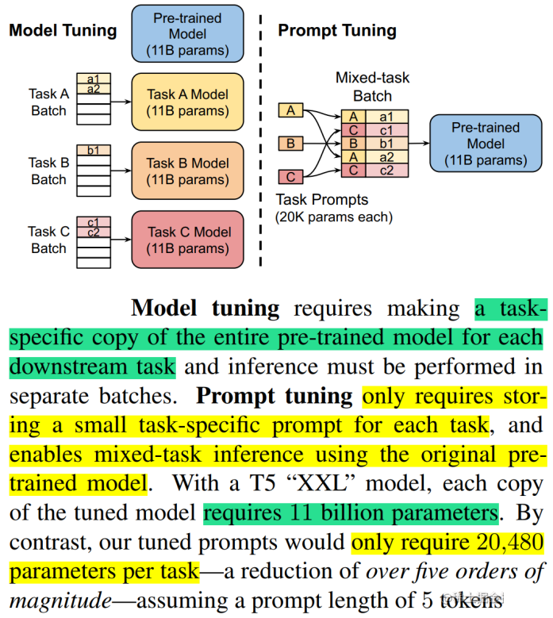
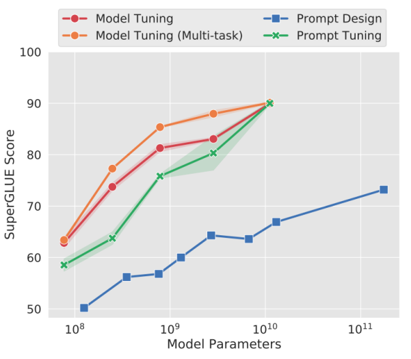
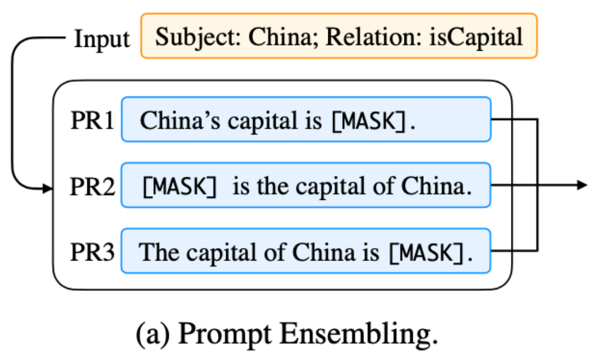

## 3. Prompt Tuning

Prompt Tuning，通过反向传播更新参数来学习prompts，而不是人工设计prompts；同时冻结模型原始权重，只训练prompts参数， 训练完以后，用同一个模型可以做多任务推理。

该方法可以看作是Prefix Tuning的简化版本，它给每个任务定义了自己的Prompt，然后拼接到数据上作为输入，但只在输入层加入prompt tokens，并且不需要加入 MLP 进行调整来解决难训练的问题。

#### Prompt Tuning 步骤
Prompt Tuning 在 fine-tuning 过程中的实现方式：

1. 定义 Prompt
	•	Prompt 是一段文本或 token 序列，通常是自然语言或有特定格式的模板，用于引导预训练语言模型生成目标输出。在 Prompt Tuning 中，Prompt 不直接改变模型的核心权重，而是引导模型生成想要的结果。
	•	在 Prompt Tuning 中，通常引入一个可训练的 嵌入向量（embedding），而不是直接修改传统的自然语言文本提示。

2. 创建可训练的 Prompt
	•	与传统的 Fine-Tuning 不同，Prompt Tuning 通过在输入中插入可学习的 虚拟 tokens 来定义 Prompt。这些虚拟 tokens 并不等同于自然语言提示，而是一些额外的 嵌入向量，它们在训练过程中会被调整。
	•	Prompt Embeddings（提示嵌入向量）是可以训练的参数，通常大小为一个小的向量集合。

3. 将 Prompt 嵌入与模型输入结合
	•	将这些 Prompt Embeddings 与实际的输入（如用户输入的文本）拼接，形成最终的模型输入。这些嵌入向量会影响模型对输入的理解和生成过程。
	•	示例：假设你想要做文本分类任务，你可以将预定义的 prompt 与文本数据拼接，然后一起输入到模型中。

4. 训练 Prompt
	•	通过 梯度下降 等优化算法，调整 Prompt Embeddings，使得它们能引导模型生成期望的输出（如文本分类标签、答案等）。
	•	在训练时，Prompt 是唯一被训练的部分，模型的其他参数保持冻结，不会更新。这种方法的优势是大大减少了训练时需要调整的参数数量，节省了计算资源。

5. 更新 Prompt Embeddings
	•	在训练过程中，模型将不断调整 Prompt Embeddings，以使得模型的输出与目标输出更匹配。
	•	这一步骤利用了 反向传播 机制，使得 Prompt Embeddings 能够根据损失函数的反馈调整其值。

6. 推理阶段
	•	在 fine-tuning 完成后，推理阶段只需要输入训练好的 Prompt Embeddings 和实际输入，模型就能生成目标输出。此时，不需要重新训练模型，只需要使用已经训练好的 Prompt。

通过实验发现，随着预训练模型参数量的增加，Prompt Tuning的方法会逼近全参数微调的结果。

同时，Prompt Tuning 还提出了 Prompt Ensembling，也就是在一个批次（Batch）里同时训练同一个任务的不同 prompt（即采用多种不同方式询问同一个问题），这样相当于训练了不同模型，比模型集成的成本小多了。

