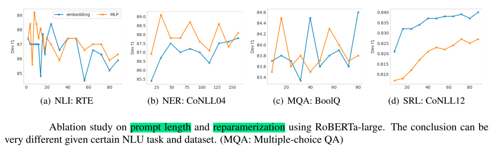

## 4. P-Tuning

P-Tuning 是通过 学习可训练的 prompt tokens 来引导预训练语言模型在特定任务上表现更好的微调方法。与传统的 Prompt Tuning 相比，P-Tuning 更加灵活、自动化，且能有效提高模型在不同任务中的适应性，同时减少计算开销。通过这一方法，模型能够根据任务需求优化输入的提示，而无需重新训练整个模型。

P-Tuning（论文：GPT Understands, Too），该方法将Prompt转换为可以学习的Embedding层，并用MLP+LSTM的方式来对Prompt Embedding进行一层处理。

P-Tuning 的特别之处在于它通过引入 可学习的 prompt tokens，并使用 embedding 表示的方式来引导模型理解和适应特定任务。这使得 P-Tuning 能够在计算效率上优于传统的 Fine-Tuning 方法，并且为每个任务自动学习任务特定的提示，从而提升少样本学习的能力。同时，它在大规模预训练模型上的应用表现出了显著的性能优势。

Virtual Token 的含义
1.	可微的 Token：
	•	传统的文本 token 通常是指模型输入中具体的词汇或符号（例如，“hello” 或 “dog”），这些 token 是预先定义好的，不会在训练过程中更新。而 virtual token 是一种 嵌入向量，它的值在训练过程中是 可微的，意味着这些向量可以通过反向传播进行更新和优化。
	•	在 P-Tuning 中，virtual token 通过梯度下降来优化，以适应特定的下游任务，而这些向量的值随着训练的进行而变化。
2.	替代传统的人工设计模板中的真实 Token：
	•	在传统的 Prompt Tuning 或 Prefix Tuning 中，模型的输入可能包括人工设计的真实文本 token，比如预设的任务提示语句（例如：“Translate this sentence into French: ”）。这些提示是固定的，不会根据数据或任务进行学习和调整。
	•	P-Tuning 采用 virtual token 替代了这些传统的固定文本 token。通过这种方式，模型能够通过训练 学习到更适合任务的提示，而不是依赖人工设计的静态模板。
3.	位置可变性：
	•	在 P-Tuning 中，virtual token 的位置是 可选的，即它们 不必总是位于输入的前缀部分。这与 Prefix Tuning 中的前缀设计不同，后者固定地将可训练的 tokens 添加到输入的开头部分。
	•	P-Tuning 可以将 virtual token 插入到输入序列中的任意位置，这使得模型能够在输入中 灵活地插入提示信息，从而提高任务适应性。
4.	仅限于输入层的可微 Tokens：
	•	P-Tuning 中的 virtual token 仅限于 输入层，意味着它们只在模型的输入阶段进行插入和优化，不会像在 Prefix Tuning 中那样在每一层都插入。
	•	这意味着 P-Tuning 并不会改变模型内部每一层的计算结构，只在输入层通过学习的 virtual token 来影响模型的行为。

经过预训练的LM的词嵌入已经变得高度离散，如果随机初始化virtual token，容易优化到局部最优值，而这些virtual token理论是应该有相关关联的。因此，作者通过实验发现用一个prompt encoder来编码会收敛更快，效果更好。即用一个LSTM+MLP去编码这些virtual token以后，再输入到模型。

从对比实验证实看出，P-Tuning获得了与全参数一致的效果。甚至在某些任务上优于全参数微调。

并且在实验中还发现，相同参数规模，如果进行全参数微调，Bert的在NLU任务上的效果，超过GPT很多；但是在P-Tuning下，GPT可以取得超越Bert的效果。

### P-Tuning v2

之前的Prompt Tuning和P-Tuning等方法存在两个主要的问题：

    第一，缺乏模型参数规模和任务通用性。

    缺乏规模通用性：***Prompt Tuning论文中表明当模型规模超过100亿个参数时，提示优化可以与全量微调相媲美***。但是对于那些较小的模型（从100M到1B），提示优化和全量微调的表现有很大差异，这大大限制了提示优化的适用性。

    缺乏任务普遍性：尽管Prompt Tuning和P-tuning在一些 NLU 基准测试中表现出优势，但提示调优对硬序列标记任务（即序列标注）的有效性尚未得到验证。

    第二，缺少深度提示优化，在Prompt Tuning和P-tuning中，连续提示只被插入transformer第一层的输入embedding序列中，在接下来的transformer层中，插入连续提示的位置的embedding是由之前的transformer层计算出来的，这可能导致两个可能的优化挑战。

    由于序列长度的限制，可调参数的数量是有限的。
    输入embedding对模型预测只有相对间接的影响。
    考虑到这些问题，作者提出了Ptuning v2，它利用深度提示优化（如：Prefix Tuning），对Prompt Tuning和P-Tuning进行改进，作为一个跨规模和NLU任务的通用解决方案。

##### 技术原理

P-Tuning v2（论文： P-Tuning v2: Prompt Tuning Can Be Comparable to Fine-tuning Universally Across Scales and Tasks），该方法在每一层都加入了Prompts tokens作为输入，而不是仅仅加在输入层，这带来两个方面的好处：

更多可学习的参数（从P-tuning和Prompt Tuning的0.01%增加到0.1%-3%），同时也足够参数高效。
加入到更深层结构中的Prompt能给模型预测带来更直接的影响。

具体做法基本同Prefix Tuning，可以看作是将文本生成的Prefix Tuning技术适配到NLU任务中，然后做了一些改进：

1. 移除重参数化的编码器。以前的方法利用重参数化功能来提高训练速度和鲁棒性（如：Prefix Tuning中的MLP、P-Tuning中的LSTM））。在 P-tuning v2 中，作者发现重参数化的改进很小，尤其是对于较小的模型，同时还会影响模型的表现。

2. 针对不同任务采用不同的提示长度。提示长度在提示优化方法的超参数搜索中起着核心作用。在实验中，我们发现不同的理解任务通常用不同的提示长度来实现其最佳性能，这与Prefix-Tuning中的发现一致，不同的文本生成任务可能有不同的最佳提示长度。

3. 引入多任务学习。先在多任务的Prompt上进行预训练，然后再适配下游任务。多任务学习对我们的方法来说是可选的，但可能是相当有帮助的。一方面，连续提示的随机惯性给优化带来了困难，这可以通过更多的训练数据或与任务相关的无监督预训练来缓解；另一方面，连续提示是跨任务和数据集的特定任务知识的完美载体。我们的实验表明，在一些困难的序列任务中，多任务学习可以作为P-tuning v2的有益补充。

4. 回归传统的分类标签范式，而不是映射器。标签词映射器（Label Word Verbalizer）一直是提示优化的核心组成部分，它将one-hot类标签变成有意义的词，以利用预训练语言模型头。尽管它在few-shot设置中具有潜在的必要性，但在全数据监督设置中，Verbalizer并不是必须的。它阻碍了提示调优在我们需要无实际意义的标签和句子嵌入的场景中的应用。因此，P-Tuning v2回归传统的CLS标签分类范式，采用随机初始化的分类头（Classification Head）应用于tokens之上，以增强通用性，可以适配到序列标注任务。

论文中展示了P-tuning v2在不同模型规模下的表现。对于简单的NLU任务，如SST-2（单句分类），Prompt Tuning和P-Tuning在较小的规模下没有显示出明显的劣势。但是当涉及到复杂的挑战时，如：自然语言推理（RTE）和多选题回答（BoolQ），它们的性能会非常差。相反，P-Tuning v2在较小规模的所有任务中都与微调的性能相匹配。并且，P-tuning v2在RTE中的表现明显优于微调，特别是在BERT中。

论文还通过消融实验研究了不同任务上Prompt Length的影响：

    针对简单任务：如情感分析，较短的Prompt（~20）即可取得不错的效果。
    针对复杂任务：如阅读理解，需要更长的Prompt（~100）。

总之，P-Tuning v2是一种在不同规模和任务中都可与微调相媲美的提示方法。P-Tuning v2对从330M到10B的模型显示出一致的改进，并在序列标注等困难的序列任务上以很大的幅度超过了Prompt Tuning和P-Tuning。P-Tuning v2可以成为微调的综合替代方案和未来工作的基线（Baseline）。

