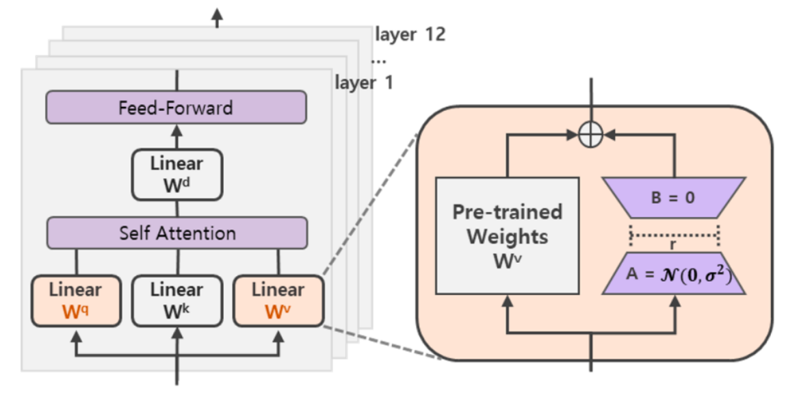
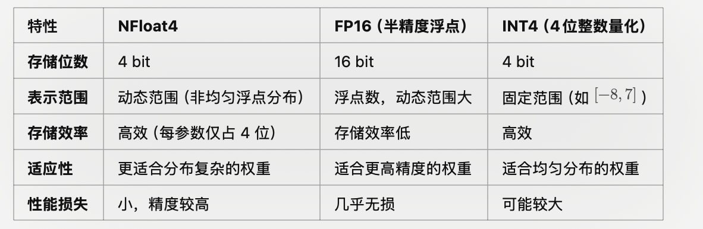

## 6. LoRA

神经网络包含很多全连接层，其借助于矩阵乘法得以实现，然而，很多全连接层的权重矩阵都是满秩的。
当针对特定任务进行微调后，模型中权重矩阵其实具有很低的本征秩（intrinsic rank），因此认为权重更新的那部分参数矩阵尽管随机投影到较小的子空间，仍然可以有效的学习，可以理解为针对特定的下游任务这些权重矩阵就不要求满秩。

LoRA（论文：LoRA: LOW-RANK ADAPTATION OF LARGE LANGUAGE MODELS），该方法的核心思想就是通过低秩分解来模拟参数的改变量，从而以极小的参数量来实现大模型的间接训练。

在涉及到矩阵相乘的模块，在原始的PLM旁边增加一个新的通路，通过前后两个矩阵A,B相乘，第一个矩阵A负责降维，第二个矩阵B负责升维，中间层维度为r，从而来模拟所谓的本征秩（intrinsic rank）。

可训练层维度和预训练模型层维度一致为d，先将维度d通过全连接层降维至r，再从r通过全连接层映射回d维度，其中，r<<d，r是矩阵的秩，这样矩阵计算就从d x d变为d x r + r x d，参数量减少很多。

在下游任务训练时，固定模型的其他参数，只优化新增的两个矩阵的权重参数，将PLM跟新增的通路两部分的结果加起来作为最终的结果（两边通路的输入跟输出维度是一致的），即h=Wx+BAx。第一个矩阵的A的权重参数会通过高斯函数初始化，而第二个矩阵的B的权重参数则会初始化为零矩阵，这样能保证训练开始时新增的通路BA=0从而对模型结果没有影响。

在推理时，将左右两部分的结果加到一起即可，h=Wx+BAx=(W+BA)x，所以只要将训练完成的矩阵乘积BA跟原本的权重矩阵W加到一起作为新权重参数替换原本PLM的W即可，对于推理来说，不会增加额外的计算资源。此外，Transformer的权重矩阵包括Attention模块里用于计算query, key, value的Wq，Wk，Wv以及多头attention的Wo,以及MLP层的权重矩阵，LoRA只应用于Attention模块中的4种权重矩阵，而且通过消融实验发现同时调整 Wq 和 Wv 会产生最佳结果。

实验还发现，保证权重矩阵的种类的数量比起增加隐藏层维度r更为重要，增加r并不一定能覆盖更加有意义的子空间。

那么关于秩的选择，通常情况下，rank为4，8，16即可。

通过实验也发现，在众多数据集上LoRA在只训练极少量参数的前提下，最终在性能上能和全量微调匹配，甚至在某些任务上优于全量微调。

### 6.2 AdaLoRA

在NLP领域，对于下游任务进行大型预训练语言模型的微调已经成为一种重要的做法。一般而言，我们会采用对原有的预训练模型进行全量微调的方法来适配下游任务，但这种方法存在两个问题。

1. 训练阶段。对于预训练模型进行微调的时候，为了更新权重参数，需要大量的显存来存储参数的梯度和优化器信息，在当今预训练模型的参数变得越来越大的情况下，针对下游任务微调门槛变得越来越高。
2. 推理阶段。由于我们训练的时候是对于模型参数进行全量的更新，所以多个下游任务需要为每个任务维护一个大型模型的独立副本，这样就导致我们在实际应用的时候浪费了不必要的存储。

为了解决这些问题，研究者提出了两个主要研究方向，以减少微调参数的数量，同时保持甚至提高预训练语言模型的性能。

方向一：添加小型网络模块：将小型网络模块添加到PLMs中，保持基础模型保持不变的情况下仅针对每个任务微调这些模块，可以用于所有任务。这样，只需引入和更新少量任务特定的参数，就可以适配下游的任务，大大提高了预训练模型的实用性。如：Adapter tuning、Prefix tuning、Prompt Tuning等，这类方法虽然大大减少了内存消耗。但是这些方法存在一些问题，比如：Adapter tuning引入了推理延时；Prefix tuning或Prompt tuning直接优化Prefix和Prompt是非单调的，比较难收敛，并且消耗了输入的token。

方向二：下游任务增量更新：对预训练权重的增量更新进行建模，而无需修改模型架构，即W=W0+△W。比如：Diff pruning、LoRA等， 此类方法可以达到与完全微调几乎相当的性能，但是也存在一些问题，比如：Diff pruning需要底层实现来加速非结构化稀疏矩阵的计算，不能直接使用现有的框架，训练过程中需要存储完整的∆W矩阵，相比于全量微调并没有降低计算成本。 LoRA则需要预先指定每个增量矩阵的本征秩 r 相同，忽略了在微调预训练模型时，权重矩阵的重要性在不同模块和层之间存在显著差异，并且只训练了Attention，没有训练FFN，事实上FFN更重要。

基于以上问题进行总结：

第一，我们不能预先指定矩阵的秩，需要动态更新增量矩阵的R，因为权重矩阵的重要性在不同模块和层之间存在显著差异。

第二，需要找到更加重要的矩阵，分配更多的参数，裁剪不重要的矩阵。找到重要的矩阵，可以提升模型效果；而裁剪不重要的矩阵，可以降低参数计算量，降低模型效果差的风险。

为了弥补这一差距，作者提出了AdaLoRA，它根据权重矩阵的重要性得分，在权重矩阵之间自适应地分配参数预算。

AdaLoRA（论文：ADAPTIVE BUDGET ALLOCATION FOR PARAMETEREFFICIENT FINE-TUNING），是对LoRA的一种改进，它根据**重要性评分动态分配参数预算给权重矩阵**。具体做法如下：

1. 调整增量矩分配。AdaLoRA将关键的增量矩阵分配高秩以捕捉更精细和任务特定的信息，而将较不重要的矩阵的秩降低，以防止过拟合并节省计算预算。
2. 以奇异值分解的形式对增量更新进行参数化，并根据重要性指标裁剪掉不重要的奇异值，同时保留奇异向量。由于对一个大矩阵进行精确SVD分解的计算消耗非常大，这种方法通过减少它们的参数预算来加速计算，同时，保留未来恢复的可能性并稳定训练。
3. 在训练损失中添加了额外的惩罚项，以规范奇异矩阵P和Q的正交性，从而避免SVD的大量计算并稳定训练。

通过实验证明，AdaLoRA 实现了在所有预算、所有数据集上与现有方法相比，性能更好或相当的水平。 例如，当参数预算为 0.3M 时，AdaLoRA 在RTE数据集上，比表现最佳的基线（Baseline）高 1.8%。

### 6.3 QLoRA

微调大型语言模型 (LLM) 是提高其性能以及添加所需或删除不需要的行为的一种非常有效的方法。然而，微调非常大的模型非常昂贵；以 LLaMA 65B 参数模型为例，常规的 16 bit微调需要超过 780 GB 的 GPU 内存。
虽然最近的量化方法可以减少 LLM 的内存占用，但此类技术仅适用于推理场景。
QLoRA，并首次证明了可以在不降低任何性能的情况下微调量化为 4 bit的模型。

QLoRA（论文： QLORA: Efficient Finetuning of Quantized LLMs），使用一种新颖的高精度技术将预训练模型量化为 4 bit，然后添加一小组可学习的低秩适配器权重，这些权重通过量化权重的反向传播梯度进行微调。

QLORA 有一种低精度存储数据类型（4 bit），还有一种计算数据类型（BFloat16）。
实际上，这意味着无论何时使用 QLoRA 权重张量，我们都会将张量反量化为 BFloat16，然后执行 16 位矩阵乘法。

QLoRA提出了两种技术实现高保真 4 bit微调——4 bit NormalFloat(NF4) 量化和双量化。
此外，还引入了分页优化器，以防止梯度检查点期间的内存峰值，从而导致内存不足的错误，这些错误在过去使得大型模型难以在单台机器上进行微调。具体说明如下：

4bit NormalFloat（NF4）：对于正态分布权重而言，一种信息理论上最优的新数据类型，该数据类型对正态分布数据产生比 4 bit整数和 4bit 浮点数更好的实证结果。

双量化：对第一次量化后的那些常量再进行一次量化，减少存储空间。

分页优化器：使用NVIDIA统一内存特性，该特性可以在在GPU偶尔OOM的情况下，进行CPU和GPU之间自动分页到分页的传输，以实现无错误的 GPU 处理。
该功能的工作方式类似于 CPU 内存和磁盘之间的常规内存分页。
使用此功能为***优化器状态（Optimizer）分配分页内存**，然后在 GPU 内存不足时将其自动卸载到 CPU 内存，并在优化器更新步骤需要时将其加载回 GPU 内存。

实验证明，无论是使用16bit、8bit还是4bit的适配器方法，都能够复制16bit全参数微调的基准性能。这说明，尽管量化过程中会存在性能损失，但通过适配器微调，完全可以恢复这些性能。

实验还比较了不同的4bit数据类型对效果（zero-shot均值）的影响，其中，NFloat 显著优于Float，而NFloat + DQ略微优于NFloat，虽然DQ对精度提升不大，但是对于内存控制效果更好。

除此之外，论文中还对不同大小模型、不同数据类型、在 MMLU数据集上的微调效果进行了对比。使用QLoRA（NFloat4 + DQ）可以和Lora(BFloat16)持平，同时， 使用QLORA（ FP4）的模型效果落后于前两者一个百分点。

NFloat4 是 4-bit quantization（4位量化）的一种变体，它专门设计用于在保持更高数值范围和分辨率的同时，显著减少存储和内存需求。

1.	非均匀量化（Non-uniform Quantization）：
	•	NFloat4 的核心思想是通过非均匀分布的浮点值来表示权重，而不是均匀分布的固定步长（如 INT4）。
	•	与标准的 INT4（整数量化）相比，NFloat4 的量化点更接近模型权重的分布，这提高了量化的精确性。
2.	动态范围：
	•	NFloat4 通过浮点表示来覆盖更大的动态范围（类似 FP16），而不像传统 INT4 那样限制在一个固定的区间（如 [-8, 7]）。
	•	这种动态范围可以更好地适应大模型权重中可能存在的稀疏性和极值。
3.	每个值占用 4 位：
	•	每个权重用 4 bit 存储，比 FP16 更加紧凑（FP16 每个权重占 16 位）。

动态解量化增加了一定的计算复杂性，需要额外的硬件支持或优化。

•	NFloat4 是一种 非均匀量化的 4-bit 浮点表示，旨在减少存储需求，同时保留较高的数值范围和精度。
•	DQ（动态解量化） 允许模型在低精度存储的基础上，在计算时恢复高精度表示，保证计算精度。
•	与传统量化方法（如 INT4 和 FP16）相比，NFloat4 提供了更高效的存储和更好的适应性，是 QLoRA 的核心创新之一。

实验中也发现了一些有趣的点，比如：指令调优虽然效果比较好，但只适用于指令相关的任务，在聊天机器人上效果并不佳，而聊天机器人更适合用Open Assistant数据集去进行微调。通过指令类数据集的调优更像是提升大模型的推理能力，并不是为聊天而生的。

总之，QLoRA的出现给大家带来一些新的思考，不管是微调还是部署大模型，之后都会变得更加容易。每个人都可以快速利用自己的私有数据进行微调；同时，又能轻松的部署大模型进行推理。
