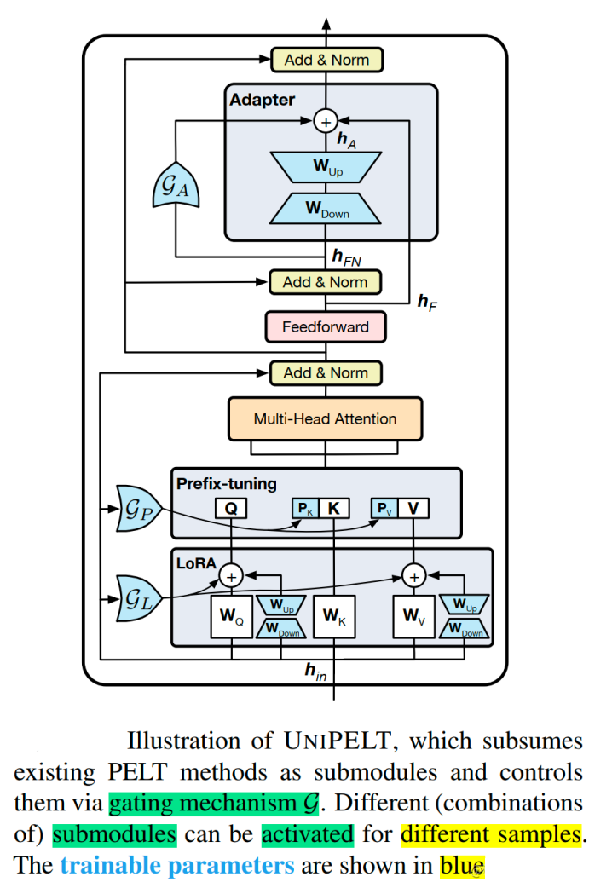
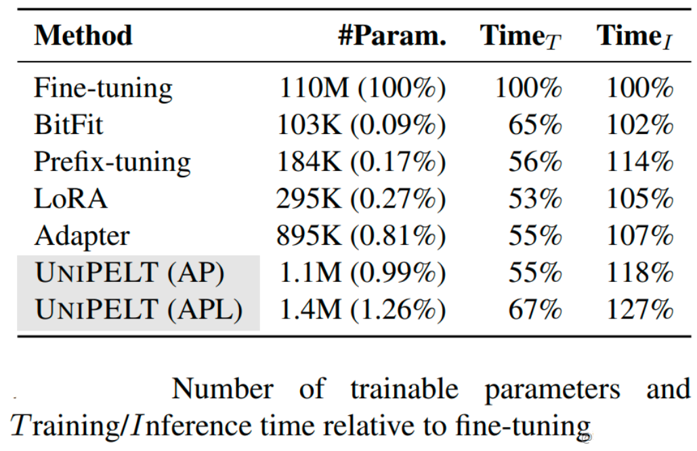

6. UniPELT

涌现出了许多针对语言模型的参数高效微调（PELT）方法，在模型训练参数极大的减少的情况下，模型效果与全量微调相当。
但是不同的PELT方法在同一个任务上表现差异可能都非常大，这让针对特定任务选择合适的方法非常繁琐。

UniPELT方法，将不同的PELT方法作为子模块，并通过门控机制学习激活最适合当前数据或任务的方法。

UniPELT（论文： UNIPELT: A Unified Framework for Parameter-Efficient Language Model Tuning）是 LoRA、Prefix Tuning和Adapter的门控组合。

更具体地说，LoRA 重新参数化用于 WQ 和 WV 注意力矩阵，Prefix Tuning应用于每一Transformer层的key和value，并在Transformer块的feed-forward子层之后添加Adapter。 对于每个模块，门控被实现为线性层，通过GP参数控制Prefix-tuning方法的开关，GL控制LoRA方法的开关，GA控制Adapter方法的开关。可训练参数包括 LoRA 矩阵 WA（Down）和WB（Up），提示调优参数Pk和Pv、Adapter参数和门函数权重。即图中蓝颜色的参数为可学习的参数。

UniPELT 仅用 100 个示例就在低数据场景中展示了相对于单个 LoRA、Adapter 和 Prefix Tuning 方法的显著改进。在更高数据的场景中，UniPELT 的性能与这些方法相当或更好。

实验还对不同 PELT 方法训练时间和推理时间进行了分析。

从训练速度来看，UniPELT比之前微调的方法多一些，但是还在能接受的范围，
从推理时间来看，BitFit方法增加的最少，UniPELT方法时间增加了27%。
从训练参数量来看，LoRA，BitFit，Prefix-tuning都比较小，UniPELT参数量相对会多一些。

本方法始终优于常规的全量微调以及它在不同设置下包含的子模块，通常超过在每个任务中单独使用每个子模块的最佳性能的上限；并且，通过研究结果表明，多种 PELT 方法的混合涉及到PLM 的不同部分可能对模型有效性和鲁棒性都有好处。

