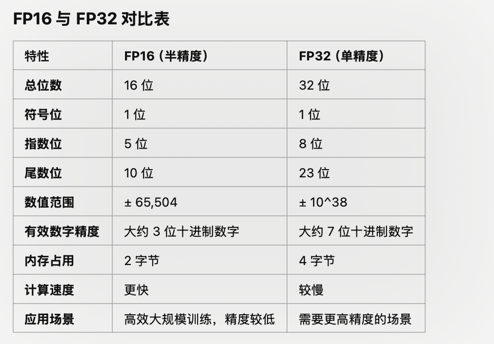
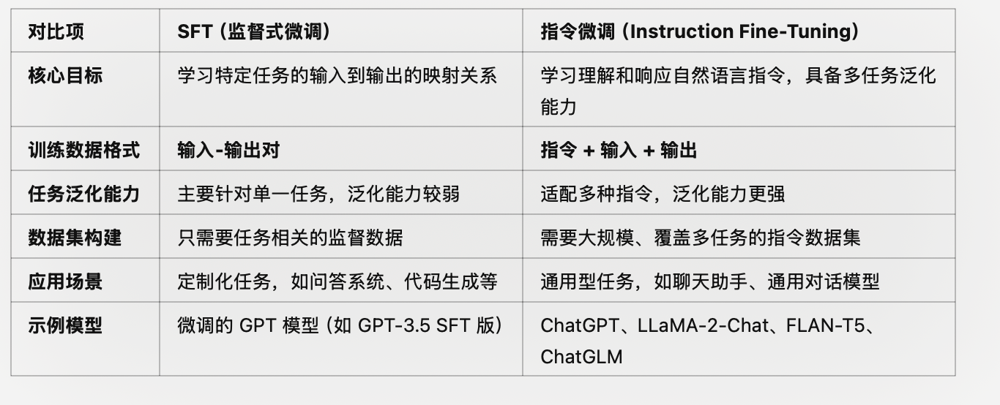

## 微调常见问题分析

1. 如果想要在某个模型基础上做全参数微调，究竟需要多少显存？

要确定进行全参数微调所需的显存量，需要考虑以下几个因素：

1) 模型的大小：
   模型的大小是影响所需显存量的一个主要因素。较大的模型通常需要更多的显存来存储模型的参数和中间计算结果。例如，GPT-3 模型拥有数十亿个参数，相比之下，较小的模型如GPT-2可能只有几亿个数。

2) 批次大小（Batch Size）：
   批次大小是指一次性输入到模型进行处理的样本数量。较大的批次大小通常需要更多的显存，因为模型需要同时存储和处理更多的输入数据。批次大小的选择通常是根据显存容量和性能需求进行平衡的

3) 输入序列长度：
   如果你的任务涉及到处理长序列文本，例如长篇文章或整个文档，那么输入序列的长度也会对显存需求产生影响。较长的序列需要更多的显存来存储序列的表示和中间计算结果。

4) 计算平台和优化:
   不同的计算平台和深度学习框架可能在显存使用方面存在差异。一些框架可能会提供显存优化的功能，以减少显存的使用。
   例如:
    梯度检查点（Gradient Checkpointing）：梯度检查点通过丢弃部分中间激活值，在反向传播阶段需要时重新计算它们，以换取更少的内存使用。
        	
            •	标准反向传播：所有中间激活值都会被缓存以供梯度计算。
	        •	梯度检查点：在前向传播时，只保存部分“检查点”的激活值，其余激活值不保存。在反向传播时，通过重新执行前向传播重新计算未保存的激活值。

    混合精度训练（Mixed Precision Training）：通过同时使用 不同精度（如 FP16 和 FP32） 来加速模型训练并减少内存使用的技术
            •	使用 FP16（半精度浮点数） 进行大部分计算（如矩阵乘法），因为它可以显著提高计算速度并减少显存占用。例如：  FP16 数字：1.234，大约 3 位有效数字，这导致其精度较低，但能有效减少内存开销。
	        •	保持一些关键变量（如权重梯度的累加）在 FP32（单精度浮点数） 下计算，以确保训练过程的数值稳定性。 例如：FP32 数字：1.2345678，大约保留 7 位有效数字的浮点数，适合精确度要求较高的计算场景。
    使用 FP16 计算比 FP32 更快，尤其在现代 GPU 上，性能提升明显（如 NVIDIA 的 Tensor Cores 支持 FP16 加速）。
    FP16 占用的内存是 FP32 的一半，可以训练更大的模型或者使用更大的 batch size。
    在相同时间内，可以完成更多的训练步骤。

    缺点：
	1.	数值不稳定性：FP16 精度较低，可能导致梯度下溢（Underflow）或上溢（Overflow），影响训练稳定性。
	2.	需要梯度缩放器：为了解决精度问题，需要引入 梯度缩放 机制，增加了一些额外的实现复杂性。
	3.	依赖硬件支持：混合精度训练需要 GPU 支持 FP16（如 NVIDIA V100、A100 等支持 Tensor Cores）。

***更加极致的压缩，比如 int4 量化在模型推理和部署阶段相比 FP32 和 FP16，int4 可以大幅度减少内存占用和加速计算，但也会牺牲一定的精度***
int4（4位整数）
	•	位数：4 位整数。
	•	数值范围：-8  到 +7（有符号整数）或者 0 到 15（无符号整数）。
	•	内存占用：每个数字仅占 0.5 字节，是 FP32 的 1/8，FP16 的 1/4。
	•	计算速度：由于数值精度低，适合部署在低功耗设备上，并能大幅提高计算效率。
int4 量化属于 低比特量化技术，通常有以下两种实现方式：

      1. 权重量化（Weights Quantization）

      将模型权重从 FP32 转换为 int4。
      	•	原理：将模型的权重映射到 int4 的数值范围，然后使用一个缩放因子将其还原到原始数值范围。
      	•	公式：

      w_{\text{int4}} = \text{round}(w_{\text{fp32}} / s)

      	•	w_{\text{fp32}}：原始权重。
      	•	s：缩放因子，保证 int4 精度范围内的数值可以尽量逼近原始权重。
      	•	w_{\text{int4}}：量化后的 int4 权重。

      2. 权重与激活量化（Weights & Activations Quantization）

      将权重和激活值同时量化为 int4，这种方法进一步减少内存开销和计算量。

      ***int4 精度虽然不足以支撑复杂任务（如聊天、代码生成），但在图片分类、目标检测、推荐系统 和 边缘设备的轻量级推理任务 中非常适用。通过量化，可以实现大幅度的内存和计算效率提升，特别是在资源受限的硬件上。***
      场景：
      	•	语音唤醒：简单的关键词识别（如“你好，小爱”）。
      	•	手势识别：基于摄像头的简单手势分类。
      	•	环境监测：如判断设备当前的温度、湿度等状态。

2. 为什么SFT之后感觉LLM傻了?

在进行Supervised Fine-Tuning（SFT）之后，有时可能会观察到基座模型（如语言模型）的性能下降或产生一些“傻”的行为。这可能是由于以下原因：

1)   数据偏移：SFT过程中使用的微调数据集可能与基座模型在预训练阶段接触到的数据分布有所不同。如果微调数据集与预训练数据集之间存在显著的差异，模型可能会在新任务上表现较差。这种数据偏移可能导致模型在新任务上出现错误的预测或不准确的输出。

2)   非典型标注：微调数据集的标注可能存在错误或不准确的标签。这些错误的标签可能会对模型的性能产生负面影响，导致模型产生“傻”的行为。

3)   过拟合：如果微调数据集相对较小，或者模型的容量（参数数量）较大，模型可能会过拟合微调数据，导致在新的输入上表现不佳。过拟合可能导致模型过于依赖微调数据的特定样本，而无法泛化到更广泛的输入。

4)   缺乏多样性：微调数据集可能缺乏多样性，未能涵盖模型在新任务上可能遇到的各种输入情况。这可能导致模型在面对新的、与微调数据集不同的输入时出现困惑或错误的预测。

为了解决这些问题，可以尝试以下方法：

1) 收集更多的训练数据，以增加数据的多样性和覆盖范围。
2) 仔细检查微调数据集的标注，确保标签的准确性和一致性。
3) 使用正则化技术（如权重衰减、dropout）来减少过拟合的风险。
4) 进行数据增强，通过对微调数据进行一些变换或扩充来增加多样性。
5) 使用更复杂的模型架构或调整模型的超参数，以提高模型的性能和泛化能力。

通过这些方法，可以尽量减少Supervised Fine-Tuning之后模型出现“傻”的情况，并提高模型在新任务上的表现。

3. 进行SFT操作的时候，基座模型选用Chat还是Base?

在进行Supervised Fine-Tuning（SFT）操作时，基座模型的选择也可以根据具体情况来决定。与之前的SFT操作不同，这次的目标是在特定的监督任务上进行微调，因此选择基座模型时需要考虑任务的性质和数据集的特点。

如果监督任务是对话生成相关的，比如生成对话回复或对话情感分类等，那么选择ChatGPT模型作为基座模型可能更合适。ChatGPT模型在对话生成任务上进行了专门的优化和训练，具有更好的对话交互能力。

然而，如果监督任务是单轮文本生成或非对话生成任务，那么选择Base GPT模型作为基座模型可能更合适。Base GPT模型在单轮文本生成和非对话生成任务上表现良好，可以提供更准确的文本生成能力。

4. 领域数据训练后，通用能力往往会有所下降，如何缓解模型遗忘通用能力？

当使用领域数据进行训练后，模型往往会出现遗忘通用能力的问题。以下是一些缓解模型遗忘通用能力的方法：

      1. 保留通用数据：在进行领域数据训练时，仍然需要保留一部分通用数据用于模型训练。这样可以确保模型仍然能够学习到通用的语言和知识，从而保持一定的通用能力。
      2. 增量学习：使用增量学习（Incremental Learning）的方法，将领域数据与通用数据逐步交替进行训练。这样可以在学习新领域的同时，保持对通用知识的记忆。
      3. 预训练和微调：在领域数据训练之前，可以使用大规模通用数据进行预训练，获得一个通用的基础模型。然后，在领域数据上进行微调，以适应特定领域的任务。这样可以在保留通用能力的同时，提升领域任务的性能。
      4. 强化学习：使用强化学习的方法，通过给模型设置奖励机制，鼓励模型在领域任务上表现好，同时保持一定的通用能力。
      5. 领域适应技术：使用领域适应技术，如领域自适应（Domain Adaptation）和领域对抗训练（Domain Adversarial Training），帮助模型在不同领域之间进行迁移学习，从而减少遗忘通用能力的问题。
      6. 数据重采样：在进行领域数据训练时，可以使用数据重采样的方法，使得模型在训练过程中能够更多地接触到通用数据，从而缓解遗忘通用能力的问题。

综合使用上述方法，可以在一定程度上缓解模型遗忘通用能力的问题，使得模型既能够适应特定领域的任务，又能够保持一定的通用能力。

5. 想让模型学习某个领域或行业的知识，是应该预训练还是应该微调？

如果你想让模型学习某个特定领域或行业的知识，一般建议使用微调（Fine-tuning） 的方法。

预训练模型通常是在大规模通用数据上进行预训练，以学习通用的语言知识和表示能力。虽然预训练模型可以在各种任务上表现出色，但它们的训练并未针对特定领域或行业进行优化。因此，如果希望模型具备特定领域的专业知识，微调是更合适的选择。

在微调阶段，可以使用特定领域的数据来微调预训练模型，使其适应该领域的任务和语境。通过在特定领域的数据集上进行微调，模型可以学习到该领域的专业术语、实体关系、特定语义和上下文等。微调过程可以使模型更好地理解和处理与特定领域相关的文本数据，从而提高模型在该领域任务上的性能。

需要注意的是，微调需要在预训练模型的基础上进行，因此你需要首先选择适合你任务的预训练模型，如BERT、GPT等，然后使用特定领域的数据进行微调。微调过程中，可以根据任务需求和数据情况，调整微调的超参数，如学习率、微调步数等。

6. 指令微调的好处

监督式微调（SFT）：是指在预训练模型的基础上，利用人工标注的 输入-输出对（监督数据）进一步训练模型。让模型学会特定任务的映射关系（如回答问题、总结文本等）。格式一般是简单的输入-输出对，重点是让模型产生正确输出，主要依赖监督数据。SFT 常用于定制化任务，如训练一个问答系统、代码生成模型或文本分类器。

指令微调（Instruction Fine-Tuning）：指令微调是在 SFT 的基础上进一步强调指令驱动的任务执行能力。通过训练，模型学会根据不同指令完成各种任务。模型理解并响应自然语言指令，具备更好的泛化能力，能够根据指令生成期望的内容。训练数据包含指令、输入和输出三部分，通常格式为：

指令：Summarize the following paragraph.
输入：Deep learning has revolutionized the AI field...
输出：Deep learning has greatly advanced artificial intelligence.

数据集覆盖各种任务类型（总结、翻译、代码生成、问答等），增强模型的多任务泛化能力。而不是单一的问答等
指令微调是大语言模型（如 GPT 系列）在多任务场景中表现优异的关键，例如在聊天、代码生成、摘要、翻译等多个任务中切换自如。

指令微调（Instruction Fine-Tuning）是一种在预训练模型上进行微调的方法，其中模型接收指令或约束来生成特定的输出。指令微调具有以下几个好处：

1) 控制生成输出：指令微调使得模型能够根据指定的指令或约束生成特定的输出。这对于需要精确控制模型生成结果的任务非常有用，例如自然语言生成任务中的文本摘要、翻译或对话系统。
2) 可解释性和可控性：通过指令微调，可以将任务的要求以指令的形式传达给模型。这增加了模型的可解释性和可控性，使得用户能够更好地理解和干预模型的生成过程。
3) 避免不符合要求的输出：通过指令微调，可以避免模型生成不符合任务要求或偏离期望的输出。通过明确的指令或约束，模型能够更好地遵循任务的要求，并生成符合期望的结果。
4) 提高任务性能：指令微调可以针对具体任务进行优化，使得模型在该任务上的性能得到提升。通过引入任务特定的指令或约束，模型可以更好地适应特定任务的需求，并生成更准确、更合理的输出。
5) 灵活性和可扩展性：指令微调是一种灵活且可扩展的方法，允许在不同任务和场景中进行微调。通过调整和修改指令或约束，可以适应不同的任务需求，并在多个任务上进行微调。
请注意，指令微调需要提供明确的指令或约束，并对模型进行适当的调整和微调。在实践中，需要根据具体任务和应用场景来决定是否采用指令微调以及如何设计和实施指令。

7. 多轮对话任务如何微调模型

在多轮对话任务中，微调模型的目标是使其能够更好地理解和生成连续的对话内容，并具备上下文理解和一致性回复的能力。下面是一种常见的微调模型的方法：

1) 数据准备：收集或创建适用于多轮对话任务的数据集，包括对话文本和相应的标签或回复。确保数据集中包含上下文信息和对话的连续性。
2) 构建输入输出格式：将对话数据转换为适合模型输入的格式。通常情况下，输入可以是包含多个对话轮次的上下文文本，输出可以是下一轮对话的回复或标签。
3) 模型选择：选择适合多轮对话任务的预训练模型，如DialoGPT、BERT等。这些模型已经在大规模对话数据上进行了预训练，并具备一定的对话理解和生成能力。
4) 微调模型：使用多轮对话数据集对预训练模型进行微调。微调的过程通常包括以下步骤：
    a) 初始化模型参数：将预训练模型的参数加载到模型中。
    b) 定义损失函数：根据任务要求，定义适当的损失函数，如交叉熵损失函数或生成模型中的对抗损失函数。
    c) 进行反向传播和参数更新：根据损失函数，通过反向传播算法计算梯度，并更新模型参数。
    d) 重复训练步骤：重复进行微调步骤，直到模型在验证集上达到满意的性能。
5) 超参数调优：根据任务需求和数据情况，调整微调过程中的超参数，如学习率、批大小、微调步数等。可以使用验证集来评估模型性能并选择最佳的超参数配置。
6) 评估和测试：使用测试集对微调后的模型进行评估和测试，评估模型在多轮对话任务上的性能和表现。

需要注意的是，微调多轮对话模型时，除了常规的微调方法，还可以采用一些特定的技巧，***如引入对话历史的注意力机制、使用特定的对话策略进行训练等**，以进一步提升模型在多轮对话任务中的性能。

如果对话历史很长，可以使用如下技术：
	•	Transformer 的优化变体：
	        Longformer、BigBird 等长上下文处理模型。（在对话管理系统中实现（如 Rasa）或使用自定义代码。）
	•	稀疏注意力机制：
	        仅对历史中关键位置进行注意力计算，例如上一轮或关键的主题句。（Hugging Face Transformers 中可以集成基于句向量的相似度计算来执行此操作。）
	•	对话裁剪策略：
	        删除与当前对话无关的历史，保留核心信息。（Longformer 和 BigBird 等稀疏注意力框架可以用于此类操作。）

•	稀疏注意力机制通过减少每个 token 之间的计算量，提高了处理长文本和长对话的效率，常用的实现框架包括 Longformer 和 BigBird。
•	对话裁剪策略则通过动态或固定长度裁剪对话历史，减少了不必要的信息处理，优化了多轮对话的响应速度和内存使用。

8. 样本量规模增大，训练出现OOM错

当在大语言模型训练过程中，样本量规模增大导致内存不足的情况出现时，可以考虑以下几种解决方案：
1) 减少批量大小（Batch Size）：将批量大小减小可以减少每个训练步骤中所需的内存量。较小的批量大小可能会导致训练过程中的梯度估计不稳定，但可以通过增加训练步骤的数量来弥补这一问题。
2) 分布式训练：使用多台机器或多个GPU进行分布式训练可以将训练负载分散到多个设备上，从而减少单个设备上的内存需求。通过分布式训练，可以将模型参数和梯度在多个设备之间进行同步和更新。
3) 内存优化技术：使用一些内存优化技术可以减少模型训练过程中的内存占用。例如，使用**混合精度训练（Mixed Precision Training）可以减少模型参数的内存占用；使用梯度累积（Gradient Accumulation）**可以减少每个训练步骤中的内存需求。
4) 减少模型规模：如果内存问题仍然存在，可以考虑减少模型的规模，例如减少模型的层数、隐藏单元的数量等。虽然这可能会导致模型性能的一定损失，但可以在一定程度上减少内存需求。
5) 增加硬件资源：如果条件允许，可以考虑增加硬件资源，例如增加内存容量或使用更高内存的设备。这样可以提供更多的内存空间来容纳更大规模的训练数据。
6) 数据处理和加载优化：优化数据处理和加载过程可以减少训练过程中的内存占用。例如，可以使用数据流水线技术来并行加载和处理数据，减少内存中同时存在的数据量。

综上所述，当在大语言模型训练中遇到内存不足的问题时，可以通过减小批量大小、分布式训练、内存优化技术、减少模型规模、增加硬件资源或优化数据处理等方式来解决。具体的解决方案需要根据具体情况进行选择和调整。

9. 大模型LLM进行SFT 如何对样本进行优化？

对于大语言模型进行有监督微调（Supervised Fine-Tuning）时，可以采用以下几种方式对样本进行优化：
1) 数据清洗和预处理：对于有监督微调的任务，首先需要对样本数据进行清洗和预处理。这包括去除噪声、处理缺失值、进行标准化或归一化等操作，以确保数据的质量和一致性。
2) 数据增强：通过数据增强技术可以扩充训练数据，增加样本的多样性和数量。例如，可以使用数据扩充方法如随机裁剪、旋转、翻转、加噪声等来生成新的训练样本，从而提高模型的泛化能力。
3) 标签平衡：如果样本标签不平衡，即某些类别的样本数量远远多于其他类别，可以采取一些方法来平衡样本标签。例如，可以通过欠采样、过采样或生成合成样本等技术来平衡不同类别的样本数量。
4) 样本选择：在有限的资源和时间下，可以选择一部分具有代表性的样本进行微调训练。可以根据任务的需求和数据分布的特点，选择一些关键样本或难样本进行训练，以提高模型在关键样本上的性能。
5) 样本权重：对于一些重要的样本或困难样本，可以给予更高的权重，以便模型更加关注这些样本的学习。可以通过调整损失函数中样本的权重或采用加权采样的方式来实现。
6) 样本组合和分割：根据任务的特点和数据的结构，可以将多个样本组合成一个样本，或将一个样本分割成多个子样本。这样可以扩展训练数据，提供更多的信息和多样性。
7) 样本筛选和策略：根据任务需求，可以制定一些样本筛选和选择策略。例如，可以根据样本的置信度、难度、多样性等指标进行筛选和选择，以提高模型的性能和泛化能力。

总的来说，对大语言模型进行有监督微调时，可以通过数据清洗和预处理、数据增强、标签平衡、样本选择、样本权重、样本组合和分割、样本筛选和策略等方式对样本进行优化。这些优化方法可以提高训练样本的质量、多样性和数量，从而提升模型的性能和泛化能力。具体的优化策略需要根据任务需求和数据特点进行选择和调整。

样本权重与强化学习的区别:

尽管样本权重调整和强化学习在某些方面有相似之处（例如，通过“奖励”或“加权”来关注某些特定的样本或状态），它们之间存在显著的区别。

1. 样本权重与强化学习的本质区别

	•	样本权重：在监督学习中，样本权重通常是静态的，即在整个训练过程中不会变化。模型通过计算加权损失来调整其参数，目的是让模型更加关注那些重要的或困难的样本。这种方法是一次性的，只在训练阶段影响模型。
	•	强化学习：在强化学习中，智能体通过与环境的交互来学习。强化学习的目标是最大化累积奖励，在这个过程中，奖励是动态的，通常是随着智能体的行为和环境反馈而变化的。强化学习涉及探索和利用的过程，智能体根据奖励信号来调整策略，而不仅仅是关注某些特定的样本。

2. 样本权重和强化学习的学习方式
	•	样本权重：通过给样本加权，模型在训练中更加关注某些特定的样本，这种权重通常是通过经验或预定义的规则（例如困难样本的标注）来设定。它是静态的，适用于监督学习。

	•	强化学习：强化学习中的奖励信号是实时计算的，它基于智能体当前的动作以及当前环境的反馈来生成。这些奖励信号动态变化，影响智能体的行为决策，通常与时间和状态变化密切相关。

3. 操作方式
	•	样本权重调整：通过加权损失函数或加权采样等方式来影响训练的重点，模型并不依赖外部的奖励机制，而是通过调整损失函数中的权重来优化模型的表现。
	•	强化学习：在强化学习中，智能体会通过奖励信号来更新其策略（如 Q-learning、策略梯度等方法）。在这种设置中，奖励来自环境，并且通常随着时间和状态的变化而动态调整。

10. 模型参数迭代实验

模型参数迭代实验是指通过多次迭代更新模型参数，以逐步优化模型性能的过程。
在实验中，可以尝试不同的参数更新策略、学习率调整方法、正则化技术等，以找到最佳的参数配置，从而达到更好的模型性能。

下面是一个基本的模型参数迭代实验过程：
1) 设定初始参数：首先，需要设定初始的模型参数。可以通过随机初始化或使用预训练模型的参数作为初始值。
2) 选择损失函数：根据任务的特点，选择适当的损失函数作为模型的优化目标。常见的损失函数包括均方误差（MSE）、交叉熵损失等。
3) 选择优化算法：选择适当的优化算法来更新模型参数。常见的优化算法包括随机梯度下降（SGD）、Adam、Adagrad等。可以尝试不同的优化算法，比较它们在模型训练过程中的效果。
4) 划分训练集和验证集：将样本数据划分为训练集和验证集。训练集用于模型参数的更新，验证集用于评估模型性能和调整超参数。
5) 迭代更新参数：通过多次迭代更新模型参数来优化模型。每次迭代中，使用训练集的一批样本进行前向传播和反向传播，计算损失函数并更新参数。可以根据需要调整批量大小、学习率等超参数。
6) 评估模型性能：在每次迭代的过程中，可以使用验证集评估模型的性能。可以计算准确率、精确率、召回率、F1值等指标，以及绘制学习曲线、混淆矩阵等来分析模型的性能。
7) 调整超参数：根据验证集的评估结果，可以调整超参数，如学习率、正则化系数等，以进一步提升模型性能。可以使用网格搜索、随机搜索等方法来寻找最佳的超参数配置。
8) 终止条件：可以设置终止条件，如达到最大迭代次数、模型性能不再提升等。当满足终止条件时，结束模型参数迭代实验。

通过模型参数迭代实验，可以逐步优化模型性能，找到最佳的参数配置。在实验过程中，需要注意过拟合和欠拟合等问题，并及时调整模型结构和正则化技术来解决。同时，要进行合理的实验设计和结果分析，以得到可靠的实验结论。