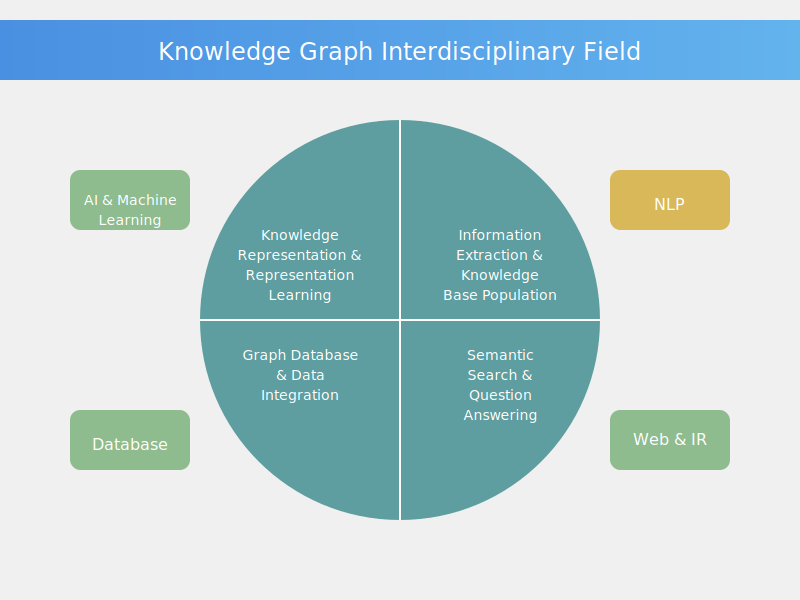

# 知识图谱

## 1. 知识图谱的定义

知识图谱是结构化知识表示的一种形式，它将知识组织成一个多关系图，其中节点表示实体，边表示实体之间的关系。
知识图谱可以表示实体之间的语义关系，帮助机器理解和推理自然语言文本。

支持用户按主题而不是字符串检索，真正实现语义检索。
基于知识图谱的搜索引擎，能够以图形方式向用户反馈结构化的知识，不必浏览大量文档即能准确定位和深度获取知识。

知识图谱（ Knowledge Graph）的概念由谷歌2012年正式提出，旨在实现更智能的搜索引擎，并且于2013年以后开始在学术界和业界普及。
下图就是goolge搜索中的结果，不仅仅给出了pagerank，还给出了知识图谱的搜索结果：


目前，随着智能信息服务应用的不断发展，知识图谱已被广泛应用于智能搜索、智能问答、个性化推荐、情报分析、反欺诈等领域。
另外，通过知识图谱能够将Web上的信息、数据以及链接关系聚集为知识，使信息资源更易于计算、理解以及评价，并且形成一套Web语义知识库。
知识图谱以其强大的语义处理能力与开放互联能力，可为万维网上的知识互联奠定扎实的基础，使Web 3.0提出的“知识之网”愿景成为了可能。
但是如果要继续追溯的话，需要追溯到20世纪60年代提出语义网络 (Semantic Networks)。但是发展脉络如下：


知识图谱的覆盖了知识图谱的表示、存储、获取、推理、融合、问答、分析等七大方面。其中囊括知识图谱与其他学科领域的融合发展，大致分成如下四个方面：


### 1.1知识图谱的组成

知识图谱主要由以下几个部分组成：

#### 1.1.1 实体

实体是知识图谱中的基本单元，通常是名词或概念。实体可以是具体的对象（如人、地点、物品）或抽象的概念（如概念、类别）。

#### 1.1.2 关系

关系是知识图谱中实体之间的连接，表示实体之间的语义关系。关系可以是二元的（表示两个实体之间的关系）或多元的（表示多个实体之间的关系）。

## 2. 知识图谱中的知识表示

知识表示的核心是通过某种形式来描述、组织和存储知识，便于机器理解与推理。
知识表示主要用途如图所示：


而知识表示主要表示方法有：


### 2.1 知识图谱的符号表示方法

知识图谱采用图的方式描述和表达知识，相比于简单图，能建模更加复杂的事物关系，但比起形式化逻辑，又免于复杂的逻辑约束，使得知识的获取过程变得更加容易。

但在知识图谱的实际实践中，不同的应用场景会对知识的建模采用不同表达能力的图表示方法。
例如有些应用场景仅采用最简单的无向图，通常适合于对建模要求不高，偏于数据挖掘类的应用场景。
知识图谱表示应用最多的是有向标记图（Directed Labelled Graph）。
最常用的两种有向标记图模型，
一种叫属性图（Property Graph），
另外一种是RDF图模型


但有向标记图的表达能力依然是有限的，在很多专业领域，如医学本体构建等，需要更为复杂的关系语义的表示，例如描述对称关系、自反关系、传递关系等，
这就需要用到OWL等本体描述语言。知识图谱领域三种最常用的知识表示方法——属性图、RDF图模型和OWL本体语言。

#### 属性图
属性图是图数据库Neo4J实现的图结构表示模型，在工业界有广泛应用。属性图的优点是表达方式非常灵活，例如，它允许为边增加属性，非常便于表示多元关系。
属性图的存储充分利用图的结构进行优化，因而在查询计算方面具有较大优势，关于这一点将在知识图谱的存储章节做更加具体的介绍。
属性图的缺点是缺乏工业标准规范的支持，由于不关注更深层的语义表达，也不支持符号逻辑推理。

#### RDF图模型
RDF是国际万维网联盟W3C推动的面向Web的语义数据标准，所以RDF本身的定位首先是数据交换标准规范，而非存储模型。
RDF的基本组成单元是三元组，即(s,p,o)，例如，可以用一条三元组来描述<浙江大学, 位于, 杭州>。一条三元组代表关于客观世界的逻辑描述或客观事实。
多个三元组头尾相互连接，就形成了一个RDF图。本质上，RDF图也是一个有向标记图。

RDF还提供了基础的表达构件用于定义类、属性等Schema层的术语。
例如，domain、range用于定义某个关系的头尾节点类型，subClassOf和subPropertyOf用于定义类及属性之间的层次关系等。
有了RDFS，已经可以实现最简单的符号推理。
例如： 如果将谷歌定义为一家人工智能公司，同时也知道人工智能公司是高科技公司，就可以推理得出谷歌也是一家高科技公司。
这类简单的推理已经可以减轻数据维护的负担，因为很多查询结果可以通过推理间接得出，而不用对所有结果进行全量存储。


#### OWL本体语言
RDF+RDFS的表达能力是非常有限的。在实际应用中，需要定义更为复杂的概念，刻画更为复杂的概念关系。这就需要用到OWL等本体表达语言。本体（Ontology）原来是一个哲学术语，后来被人工智能的研究人员作为知识表示研究的对象引入计算机领域。本体最常用的逻辑表达语言即描述逻辑（Description Logic）。系统性介绍描述逻辑的内容超出了本书的范围，接下来主要结合国际万维网联盟推动的OWL本体语言标准来介绍相关的基本知识。

OWL首先可以被看作RDF Schema的扩展。OWL在RDF的基础上增加了更多的语义表达构件。例如，通过多个类组合定义更加复杂的类；刻画关系的一对多、多对一、多对多等关系基数（Cardinality）约束；定义常用的全称量词和存在量词；定义互反关系、传递关系、自反关系、函数关系等更加复杂的关系语义等。

OWL拥有众多的表达构件。OWL实际上有很多语言家族，不同的语言家族代表不同的表达构件的组合。不同的组合对应不同的推理计算复杂度以及它们所适用的场景。
OWL-QL表示查询语言的意思，专为基于大规模的查询设计的子语言；
OWL 2 RL在扩展RDFS表达能力的同时，保持了较低的复杂度；
OWL 2 EL专为概念术语描述、推理而设计，在生物医疗领域广泛应用，如临床医疗术语本体SNOMED CT等。


### 2.2 最常用的知识表示方法--属性图(neo4j的实现)

而在知识表示中，知识图谱是一种知识库，其中的数据通过图结构的数据模型或拓扑整合而成。知识图谱通常被用来存储彼此之间具有相互联系的实体。

三元组是知识图谱的一种通用表示方式，即 G =（E, R, S)，其中 E 是知识库中的实体，R 是知识库中的关系，S 代表知识库中的三元组。


三元组的基本形式主要包括实体关系、实体和概念、属性、属性值等。


实体是知识图谱中的最基本元素，不同的实体间存在不同的关系。

概念主要指集合、类别、对象类型、事物的种类，例如人物、地理等；

属性主要指对象可能具有的属性、特征、特性、特点以及参数，例如国籍、生日等；
属性值主要指对象指定属性的值，例如中国、1988-09-08等。

每个实体(概念的外延)可用一个全局唯一确定的ID来标识，每个属性-属性值对(attribute-value pair, AVP) 可用来刻画实体的内在特性，而关系可用来连接两个实体，刻画它们之间的关联。

## 3 知识的存储和查询

随着数据量的爆炸式增长和数据处理需求的复杂性提升，数据库技术也在不断发展和演进。
传统的关系型数据库以其稳定的数据结构和强大的事务处理能力，在各类业务系统中占据了重要地位。
然而，随着大数据和实时分析需求的崛起，关系型数据库在某些场景下的局限性逐渐显现。

### 关系数据库
关系数据库将数据组织成具有预定义模式的表格。
每个表格都包含行和列，其中行代表单个记录，列代表这些记录的属性。
这种结构化格式允许高效地存储、检索和管理数据。

关系数据库使用 SQL（结构化查询语言）来查询和操作数据。SQL 提供了一种标准化的方式与数据库交互，使用户能够执行各种操作，例如插入、更新、删除和选择数据。
这使得以一致的方式管理和检索数据变得更加容易。
关系数据库通过 ACID（原子性、一致性、隔离性、持久性）属性来强制执行数据一致性。这些属性确保所有数据库事务都可靠地处理并维护数据完整性。

### 图数据库
高效处理复杂的关系： 
图数据库擅长管理高度连接的数据。当处理具有大量相互连接的数据时，例如社交网络或组织层次结构，图数据库提供了明显的优势。它们将数据表示为节点和边，使得对复杂关系进行建模和查询变得直观。


可变模式： 
图数据库允许不断变化的模式，这在处理动态数据模型时特别有用。与需要预定义模式的关系数据库不同，图数据库提供了灵活性，允许您在数据模型不断发展时添加新的关系类型或实体。


## 4. 知识图谱的知识抽取

知识图谱的体系架构分为3个部分，分别获取源数据、知识融合和知识计算与知识应用。

知识图谱有两种构建方式，自顶向下和自底向上。

在知识图谱发展初期，知识图谱主要借助百科类网站等结构化数据源，提取本体和模式信息，加入到知识库的自顶向下方式构建数据库。
现阶段知识图谱大多为公开采集数据并自动抽取资源，经过人工审核后加入到知识库中，这种则是自底向上的构建方式。

知识抽取（information extraction）是构建知识图谱的第一步，为了从异构数据源中获取候选知识单元，知识抽取技术将自动从半结构化和无结构数据中抽取实体、关系以及实体属性等结构化信息。


### 4.1 知识图谱的构建

实体抽取（entity extraction）:
是指从文本中识别出具有特定意义的实体，并将其转换为知识图谱中的节点。实体抽取是知识图谱构建的基础，实体抽取的准确性直接影响到知识图谱的构建质量。
实体抽取的主要任务包括识别实体类型、实体边界和实体关系。

关系抽取（relation extraction）:
是指从文本中识别出实体之间的关系，并将其转换为知识图谱中的边。关系抽取是知识图谱构建的关键，关系抽取的准确性直接影响到知识图谱的构建质量。
关系抽取的主要任务包括识别关系类型、关系边界和关系方向。

属性抽取（attribute extraction）:
是指从文本中识别出实体的属性，并将其转换为知识图谱中的属性。
属性抽取是知识图谱构建的重要组成部分，属性抽取的准确性直接影响到知识图谱的构建质量。

属性抽取的主要任务包括识别属性类型、属性边界和属性值。

知识融合（knowledge fusion）:
是指将多个知识图谱中的知识进行合并，以形成一个统一的知识图谱。
知识融合是知识图谱构建的重要组成部分，知识融合的准确性直接影响到知识图谱的构建质量。
知识融合的主要任务包括识别实体类型、实体边界和实体关系。

知识加工（knowledge processing）:
是指对知识图谱中的知识进行处理，以形成一个统一的知识图谱。
知识加工是知识图谱构建的重要组成部分，知识加工的准确性直接影响到知识图谱的构建质量。知识加工的主要任务包括识别实体类型、实体边界和实体关系。

知识推理（knowledge reasoning）:
是指对知识图谱中的知识进行推理，以形成一个统一的知识图谱。
知识推理是知识图谱构建的重要组成部分，知识推理的准确性直接影响到知识图谱的构建质量。
知识推理的主要任务包括识别实体类型、实体边界和实体关系。

### 4.2 结合大语言模型的知识抽取 

在没有使用LLM的情况下，知识抽取主要依赖于人工规则和启发式方法，这些方法通常需要领域专家手动编写规则，并且难以处理复杂的关系和语义。
而且针对不同的步骤需要不同的算法，给知识抽取带来了很大的难度。
而大语言模型（LLM）的出现，给知识抽取带来了新的思路，它本身具有通用知识，然后通过少量的few shot，就可以在特定的领域进行应用。
详细请参照:
[graphrag处理流程](./graphRAG-overview-20240728.md#2graphrag主要解决什么问题)


### 4.3 LLM抽取存在问题和探讨方向

质量评估也是知识库构建技术的重要组成部分，这一部分存在的意义在于：可以对知识的可信度进行量化，通过舍弃置信度较低的知识来保障知识库的质量。
整体的entity，relation，attribute的准确性，多样性，全面性。通过统计和图形可视化等量化或直观化评估等。

这里可以列出出一些评估指标：

1. 实体识别的准确性：
    a. 每个chunk中token的数量，以及token个数的分布 
        
        ```cypher
            MATCH (n:__Chunk__) RETURN n.n_tokens as token_count, count(*) AS count
        ```

    b. 每个chunk中抽取的entity 数量
         
        ```cypher
            MATCH (d:__Chunk__)
            RETURN count {(d)-[:HAS_ENTITY]->()} AS entity_count
        ```

    c. 抽样检查实体描述（看是否乱码，是否相对正确）
        
        ```cypher
                MATCH (n:__Entity__) RETURN n.name AS name, n.description AS description LIMIT 1
        ```

    d. 每个实体的关联度 （判断最热的那些实体，是否满足预期）
        
        ```cypher
                    MATCH (n:__Entity__) 
                    RETURN n.name AS name, count{(n)-[:RELATED]-()} AS degree
                     ORDER BY degree DESC LIMIT 5
        ```

    e. 实体属性的正确性（是否必须存在的属性在，是否有错误属性等）
       

2. 关系抽取的准确性：

    a.relationship种类数量
        
        ```cypher
        ```

    b.relationship描述（看是否乱码，是否相对正确）
        
        ```cypher
                MATCH ()-[n:RELATED]->() RETURN n.description AS description LIMIT 5
        ```

    c. relationship种类的分布

    d. 关系属性的正确性（是否必须存在的属性在，是否有错误属性等）

3. communtiy detection的准确性：

    a. 社区的各个属性信息（title，summary，full_content）（看是否乱码，是否相对正确）

    b. 社区的划分和社区的规模

    c. 社区的等级和分布
     
    ```cypher
        cumminity 等级分布情况
            MATCH (n:__Community__)
            RETURN n.level AS level, count{(n)-[:IN_COMMUNITY]-()} AS members
    ```


### 4.4 知识图谱的知识更新

从逻辑上看，知识库的更新包括概念层的更新和数据层的更新。

概念层的更新是指新增数据后获得了新的概念，需要自动将新的概念添加到知识库的概念层中。
数据层的更新主要是新增或更新实体、关系、属性值，对数据层进行更新需要考虑数据源的可靠性、数据的一致性（是否存在矛盾或冗杂等问题）等可靠数据源，并选择在各数据源中出现频率高的事实和属性加入知识库。
知识图谱的内容更新有两种方式：

全面更新：指以更新后的全部数据为输入，从零开始构建知识图谱。这种方法比较简单，但资源消耗大，而且需要耗费大量人力资源进行系统维护；
增量更新：以当前新增数据为输入，向现有知识图谱中添加新增知识。这种方式资源消耗小，但目前仍需要大量人工干预（定义规则等），因此实施起来十分困难。

这个等graphRAG的进一步更新。

## 知识图谱总结

通过知识图谱，不仅可以将互联网的信息表达成更接近人类认知世界的形式，而且提供了一种更好的组织、管理和利用海量信息的方式。目前的知识图谱技术主要用于智能语义搜索、移动个人助理（Siri）以及深度问答系统（Watson），支撑这些应用的核心技术正是知识图谱技术。

在智能语义搜索中，当用户发起查询时，搜索引擎会借助知识图谱的帮助对用户查询的关键词进行解析和推理，进而将其映射到知识图谱中的一个或一组概念之上，然后根据知识图谱的概念层次结构，向用户返回图形化的知识结构，这就是我们在谷歌和百度的搜索结果中看到的知识卡片。

在深度问答应用中，系统同样会首先在知识图谱的帮助下对用户使用自然语言提出的问题进行语义分析和语法分析，进而将其转化成结构化形式的查询语句，然后在知识图谱中查询答案。
比如，如果用户提问：『如何判断是否感染了埃博拉病毒？』，则该查询有可能被等价变换为『埃博拉病毒的症状有哪些？』，然后再进行推理变换，最终形成等价的三元组查询语句，如（埃博拉，症状，？）和（埃博拉，征兆，？）等。
如果由于知识库不完善而无法通过推理解答用户的问题，深度问答系统还可以利用搜索引擎向用户反馈搜索结果，同时根据搜索结果更新知识库，从而为回答后续的提问提前做出准备。

随着大语言模型的兴起，知识图谱的构建和更新方式也在不断演进。