# GraphRAG with agetic RAG

随着大语言模型的爆火，大家熟悉了基本的prompt engeering之后，基本就开始尝试RAG的方案，来实现私域知识库的问题。
如下是一个在azure平台上baseline rag最简单常见端到端的处理架构图:

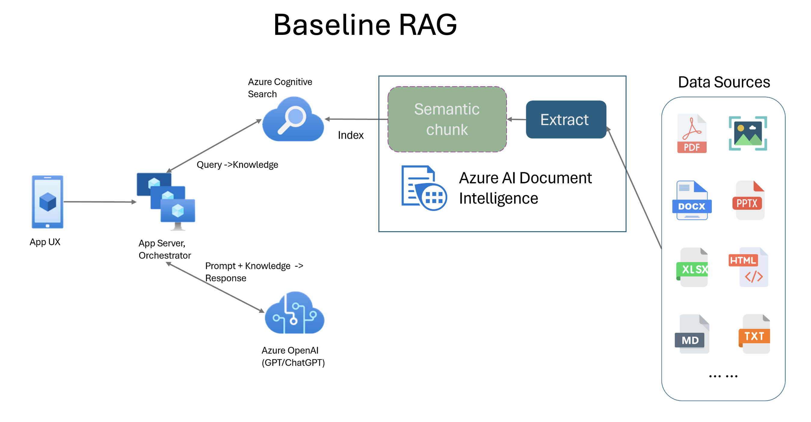

主要分成两个部分：

1. 离线文档部署：通过把各种文件格式，通过不同的chunk策略来切割，索引。
2. 在线文档：通过问题内容，查询索引获取到top N的chunk内容，通过大语言模型的理解，回答相应的内容。

## baseline rag的盲点和挑战

可以从上述的处理流程看出，baseline rag它简单，容易理解，同时也效率很高，能够快速验证，整理的性能上也不错。
同时由于它的这个简单流程，所以面对一些问题的时候，表现就不是很好。
总结下来有如下四类：

1. 总结类问题

	1. 总结一般要遍历所有相关的chunk，但是一般情况下 只是topN 的chunk这样给出的答案不会全面。

	2. 如果通过其他框架去运行执行的话，不如langchain里面map-reduce，通常性能也就满足不实时需求。

2. 比较类问题

	1. 比较类问题需要查找出涉及不同内容的文档，同时业务查询过程的打分机制，可能没有办法很好的同时把相关的内容都提取出来，导致要么回答不全，要么回答不了。

	2. 第二比较问题就是，如果比较的实体占比相差很大，比如问的一个问题是： 大象和蚂蚁（用重量来表示内容占比），因为比例太小蚂蚁内容很多情况没有办法召回，从而没法进行比较。

3. 隐式数据和关系型问题

	1. 	隐式数据是指那些不是通过直接输入或显式提供的方式获得的数据，而是通过用户行为、操作或系统的自动记录推断出来的。
		比如问： 多家房地产财报中业绩最好的公司的收入是多少？这样通过关键字，或者语义搜索，都找不到对应的公司，如果没有规定章节的话。
	
	2. 通过对象与对象之间的关系，比如食物和人群之间的关系等。食谱类，比较好回答某个食物是否适合孕妇，因为有对应的章节，但是如果反过来问，孕妇适合的食谱有哪些就难了。

4. 多头问题

	1. 问题本身是多个问题组成。

	2. 或者问题本身也包含了上述的三类问题。

***总结成一句话，rag很有必要，但是仅仅有rag还不够。***

## 改进RAG的两个方向

从上述处理过程来看，我们也不难推断出，如果想结局上述问题，主要的方向有两个：

1. Improving Data Quality（提高数据质量）
    在数据预处理阶段，对原数据进行按照以问题为中心的方式来加工处理数据，而不仅仅是按照原文本的方式。

2. 提高查询复杂度（Improving Query Sophistication）
	对问题进行分拆，反思等预处理，提高检索到数据的概率，同时对结果进行评估给出更准确的答案。

### 提高数据质量

用户输出的文本内容是信息，怎么才能把信息转化为知识呢？
在这种情况下，主要是通过归纳法。归纳法（Inductive reasoning）是一种从具体实例推导出一般性原则的推理方法。它通过观察具体的现象或事件，找出其中的规律或模式，并从中推导出普遍性的结论。归纳推理的结论在逻辑上不是必然成立的，而是可能的，结论的正确性取决于观察数据的全面性和代表性。
归纳法是由英国哲学家弗朗西斯·培根（Francis Bacon）提倡的一种科学方法论。他认为归纳法比演绎法更可靠，因为归纳法基于观察和经验，而演绎法则依赖于既定的理论和假设。培根提出了一种系统的归纳法方法，通过三个步骤和三张表格来整理和分析经验数据，最终得出可靠的结论。培根在他的著作《新工具》（Novum Organum）中提到了归纳法的“三张表格”，它们分别是存在表（Table of Presence）、对照表（Table of Absence in Proximity）和差异表（Table of Degrees or Comparison）。
	1.	存在表（Table of Presence）：
		•	内容：列出某种现象（比如“热”）存在时的所有情况和实例。
		•	目的：通过列举所有有该现象的实例，找出它们之间的共同特征。
		•	示例：如果研究“热”的本质，存在表可能列出太阳光、火、摩擦生热等所有与“热”相关的实例。
	2.	对照表（Table of Absence in Proximity）：
		•	内容：列出在类似条件下，该现象不存在的情况。
		•	目的：通过对比现象存在和不存在的情况，找出它们的差异，并排除不相关的因素。
		•	示例：在研究“热”时，对照表会列出没有热的实例，比如月光、冰块、或在真空中无热的情况。
	3.	差异表（Table of Degrees or Comparison）：
		•	内容：列出现象在不同强度或程度下发生的情况。
		•	目的：通过观察现象强度的变化，确定可能的因果关系。
		•	示例：差异表可能列出不同燃料燃烧产生的热量差异、或不同时间下太阳辐射的热量差异。

使用归纳法分析问题时，培根建议按照以下三个步骤进行：

	1.	数据收集与整理：
		•	首先，通过观察和实验，系统地收集有关研究对象的所有信息和实例。这些信息被整理到三张表格中，以便进行后续分析。
	2.	寻找共同点与差异：
		•	在三张表格中寻找现象出现与消失的条件、不同强度下的表现等，通过比较与对照，逐步排除与现象无关的因素，找出可能的因果关系或本质特征。
	3.	形成假设与验证：
		•	根据前两个步骤得出的初步结论，提出可能的假设或理论，然后通过进一步的实验和观察进行验证和修正，最终形成可靠的科学结论。

总结：

培根的归纳法强调从经验和观察中总结出规律，而非依赖既有理论。通过“三张表格”和“三个步骤”，归纳法为科学研究提供了一个系统的、由下至上的探索路径，被认为是现代科学方法论的奠基石之一。

***GraphRAG通过抽取实体，因为实体就是专业领域的概念，是信息的承载的主要载体。不论实体的占比例多少，都变成一个个实体，无论占比例多少，这样能解决比较类问题。***

***通过实体通过leiden算法，变成一个个社区，形成不同社区的总结。对应总结问题的话，通过global search可以逐个遍历社区得到整体内容，来应对总结类问题。***

***在graphRAG里面，entity和entity的关系也通过图的边来表示，同时抽取claim把一些额外信息保存，来解决隐式数据和关系型问题***

### 提高查询复杂度

通过在查询索引之前引入agent，给它更多的context，tool和instruction等，让它把问题描述更叫准确，找到更合适的数据，同时对最终结果进行评估返回。

这个图展示简单rag的处理流程：
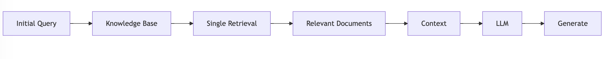

这个图展示agentic rag的处理流程
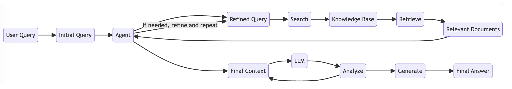

一个rag的agent通过由四个基本功能组成：
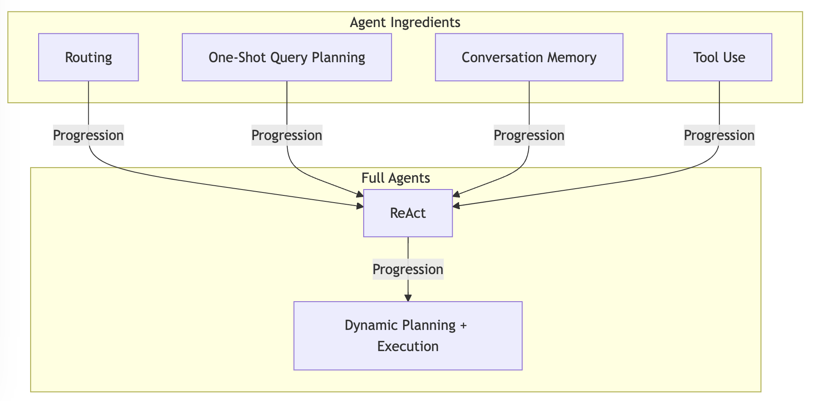

#### 1. Routing（路由）：处理和分配任务或请求的能力。

一种路由代理使用大型语言模型 （LLM） 来确定要选择哪个下游 RAG 管道。此过程构成代理推理，其中分析LLM输入查询，以就选择最合适的 RAG 管道做出明智的决策。这代表了代理推理的基本和简单形式。另一种路由涉及在摘要和问答 RAG 管道之间进行选择。代理评估输入查询，以决定是将其定向到摘要查询引擎还是矢量查询引擎，两者都配置为工具。

    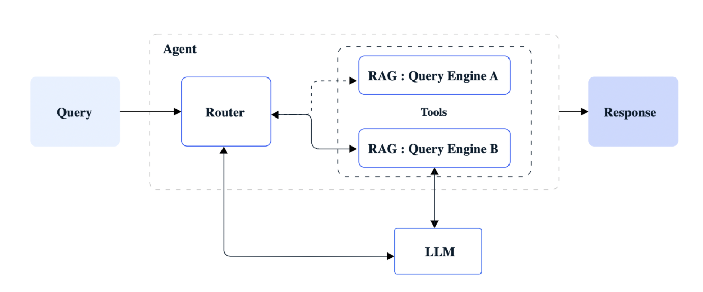
    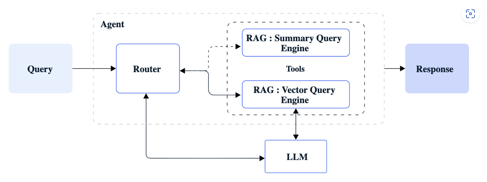

####  2. One-Shot Query Planning（一次性查询规划）：一次性处理查询和规划响应的能力。

查询规划代理将复杂查询划分为可并行化的子查询，每个子查询都可以根据不同的数据源在各种 RAG 管道中执行。然后，来自这些管道的响应将合并到最终响应中。基本上，在查询规划中，初始步骤涉及将查询分解为子查询，在合适的 RAG 管道中执行每个子查询，并将结果综合为全面的响应。

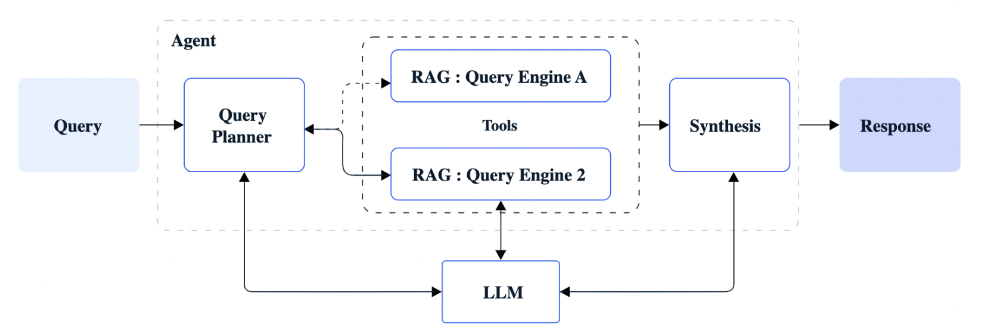

####  3. Conversation Memory（对话记忆）：记住和管理对话历史的能力。

在Agent类应用中，记忆可以记住事实和偏好，例如：问题答案、工具调用结果、格式偏好、语言偏好、表达偏好、图表绘制偏好、任务下工具选择偏好；对于事实和偏好的记忆能够让Agent应用提升回答准确率、稳定性以及速度。
Agent不同于Chat类或者RAG类的单纯知识型应用，其中还涉及到规划与决策、工具调用等内容，因此对于能够把什么东西存入记忆中，以及在使用过程中如果把想要的记忆内容召回。
短期记忆和长期记忆是基于其存储方式而定义的记忆概念。在实际使用Chat类以及Agent类应用的时候，在开启新的话题时，用户会选择开启新的Session（会话）来进行对话，这不仅是一种对于交互主题的一种分类，也能让每个会话的记忆相互隔离。从会话的角度上来讲，记忆可被分为两种方式：会话内记忆和会话间的记忆。

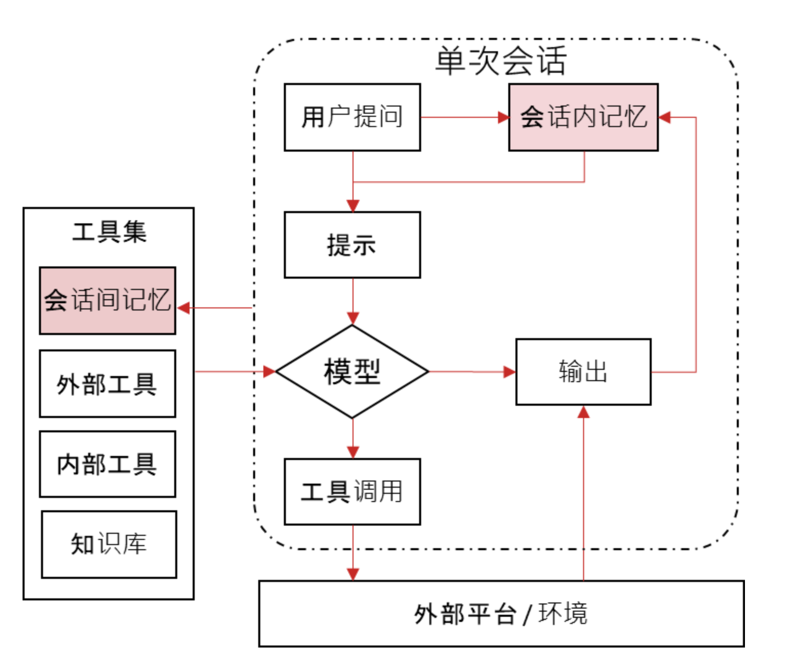

#### 4. Tool Use（工具使用）：使用各种工具来完成任务的能力。

在典型的 RAG 中，提交查询以检索在语义上与查询匹配的最相关的文档。 但是，在某些情况下，需要来自外部源（例如 API、SQL 数据库或具有 API 接口的应用程序）的其他数据。这些额外的数据用作上下文，以在输入查询被处理之前增强输入查询LLM。在这种情况下，代理也可以使用 RAG 规范。

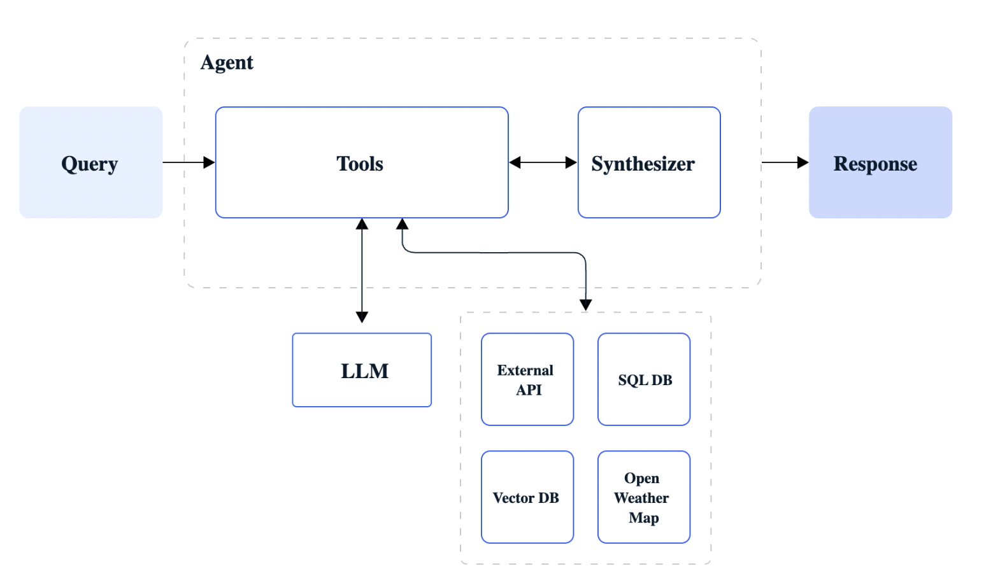

发展成为高级agent，拥有如下能力：

####  1. ReAct：具备反应能力，根据输入动态调整行为。

升级到更高层次涉及合并推理和操作，这些推理和操作是在复杂查询上迭代执行的。从本质上讲，这包括将路由、查询规划和工具使用组合到一个实体中。ReAct 代理能够在保持状态（在内存中）的同时处理顺序多部分查询。该过程包括以下步骤：
1. 在收到用户输入查询后，代理会确定要使用的适当工具（如有必要），并收集该工具的必要输入。
2. 使用必要的输入调用该工具，并存储其输出。
3. 代理接收工具的历史记录，包括输入和输出，并根据此信息确定后续操作过程。
4. 此过程将循环进行，直到代理完成任务并响应用户。

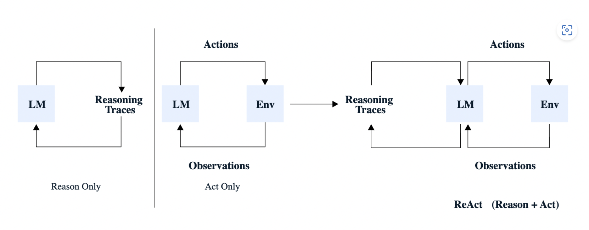

####  2. Dynamic Planning + Execution（动态规划与执行）：具备动态规划和执行复杂任务的能力。

ReAct 目前是采用最广泛的代理;然而，解决更复杂的用户意图的需求越来越大。随着代理在生产环境中的部署增加，对增强可靠性、可观察性、并行化、控制和关注点分离的需求越来越高。从本质上讲，需要长期规划、执行洞察力、效率优化和减少延迟。

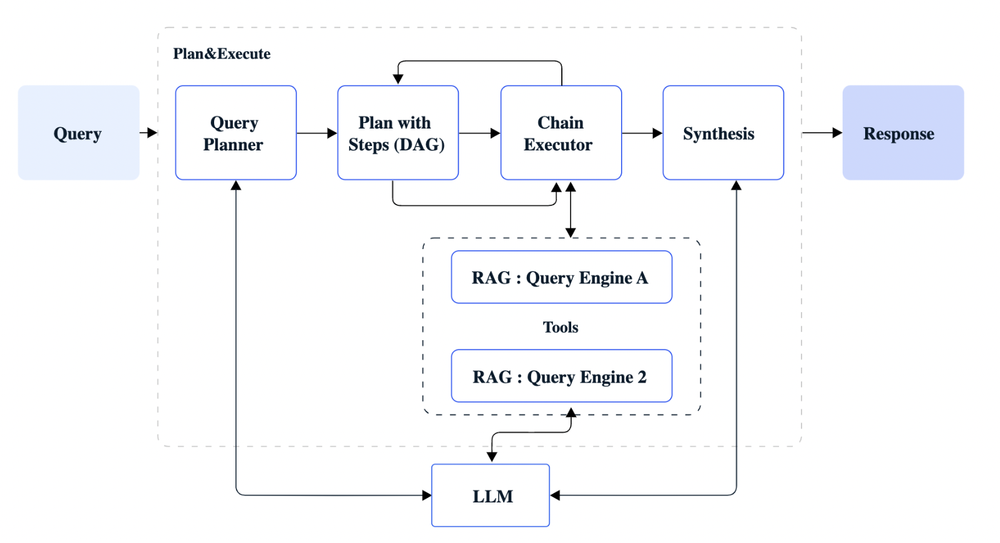

***agentic rag来实现对问题的分解和对中间信息反思，相应等，来解决多头问题***

### agentic rag的几种方案

构建代理 RAG 需要特定的框架和工具，以促进多个代理的创建和协调。虽然从头开始构建这样的系统可能很复杂，但现有的几个选项可以简化实施过程。

1. Llamalndex

LlamaIndex 是构建代理系统的坚实基础，提供一整套功能。它使开发人员能够创建文档代理，监督代理交互，并实施高级推理机制，例如思维链。该框架提供了许多预构建的工具，促进与各种数据源的交互，包括流行的搜索引擎（如Google）和存储库（如Wikipedia）。它与各种数据库无缝集成，包括SQL和向量数据库，并支持通过Python REPL执行代码。 LlamaIndex的链功能使不同工具的无缝链接成为可能，从而LLMs促进了复杂工作流程的创建。此外，它的记忆组件有助于跟踪代理操作和对话历史，从而促进上下文感知决策。包含针对特定用例（例如聊天机器人和问答系统）量身定制的专用工具包，进一步增强了其实用性。但是，要充分利用其潜力，可能需要熟练掌握编码和理解底层架构。
参考文档链接：
[agentic_rag_with_llamaindex](https://docs.llamaindex.ai/en/stable/examples/agent/agentic_rag_with_llamaindex_and_vertexai_managed_index/)

2. langchain

与LlamaIndex一样，LangChain提供了一个全面的工具包，用于构建基于代理的系统并协调它们之间的交互。其一系列工具与LangChain生态系统内的外部资源无缝集成，使代理能够访问广泛的功能，包括搜索、数据库管理和代码执行。LangChain的可组合性功能使开发人员能够结合不同的数据结构和查询引擎，从而促进创建能够访问和操作来自各种来源的信息的复杂代理。其灵活的框架可以很容易地进行调整，以适应代理RAG实现中固有的复杂性。
参考文档链接：
[langgraph_agentic_rag](https://langchain-ai.github.io/langgraph/tutorials/rag/langgraph_agentic_rag/)

3. transform agent

HF 在一年前推出了 Transformers Agents，框架致力于通过简单性实现清晰度：将抽象减少到最低限度。通过简单的错误日志和可访问的属性，您可以轻松检查所发生的情况，并让您更加清晰。模块化：更喜欢提出构建块，而不是完整、复杂的功能集。您可以自由选择最适合您项目的任何构建块。例如，由于任何代理系统都只是由LLM引擎驱动的车辆，因此他们决定在概念上将两者分开，这使您可以从任何底层创建任何代理LLM类型。

[transform-agent](https://huggingface.co/docs/transformers/en/main_classes/agent#transformers.Agent)

## 通过agentic整合graphRAG和baseline RAG

很多客户在baseline RAG中以及投入了很多努力，很多系统也已经在线使用，而且一些问题，baselineRAG确实也不错。那么怎么让graphRAG和baseline RAG共存呢？
通过上面的介绍，所以大家也自然就想到了，使用了agentic rag方案，通过路由的简单功能，把不符合baseline rag适合graph rag适合的问题，路由到graphRAG的pipeline便可以了。
通过一个简单例子，来展示：
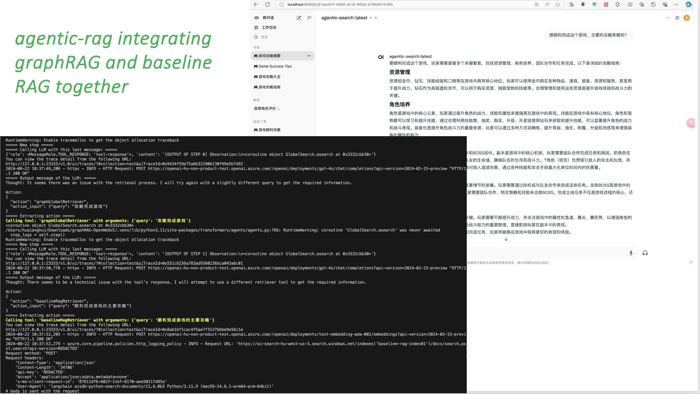

从这个日志输出看出来，这个问题首先选择的是graphrag global search，这个是适合的。因为这个问题是是一个总结类的问题。但是由于global search有点问题，导致fallback到了baseline search。