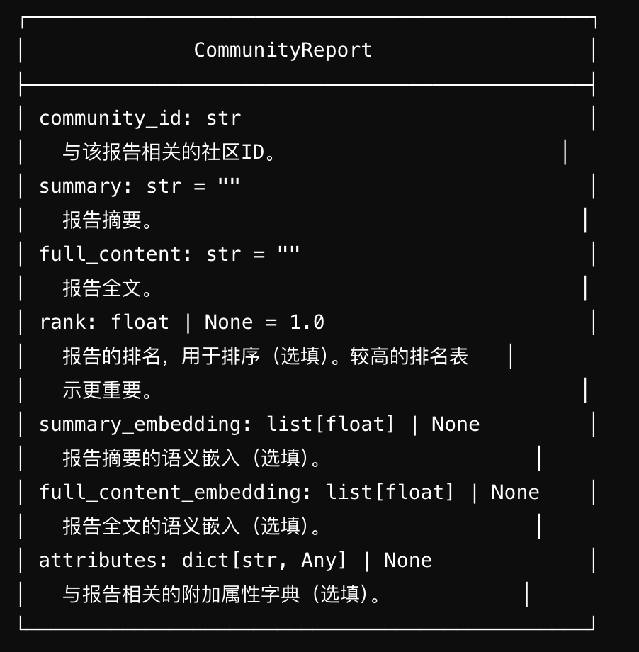

# 探索 GraphRAG 的最佳实践

根据上周的overview的文章的[demo](graphRAG-overview-20240728.md#5-动手试验)
里面给出了三个上手试验，尝试使用GraphRAG的方法。
随着进一步实践，这里针对其中使用过程中的问题，给出自己一些实践分享和建议。

## 1. 都说GraphRAG贵，具体多贵，影响价格的因素有哪些？怎么来计算这个成本？

刚开始接触GraphRAG的时候，就看到大量的说GraphRAG很贵的内容。
当时大概率主要使用gpt-4-turbo 或者gpt-4o模型，后面随着gpt-4o-mini的API推出，成本一下字下降了很多，所以不再是不敢尝试。
但是在实践使用过程中，我们还是需要在使用之前，还是希望有一个大致的预判，或者是一个什么的数量级的token数量。

要计算前期的索引成本，所以要弄清楚索引过程中做了哪些事情，产生了哪些内容，以及这些内容的作用是什么。

首先我通过这个文件可以知道workflow定义

然后可以通过运行运行来构建索引

在运行过程中，如果选择了prompt tune的话，它会产生适应于文本的prompt，如果没有就使用默认的prompt，来多次请求LLM而消费token
可以通过产看ragtest/prompts里面prompt文件。文件列表如下：

    entity_extraction.txt
    summarize_descriptions.txt
    claim_extraction.txt
    community_report.txt

同这个文件的名字和列表，我们就可以推测出来，token的消费，和文本里面entity，community 和 claim数量是有关的。
通过监控调用次数，如果不修改prompt的话，大致的token消费公式如下：

Token Consumption formula: 

    Base Call Count= Tokens of Document / chunk size

    Entity Extraction Token Consumption  = （ 2200 + chunk）* （ Base Call Count ）
    Entity  Description Token Consumption  = （ 130 + Entity Description ）* （ Entity Count ）
    Community  Token Consumption  = （ 1900 + Community Description ）* （ Community Count ）
    Claim Extraction Consumption  = （ 1200 + chunk ）* （ Base Call Count ）optional ；默认不抽取，需要打开配置项才抽取

** 前面的数字，是默认的prompt template通过gpt-turbo c100K对应的编码器的token数字，如果你修改了模型，或者自定义prompt都需要相应的变化。

调用链路如下：

## 2. 实际使用过程中，为什么觉得GraphRAG很慢？但是在文档中，GraphRAG比base RAG更高效呢? 具体的原因是什么？

在实际使用过程中，GraphRAG可能会显得较慢，原因可能有哪些呢？
首先如果只是看代码的话，可能会觉得有如下几个可能：

1. **初始化时间**：GraphRAG需要初始化知识图谱，这个过程可能比较耗时。
2. **查询复杂度**：如果知识图谱非常复杂，查询时间可能会较长。
3. **数据传输**：在global-search中map-reduce，数据传输时间也会影响整体性能。

而实际监控下来，发现的结果和我们的直觉还是有一些出入。首先在GraphRAG中提供了两种search，分别是localSearch 和 globalSearch.

##### local search

在[overview中local-search的实现流程](graphRAG-overview-20240728.md#41local-search的实现流程)文档中给出了local search主要的主要过程。

通过图，得到大致通过向量查询找到对应entity，然后通过entity找到对应的relation和Covariate（这里就是上面提到的claim，它是optional），最后把这些信息给LLM，让它给出最后的结果。

  
  
  

然后我们进一步查看方法调用的堆栈以及对应的时间消耗：

从这个图中，我们可以看到主要时间还是在search方法上，也就是LLM的调用，因为max reponse默认给2000，而且local search输出的内容也很长，所以时间消耗比较多。
只要对prompt进行调整，也可以对性能的调优。同时也需要确保内容效果能达到预期。

##### global search

在[overview中global-search的实现流程](graphRAG-overview-20240728.md#42global-search的实现流程)文档中给出了global search主要的主要过程：

通过map的方式调用每个communit的report生成相应的答案，然后最后通过reduce的方法把所有的答案集合起来完成最后的答案。主要时间也是在LLM的调用上。

  
  

global的调用堆栈和时间类似，实际情况如下：

*** 从中我们可以看出，不管local search 还是 global search 它不在直接调用text 和document本身，而是加工之后的数据，所以它给LLM的数据量是要小一些。  ***
*** 从保证结果质量的情况下，raphRAG能够生成更准确和相关性更高的结果，从而减少了不必要的重复查询。**

## 3. 如果评估GraphRAG，特别是生成的知识图谱的评估好坏？

### graphRAG最终结果评价体系

因为graphRAG 和 baseline RAG对知识的处理不一样，graphRAG基本上是对知识进行的二次加工，它适合知识点跳动，需要串联，或者全局查找的情况。
所以除了基本的评价指标之外，可能还需要一个更加贴近这种技术的评价指标来评价最终结果的好坏。
主要参数的指标方向有如下几个：

#### 信息整合
**定义:** 将文档中不同部分的相关概念整合在一起。

#### 2. 关系分析
**定义:** 增加了文档中未明确说明的概念之间的关系和互动。

#### 3. 结构重组
**定义:** 将原有的章节结构重新组织成更连贯的分析文本。

#### 4. 信息扩展
**定义:** 基于文档中的概念增加一些推断信息或解释。

由于graphRAG的效果，主要取决于知识图谱本身的质量，也需要构建一个评级体系测量和验证这些点（node），边（edge）和 协变（Covariate，Claim）的质量。

### graphRAG最终结果评价体系

目前还没有比较好的评价体系，都是通过了解这个领域支持的人，对一些实体，关系和协变，或者一些描述是否恰当等。

*** 特别是中文的情况下，接下来可以尝试的是看claim中，描述已经community report是否通过更强的LLM来进一步检测。***

## 4. 如果我的文件增加了，怎么实现增量？

当文件增加时，可以通过以下步骤实现增量更新：

1. **数据预处理**：对新增数据进行预处理，确保其格式和现有数据一致。
2. **增量更新**：将新增数据添加到现有知识图谱中，避免重新构建整个图谱。
3. **索引更新**：更新知识图谱的索引，确保新增数据可以被高效查询到。

## 5. 实际使用下来，不同场景或者不同问答，两个技术各有所强，应该怎么混合使用两种技术？

在实际使用中，可以根据具体场景和需求，选择适当的技术或混合使用两种技术：

1. **场景分析**：首先，分析具体应用场景，确定主要需求是效率还是准确性。
2. **技术选择**：如果需求更偏向于高效处理复杂查询，可以优先选择GraphRAG；如果需求更偏向于快速响应和简单查询，可以选择base RAG。
3. **混合使用**：在某些复杂场景下，可以先使用base RAG进行初步查询，再通过GraphRAG进行深度挖掘，从而兼顾效率和准确性。

通过以上方式，可以在实际应用中更好地发挥GraphRAG和base RAG的各自优势，实现最佳的查询效果。