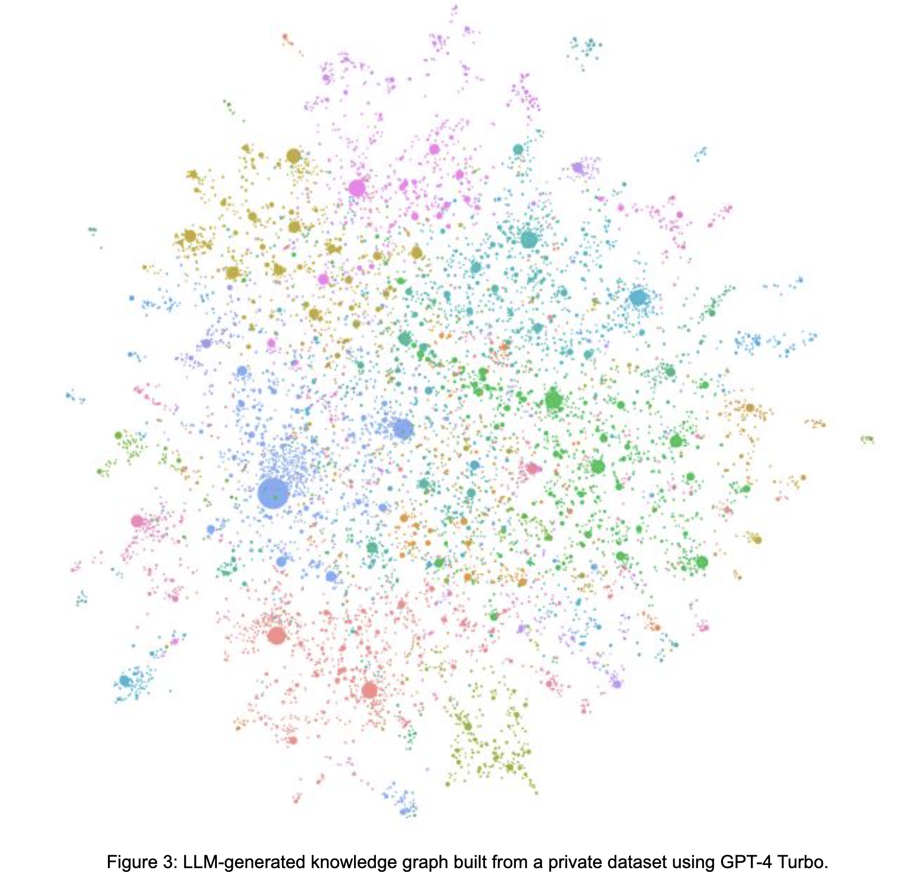

### 1.	为什么需要一种新的RAG？

#### 1.1	baseline RAG的处理流程

##### 1.1.1 前置处理流程

以文档为中心，没有做其他的内容洞见，通过chunk方式来切割

##### 1.1.2 查询处理流程

通过不同算法的打分，找回top N方式, 然后通过prompt给LLM，来回答问题。

##### 1.1.3常规的优化优化手段失效之后，一些进一步的优化手段

        1. 增加chunk summary 

        2. 修改列的权重影响打分公式

        3. 增对Q&A模式发现问题，增加内容，比如比较等。

### 2.	graphRAG主要解决什么问题？
    GraphRAG 是一种结构化的、分层的检索增强生成 （RAG） 方法，与使用纯文本片段的朴素语义搜索方法相反。GraphRAG 过程涉及从原始文本中提取知识图谱、构建社区层次结构、为这些社区生成摘要，然后在执行基于 RAG 的任务时利用这些结构。

    对于以下情况下，比baseline RAG有更好的表现：

        1.	当一些实体（名词）占比比较小，通过baseline rag无法正确的召回，能否比较正确的召回

        2.	当希望通过实体关系正向和方向查询内容的时候，能通过实体关系实现很好的正确召回

        3.	通过global search实现对整体做一些总结和洞见

### 3.	GraphRAG的数据处理流程是怎么样？

GraphRAG流程的基本步骤如下：

        1. Slice up an input corpus into a series of TextUnits, which act as analyzable units for the rest of the process, and provide fine-grained references into our outputs.
        
        将输入语料库切成一系列 TextUnits，这些 TextUnits 充当流程其余部分的可分析单元，并在我们的输出中提供细粒度的引用。

        2. Extract all entities, relationships, and key claims from the TextUnits using an LLM. 
        
        使用LLM来抽取这些实体，关系，主要申明

        3. Perform a hierarchical clustering of the graph using the Leiden technique. To see this visually, check out Figure 1 above. Each circle is an entity (e.g., a person, place, or organization), with the size representing the degree of the entity, and the color representing its community.
        
        使用 Leiden 技术对图形执行分层聚类。要直观地看到这一点，请查看上面的图 1。每个圆圈都是一个实体（例如，一个人、一个地方或组织），大小代表实体的程度，颜色代表其社区。

        4. Generate summaries of each community and its constituents from the bottom-up. This aids in holistic understanding of the dataset. 
        
        自下而上生成每个社区及其成员的摘要。这有助于全面了解数据集。

更加详细的步骤步骤参照：

#### 3.1	通过文档生成domain spefic entity 和 entity relation 
        
开箱即用地使用GraphRAG处理数据可能无法产生最佳结果。强烈建议您按照文档中的提示优化指南对提示进行微调

通过prompt tuning 生成对应的graph

#### 3.2	通过entity 和 relation算法形成不同的community，并且community级别总结

使用图创建自下而上的聚类，该聚类将数据分层组织为语义聚类（在下面的图中使用颜色表示）。
这种划分允许对语义概念和主题进行预总结，这有助于对数据集进行整体理解。

社区总结的使用算法Leiden的论文链接：

[From Louvain to Leiden: guaranteeing well-connected communities](https://arxiv.org/pdf/1810.08473)

### 4.	GraphRag的查询接口localSearch和globalSearch

#### 4.1	Local search的实现流程

本地搜索方法将知识图谱中的结构化数据与输入文档中的非结构化数据相结合，以在查询时使用相关实体信息来增强LLM上下文。它非常适合回答需要了解输入文档中提到的特定实体的问题。
本地搜索方法从知识图谱中识别一组在语义上与用户输入相关的实体。这些实体充当知识图谱的访问点，可以提取更多相关详细信息，例如连接的实体、关系、实体协变量和社区报告。
此外，它还从与已识别实体关联的原始输入文档中提取相关文本块。然后，对这些候选数据源进行优先级排序和筛选，以适合预定义大小的单个上下文窗口，该窗口用于生成对用户查询的响应。
有点像keyword search，倒排索引在这个基础上增加了一层relationship。

[system prompt](https://github.com/microsoft/graphrag/blob/main/graphrag/query/structured_search/local_search/system_prompt.py)

#### 4.2	Global search的实现流程 

baseline RAG 难以处理需要聚合数据集中信息以组成答案的查询。
诸如“数据中排名前 5 位的主题是什么？”之类的查询执行得很糟糕，因为基线 RAG 依赖于对数据集中语义相似的文本内容的向量搜索。
查询中没有任何内容可以将其定向到正确的信息。

使用 GraphRAG，我们可以回答这些问题，因为生成的知识图谱的结构LLM告诉我们整个数据集的结构（以及主题）。
这允许将私有数据集组织成预先汇总的有意义的语义集群。使用我们的全局搜索方法，在响应用户查询时LLM使用这些聚类来汇总这些主题。

全局搜索方法使用来自图形社区层次结构的指定级别的生成社区报告的LLM集合作为上下文数据，以 map-reduce 方式生成响应。
在该 map 步骤中，社区报告被分割为预定义大小的文本块。然后，每个文本块用于生成包含点列表的中间响应，每个点列表都伴随着一个数字评级，指示该点的重要性。
在该 reduce 步骤中，从中间响应中筛选出的一组最重要的点被聚合并用作生成最终响应的上下文。

全局检索响应的质量可能会受到为获取社群报告而选择的社区层次结构的严重影响。
具有详细报告的较低层次结构级别往往会产生更全面的响应，但由于报告量大，也可能增加生成最终响应所需的时间和LLM资源。

[map system prompt](https://github.com/microsoft/graphrag/blob/main/graphrag/query/structured_search/global_search/map_system_prompt.py)

[reduce system prompt](https://github.com/microsoft/graphrag/blob/main/graphrag/query/structured_search/global_search/reduce_system_prompt.py)

### 5. 动手试验

#### 5.1 最简单的hands-on Demo

通过直接安装graphrag包，本地实现动手实现：

[hands-on Demo01](https://microsoft.github.io/graphrag/posts/get_started/)

#### 5.2 运行graphRAG的example：

[hands-on Demo02](https://github.com/microsoft/graphrag/tree/main/examples)

这里的代码有两个sample的代码有一些问题，需要注意。

bug1：

    '''
        执行workflow的过程中，自定义的method，
        
        str_append 会被传入很多的反射参数，导致调用出错。
        
        
        所以需要在代码中，把多余的参数注释掉：
        
        /Users/huqianghui/Downloads/graphRAG/.venv/lib/python3.11/site-packages/datashaper/workflow/workflow.py
        
        
        
                    # comment  verb_context for TypeError: str_append()
                    verb_args = {
                        "input": input,
                        ##**verb_context,
                        **node.args,
                    }
        
        
        来执行/Users/huqianghui/Downloads/graphRAG/examples/custom_set_of_available_verbs/run.py 这个文件
    '''

bug2: 

    '''
        Run --》  index/run.py( run_Pipeline)   --> load_workflows  --> create_workflow --> _get_steps_for_workflow() 这个里面，只有default workflow，还没有新增加的。
        
        所以出错。
        
        
        比较发现，自己的workflow 需要通过
        
        additional_workflows=custom_workflows 传入，还能避免这个错误
    '''

在索引过程中的pipelines：

每个pipelines里面的对应的workflow里面分成不同的steps

#### 5.3 比较完整运行sample-graphrag-accelerator

[graphrag-accelerator](https://github.com/Azure-Samples/graphrag-accelerator)

除了使用notebook来上传处理文件以及执行local和global search之外，也提供front-end的streamlit应用，可以通过页面的方式实现。

### 6.	需要进一步验证的点

#### 6.1	Cost的计算公式以及BaseRAG和graphRAG的cost对比（前期处理和查询时）

#### 6.2	实际case中BaseRAG和graphRAG的Benchmark测试对比,以及两种技术如何实现融合能够达到最佳选择

文档中给了一些评估标准：
    
    1. comprehensiveness (completeness within the framing of the implied context of the question), 
    全面性（在问题隐含上下文框架内的完整性）
    
    2. human enfranchisement (provision of supporting source material or other contextual information), 
    （提供支持源材料或其他上下文信息）

    3. diversity (provision of differing viewpoints or angles on the question posed). 
    多样性（对所提出的问题提供不同的观点或角度）
    
    4. faithfulness to help ensure factual, coherent results grounded in the source material
    Results show that GraphRAG achieves a similar level of faithfulness to baseline RAG.
    GraphRAG达到了与基线RAG相似的忠实度。

#### 6.3    实际case中performance测试对比

#### 6.4    不同的chunk策略的影响

根据文档中显示：     
    
    有意的让不同的entity出现在多个chunck里面，来增加实体被识别的可能性，而不是通过seamic chunck 来集中内容。
    但是如果是已经给定的chunk的情况下，或者就是需要通过语义切割的情况下，怎么去客制化这一部分？

#### 6.5    langchain 与 llamaIndex，以及neo4j实现的横向对比

[llama_index-GraphRAG_examples_code](https://github.com/run-llama/llama_index/blob/main/docs/docs/examples/cookbooks/GraphRAG_v1.ipynb)

[llama_index-GraphRAG_doc](https://docs.llamaindex.ai/en/stable/examples/query_engine/knowledge_graph_query_engine/)

[neo4j-GraphRAG_doc](https://neo4j.com/developer-blog/knowledge-graph-rag-application/)

[neo4j-GraphRAG_github_sample](https://github.com/neo4j-examples/rag-demo)

[Implementing ‘From Local to Global’ GraphRAG with Neo4j and LangChain: Constructing the Graph](https://medium.com/neo4j/implementing-from-local-to-global-graphrag-with-neo4j-and-langchain-constructing-the-graph-73924cc5bab4)

[Enhancing the Accuracy of RAG Applications With Knowledge Graphs](https://medium.com/neo4j/enhancing-the-accuracy-of-rag-applications-with-knowledge-graphs-ad5e2ffab663)

[lagnchain-neo4j-GraphRAG_github_sample](https://github.com/hfhoffman1144/langchain_neo4j_rag_app)

[lagnchain-Constructing knowledge graphs](https://python.langchain.com/v0.1/docs/use_cases/graph/constructing/)

### 7.	一些技术疑点

#### 7.1	Meta-agent怎么选择localsearch 和 globalsearch呢？

#### 7.2	怎么实现增量的处理

#### 7.3	如果实现对中间的结果进行验证？

#### 7.4	在图片展示中，怎么显示community? 目前只能显示节点和边

### 8. 相关链接

[graphrag-github-doc](https://microsoft.github.io/graphrag/)

[graphrag-unlocking-llm-discovery-on-narrative-private-data](https://www.microsoft.com/en-us/research/blog/graphrag-unlocking-llm-discovery-on-narrative-private-data/)

[论文：From Local to Global: A Graph RAG Approach to Query-Focused Summarization](https://arxiv.org/pdf/2404.16130)

[query-focused-summarization-graphRAG](https://www.microsoft.com/en-us/research/publication/from-local-to-global-a-graph-rag-approach-to-query-focused-summarization/)

[论文：SELFCHECKGPT: Zero-Resource Black-Box Hallucination Detection for Generative Large Language Models](https://arxiv.org/pdf/2303.08896)

[unified-copilot.azurewebsites.net：在线demo站点](https://unified-copilot.azurewebsites.net/?dataset=podcast&include_standard_rag=true)

[微软内部的一次内部分享视频](https://microsoft.sharepoint.com/teams/aiml-cc/_layouts/15/stream.aspx?id=%2Fteams%2Faiml%2Dcc%2FCommunity%20Videos%2FIntroduction%20to%20Microsoft%E2%80%99s%20GraphRAG%20Capability%2D20240723%5F105903%2DMeeting%20Recording%2Emp4&nav=eyJyZWZlcnJhbEluZm8iOnsicmVmZXJyYWxBcHAiOiJTdHJlYW1XZWJBcHAiLCJyZWZlcnJhbFZpZXciOiJTaGFyZURpYWxvZy1MaW5rIiwicmVmZXJyYWxBcHBQbGF0Zm9ybSI6IldlYiIsInJlZmVycmFsTW9kZSI6InZpZXcifSwicGxheWJhY2tPcHRpb25zIjp7InN0YXJ0VGltZUluU2Vjb25kcyI6MzMzLjg2fX0&ga=1&referrer=StreamWebApp%2EWeb&referrerScenario=AddressBarCopied%2Eview%2E1fa97bac%2D587a%2D4d80%2Db2fd%2D5702257b2dab&web=1)

    会议主要围绕GraphRAG项目展开，涉及以下几个关键议题：
    GraphRAG介绍与应用:
        • Jonathan介绍了GraphRAG，一种利用LLMs创建知识图谱的系统，特别是在私有数据集上进行发现的能力。4:37
    合作与技术转移:
        • 讨论了与Azure AI搜索、Azure文档智能等团队的合作，以及GraphRAG技术在Microsoft内部的应用和转移。9:17
    技术深度与优化:
        • 探讨了GraphRAG的技术深度，包括使用小型语言模型进行优化，以及FastGraphRAG作为低资源版本的开发。31:41
    自动模板生成:
        • 强调了自动模板生成机制的重要性，以简化用户在使用GraphRAG时创建提取模板的过程。34:15
    未来方向:
        • 讨论了GraphRAG未来的发展方向，包括与更多产品团队合作，以及探索新的应用场景。35:48
    这次会议涵盖了GraphRAG项目的多个方面，从技术细节到合作伙伴关系，以及未来的发展计划。

    

    在问答环节中，参与者提出了多个问题，以下是一些问题及其回答的摘要：
        • 关于GraphRAG与标准RAG的区别:
        • Arnab询问GraphRAG是否会取代标准RAG，以及如何根据用户问题决定使用哪种方法。Jonathan解释说，GraphRAG是作为标准RAG的补充，用于处理标准RAG难以解决的抽象问题。45:28
        • 关于GraphRAG的数据处理能力:
        • Cornel询问GraphRAG可以处理多大的数据集，以及处理特定数据量所需的时间。Jonathan指出，处理能力主要取决于所使用的LLM的成本和性能。48:16
        • 关于GraphRAG的更新频率:
        • Nitin询问高速数据的情况下，GraphRAG的图表需要多久更新一次。Jonathan提到，目前的实现支持每小时或每天更新一次，但正在探索更快的更新方法。52:09
        • 关于GraphRAG与知识图谱的区别:
        • Disha询问GraphRAG与传统知识图谱之间的区别。Jonathan解释说，GraphRAG自动生成其知识图谱，而不需要预先定义的本体或拓扑结构。57:58
        • 关于GraphRAG的延迟和即时图表创建:
    Esin询问是否有比较GraphRAG在即时创建图表与预先创建图表之间的延迟。Jonathan指出，目前GraphRAG主要是预先计算的，但正在探索更快的、即时更新的方法。59:31