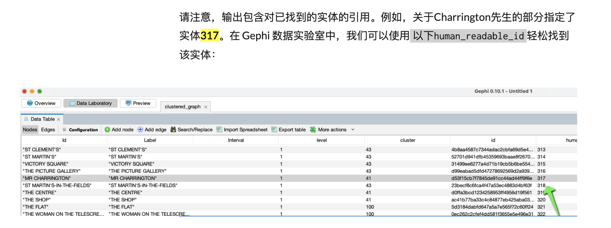
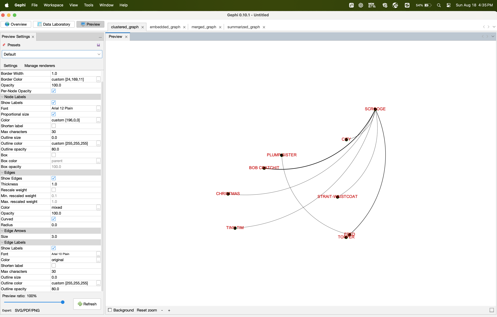
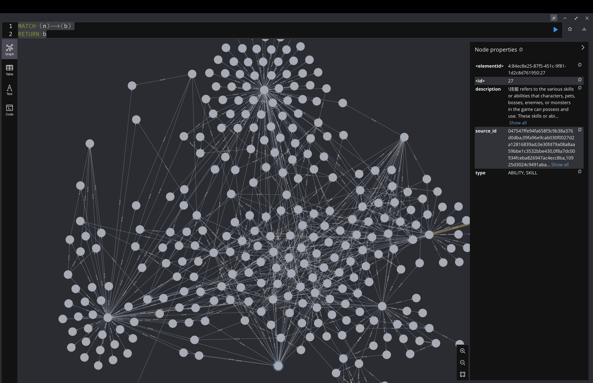
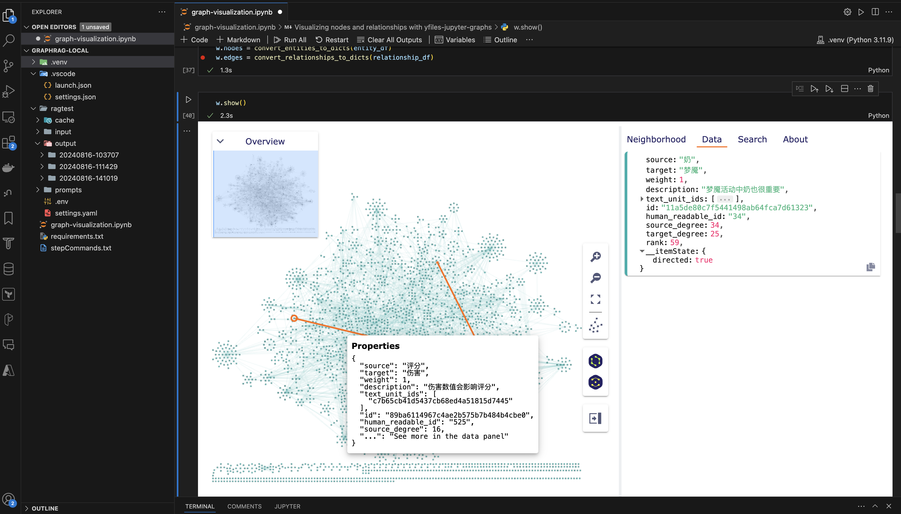

# GraphRAG的图形化展示

根据graph practice 01的文章的[local-search](graphRAG-practice-01-20240804.md#local-search)
和[global-search](graphRAG-practice-01-20240804.md#global-search)
里面给出在graphRAG中使用的表的定义schema和最终生成的parque文件等。通过对应vscode插件，我们可以很方便的查看里面的内容。

但是对于图形数据来说，更好的方式是通过图形的方式展示，这样可以很方便和直接看到：点，边，社区等信息。这样会有一个只管的感受。
其次，就是在local-search中会给出对应的entityID，在global-search中给出相关的community reqportID引用信息。
为了人为的cidation，需要根据这些ID来获取进一步信息来验证，最好也有一个相关的查询和可视化展示。

如下在一个localsearch中给出了引用317实体，在对应entity表中，通过human readable id查询对应的实体。





***.graphml 文件用于可视化提取的图形。.json文件用于日志、统计分析和原始提取数据。图形数据主要记录在 .parquet 文件中***

## 1. graphml文件的可视化

在settings.yaml中将graphml更改为true，这样的话会在输出文件夹中生成GraphML文件。graphml格式是多种OSS工具支持的开放标准。
Gephi这个软件，可以用来读取graphML来可视化相应的内容。
如果开始的时候，没有打开修改之后，可以重新执行，不会全部执行，因为有缓存在，所以还是可以产生graphml文件，不需要重洗消耗token。

配置如下：

```yaml
  snapshots:
    graphml: True
```

有了graphml之后，可以通过gephi来打开查看，如果元素太多，或者需要编辑的话，这个软件就不好用了。


如果需要查询等功能，可以把graphml文件导入neo4j中，参考文档：
[导入graphml到neo4j](https://neo4j.com/labs/apoc/4.1/import/graphml/)

Neo4j使用Cypher查询图形数据，Cypher是描述性的图形查询语言，语法简单，功能强大，由于Neo4j在图形数据库家族中处于绝对领先的地位，拥有众多的用户基数，使得Cypher成为图形查询语言的事实上的标准。

导入成功之后，启动数据库，然后数据库浏览中，通过Cypher查询对应的内容。这里用一个最简单查询语句，得到所有的点和边。

```cypher
  MATCH (n)-->(b)
  RETURN b
```



可以通过不同的形式查看到内容，比如table，text，code等。

## 2. 读取对应parque文件，通过图形库来展示

### 在notebook中使用yFiles Graphs for Jupyter来可视化内容

yFiles_jupyter_graphs是一个用于在 Jupyter Notebook 中可视化和操作图形结构的 Python 包。
通过使用 `GraphWidget`，可以在 Notebook 中交互式地展示和操作图形。以下是简单的使用步骤。通过 GraphWidget，你可以进一步操作图形，添加节点、边，或应用布局算法。

交互功能：

	•	通过鼠标操作节点和边，可以直接在图形上进行交互，比如拖动节点、点击边等。
	•	支持图的缩放、平移等功能，便于查看复杂结构。

适用场景：

	•	网络结构展示：适合展示如社交网络、依赖图等复杂结构。
	•	流程图和拓扑图：可以用于绘制流程图和各类拓扑图。
	•	算法研究：可用于图论算法的可视化展示和调试。

yFiles Graphs for Jupyter 提供了强大的图形可视化和编辑功能，适用于需要处理图形结构的场景。



对应的notebook,请参照[graph-visualization](./graphRAG-visualization-20240818/graph-visualization.ipynb)

更多可以参照官方文档：[yfiles-graphs-for-jupyter](https://www.yworks.com/products/yfiles-graphs-for-jupyter)

### 在web中使用plotly来可视化内容

#### Python 中使用 plotly

在 Python 中使用 plotly.subplots.make_subplots 和 go.Figure 的 show() 函数时，通过以下几种方式显示子图：

1. 在 Jupyter Notebook/Lab 中显示

如果你是在 Jupyter Notebook 或 JupyterLab 环境中使用 plotly，调用 show() 函数会直接在 Notebook 的输出单元格中嵌入交互式的图表，而不会启动外部浏览器窗口。

2. 在普通 Python 脚本中显示

如果你在标准的 Python 脚本中运行 show()，并且没有安装 Notebook 或类似工具，plotly 会启动一个本地 Web 服务器，并在系统默认的浏览器中显示图表。这个过程会启动浏览器标签页，而不是一个独立的应用程序窗口。

plotly 的 show() 函数实现逻辑在 plotly 库的内部，是一个通用的渲染函数，根据运行环境来决定如何显示图表。具体的显示方式由 plotly.io 模块的逻辑来处理，这个模块包含了处理图表渲染的不同机制。

具体的代码库实现：[plot-web-browser-render](./graphRAG-visualization-20240818/plot-web-browser-render.png)

在 plotly 中，show() 函数的逻辑会根据当前的执行环境来确定是内嵌显示图表还是启动外部浏览器。

实现逻辑的关键模块：

	1.	plotly.io 模块：
	•	plotly.io 是一个用于处理图表渲染的模块。show() 函数最终会调用这个模块的函数来决定如何渲染图表。它根据当前运行的环境（例如 Jupyter Notebook 或标准的 Python 环境）来确定显示方式。
	2.	环境检测与渲染方式：
	•	如果代码在 Jupyter 环境中执行，plotly.io 检测到这个环境后会使用内嵌的渲染方式（例如 plotly_mimetype）将图表直接输出到 Notebook。
	•	如果代码在标准 Python 脚本中运行，并且没有特殊的设置，plotly.io 会启动一个本地 Web 服务器来显示图表，并在默认浏览器中打开图表的页面。
	3.	plotly.offline 支持：
	•	在非交互式环境（例如终端或文本编辑器）中，可以使用 plotly.offline 来离线显示图表，通常也是通过浏览器打开一个本地文件来显示。

大致流程：

	•	当 show() 被调用时，plotly.io.show 检查当前的运行环境。
	•	如果是在 Jupyter Notebook 中，它会使用 JavaScript 来内嵌图表到 Notebook 单元格中。
	•	如果是在普通 Python 脚本中，它会创建一个 HTML 文件，并通过浏览器打开这个文件。

代码参考位置：

	•	plotly.io._renderers.show 是核心的渲染函数。
	•	检测和处理环境的代码可能位于 plotly.io._base_renderers.py 文件内，它负责决定显示图表的策略。

web结果展示：
[graphrag-web-render](./graphRAG-visualization-20240818/graphrag-web-render.png)

源码实例实现：[graphrag3dknowledge](./graphRAG-visualization-20240818/graphrag3dknowledge.py)

#### javascript中使用 react-force-graph-2d和react-force-graph-3d

这个工程分成前后端，可以上传对应的parque文件，解析成2d或者3d图形，同时给出了几个parque文件对应的table。
通过查询模式，或者点击交互模式，可以找到对应节点信息。

具体源码可以参看github：
[graphrag-visualizer](https://github.com/huqianghui/graphrag-visualizer)

[graphrag3dknowledge](./graphRAG-visualization-20240818/reactJs-graphrag-web-browser-render.png)
[graphrag3dknowledge](./graphRAG-visualization-20240818/reactJs-graphrag-entity-web-browser.png)

