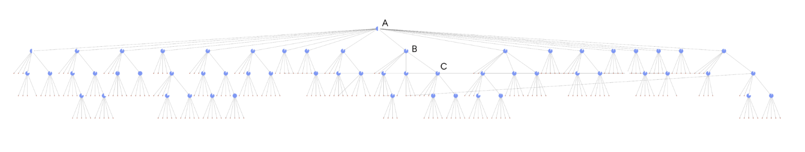
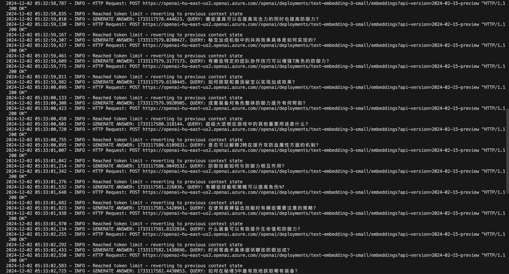
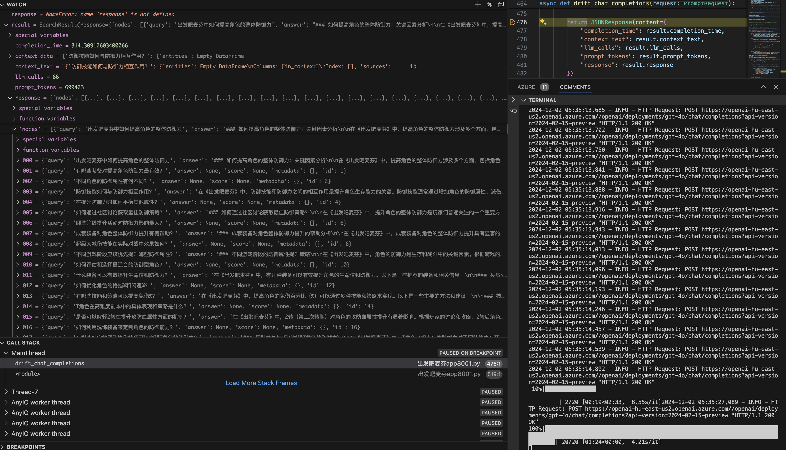

## graphrag简要分析

 Graph-RAG把杂乱无章的文档堆合成一个整洁的知识图谱，有点像家谱，但用于存储信息。
 图中包含代表关键概念的“节点”）和显示它们如何关联的“边缘”（它们之间的关系）。
 因此，当提出问题时，Graph-RAG 不会从chunk入手;
 它快速浏览这个知识网络，找到最相关的节点，提供准确的答案。
 
 这就像问，“谁是罗密欧最好的朋友？”，而不是得到莎士比亚的整个人生故事，你得到的是一个直接的答案：“莫库蒂奥，他不幸地英年早逝。
 这种结构化方法使 Graph-RAG 非常擅长处理复杂问题和发现数据中隐藏的关系。

 但是这种本地搜索方法也有问题,就像那个有时会匆忙下结论的朋友一样，它偶尔会患上 “幻觉”，当它的知识图谱不完整或模棱两可时，它会捏造信息。
 这通常源于有限的搜索空间，系统有点过于关注它所拥有的信息，而错过了更大的图景。
 把它想象成试图用只有一半的线索解开一个谜团——你最终可能会得到一个有创意但最终不正确的解决方案

### DRIFT search简介

DRIFT融合全球和本地搜索策略，动态适应查询内容，查询社区信息以发现最相关的信息。
它的全称是：Dynamic Reasoning and Inference with Flexible Traversal

DRIFT 搜索层次结构，突出显示了 DRIFT 搜索过程的三个核心阶段。

- A（入门）：DRIFT 将用户的查询与语义相关性最高的 K 个社区报告进行比较，生成广泛的初始答案和后续问题，以指导进一步探索。

- B （Follow-Up）：DRIFT 使用本地搜索来优化查询，生成额外的中间答案和后续问题，从而提高特异性，引导引擎获得上下文丰富的信息。图中每个节点上的字形显示算法继续查询扩展步骤的置信度。

- C（输出层次结构）：最终输出是按相关性排序的问题和答案的分层结构，反映了全局见解和本地优化的平衡组合，使结果具有适应性和全面性。

DRIFT Search 通过在搜索过程中包含社区信息，引入了一种新的本地搜索查询方法。这极大地扩展了查询起点的广度，并导致在最终答案中检索和使用更多种类的事实。此新增功能通过为本地搜索提供更全面的选项来扩展 GraphRAG 查询引擎，该选项使用社区见解将查询细化为详细的后续问题。

#### DRIFT Search的具体处理流程：

- step 1）. 用户向 Graph-RAG 提交问题（调用DRIFT Search接口）
- step 2）.它被称为 Graph-RAG 中的引物阶段 （Primer Phase）。
        首先，Graph-RAG 在其知识图谱中执行广泛的搜索，识别与用户查询相关的相关概念和实体。
        其次，它利用社区信息（来自知识图谱的见解和联系）来更广泛地了解该主题。
        然后，Graph-RAG 根据全球搜索和社区信息制定初始答案。
        之后，Graph-RAG 会生成一组后续问题，旨在引导用户更深入地探索该主题。
- step 3） 跟进阶段（Follow up Phase）用户选择提供的跟进问题之一
        Graph-RAG 在知识图谱中执行重点搜索，专注于与所选后续问题相关的区域。
        然后，Graph-RAG 根据本地搜索生成更具体的答案。
        之后，Graph-RAG 会生成另一组与中间答案相关的后续问题，以便进行更深入的探索。
- step 4） 迭代继续（Iteration Continue） 
        重复步骤 3 （跟进阶段） 和 4 （迭代）。
        用户选择后续问题，Graph-RAG 执行本地搜索并生成越来越具体的答案。这个迭代过程还在继续。

- step 5）终止
  当满足其中一个停止标准（例如，预定义的限制、用户满意度、收益递减、得出结论）时，迭代终止。

##### Drift search终止标准

- 预定义限制（Predefined Limit）： 
    Graph-RAG 可能对迭代次数有设置限制。
    这是基于计算资源或描述 DRIFT 的研究论文所需的 detail.in 水平等因素，他们将其限制为两次迭代。

- 用户满意度（User Satisfaction）：
    迭代可以继续进行，直到用户表示他们有足够的信息或对答案感到满意。这可能涉及来自用户的明确反馈或隐含信号，例如停下来选择后续问题。

- 答案的相关性（Relevance of Answers）：
    如果在每次迭代中获得的新信息变得不那么相关或重要，则 DRIFT 可能会停止。这可以通过分析生成的答案的相关性或用户与它们的交互来确定。

结论 ：在某些情况下，搜索可能会自然而然地达到一个点，即所有相关信息都已被探索，并且没有进一步有意义的途径可以追求。

通过一个例子来说明：
    假设用户有兴趣了解电动汽车的历史和影响。他们向 Graph-RAG 提交以下查询： 查询：“请介绍一下电动汽车的演变及其在应对气候变化中的作用。“

    第一阶段： - Graph-RAG 在其知识图谱中执行广泛的搜索，识别出 “电动汽车”、“历史”、“进化”、“气候变化”、“环境影响” 等关键概念。

            - Graph-RAG 可能会发现电动汽车历史悠久，可以追溯到 19 世纪，但它们的受欢迎程度随着时间的推移而波动。报告还指出，减少温室气体排放是它们最近复苏的主要动力。（这是社区信息）

            - Graph-RAG 概述了电动汽车的历史，重点介绍了早期发明、汽油车在 20 世纪的主导地位，以及最近因对气候变化的担忧和电池技术进步而推动的复兴。    

            - 后续问题：“阻碍电动汽车早期采用的主要挑战是什么？“电动汽车与汽油车相比对环境的影响如何？”“电动汽车技术的最新进展是什么？”
    
    第二阶段： 假设用户选择第一个后续问题

            - Graph-RAG 将搜索重点放在电动汽车的早期历史上，研究限制其采用的因素。它可能会探讨“电池技术”、“充电基础设施”、“成本”和“来自汽油车的竞争”等概念。
            - 中间答案：Graph-RAG 解释说，由于电池沉重、效率低下、续航里程有限、缺乏充电基础设施以及大规模生产、价格合理的汽油车的兴起，早期的电动汽车面临限制。
            - 后续问题：“内燃机的发明如何影响电动汽车的发展？“是否有任何具体事件或技术突破导致 20 世纪初电动汽车的衰落？”
      - 此迭代将继续。可以将其可视化为树结构：
            Root： “跟我说说电动汽车的演变及其在应对气候变化方面的作用吧。”
            Branches（分支）：每个后续问题都会创建一个新分支。
            Leaves：每次迭代时提供的答案。
    
    DRIFT 动态扩展了这棵树，引导用户对电动汽车历史及其环境影响进行多方面的探索。

