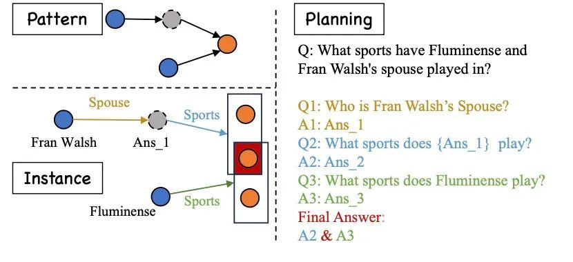
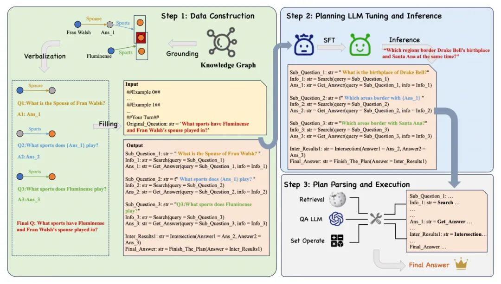
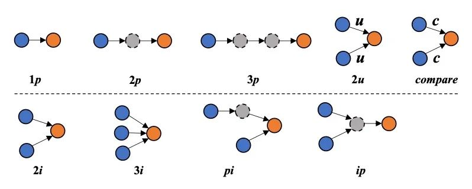

## 从知识图谱中习得大语言模型的规划能力

在利用大语言模型(LLMs)解决复杂问答时，往往会先对复杂问题进行规划(Planning)，将复杂问题拆分为多个子问题，并对每个子问题分别进行检索问答，从而得到原始复杂问题的答案。

对于参数量较小的模型(小于10B)来说，对复杂问题进行规划并非易事，往往需要进行监督训练。

而这又进一步引出了一个值得关注的问题：如何获取规划任务的监督训练样本？若进行人工标注，人工标注的成本过高，难以规模化；一般的做法是从一个更大的语言模型中蒸馏出规划路径用于训练小型的语言模型，然而也无法保证更大模型中蒸馏出来的知识完全正确。

我们发现知识图谱中蕴含着丰富且正确的推理知识。如图1所示，图谱中的每一个子图Pattern都可以被视为一个复杂问题的抽象表示，这为复杂问题规划任务的训练数据构建展现了新的可能。因此，在这项工作中，我们使用了知识图谱构建了复杂问题规划的训练数据，让大语言模型从知识图谱中习得问题规划的能力。

图1 知识图谱中的子图Pattern与复杂问题之间的联系

### 方法

LPKG的问答框架，旨在使用知识图谱构建复杂问题规划任务的训练数据，以此提升参数量较小的LLMs的规划能力。LPKG问答框架的整体流程如图2所示，其主要由以下三个部分组成：

1.基于知识图谱的训练数据构建

2.模型微调与下游问题推理

3.规划过程解析与执行

#### 基于知识图谱的训练数据构建

在训练数据构建之前，我们首先确定了9种类型的子图Pattern，如图3所示。

其中，p代表投射逻辑(即一跳)，i代表交集逻辑，u代表并集逻辑，c代表比较逻辑。

每一种Pattern都代表了一种类型的查询，

例如1p、2p、3p分别代表一跳、二跳、三跳查询，

2i、3i、2u分别代表两个查询的交集、三个查询的交集、两个查询的并集，等等。

我们在此处确定了丰富的Pattern类型，以期能够尽可能覆盖现实中各种类型的复杂问题。

从公开的知识图谱Wikidata15k中，根据我们事先定义好的9种子图Pattern抽取出了9000个子图实例。
随后，我们沿着每个子图实例的路径，自下而上地将其还原为了多个自然语言形式的子问题并糅合为一个复杂问题。为了提高效率并确保问题的流畅性，我们在此利用大模型实现子图数据格式的转化。通过调用GPT-4并给定上下文学习样例，高效而准确地完成子问题以及复杂问题的的构建。需要注意的是，虽然我们在这引入了大模型，但是知识仍然来源于知识图谱本身，大模型只承担了数据格式转化的任务，没有引入额外知识。随后，我们将得到的子问题按照问题类型填充到输出的模板中，复杂问题填充到输入的模板中，便构建得到了规划任务的训练数据。值得注意的是，我们采用了一种代码形式的训练数据构建方式，以便后续对模型输出进行格式化解析。

#### 模型微调与下游问题推理

随后我们使用构建完成的训练数据进行模型微调，在此使用的是一般的Lora微调方式。训练完成之后，我们便可以使用微调过的模型在下游数据集上进行问题规划的推理。

虽然我们使用的是图谱来源的数据，但是在下游推理的时候，完全可以对一般的多跳问答问题进行推理，而非仅限于KGQA。在此推理得到的是一份规划过程，如图2中的Output所示，需要通过后续的解析和执行得到最终的答案。

#### 规划解析与执行

我们基于上一步得到的规划数据进行解析和执行，具体而言：
1.当识别到“Search”关键字时，我们将调用检索器对子问题进行检索，获得相关的文档；

2.当识别到“Get Answer”关键字时，我们将调用QA模型，令其基于子问题和相关文档进行作答；

3.当识别到“Intersection”或者“Union”关键字时，我们调用交并集函数，对集合进行操作。

需要注意的是，此处的QA模型和之前的规划模型是解耦的，可以使用任何一个现成的大模型来完成此处的问答。在所有的Plan解析完成之后，我们就得到的原始复杂问题的答案。

### 总结

在这项工作中，我们探索如何让语言模型从知识图谱中习得复杂问题的规划能力。我们设计了名为LPKG的框架，利用了知识图谱中丰富的子图Pattern构建了丰富且正确的规划训练数据，并由此训练大语言模型使其能在下游问题上推理得到更为准确的规划过程，最后将规划过程进行解析和执行从而得到最终答案。我们在多个数据集上验证了LPKG框架的优越性，并且为社区贡献了一个名为CLQA-Wiki的全新复杂问答数据集。