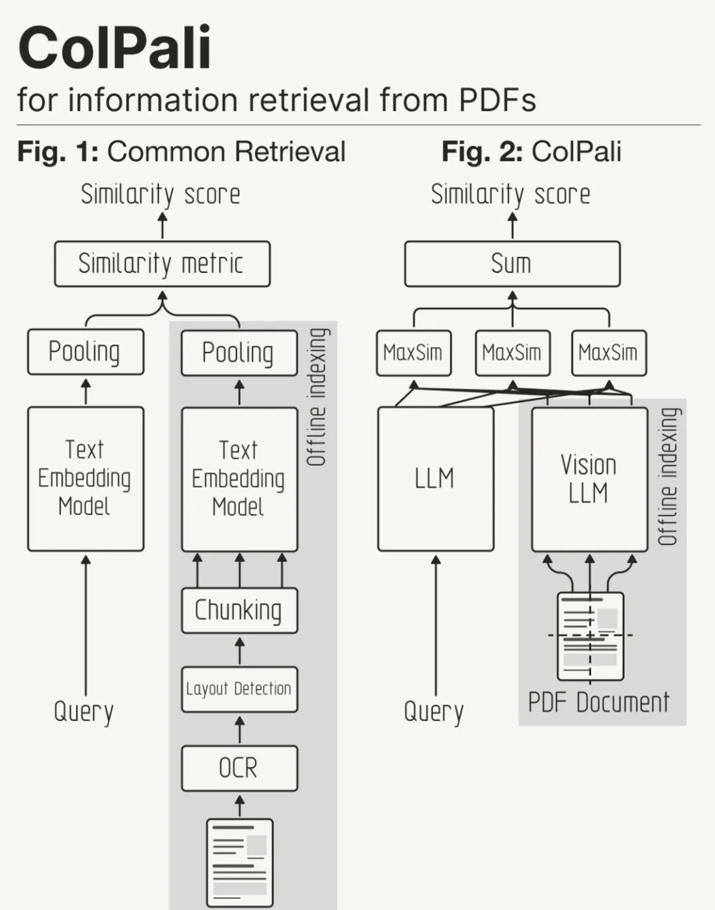

##  视觉增强检索和生成

VARAG （Vision-Augmented Retrieval and Generation） 是一种视觉优先的 RAG 引擎，强调基于视觉的检索技术。它通过视觉语言模型集成视觉和文本数据，增强了传统的检索增强生成 （RAG） 系统。


VARAG 支持多种检索技术，并针对不同的使用案例进行了优化，包括文本、图像和多模式文档检索。

以下是支持的主要技术:

#### 1.Simple RAG（简单检索增强生成)

是一种从文档中提取文本并将其馈送到检索管道中的高效且直接的方法。VARAG 通过 Docling 整合了光学字符识别 （OCR），从而可以处理和索引扫描的 PDF 或图像。在提取文本并为其编制索引后，可以将查询与文档中的相关段落进行匹配，从而为生成基于提取信息的响应提供坚实的基础。此技术非常适合文本密集型文档，如扫描的书籍、合同和研究论文，并且可以与大型语言模型 （LLMs以生成上下文感知输出。

```
Docling技术报告 https://arxiv.org/pdf/2408.09869
https://github.com/DS4SD/docling
```

#### Vision RAG

Vision RAG 通过整合视觉信息的检索来扩展传统的 RAG 技术，弥合文本和图像之间的差距。使用强大的跨模态嵌入模型，如 JinaCLIP（Jina AI 开发的 CLIP 变体），文本和图像都被编码到共享向量空间中。这允许跨不同模态进行相似性搜索，这意味着可以与文本一起查询图像。

**Vision RAG 对于视觉组件（例如，图形、图表、图像）与文本内容同样重要的文档分析任务特别有用。***
对于图像标题或生成产品描述等任务也很有效，在这些任务中，理解文本并将其与视觉元素相关联至关重要。

#### ColPali RAG 

ColPali RAG 代表了一种尖端方法，它通过将文档页面直接嵌入为图像而不是将其转换为文本来简化传统的检索管道。这种方法利用了 PaliGemma，这是 Google Zürich 团队的视觉语言模型 （VLM），它将整个文档页面编码为矢量嵌入，将页面布局和视觉元素视为检索过程的一部分。ColPali RAG 使用受 ColBERT（列 BERT）启发的后期交互机制，通过在用户查询和文档补丁之间实现令牌级匹配来增强检索。这种方法确保了高检索准确性，同时保持了合理的索引和查询速度。

*** 它特别适用于具有丰富视觉效果的文档，例如信息图表、表格和复杂布局，而传统的基于文本的检索方法在这些文档中很难找到。**

```
ColPali论文: https://arxiv.org/abs/2407.01449
ColPali博客: https://huggingface.co/blog/manu/colpali
ColPali实战: https://github.com/weaviate/recipes/blob/main/weaviate-features/named-vectors/NamedVectors-ColPali-POC.ipynb
```


#### Hybrid ColPali RAG

Hybrid ColPali RAG 通过结合图像嵌入和 ColPali 的后期交互机制的优势，进一步增强了检索性能。在这种方法中，系统首先使用图像嵌入（例如，来自 JinaCLIP 等模型）执行粗略检索步骤，以检索前 k 个相关文档页面。然后，在第二轮中，系统使用 ColPali 后期交互机制对这 k 个页面进行重新排序，以根据视觉和文本信息识别最终最相关的页面集。当文档包含复杂的视觉对象和详细文本的混合时，这种混合方法特别有用，允许系统利用这两种内容类型进行高度准确的文档检索。

```
https://github.com/adithya-s-k/VARAG
https://adithya-s-k.github.io/VARAG/
```