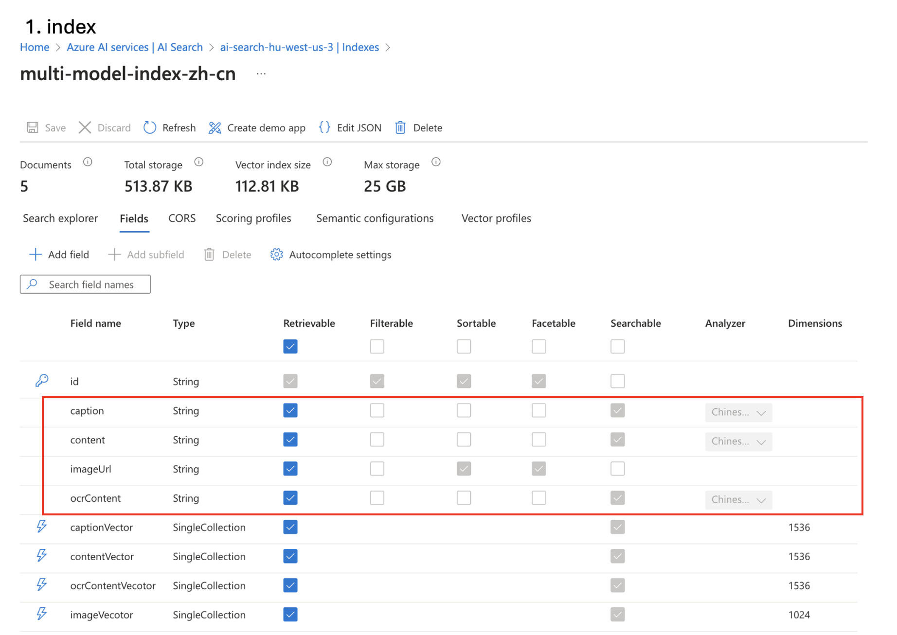
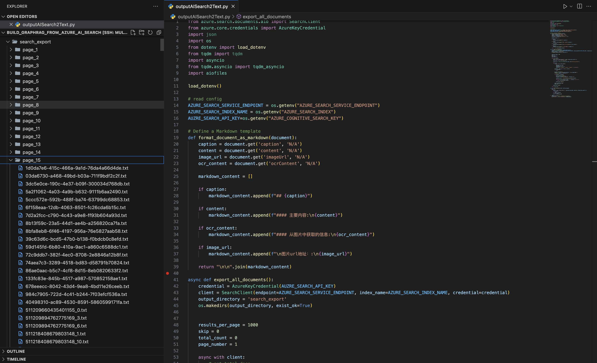
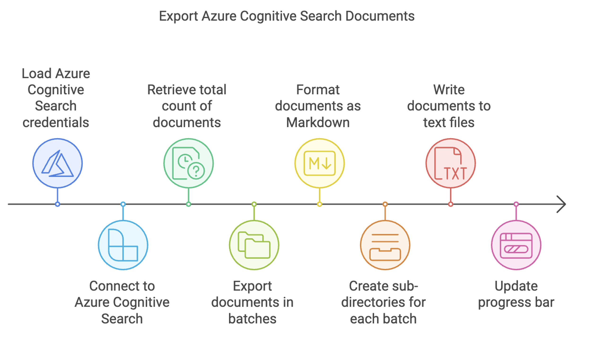
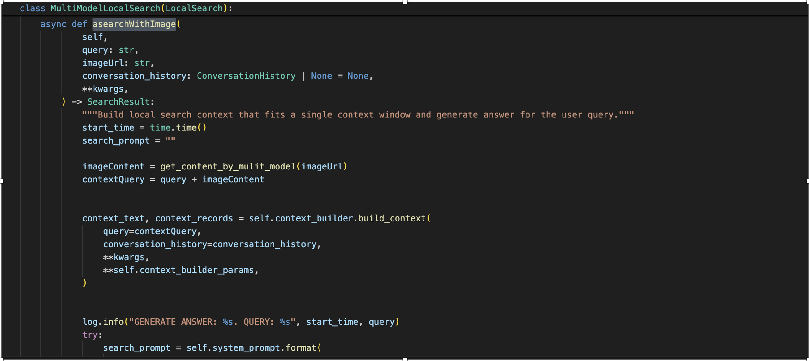
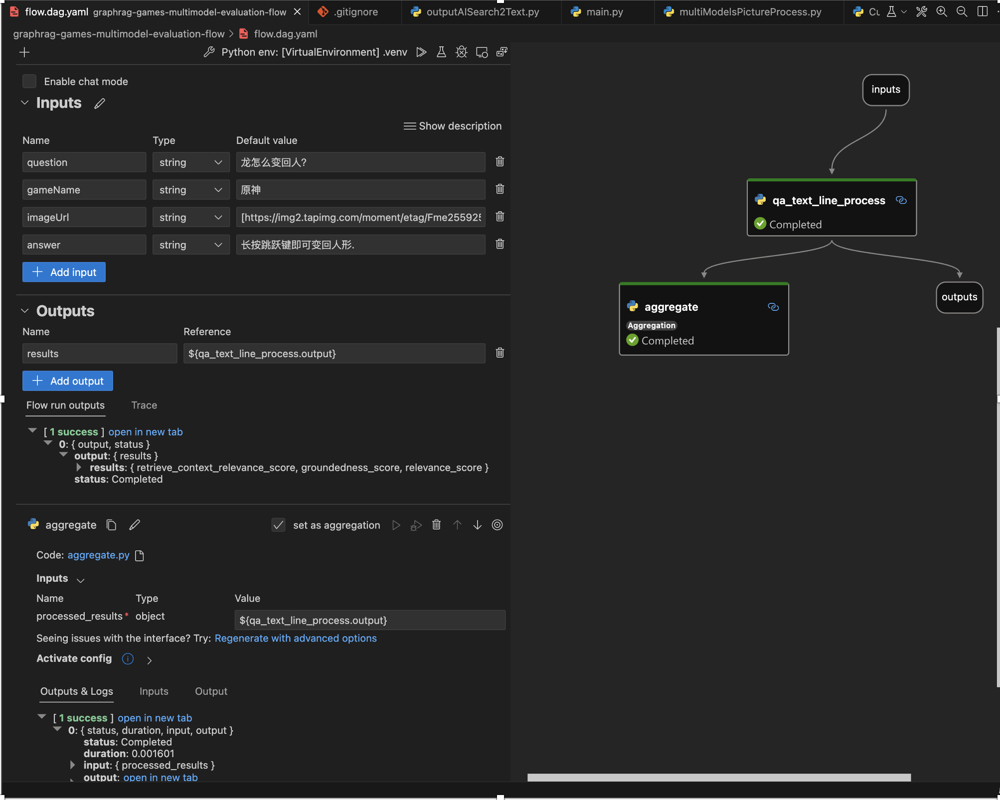
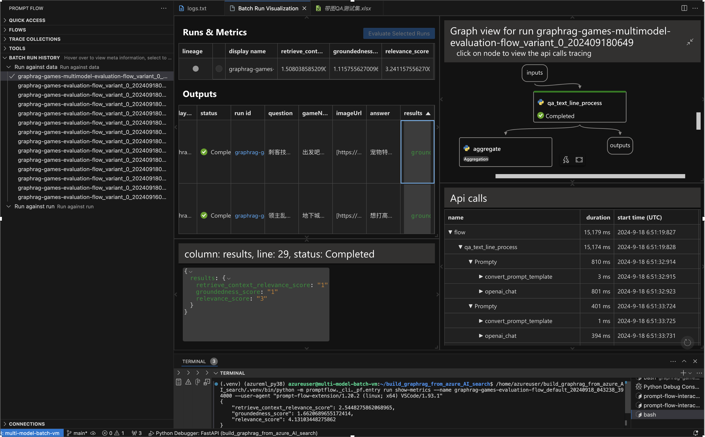

## 前提说明

通过对大语言模型构建知识图谱graphrag解决方案的进一步探索，以及大语言模型在多模态上的进一步发展包括对图片的识别和生成能力的进一步提升，怎么让两者更好的结合，今天做一些简单案例的分享。

首先对里面最主要的一个词--图的概念做一个区分，在中文里面是同一个字，在英语中使用的是区分开的graph和image。

•	知识图谱（Knowledge Graph）：
	知识图谱以节点（实体）和边（关系）来构成图结构。每个节点代表某个实体（如人、物体、事件等），边表示实体之间的关系（如“位于”、“属于”、“是”等）。这些信息是结构化的、明确的，通常用于描述复杂的关系和事实。同时知识图谱以符号（通常是文字或标签）形式呈现，背后有明确的语义模型或本体支持，便于推理和查询。

•	图片（Image）：
	图片包含的是像素数据，这些数据不直接携带明确的语义。图片可以直观呈现物体、场景、情感等复杂的视觉信息，但这些信息通常是通过视觉感知和深度学习模型来解析的。图片通过视觉传达信息，适合展示复杂的场景、情感或具体的视觉细节，但不具备直接的结构化语义。

## 1. 应用场景:

GraphRAG主要关注文本知识的重新索引，通过知识图谱的方式组织信息，提高了许多问题的处理效果。然而，现实世界的信息是多模态的，包括文本、图像、视频和音频等。将GraphRAG扩展到多模态领域，可以更全面地捕捉和利用各种形式的信息。

比如：在教育和制造业行业的教材和使用手册等，里面都使用了大量使用文字和图片等。在新闻和网络平台里面，同样的里面使用大量的图片文字等传播信息。

多模态GraphRAG代表了知识检索和问答系统的发展方向。通过整合多种形式的信息，它能够提供更全面、更智能的解决方案，适用于广泛的应用场景。

## 2. 数据处理和表示和知识图谱构建:

在处理多模态数据(文本、图像、音频等)的时候，不同的数据质量，不同的场景和需求使用的方案也是多式多样。

主要方面：
    数据预处理
    特征提取和表示

这里进一步展开主要基于
[multimodelRAG文字图片的混合多模态搜索](./multimodelRAG-imageTextSearch-20240901.md)
的内容。

在知识图谱构建的过程中，主要包括：
    实体和关系抽取  
    知识融合和图谱构建
    知识图谱更新和维护
这里主要基于
1. [graphrag总体介绍](../graphRAG/graphRAG-overview-20240728.md)
2. [graphrag实践介绍](../graphRAG/graphRAG-practice-01-20240804.md)

的内容。

有了这些内容后，需要把这两者融合的解决方案就水到渠成了。可以把multimodelRAG文字图片的混合多模态搜索里面的文本内容，

作为graphrag的文本输入,把每一条记录作为一个文件单独保存，然后通过分页的方式逐步导出。

大致处理流程如下：

## 3. graphRAG的多模态查询和输出

graphrag的大致步骤，通过[graphrag总体介绍](../graphRAG/graphRAG-overview-20240728.md)和[graphrag实践介绍](../graphRAG/graphRAG-practice-01-20240804.md)里面介绍，
我们能得知，它是通过输入的问题通过向量化寻找最相关的实体，然后通过实体寻找到关系，社区以及协边等相关内容。通过这些内容和对应的提示词模版的格式化，作为提示词给大语言模型，得到相应的格式的返回内容。
如果需要通过图片和文本，或者只有图片的查询，需要做到如下基本：

1. 客户化graphRAG的search类，让它提供图片的参数
2. 通过多模态大语言模型对图片机型描述，来丰富查询内容，得到相应的相关内容，构建上下文。
3. 调用大语言过程中,再次增加图片，理解用户问题更多的意图。

相应的代码实现，已经开源。截图处理如下：

目前的代码还没有输出相关图片，如果需要输出相关的图片的话，通过修改对应提示词，让大语言模型返回对应引用图片的url地址，应该是可以达到的。

4.评估方法

因为graphRAG的出现算是比较慢，如果想全部替代baseline rag显得有些冒进，特别是一些客户baseline rag的解决方案已经上线，只是一些问题回答不好，或者有几类问题总是没有很好的回答。
需要借助graphRAG来处理这些内容，具体细节可以参考：[graphRAG智能体实践](../graphRAG/graphRAG-agentic-practice-20240825.md)

在使用智能体方案之前还是需要通过一个评估，graphrag在baseline rag表现不好的问题上，它的表现如何，所以需要构建一套相同的评价标准来衡量两者。
主要是三个参数维度的两两之间的关联性。

1. 召回内容和问题的相关性
2. 召回内容和最终回答的关联性
3. 回答问题和准确答案的关联性

对应的评估流如下：

最后和baseline的结果进行对比，包括整体的评估和各个子项的详细分数和应答等。

实现代码和评估代码，参考github库：
